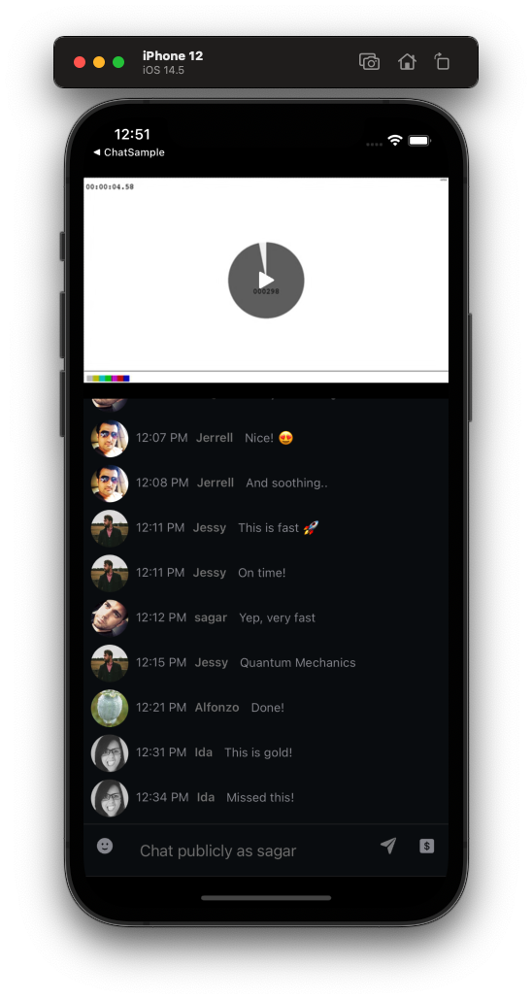

# 📲 Stream Chat YouTube Live Clone App

**WARNING**

This work is currently WIP and it is subject to change.

In `YouTubeClone` folder you can find the source code for YouTube clone. This app copies some, parts of the UI of YouTube iOS app in livestream mode. 
It is meant to show off the customizability of StreamChat UI SDK and to be of inspiration for developers working with this SDK and looking to integrate StreamChatUI in their livestreaming applications for chatting purpose.

## 👩‍🏫 Instructions

### Installation

1. Clone this repository.
2. Open `StreamChat.xcodeproj` on Xcode.
3. Wait for Swift Package Manager to install dependencies.
4. Select the `YouTubeClone` target and run in your preferred device.