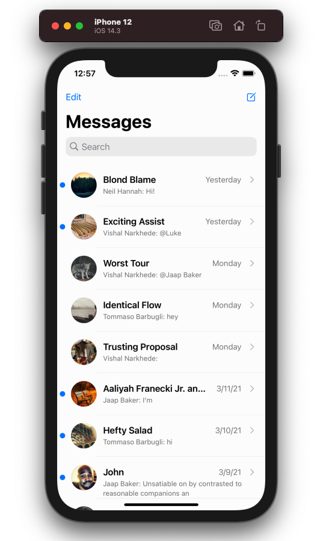

# 📲 Stream Chat iMessage Clone App

In `iMessageClone` folder you can find the source code for iMessage clone. This app copies some, but not all, features that iMessage app offers. It is meant to show off the customizability of StreamChat UI SDK and to be of inspiration for developers working with this SDK.

**WARNING**

This work is currently WIP and it is subject to change.

## 👩‍🏫 Instructions

### Installation

1. Clone this repository.
2. Open `StreamChat.xcodeproj` on Xcode.
3. Wait for Swift Package Manager to install dependencies.
4. Select the `iMessageClone` target and run in your preferred device.