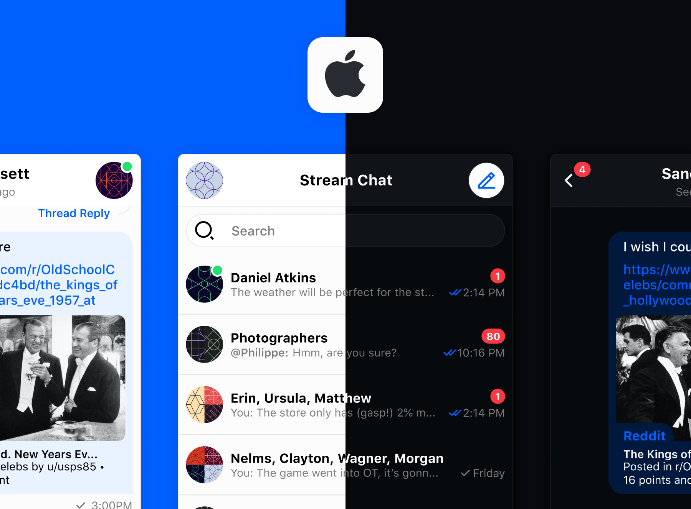

  

  
  
  

  
  
  
  

# The official iOS SDK for [Stream Chat](https://getstream.io/chat/sdk/ios/)

The **StreamChatUI SDK**  is the official iOS SDK for [Stream Chat](https://getstream.io/chat/sdk/ios/), a service for building chat and messaging applications.

---

## Main Features

- **Offline support:** Browse channels and send messages while offline.
- **Familiar behavior**: The UI elements are good platform citizens and behave like native elements; they respect `tintColor`, `layoutMargins`, light/dark mode, dynamic font sizes, etc.
- **Swift native API:** Uses Swift's powerful language features to make the SDK usage easy and type-safe.
- **Uses `UIKit` patterns and paradigms:** The API follows the design of native system SDKs. It makes integration with your existing code easy and familiar.
- **First-class support for `Combine`**: The StreamChat SDK (Low Level Client) has Combine wrappers to make it really easy use in an app that uses `Combine`.
- **Fully open-source implementation:** You have access to the complete source code of the SDK here on GitHub.
- **Supports iOS 11+:** We proudly support older versions of iOS, so your app can stay available to almost everyone.

## **Quick Links**

* [iOS/Swift Chat Tutorial](https://getstream.io/tutorials/ios-chat/): Learn how to use the SDK by following our simple tutorial.
* [Register](https://getstream.io/chat/trial/): Register to get an API key for Stream Chat.
* [Installation](https://getstream.io/chat/docs/sdk/ios/basics/integration): Learn more about how to install the SDK using CocoaPods, SPM or Carthage.
  * Do you want to use Module Stable XCFrameworks? [Check this out](https://getstream.io/chat/docs/sdk/ios/basics/integration#xcframeworks)
* [Documentation](https://getstream.io/chat/docs/sdk/ios/): An extensive documentation is available to help with you integration.
* [Demo app](https://github.com/GetStream/stream-chat-swift/tree/main/DemoApp): This repo includes a fully functional demo app with example usage of the SDK.
* [Example apps](https://github.com/GetStream/stream-chat-swift/tree/main/Examples): This section of the repo includes fully functional sample apps that you can use as reference.

## Free for Makers

Stream is free for most side and hobby projects. You can use Stream Chat for free if you have less than five team members and no more than $10,000 in monthly revenue.

## Main Principles

* **Progressive disclosure:** The SDK can be used easily with very minimal knowledge of it. As you become more familiar with it, you can dig deeper and start customizing it on all levels.

* **Highly customizable:** Every element is designed to be easily customizable. You can modify the brand color by setting `tintColor`, apply appearance changes using custom UI rules, or subclass existing elements and inject them everywhere in the system, no matter how deep is the logic hierarchy.

* **`open` by default:** Everything is `open` unless there's a strong reason for it to not be. This means you can easily modify almost every behavior of the SDK such that it fits your needs.

* **Good platform citizen:** The UI elements behave like good platform citizens. They use existing iOS patterns; their behavior is predictable and matches system UI components; they respect `tintColor`, `layourMargins`, dynamic font sizes, and other system-defined UI constants.

## Dependencies

This SDK tries to keep the list of external dependencies to a minimum.
Starting **4.6.0**, and in order to improve the developer experience, dependencies are hidden inside our libraries.
(Does not apply to StreamChatSwiftUI's dependencies yet).

Learn more about our dependencies [here](https://getstream.io/chat/docs/sdk/ios/#dependencies)

---

## We are hiring
We've recently closed a [\$38 million Series B funding round](https://techcrunch.com/2021/03/04/stream-raises-38m-as-its-chat-and-activity-feed-apis-power-communications-for-1b-users/) and we keep actively growing.
Our APIs are used by more than a billion end-users, and you'll have a chance to make a huge impact on the product within a team of the strongest engineers all over the world.
Check out our current openings and apply via [Stream's website](https://getstream.io/team/#jobs).

---

## Quick Overview

### Channel List

<table>
  <tr>
    <th width="50%">Features</th>
    <th width="30%">Preview</th>
  </tr>
  <tr>
    <td> A list of channels matching provided query </td>
    <th rowspan="7"></th>
  </tr>
   <tr> <td> Channel name and image based on the channel members or custom data</td> </tr>
  <tr> <td> Unread messages indicator </td> </tr>
  <tr> <td> Preview of the last message </td> </tr>
  <tr> <td> Online indicator for avatars </td> </tr>
  <tr> <td> Create new channel and start right away </td> </tr>
  <tr><td> </td> </tr>
  </tr>
</table>

### Message List

<table>
  <tr>
    <th width="50%">Features</th>
    <th width="30%">Preview</th>
  </tr>
  <tr>
    <td> A list of message in a channel </td>
    <th rowspan="9"></th>
  </tr>
  <tr> <td> Photo preview </td> </tr>
  <tr> <td> Message reactions </td> </tr>
  <tr> <td> Message grouping based on the send time </td> </tr>
  <tr> <td> Link preview </td> </tr>
  <tr> <td> Inline replies </td> </tr>
  <tr> <td> Message threads </td> </tr>
  <tr> <td> GIPHY support </td> </tr>
  <tr><td> </td> </tr>
  </tr>
</table>

---

### Message Composer

<table>
  <tr>
    <th width="50%">Features</th>
    <th width="30%">Preview</th>
  </tr>
  <tr>
    <td> Support for multiline text, expands and shrinks as needed </td>
    <th rowspan="6"></th>
  </tr>
  <tr> <td> Image and file attachments</td> </tr>
  <tr> <td> Replies to messages </td> </tr>
  <tr> <td> Tagging of users </td> </tr>
  <tr> <td> Chat commands like mute, ban, giphy </td> </tr>
  <tr><td> </td> </tr>
  </tr>
</table>

---

### Chat Commands

<table>
  <tr>
    <th width="50%">Features</th>
    <th width="30%">Preview</th>
  </tr>
  <tr>
    <td> Easily search commands by writing / symbol or tap bolt icon </td>
    <th rowspan="5"></th>
  </tr>
  <tr> <td> GIPHY support out of box</td> </tr>
  <tr> <td> Supports mute, unmute, ban, unban commands </td> </tr>
  <tr> <td> WIP support of custom commands </td> </tr>
  <tr><td> </td> </tr>
  </tr>
</table>

---

### User Tagging Suggestion

<table>
  <tr>
    <th width="50%">Features</th>
    <th width="30%">Preview</th>
  </tr>
  <tr>
    <td> User mentions preview </td>
    <th rowspan="4"></th>
  </tr>
  <tr> <td> Easily search for concrete user </td> </tr>
  <tr> <td> Mention as many users as you want </td> </tr>
  <tr><td> </td> </tr>
  </tr>
</table>
