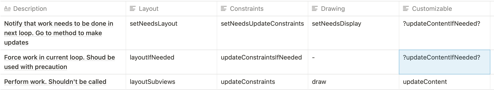

Right now we do not have any place to provide layout and appearance updates based on content changes except in `updateContent`. This leads to redundant `updateContent` calls, that propagate through whole view tree even if you just need to change spacing.

I propose to introduce UIKit like methods for Layout and Appearance.
So `Customizable` became

```swift
public protocol Customizable {

    /// Indicates that component have been properly initialized and it's safe to access any methods below.
    var streamInitialized: Bool { get }

    // MARK: - Setup stage

    /// Main point of customization for the view functionality.
    /// Calling super implementation is required.
    func setUp()

    /// Main point of customization for appearance.
    /// Calling super is usually not needed.
    func setUpAppearance()

    /// Main point of customization for appearance.
    /// Calling super implementation is not necessary if you provide complete layout for all elements.
    func setUpLayout()

    // MARK: - Content
    func setNeedsUpdateContent()
    func updateContentIfNeeded()
    /// Main point of updating views internal model to the latest data.
    /// Calling super is recommended in most of the cases.
    /// If you need to call this method by hands, most likely you doing something wrong.
    func updateContent()

    // MARK: - Layout
    func streamSetNeedsUpdateLayout()
    func streamUpdateLayoutIfNeeded()
    /// Main point of updating views layout based on the latest data.
    /// If you need to call this method by hands, most likely you doing something wrong.
    func streamUpdateLayout()

    // MARK: - Appearance
    func setNeedsUpdateAppearance()
    func updateAppearanceIfNeeded()
    /// Main point of updating views visuals based on the latest data.
    /// If you need to call this method by hands, most likely you doing something wrong.
    func updateAppearance()
}
```

And our default `View` implementation will be:

```swift
open class View: UIView, AppearanceSetting, Customizable {

    open private(set) var streamInitialized: Bool = false

    override open func didMoveToSuperview() {
        super.didMoveToSuperview()
        guard !streamInitialized && superview != nil else { return }
        streamInitialized = true

        setUp()
        (self as! Self).applyDefaultAppearance()
        setUpAppearance()
        setUpLayout()
        updateContentIfNeeded()
    }

    public func defaultAppearance() { /* default empty implementation */ }
    open func setUp() { /* default empty implementation */ }
    open func setUpAppearance() { /* default empty implementation */ }
    open func setUpLayout() { /* default empty implementation */ }

    // MARK: - Content
    open var needsUpdateContent: Bool = false
    open func setNeedsUpdateContent() {
        needsUpdateContent = true
    }
    open func updateContentIfNeeded() {
        guard needsUpdateContent && streamInitialized else { return }
        updateContent()
    }
    open func updateContent() {
        needsUpdateContent = false
    }

    // MARK: - Layout
    open var streamNeedsUpdateLayout: Bool = false
    open func streamSetNeedsUpdateLayout() {
        streamNeedsUpdateLayout = true
        if translatesAutoresizingMaskIntoConstraints {
            setNeedsLayout()
        } else {
            setNeedsUpdateConstraints()
        }
    }
    open func streamUpdateLayoutIfNeeded() {
        guard streamNeedsUpdateLayout && streamInitialized else { return }
        streamUpdateLayout()
    }
    open func streamUpdateLayout() {
        streamNeedsUpdateLayout = false
    }

    open override func layoutSubviews() {
        super.layoutSubviews()
        streamUpdateLayoutIfNeeded()
    }

    open override func updateConstraints() {
        super.updateConstraints()
        streamUpdateLayoutIfNeeded()
    }

    // MARK: - Appearance
    open var needsUpdateAppearance: Bool = false
    open func setNeedsUpdateAppearance() {
        needsUpdateAppearance = true
    }
    open func updateAppearanceIfNeeded() {
        guard needsUpdateAppearance && streamInitialized else { return }
        updateAppearance()
    }
    open func updateAppearance() {
        needsUpdateAppearance = false
    }
}
```

Questionable: Because layout part is kinda existed in UIKit, I required to stick with `stream` prefix, fuuu. Otherwise confusion is imminent.

On other hand, we able to inject our layout part inside UIKit's methods `layoutSubviews` and `updateConstraints`.

Benefit is, on trait collection changes we don't need to update our content, just appearance.

```swift
override open func traitCollectionDidChange(_ previousTraitCollection: UITraitCollection?) {
    super.traitCollectionDidChange(previousTraitCollection)
    guard #available(iOS 12, *) else { return }
    guard previousTraitCollection?.userInterfaceStyle != traitCollection.userInterfaceStyle else { return }

    (self as! Self).applyDefaultAppearance()
    setUpAppearance()
    setNeedsUpdateAppearance()
}
```

Problem with all this: **When `update*` methods will be called?**

UIKit has for it awesome `RunLoop` thingy, that runs it's methods when needed.
I see 2 possible solutions:

### Easy one

Just call `update*` inside `update*IfNeeded` or `setNeedsUpdate*`.

Main disadvantage of such approach: while changing a lot of properties, some methods will be called again and again, leading to unneeded work. Which will hit on performance (we have just 8.3ms to update screen and not drop frames).

### Complex one

If UIKit has `RunLoop` thingy, let's use it as well!

Unfortunately here no easy way to make something part of runloop loop. So we improvise:

```swift
class StreamRunLooper {
    static let shared = StreamRunLooper()
    private init() { schedule() }

    var runningAppearanceUpdates = false
    var appearanceChanges: [Customizable] = []
    func addAppearance(_ smth: Customizable) {
        if runningAppearanceUpdates {
            smth.updateAppearance()
        } else {
            appearanceChanges.append(smth)
        }
    }

    var runningContentUpdates = false
    var contentChanges: [Customizable] = []
    func addContent(_ smth: Customizable) {
        if runningContentUpdates {
            smth.updateContent()
        } else {
            contentChanges.append(smth)
        }
    }

    @objc func loop() {
        let content = contentChanges
        contentChanges = []
        runningContentUpdates = true
        content.forEach { $0.updateContent() }
        runningContentUpdates = false

        let appearance = appearanceChanges
        appearanceChanges = []
        runningAppearanceUpdates = true
        appearance.forEach { $0.updateAppearance() }
        runningAppearanceUpdates = false

        schedule()
    }

    func schedule() {
        // guranteed to be called on start of next loop, before UIKit layouting and drawing
        RunLoop.main.perform(#selector(loop), target: self, argument: nil, order: 0, modes: [RunLoop.Mode.default])
    }
}
```

We add our own thingy, that will perform all required changes once per runloop loop.

So our `setNeedUpdate*` became:

```swift
open func setNeedsUpdateAppearance() {
    guard !needsUpdateAppearance else { return }
    needsUpdateAppearance = true
    StreamRunLooper.shared.addAppearance(self)
}
```

Pros:

- This is as much UIKit pattern as it can only could be
- Reduce amount of work, that needs to be done by batching updates together

Cons:

- It may not work at all. This is theoretical solution
- May be overkill? But all complex stuff is hidden from customers and they do not need to worry