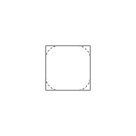

Default attachment view to be used as a placeholder when attachment preview is not implemented for custom attachments.

``` swift
open class AttachmentPlaceholderView: _View, AppearanceProvider 
```

## Inheritance

[`_View`](../_View), [`AppearanceProvider`](../../Utils/AppearanceProvider)

## Properties

### `borderLayer`

``` swift
open private(set) lazy var borderLayer: CAShapeLayer 
```

## Methods

### `layoutSubviews()`

``` swift
override open func layoutSubviews() 
```

### `setUpLayout()`

``` swift
override open func setUpLayout() 
```

### `setUpAppearance()`

``` swift
override open func setUpAppearance() 
```
