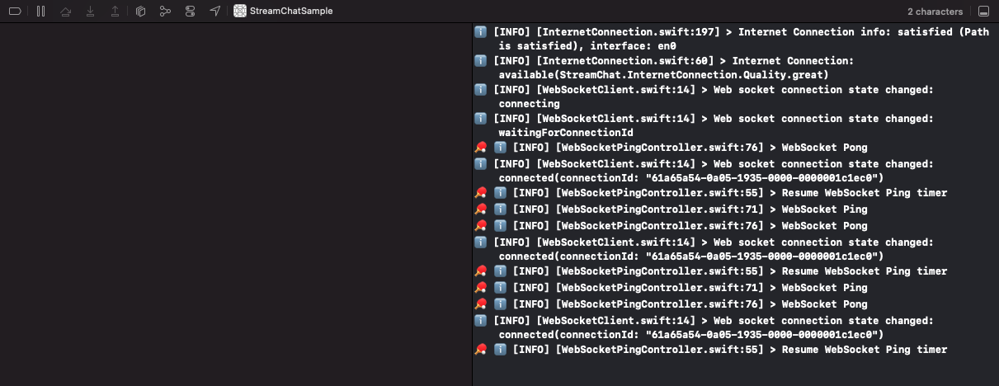

**By default, logs are disabled.**

Using the Stream Chat SDK is straightforward, and you should have something running very quickly. If you like, you can view the logging provided by the SDK. When loging is enabled, we print most log messages to the console from information, warnings and errors. This also includes logs provided by the Stream Chat API.



## Enable Logging

You can enable logs by setting the `logLevel`.

```swift
import StreamChat

LogConfig.level = .info
```

We have four different `logLevel`'s available.

- `.info` (This will provide all the information logs to the console).
- `.debug` (This is unfiltered and will show **ALL** logs).
- `.warning` (This will surface all warnings to the console).
- `.error` (This will surface all error logs).

## Customizing Logs

By default, the logs will provide basic text to your console. Still, in the SDK, we have functionality that enables you to provide custom Emoji's to identify logs coming from the SDK quickly.

```swift
LogConfig.formatters = [
    PrefixLogFormatter(prefixes: [.info: "ℹ️", .debug: "🛠", .warning: "⚠️", .error: "🚨"]),
    PingPongEmojiFormatter()
]
```

Setting a `LogConfig.formatter` will enable Emoji's to be placed before every log message.

It's also possible to go one step further and hide certain parts of the log messages that you require.

```swift
LogConfig.showThreadName = false
LogConfig.showDate = false
LogConfig.showFunctionName = false
```

Here, you're hiding the `threadName`, `date` and `functionName`.
