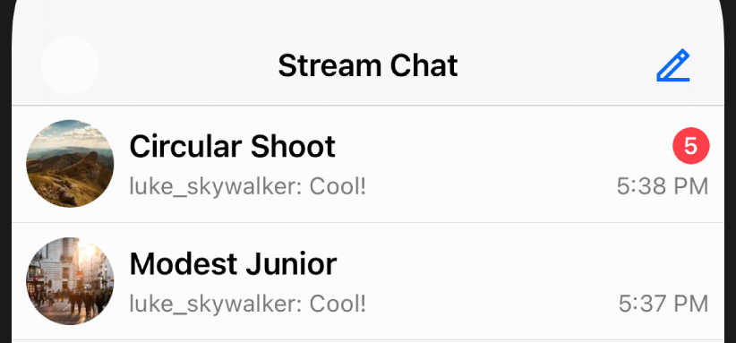
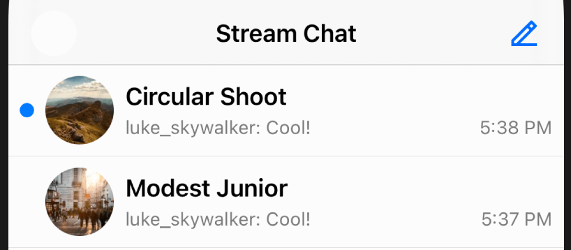

import Properties from '../common-content/reference-docs/stream-chat-ui/chat-channel-list/chat-channel-list-item-view-properties.md'
import ComponentsNote from '../common-content/components-note.md'

This component is used to display a channel in the [`ChannelList`](channel-list.md) component.

### Customization

#### Use a custom component

You can swap the built-in component with your own by setting `Components.default.channelContentView` to your own view type.

```swift
Components.default.channelContentView = MyChannelListItemView.self
```

<ComponentsNote />

### Example: Custom Unread Indicator

As an example of how to use these methods in practice, let's try to change the channel unread count indicator to look like the one in iMessage:

| Default style  | Custom "iMessage" Style |
| -------------- | ----------------------- |
|   |   |


Firstly, we need to create a custom subclass of `ChatChannelListItemView`, which is the component responsible for showing the channel summary in the channel list. Because the iMessage-style unread indicator is just a blue dot, rather then trying to modify the existing unread indicator, it's easier to create a brand new view for it:

```swift
class iMessageChannelListItemView: ChatChannelListItemView {

    // this is the blue dot to show next to channels with unread messages
    private lazy var customUnreadView: UIView = {
        let unreadView = UIView()
        unreadView.backgroundColor = tintColor
        unreadView.layer.masksToBounds = true
        unreadView.layer.cornerRadius = 5
        unreadView.clipsToBounds = true
        return unreadView
    }()

    override func setUpLayout() {
        super.setUpLayout()

        // Set constraints for the unread indicator
        NSLayoutConstraint.activate([
            customUnreadView.widthAnchor.constraint(equalTo: customUnreadView.heightAnchor),
            customUnreadView.widthAnchor.constraint(equalToConstant: 10),
        ])

        // Insert it as the left-most subview
        mainContainer.insertArrangedSubview(customUnreadView, at: 0)

        // Remove the original unread count indicator, since we don't need it anymore
        topContainer.removeArrangedSubview(unreadCountView)
    }

    override func updateContent() {
        super.updateContent()

        customUnreadView.alpha = unreadCountView.content == .noUnread ? 0 : 1
    }
}
```

Finally, we have to tell the SDK to use our custom subclass instead of the default type:
```swift
Components.default.channelContentView = iMessageChannelListItemView.self
```

## Properties

<Properties />
