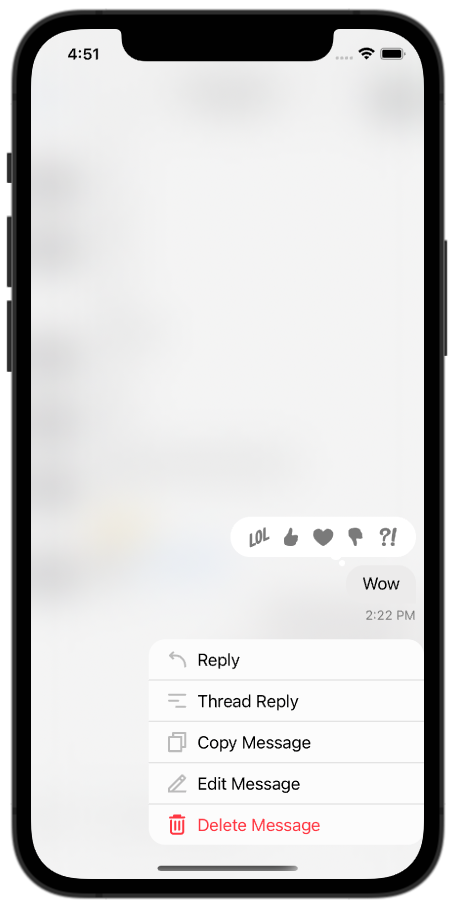
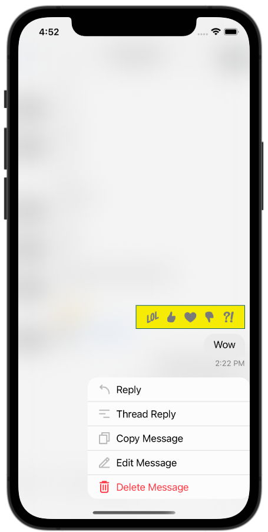

import Digraph  from '../common-content/digraph.jsx'

The Stream Chat API provides built-in support for adding reactions to messages. The UI SDK provides components for displaying and adding the reactions to a message.

## Basic Usage

Message reactions come out of the box with Stream Chat. The SDK will respect your channel configuration, if you disable reactions for a channel or channel type from the dashboard, the SDK will not render the UI for reactions.

## Message Reactions

By default, the message reactions are displayed inline as a bubble view on top of the messages.


The message reaction view is composed of a container bubble view that holds a stack of reaction item views. Here is the hierarchy of the message reaction view:

<Digraph margin="0 auto" width="300px">
{`
    ChatReactionsBubbleView -> ChatMessageReactionsView
    ChatMessageReactionsView -> ChatMessageReactionItemView
`}
</Digraph>

### ChatReactionsBubbleView

The reactions bubble view is a container that is responsible not only to hold the stack of the reactions but also for the bubble styling.

By subclassing the `ChatReactionsBubbleView`, you can customize the styling of the bubble view. In this example, we change the bubble fill color to black:
```swift
class CustomChatReactionsBubbleView: ChatReactionsBubbleView {
    override var fillColor: UIColor? {
        UIColor.black
    }
}

Components.default.messageReactionsBubbleView = CustomChatReactionsBubbleView.self
```

### ChatMessageReactionsView

This component is resposinble to layout the list of reactions. By default the reactions are rendered in a horizontal stack.

In this example we customize the `ChatMessageReactionsView` so that the reactions are rendered in a vertical stack instead:
```swift
class CustomChatMessageReactionsView: ChatMessageReactionsView {

    override func setUpLayout() {
        super.setUpLayout()

        stackView.axis = .vertical
    }
}

Components.default.messageReactionsView = CustomChatChatMessageReactionsView.self
```

### ChatMessageReactionItemView

This component is responsible to display a single reaction. By default if the reaction is from the logged in user, the reaction image color is blue, if not, the color is gray. Let's do a simple customization and force the reaction color to always be white:

```swift
class CustomChatMessageReactionItemView: ChatMessageReactionItemView {

    override var reactionImageTint: UIColor? {
        UIColor.white
    }
}

Components.default.messageReactionItemView = CustomChatMessageReactionItemView.self
```

If we do all the customizations descrive the above to the message reactions view, this will be the end result:

| Default Message Reactions | Custom Message Reactions |
| ------------------------- | ------------------------ |
|   |   |

## Reactions Picker

When you long-press a message or tap the reactions view bubble above the message view, the SDK will show a popup that contains a reactions picker. The `ChatMessageReactionsVC` view controller allows the user to toggle message reactions. Most of the time, changing the sub-components used by this class or its configurations is enough. For more complex customizations you can sub-class `ChatMessageReactionsVC` and use it. 

```swift

class CustomChatMessageReactionsVC: ChatMessageReactionsVC {}

Components.default.messageReactionsVC = CustomChatMessageReactionsVC.self
```

### Custom Reactions and Images

The `ChatMessageReactionsVC` picker uses the `components.reactionPickerBubbleView` component to render the reactions available to the user and to render their state. 

You can change the list of supported message reactions via the `Appearance` object. Here is an example on how you can use your own set of reactions

```swift
let reactionFireSmall: UIImage = UIImage(named: "fireSmall")!
let reactionFireBig: UIImage = UIImage(named: "fireBig")!
let reactionWaveSmall: UIImage = UIImage(named: "waveSmall")!
let reactionWaveBig: UIImage = UIImage(named: "waveBig")!

let customReactions: [MessageReactionType: ChatMessageReactionAppearanceType] = [
    "fire": ChatMessageReactionAppearance(
        smallIcon: reactionFireSmall,
        largeIcon: reactionFireBig
    ),
    "wave": ChatMessageReactionAppearance(
        smallIcon: reactionWaveSmall,
        largeIcon: reactionWaveBig
    )
]

Appearance.default.images.availableReactions = customReactions
```

### Custom Reaction Bubble

If you want to make more advanced customizations you can use your own `ChatMessageReactionsBubbleView` subclass and use it in your application.

```swift
class CustomChatMessageReactionsBubbleView: ChatMessageDefaultReactionsBubbleView {
    
    override open func layoutSubviews() {
        super.layoutSubviews()
        contentViewBackground.layer.cornerRadius = 0
    }

    override open var contentBackgroundColor: UIColor {
        .init(red: 0.96, green: 0.92, blue: 0.017, alpha: 1.0)
    }

    override open var contentBorderColor: UIColor {
        .init(red: 0.054, green: 0.36, blue: 0.39, alpha: 1.0)
    }

    override open var tailBackImage: UIImage? { nil }
    
    override open var tailFrontImage: UIImage? { nil }
}
```

Then you need to change the `reactionPickerBubbleView` component to use your class as usual.

```swift
Components.default.reactionPickerBubbleView = CustomChatMessageReactionsBubbleView.self
```

| Default Picker | Custom Picker |
| ------------- | ------------- |
|   |   |

### ChatReactionPickerReactionsView

This view is used to render the list of reaction buttons. By default the library will show one reaction button for every entry in `Appearance.default.images.availableReactions`.

You can use your own view class and replace using `Components.default.reactionPickerReactionsView`

```swift
Components.default.reactionPickerReactionsView = ChatReactionPickerReactionsView.self
```

### ChatMessageReactionItemView

This view is used to show the single reaction button, you can use your own view class and replace using `Components.default.reactionPickerReactionItemView`

```swift
Components.default.reactionPickerReactionItemView = CustomChatMessageReactionItemView.self
```
