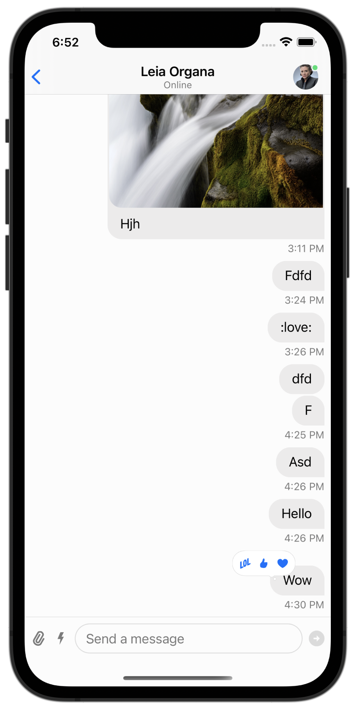

The Stream Chat API provides built-in support for adding reactions to messages. The component library provides default components to enable reaction selection and display.

## Basic Usage

Message reactions come out of the box with Stream Chat. The SDK will respect your channel configuration, if you disable reactions for a channel or channel type from the dashboard, the SDK will not render the UI for reactions.

## Reactions Picker

When you long-press a message, the SDK will show a reactions picker. The `ChatMessageReactionsVC` view controller allows the user to toggle message reactions. Most of the times, changing the sub-components used by this class or its configurations is enough. For more complex customizations you can sub-class `ChatMessageReactionsVC` and use it. 

```swift

class CustomChatMessageReactionsVC: ChatMessageReactionsVC {}

Components.default.messageReactionsVC = CustomChatMessageReactionsVC.self
```

### Custom Reactions and Images

The `ChatMessageReactionsVC` picker uses the `components.reactionPickerBubbleView` component to render the reactions available to the user and to render their state. 

You can change the list of supported message reactions via the `Appearance` object. Here is an example on how you can use your own set of reactions

```swift
let reactionFireSmall: UIImage = UIImage(named: "fireSmall")!
let reactionFireBig: UIImage = UIImage(named: "fireBig")!
let reactionWaveSmall: UIImage = UIImage(named: "waveSmall")!
let reactionWaveBig: UIImage = UIImage(named: "waveBig")!

let customReactions: [MessageReactionType: ChatMessageReactionAppearanceType] = [
    "fire": ChatMessageReactionAppearance(
        smallIcon: reactionFireSmall,
        largeIcon: reactionFireBig
    ),
    "wave": ChatMessageReactionAppearance(
        smallIcon: reactionWaveSmall,
        largeIcon: reactionWaveBig
    )
]

Appearance.default.images.availableReactions = customReactions
```

### Custom Reaction Bubble

If you want to make more advanced customizations you can use your own `ChatMessageReactionsBubbleView` subclass and use it in your application.

```swift
class CustomChatMessageReactionsBubbleView: ChatMessageDefaultReactionsBubbleView {
    
    override open func layoutSubviews() {
        super.layoutSubviews()
        contentViewBackground.layer.cornerRadius = 0
    }

    override open var contentBackgroundColor: UIColor {
        .init(red: 0.96, green: 0.92, blue: 0.017, alpha: 1.0)
    }

    override open var contentBorderColor: UIColor {
        .init(red: 0.054, green: 0.36, blue: 0.39, alpha: 1.0)
    }

    override open var tailBackImage: UIImage? { nil }
    
    override open var tailFrontImage: UIImage? { nil }
}
```

Then you need to change the `reactionPickerBubbleView` component to use your class as usual.

```swift
Components.default.reactionPickerBubbleView = CustomChatMessageReactionsBubbleView.self
```

| Default Picker | Custom Picker |
| ------------- | ------------- |
|   |   |

### ChatReactionPickerReactionsView

This view is used to render the list of reaction buttons. By default the library will show one reaction button for every entry in `Appearance.default.images.availableReactions`.

You can use your own view class and replace using `Components.default.reactionPickerReactionsView`

```swift
Components.default.reactionPickerReactionsView = ChatReactionPickerReactionsView.self
```

### ChatMessageReactionItemView

This view is used to show the single reaction button, you can use your own view class and replace using `Components.default.reactionPickerReactionItemView`

```swift
Components.default.reactionPickerReactionItemView = CustomChatMessageReactionItemView.self
```

## Message Reactions

Message reactions are added inline to messages. Here's the list of views that are used by the SDK.

### ChatReactionsBubbleView

A container view for the reactions. You can customize this if you want to change the border or the position of the whole list of reactions.

```swift
class CustomChatReactionsBubbleView: ChatReactionBubbleBaseView {
    private let tailHeight: CGFloat = 10

    override open func setUpLayout() {
        super.setUpLayout()
        directionalLayoutMargins.bottom += tailHeight
    }
}

Components.default.messageReactionsBubbleView = CustomChatReactionsBubbleView.self
```

### ChatMessageReactionsView

This component shows the list of reactions, you can customize this if you want to change how single reactions are positioned or arranged.

```swift
class CustomChatChatMessageReactionsView: ChatMessageReactionsView {}

Components.default.messageReactionsView = CustomChatChatMessageReactionsView.self
```

### ChatMessageReactionItemView

This component renders the single message reaction. 

```swift
class CustomChatMessageReactionItemView: ChatMessageReactionItemView {
    override open func updateContent() {
        super.updateContent()

        imageView?.layer.borderWidth = 1.0
        imageView?.layer.cornerRadius = 3.0
        imageView?.layer.masksToBounds = true
        imageView?.layer.borderColor = .init(red: 0, green: 0, blue: 0, alpha: 1)
    }
}

Components.default.messageReactionItemView = CustomChatMessageReactionItemView.self
```

| Default Message Reactions | Custom Message Reactions |
| ------------------------- | ------------------------ |
|   |   |
