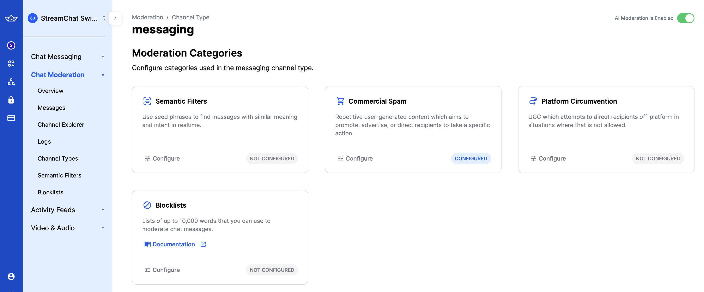

Stream Chat has support for several moderation actions, such as flagging, muting, banning and shadow banning. You can find more details about the available low-level client moderation tools on this [page](https://getstream.io/chat/docs/ios-swift/moderation/?language=swift).

You can moderate flagged messages and users through Stream's [moderation dashboard](https://getstream.io/chat/docs/ios-swift/moderation_dashboard/?language=swift).

### Moderation Categories

For each channel type, you can enable AI moderation, consisting of 4 moderation categories:
- Semantic Filters
- Commercial Spam
- Platform Circumvention
- Blocklists

For each moderation category, you can configure an action that will be performed after a message falls into that category.

The available actions are:
- Flag
- Block
- Bounce
- Bounce then flag
- Bounce then block

### iOS SDK Handling

In the iOS SDK, you can check if a message was moderated, by checking the `moderationDetails` value in the `ChatMessage`, which is `nil` for regular messages. 

If a message was moderated, the `moderationDetails` will have the following values:
- `originalText` - the original text of the message
- `action` - the action that was performed (flag, bounce or block).

You can also check if a message was bounced, by checking the `isBounced` boolean property.

### UI Components handling

The UIKit and SwiftUI components have default handling of bounced messages. When a message is bounced, there's a visual indicator on the message view to reflect that.

When you long press on a message, you can perform several default actions on it, such as editing and deleting it, as well as trying to resend it.