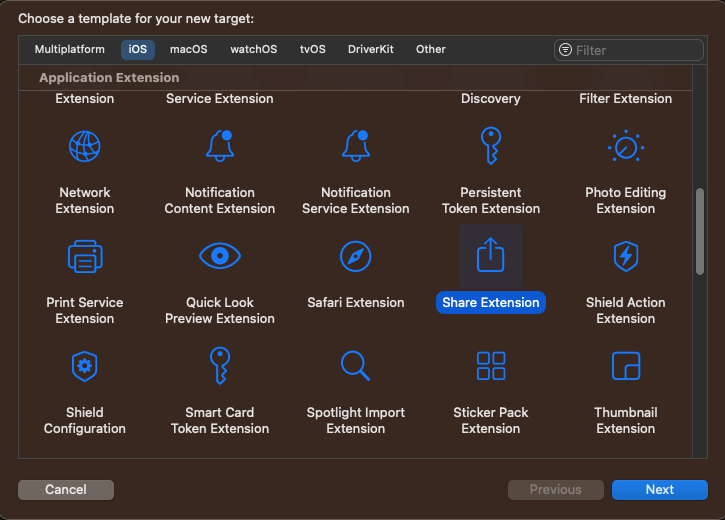
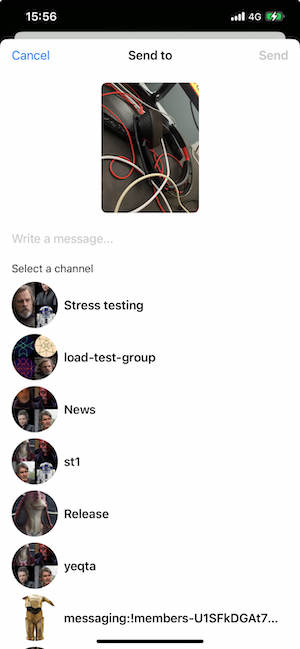

The StreamChat iOS SDK provides possibilities for deeper integration with the operating system, helping your users to engage with your app even when it is not active. One example is the "Share" extension, which allows users to share content via third-party apps from other apps, such as Apple's native Photos app.

### Chat Share Extension

In this guide, we will show you how to create such extension, which will share photos from Apple's share sheet to the Stream chat.

In order to get started, you need to create a share extension for your project in Xcode:



This action will generate a new target and a starting point to implement the share extension. In this example, we will not use a Storyboard, so you can delete that file from the generated code. The `Info.plist` file needs to be updated accordingly, by removing the storyboard entry. Its contents should look something like this:

```swift
<?xml version="1.0" encoding="UTF-8"?>
<!DOCTYPE plist PUBLIC "-//Apple//DTD PLIST 1.0//EN" "http://www.apple.com/DTDs/PropertyList-1.0.dtd">
<plist version="1.0">
<dict>
    <key>NSExtension</key>
    <dict>
        <key>NSExtensionAttributes</key>
        <dict>
            <key>IntentsSupported</key>
            <array>
                <string>INSendMessageIntent</string>
            </array>
            <key>NSExtensionActivationRule</key>
            <dict>
                <key>NSExtensionActivationSupportsImageWithMaxCount</key>
                <integer>10</integer>
            </dict>
        </dict>
        <key>NSExtensionPointIdentifier</key>
        <string>com.apple.share-services</string>
        <key>NSExtensionPrincipalClass</key>
        <string>DemoShare.ShareViewController</string>
    </dict>
</dict>
</plist>
```

Note that the `NSExtensionPrincipalClass`'s name consists of the target name and the name of the class that will be called when the user selects our extension from Apple's native share sheet.

In the `NSExtensionActivationRule`, we specify how our extension can be activated. Since we want to share images, we will use `NSExtensionActivationSupportsImageWithMaxCount`, with the value of 10. That means that our extension would be shown when up to 10 images are selected in the photos app. You can configure this value according to your requirements.

#### Setting up App Groups

To support sharing from an extension, we would need to take the currently logged in user in the main app. To do this, we need to create a shared container between the main app and the service extension. You can do this by adding an app group capability within your projects “Signing & Capabilities” section.

Make sure to use the same group for both targets (app and extension). When you have both configured, you need to adjust your `ChatClient` setup and add the following code to the configuration object:

```swift
var config = ChatClientConfig(apiKey: .init("<# Your API Key Here #>"))
config.applicationGroupIdentifier = "group.x.y.z"

let client = ChatClient(config: config)
```

In order for this to work correctly, you need to do it in the service extension and in the application.

#### ShareViewController

Next, let's implement the `ShareViewController`, which is called when the user selects our extension for sharing. In the generated code, the `ShareViewController` is subclassing the `SLComposeServiceViewController`, which provides a default UI with a text field and the images to share.

However, in our case we want to have the possibility to select a channel where we want to share the message, so we will change the subclass to `UIViewController` instead, and provide our custom UI.

Here's how the end result will look like:



In this example, we will use SwiftUI views, wrapped in a `UIHostingController`. However, you can build your UI entirely in UIKit as well.

Here's how the `ShareViewController`'s implementation looks like.

```swift
import UIKit
import Social
import StreamChat
import SwiftUI
import CoreServices

class ShareViewController: UIViewController {
        
    override func viewDidLoad() {
        super.viewDidLoad()
        
        guard let userCredentials = UserDefaults.shared.currentUser else {
            self.extensionContext?.completeRequest(returningItems: [], completionHandler: nil)
            return
        }
                
        self.view.backgroundColor = .systemBackground
        let demoShareView = UIHostingController(
            rootView: DemoShareView(
                userCredentials: userCredentials,
                extensionContext: self.extensionContext
            )
        ).view!
        
        demoShareView.frame = view.frame
        self.view.addSubview(demoShareView)
    }
}
```

First, we try to fetch the current user. Here `UserDefaults` are used for simplicity. However, in your app, you should store the currently logged in user in a more secure storage, such as the keychain.

Next, we create a `UIHostingController` with a root view called `DemoShareView`, and we add this as a subview to the view controller's view.

#### DemoShareView

Let's check the `DemoShareView` implementation next.

```swift
struct DemoShareView: View {
    
    @StateObject var viewModel: DemoShareViewModel
        
    init(
        userCredentials: UserCredentials,
        extensionContext: NSExtensionContext?
    ) {
        let vm = DemoShareViewModel(
            userCredentials: userCredentials,
            extensionContext: extensionContext
        )
        _viewModel = StateObject(wrappedValue: vm)
    }
    
    var body: some View {
        VStack(spacing: 0) {
            TopView(viewModel: viewModel)
            
            VStack(alignment: .center) {
                if viewModel.images.count == 1 {
                    ImageToShareView(image: viewModel.images[0])
                } else {
                    ScrollView(.horizontal) {
                        HStack {
                            ForEach(viewModel.images, id: \.self) { image in
                                ImageToShareView(image: image, contentMode: .fill)
                            }
                        }
                    }
                }
                
                TextField("Write a message...", text: $viewModel.text)
                    .padding(.vertical)
                
                HStack {
                    if viewModel.channels.count == 0 {
                        ProgressView()
                    } else {
                        Text("Select a channel")
                            .font(.subheadline)
                        
                        Spacer()
                    }
                }
                
                ShareChannelsView(viewModel: viewModel)
            }
            .padding()
        }
        .allowsHitTesting(!viewModel.loading)
    }
}
```

It's a standard SwiftUI implementation for the UI shown above. We are also using few helper views here:

```swift
struct TopView: View {
    
    @ObservedObject var viewModel: DemoShareViewModel
    
    var body: some View {
        HStack {
            Button(action: {
                viewModel.dismissShareSheet()
            }, label: {
                Text("Cancel")
            })
            Spacer()
            Button(action: {
                Task {
                    do {
                        try await viewModel.sendMessage()
                    } catch {
                        viewModel.dismissShareSheet()
                    }
                }
            }, label: {
                if viewModel.loading {
                    ProgressView()
                } else {
                    Text("Send")
                        .bold()
                }
            })
            .disabled(viewModel.selectedChannel == nil)

        }
        .padding(.vertical, 8)
        .padding(.horizontal, 16)
        .frame(height: 44)
        .overlay(
            Text("Send to")
                .bold()
        )
    }
}

struct ImageToShareView: View {
    
    private let imageHeight: CGFloat = 180
    
    var image: UIImage
    var contentMode: ContentMode = .fit
    
    var body: some View {
        Image(uiImage: image)
            .resizable()
            .aspectRatio(contentMode: contentMode)
            .frame(height: imageHeight)
            .cornerRadius(8)
    }
    
}

struct ShareChannelsView: View {
    
    @ObservedObject var viewModel: DemoShareViewModel
    
    var body: some View {
        ScrollView {
            LazyVStack(alignment: .leading, spacing: 8) {
                ForEach(viewModel.channels) { channel in
                    Button {
                        viewModel.channelTapped(channel)
                    } label: {
                        HStack {
                            ChatChannelAvatarView.asView(
                                (channel: channel, currentUserId: viewModel.currentUserId)
                            )
                            .frame(width: 64, height: 64)
                            
                            Text(channel.name ?? channel.id)
                                .bold()
                                .lineLimit(1)
                                .foregroundColor(.primary)
                            Spacer()
                            if viewModel.selectedChannel == channel {
                                Image(systemName: "checkmark")
                            }
                        }
                    }
                }
            }
        }
    }
    
}

extension ChatChannel: Identifiable {
    public var id: String {
        return cid.rawValue
    }
}
```

Next, let's see the implementation of the `DemoShareViewModel`, that handles the loading of the selected image and sends it to Stream's chat.

```swift
import Combine
import CoreServices
import UIKit
import StreamChat
import Social

@MainActor
class DemoShareViewModel: ObservableObject, ChatChannelControllerDelegate {
    
    private let chatClient: ChatClient
    private let userCredentials: UserCredentials
    private var channelListController: ChatChannelListController?
    private var channelController: ChatChannelController?
    private var messageId: MessageId?
    private var extensionContext: NSExtensionContext?
    private var imageURLs = [URL]() {
        didSet {
            images = imageURLs.compactMap { url in
                if let data = try? Data(contentsOf: url),
                   let image = UIImage(data: data) {
                    return image
                }
                return nil
            }
        }
    }
    
    var currentUserId: UserId? {
        chatClient.currentUserId
    }
    
    @Published var channels = LazyCachedMapCollection<ChatChannel>()
    @Published var text = ""
    @Published var images = [UIImage]()
    @Published var selectedChannel: ChatChannel?
    @Published var loading = false
    
    init(
        userCredentials: UserCredentials,
        extensionContext: NSExtensionContext?
    ) {
        var config = ChatClientConfig(apiKey: .init(apiKeyString))
        config.isClientInActiveMode = true
        config.applicationGroupIdentifier = applicationGroupIdentifier
        
        let client = ChatClient(config: config)
        client.setToken(token: Token(stringLiteral: userCredentials.token.rawValue))

        self.chatClient = client
        self.userCredentials = userCredentials
        self.extensionContext = extensionContext
        self.loadChannels()
        self.loadImages()
    }
    
    func sendMessage() async throws {
        guard let cid = selectedChannel?.cid else {
            throw ClientError.Unexpected("No channel selected")
        }
        self.channelController = chatClient.channelController(for: cid)
        guard let channelController = channelController else {
            throw ClientError.Unexpected("Can't upload attachment")
        }
        channelController.delegate = self
        loading = true        
        try await channelController.synchronize()
        let remoteUrls = await withThrowingTaskGroup(of: URL.self) { taskGroup in
            for url in imageURLs {
                taskGroup.addTask {
                    let uploaded = try await channelController.uploadAttachment(
                        localFileURL: url,
                        type: .image
                    )
                    return uploaded.remoteURL
                }
            }
            
            var results = [URL]()
            while let result = await taskGroup.nextResult() {
                if let url = try? result.get() {
                    results.append(url)
                }
            }
            return results
        }
        
        var attachmentPayloads = [AnyAttachmentPayload]()
        for remoteUrl in remoteUrls {
            let attachment = ImageAttachmentPayload(title: nil, imageRemoteURL: remoteUrl)
            attachmentPayloads.append(AnyAttachmentPayload(payload: attachment))
        }
        
        messageId = try await channelController.createNewMessage(
            text: text,
            attachments: attachmentPayloads
        )
    }
    
    func channelTapped(_ channel: ChatChannel) {
        if selectedChannel == channel {
            selectedChannel = nil
        } else {
            selectedChannel = channel
        }
    }
    
    
    func dismissShareSheet() {
        loading = false
        self.extensionContext?.completeRequest(returningItems: [], completionHandler: nil)
    }
    
    nonisolated func channelController(
        _ channelController: ChatChannelController,
        didUpdateMessages changes: [ListChange<ChatMessage>]
    ) {
        Task {
            await MainActor.run {
                for change in changes {
                    if case .update(let item, _) = change {
                        if messageId == item.id, item.localState == nil {
                            dismissShareSheet()
                            return
                        }
                    }
                }
            }
        }
    }
    
    // MARK: - private
    
    private func loadItem(from itemProvider: NSItemProvider, type: String) async throws -> NSSecureCoding {
        return try await withCheckedThrowingContinuation { continuation in
            itemProvider.loadItem(forTypeIdentifier: type) { item, error in
                if let error = error {
                    continuation.resume(throwing: error)
                } else if let item = item {
                    continuation.resume(returning: item)
                } else {
                    continuation.resume(throwing: ClientError.Unknown())
                }
            }
        }
    }
    
    private func loadImages() {
        Task {
            let inputItems = extensionContext?.inputItems
            var urls = [URL]()
            for inputItem in (inputItems ?? []) {
                if let extensionItem = inputItem as? NSExtensionItem {
                    for itemProvider in (extensionItem.attachments ?? []) {
                        if itemProvider.hasItemConformingToTypeIdentifier(kUTTypeImage as String) {
                            let item = try await loadItem(from: itemProvider, type: kUTTypeImage as String)
                            if let item = item as? URL {
                                urls.append(item)
                            }
                        }
                    }
                }
            }
            self.imageURLs = urls
        }
    }
    
    private func loadChannels() {
        Task {
            try await chatClient.connect(
                userInfo: userCredentials.userInfo,
                token: userCredentials.token
            )
            let channelListQuery: ChannelListQuery = .init(
                filter: .containMembers(userIds: [chatClient.currentUserId ?? ""])
            )
            self.channelListController = chatClient.channelListController(query: channelListQuery)
            channelListController?.synchronize { [weak self] error in
                guard let self, error == nil else { return }
                channels = channelListController?.channels ?? []
            }
        }
    }
}
```

When we create the view model, we are connecting the user and creating and synchronizing a channel list controller. We need this controller in order to fetch the latest channels and present them in a list to the user for selection. 

Note that in this example, for simplicity, we are not paginating through the channels. You can do that by using the `loadPreviousMessages` from the `ChatChannelController`.

The other important bits of this code are the `loadImages` method, that loads the images provided from the extension context, as well as the methods for uploading the attachments and sending the message to Stream chat.

We also implement the `channelController.didUpdateMessages` delegate method, to dismiss the extension when the message is successfully sent, in order to avoid inconsistent local state.

To make the implementation more readable and robust, we are also wrapping the completion handlers from the `ChatClient` and `ChatChannelController` in async/await syntax.

```swift
import Foundation
import StreamChat

extension ChatClient {
    func connect(userInfo: UserInfo, token: Token) async throws {
        return try await withCheckedThrowingContinuation { continuation in
            connectUser(userInfo: userInfo, token: token) { error in
                if let error = error {
                    continuation.resume(throwing: error)
                } else {
                    continuation.resume(returning: ())
                }
            }
        }
    }
}

extension ChatChannelController {
    func synchronize() async throws {
        return try await withCheckedThrowingContinuation { continuation in
            self.synchronize { error in
                if let error = error {
                    continuation.resume(throwing: error)
                } else {
                    continuation.resume(returning: ())
                }
            }
        }
    }
    
    func uploadAttachment(
        localFileURL: URL,
        type: AttachmentType
    ) async throws -> UploadedAttachment {
        return try await withCheckedThrowingContinuation { continuation in
            uploadAttachment(localFileURL: localFileURL, type: type) { result in
                switch result {
                case .success(let uploaded):
                    continuation.resume(returning: uploaded)
                case .failure(let error):
                    continuation.resume(throwing: error)
                }
            }
        }
    }
    
    @discardableResult
    func createNewMessage(text: String, attachments: [AnyAttachmentPayload]) async throws -> MessageId {
        return try await withCheckedThrowingContinuation { continuation in
            createNewMessage(
                text: text,
                attachments: attachments
            ) { result in
                switch result {
                case .success(let messageId):
                    continuation.resume(returning: messageId)
                case .failure(let error):
                    continuation.resume(throwing: error)
                }
            }
        }
    }
}
```

With that, image attachments can successfully be sent to Stream chat from a Share extension.

#### Donating intents

If you want to have your extension appear in the suggestions of the share sheet, you should donate a `INSendMessage` intent to `SiriKit`, when you send a message.

You can find more details about this [here](https://developer.apple.com/documentation/foundation/app_extension_support/supporting_suggestions_in_your_app_s_share_extension).