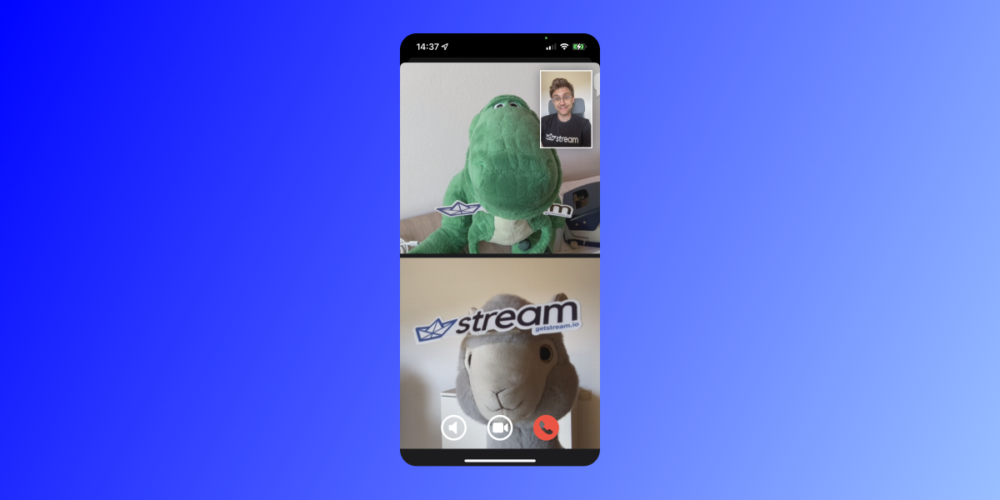
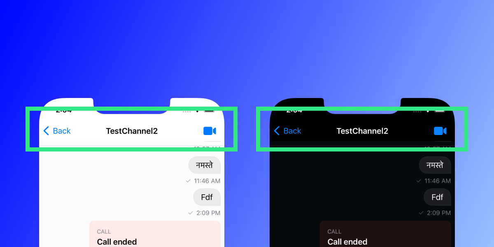
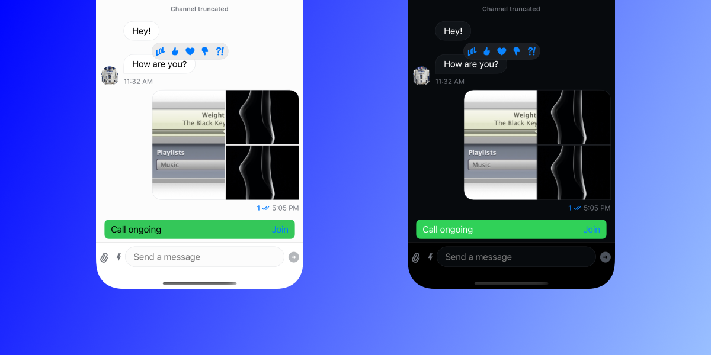

## Introduction

Video calls have become immensely popular since the onset of the pandemic. Today, we take a look at how you can use the service of [agora](https://www.agora.io/en/) to integrate video calls into the Stream Chat SDK.

Agora is an infrastructure provider for live, interactive voice and video. They offer native SDKs for mobile platforms, cross-platform frameworks, and the web and allow for simple integration with very few lines of code. They cover a wide range of use-cases such as video conferencing, interactive live-streaming, real-time messaging, and many more.

You must complete quite a few steps to create the final product. We will cover all of them to help you create a well-integrated, fully functional, and reusable solution in the end.

In order to create this, follow these six steps:

1. Set up an Agora account
2. Create a server
3. Set up a basic app architecture
4. Layout UI
5. Update the channel information to indicate an active call
6. Hook up the agora SDK to the UI

<aside>
💡 On the second step of creating a server: we will provide a solution for you that you can re-use but in case you’re interested we offer a guide on how to build one as well. (TODO: link to repo)

</aside>

In order to not start from the beginning, [the tutorial for SwiftUI](https://getstream.io/tutorials/swiftui-chat/) from [our website](https://getstream.io) is set as the starting point. So, if you followed this one, you are ready to jump right in.

## 1. Setting up an account for Agora

You need to set up an account on the [agora.io](http://agora.io) website. Once you’ve created the account, you will need to create a project and look for it in the [console](https://console.agora.io). Once you have that ready, you will need to prepare two things for the creation of the server in the next chapter:

- the app id
- the app certificate

Once you have these two available you can continue with this guide.

## 2. Create a server

This guide does not cover each and every step required to create a server. However, we do offer a custom solution in *node.js* that you can use, that supports all necessary steps and APIs.

Go to the Github page (TODO: create a Github page with a guide) to see an integration guide. We will assume that you followed the following steps, to have a server up and running on your local machine:

1. Clone the repo and set up your machine to have it running (install node / npm)
2. Get the credentials from the Dashboard and copy them into a local `.env` file

With the server running you can create a new class that takes care of the communication with it.

Create a new Swift file called `NetworkManager`:

```swift
import Foundation

enum MyError: Error {
	case urlCreationFailure(message: String), invalidServerResponse(message: String), unsupportedData
}

struct AccessTokenResponse: Codable {
	var token: String
	var appId: String
	var channelId: String
	var uid: String
}

class NetworkManager {
	
#if targetEnvironment(simulator)
	// simulator code
	let serverAddress: String = "http://localhost:3000"
#else
	// real device code (you need to check the IP address of your mac in network settings
	let serverAddress: String = "http://192.168.178.132:3000"
#endif
	
	static let shared = NetworkManager()
	
	private init() {}
	
	func getAccessToken(for channel: String, with uid: UInt) async throws -> AccessTokenResponse {
		var urlComponents = URLComponents(string: createRoomCreationUrlString())
		
		// Add query parameters
		urlComponents?.queryItems = [
			URLQueryItem(name: "channelId", value: channel),
			URLQueryItem(name: "uid", value: "\(uid)")
		]
		
		guard let url = urlComponents?.url else {
			throw MyError.urlCreationFailure(message: "Access Token URL could not be created")
		}
		
		var request = URLRequest(url: url)
		request.httpMethod = "GET"
		
		print("=== \(request.url?.absoluteString ?? "unknown")")
		
		let (data, response) = try await URLSession.shared.data(for: request)
		
		guard let httpResponse = response as? HTTPURLResponse, httpResponse.statusCode == 200 else {
			throw MyError.invalidServerResponse(message: response.debugDescription)
		}
		
		if let responseObject = try? JSONDecoder().decode(AccessTokenResponse.self, from: data) {
			print(responseObject)
			return responseObject
		} else {
			throw MyError.unsupportedData
		}
	}
	
	private func createRoomCreationUrlString() -> String {
		return "\(serverAddress)/accessToken"
	}
}
```

<aside>
💡 Note that you need to change the `serverAddress` variable on *line 21* to match the IP address of your Mac in order to connect your real device to the server.
Not sure where to find the correct IP? [Check out this guide](https://www.hellotech.com/guide/for/how-to-find-ip-address-on-mac).

</aside>

With that, the server is running and you have a helper class that allows you to interact with the backend without much need for customization.

## 3. Set up basic app architecture

The integration requires a bit of setup which is why you will create most of the necessary files right now. This will provide a solid overview of the overall architecture and you will fill up the files more and more over the course of following this integration guide.

Before starting, you need to import the Agora SDK into the project. The recommended way is to use Swift Package Manager (SPM) for it. [Follow the guide on their GitHub repo](https://github.com/AgoraIO/AgoraRtcEngine_iOS/) to add the dependency to your project.

For the implementation, you will need an object that conforms to the `ViewFactory` of the `StreamChatSwiftUI` SDK. This will be used to tailor the SDK to your needs so you will create a new Swift file called `CustomFactory`. You now only need to add a `chatClient` object to it and we will do all other work later. This is what it should look like for now:

```swift
import StreamChatSwiftUI
import StreamChat

class CustomFactory: ViewFactory {
	@Injected(\.chatClient) public var chatClient: ChatClient
}
```

Note: if you’re not sure how the dependency injection mechanism works, [we have a nice resource to read up on it](https://getstream.io/chat/docs/sdk/ios/swiftui/dependency-injection/).

In order to have a clean architecture, separate the logic from the view code. One of the most common approaches for that is the MVVM-Architecture (Model-View-ViewModel). Create the `CallViewModel` next and give it some basic properties that will later be filled up with the necessary SDK logic. This will make it easier for you to layout the UI and have that in place.

Create a Swift file called `CallViewModel` and fill it with the following code:

```swift
import SwiftUI
import StreamChat
import StreamChatSwiftUI

class CallViewModel: NSObject, ObservableObject  {
	
	@Injected(\.chatClient) var chatClient

		// Indicates whether a call is active at the moment
	@Published fileprivate(set) var callActive: Bool = false

	// Indicates whether the call screen is currently shown
	@Published var isCallScreenShown: Bool = false
	
	// Handles for muting of audio / video
	@Published private(set) var isAudioMuted = false
	@Published private(set) var isVideoMuted = false

		// Needed to update the call info about the channel
		private var channelController: ChatChannelController?

		// Property used to detect if the user is currently in a call
		@Published private(set) var ownUid: UInt?

		func setChannelId(_ id: ChannelId) {}

		func startCall(updateChannel: Bool = true) {}

		func joinCall() {}

		func leaveCall() {}

		func toggleAudioMute() {}

		func toggleVideoMute() {}
}
```

If you need a refresher on the entire MVVM architecture [there is a nice article here](https://www.hackingwithswift.com/books/ios-swiftui/introducing-mvvm-into-your-swiftui-project).

There are a few methods already defined which have no logic inside. You will gradually fill the view model up with more logic throughout this guide, but first, let’s start by building out the UI for the project. Having the (empty) functions in place already allows us to build up the UI completely and only care for the logic later inside of the `CallViewModel`.

## 4. Layout basic UI

You saw the UI in the video at the beginning of this guide. It’s not a complicated setup, and luckily, the SDKs provide a lot of assistance. But there’s still work to be done, so let’s get to it!

You’ll start off with creating the view for calls, that shows some UI elements and the participants. Let’s have a look first at what it is made up of:



The UI components are:

1. A vertical list of all call participants
2. The user’s own video is placed at the top right above the other content
3. A row of buttons at the bottom to control certain call elements (namely toggle audio and video and end call)

### Create a View for Call Participants

For the rendering of participants’ videos, you will use the *agora* SDK. This is only supported in UIKit yet so this part of the UI will be wrapped inside of a `ViewController` that will then be bridged with SwiftUI to make it integrate seamlessly into the project.

Start off by creating a new Swift file called `RemoteVideoViewController`.

Its structure is fairly straightforward. It will only consist of a `UIStackView`. When a new participant is joining a call it will have an `addVideoView` function that adds a new view to the stack view and a `removeVideoView` that will remote a certain view from the stack view.

In order to keep track of the participants and their respective video views, there will be a variable called `remoteVideoViews` which is a dictionary that assigns the respective video view to the key of the id of the participant.

With that, you can easily remove a view from the stack view (via `.removeFromSuperview()`).

Let’s fill the `RemoteVideoViewController.swift` with the following code:

```swift
import UIKit
import AgoraRtcKit
import SwiftUI

class RemoteVideoViewController: UIViewController {
	
	let stackView: UIStackView = {
		let sv = UIStackView()
		sv.translatesAutoresizingMaskIntoConstraints = false
		sv.axis = .vertical
		sv.distribution = .fillEqually
		sv.spacing = 16.0
		return sv
	}()
	
	var remoteVideoViews: [UInt: UIView] = [:]

	override func viewDidLoad() {
		super.viewDidLoad()

		self.view.addSubview(stackView)
		
		NSLayoutConstraint.activate([
			stackView.topAnchor.constraint(equalTo: view.topAnchor),
			stackView.leftAnchor.constraint(equalTo: view.leftAnchor),
			stackView.rightAnchor.constraint(equalTo: view.rightAnchor),
			stackView.bottomAnchor.constraint(equalTo: view.bottomAnchor)
		])
	}
	
	func addVideoView(_ view: AgoraRtcVideoCanvas, with uid: UInt) {
		let containerView = UIView()
		containerView.backgroundColor = .gray
		containerView.translatesAutoresizingMaskIntoConstraints = false
		
		stackView.addArrangedSubview(containerView)
		
		view.view = containerView
		
		remoteVideoViews[uid] = containerView
	}
	
	func removeVideoView(with uid: UInt) {
		if !remoteVideoViews.keys.contains(uid) {
			print("Uid (\(uid)) is not in keys.")
			return
		}
		let viewToRemove = remoteVideoViews[uid]
		viewToRemove?.removeFromSuperview()
		remoteVideoViews.removeValue(forKey: uid)
	}
	
	override func viewDidDisappear(_ animated: Bool) {
		remoteVideoViews = [:]
				for child in stackView.subviews {
			child.removeFromSuperview()
		}
		super.viewDidDisappear(animated)
	}
	
}
```

<aside>
💡 Note that the view uses UI that is created programmatically. The sole purpose is that it fits the scope of this guide better. You are free to use whatever you like.

</aside>

Connecting this code with real calls will happen in a later chapter, but the UI is functional for now. The last required step is to create a bridge for SwiftUI so that you can use the `RemoteVideoViewController` in the SwiftUI world.

Luckily, there is `UIViewControllerRepresentable` that allows to quite simply wrap a `UIViewController` with very few lines of code.

Add the following lines to the top of the  `RemoteVideoViewController.swift` file (after the imports):

```swift
struct RemoteVideoView: UIViewControllerRepresentable {
	
	let viewController: RemoteVideoViewController
	
	func makeUIViewController(context: Context) -> some UIViewController {
		return viewController
	}
	
	func updateUIViewController(_ uiViewController: UIViewControllerType, context: Context) {
		// nothing to do here
	}
}
```

The `viewController` variable is used because it will be part of the view model and needs to reflect updates from the *agora* SDK when participants are joining or leaving a call.

Add the following variable to `CallViewModel`:

```swift
var remoteVideoViewController = RemoteVideoViewController()
```

You have now taken care of the video from other participants of the call, so let’s tackle the user’s own video next.

### Create a view of the user’s video

What you can see from the UIKit view is that in order to show the remote video, you need to have a `UIView` as a container. You’ll then create the *agora* SDK’s video view and assign your container as its `view` property (you will see how to do that in the later chapter called “**Integration of the agora SDK**”.

The process is merely the same for the user’s local video. Again, you’ll need to create a `UIView` for the container that serves as a canvas for the video. 

Create a new Swift file called `VideoCanvas` and fill it with this code:

```swift
import SwiftUI

struct VideoCanvas: UIViewRepresentable {
	
	let containerView = UIView()
	
	func makeUIView(context: Context) -> some UIView {
		containerView.backgroundColor = .gray
		return containerView
	}
	
	func updateUIView(_ uiView: UIViewType, context: Context) {
		// Nothing to do here
	}
	
}
```

It is important to have a reference to the `containerView` because that is needed to assign it to the *agora* SDK’s video view.

With that, head over to the `CallViewModel` and give it a new property (e.g. right below the previously added `remoteVideoViewController`):

```swift
var localCanvas = VideoCanvas()
```

Hooking that up with real functionality comes later but now you have everything ready to combine the previously created views and create the UI for an entire call. 

### Combine everything with the call view

Create a new SwiftUI view called `CallView`. It will consist of the following pieces:

1. The remote video parts (the `RemoteVideoView`)
2. The user’s video (the `localCanvas` you just added to the view model)
3. A list of buttons to mute/unmute audio and video and end the call

Because we access several variables and will also call functions from it the `CallView` needs to receive a `CallViewModel` upon initialization, so first, add that as a property:

```swift
@ObservedObject var viewModel: CallViewModel
```

You will be stacking views on top of each other so a `ZStack` will be at the root. Then the remote videos will be shown. On top, there will be a `VStack` that shows the user’s video if it is available (the check for `viewModel.ownUid`) and if the video is not muted (the check for `viewModel.isVideoMuted`). The `VStack` will also contain the button row at the bottom with an `HStack` where the actions happening will be filled later on.

Here is the code for the `CallView`:

```swift
import SwiftUI

struct CallView: View {
	
	@ObservedObject var viewModel: CallViewModel
	
	var body: some View {
		ZStack {
			RemoteVideoView(viewController: viewModel.remoteVideoViewController)
			
			VStack {
				if let _ = viewModel.ownUid {
					HStack {
						Spacer()
						
						if viewModel.isVideoMuted {
							Rectangle()
								.fill(Color.gray)
								.frame(width: 100, height: 150)
								.shadow(radius: 10)
						} else {
							viewModel.localCanvas
								.frame(width: 100, height: 150)
						}
					}
					.padding()
				}
				
				Spacer()
				
				HStack(spacing: 40) {
					Button {
						// mute
					} label: {
						Image(systemName: viewModel.isAudioMuted ? "speaker.slash.circle" : "speaker.circle")
							.resizable()
							.foregroundColor(viewModel.isAudioMuted ? .gray : .primary)
							.frame(width: 50, height: 50)
					}
					
					Button {
						// toggle video
					} label: {
						Image(systemName: viewModel.isVideoMuted ? "video.slash" : "video.circle")
							.resizable()
							.foregroundColor(viewModel.isVideoMuted ? .gray : .primary)
							.frame(width: 50, height: 50)
					}
					
					Button {
						// end call
					} label: {
						Image(systemName: "phone.circle.fill")
							.resizable()
							.foregroundColor(.red)
							.frame(width: 50, height: 50)
					}
				}
				.padding()
			}
		}
	}
}
```

With that, the `CallView` is finished and you have already called the correct functions on the button clicks. They are just not hooked up with the logic that, will happen in the next chapters.

### Create the custom channel header

 For initiating calls the channel header will have a call icon at the right as shown in the screenshot below:



Creating the custom channel header requires a few steps. 

You start off by creating a new Swift file called `CustomChatChannelHeader.swift`. It will define a toolbar and the content that should go there, which are two things:

1. The name of the channel in the middle
2. A button to start a call on the right of the toolbar

You will leverage the `ToolbarContent` type for that and create your items as `ToolbarItem`s with a placement parameter specifying the position.

There are a few things you need to make everything work as expected. Create the struct and add the following parameters to it:

```swift
public struct CustomChatChannelHeader: ToolbarContent {
		// Stream SDK related
	@Injected(\.fonts) var fonts
	@Injected(\.utils) var utils
	@Injected(\.chatClient) var chatClient
	
		// Parameters received upon creation
	@ObservedObject var viewModel: CallViewModel

	public var onTapTrailing: () -> ()
	
	public var body: some ToolbarContent {
		// To fill
	}
}
```

The need for those will become clear in a second because now you will add the layout in the `body` inside of `CustomChatChannelHeader`:

```swift
// Name of the channel
ToolbarItem(placement: .principal) {
	VStack {
		Text(utils.channelNamer(channel, chatClient.currentUserId) ?? "")
			.font(fonts.bodyBold)
	}
}

// Button to start a call
ToolbarItem(placement: .navigationBarTrailing) {
	Button {
		onTapTrailing()
	} label: {
		Image(systemName: "video.fill")
	}
		.disabled(viewModel.callActive)
}
```

This allows you to have the name of the channel with the `.principal` placement (the middle) and the button to start a call for the `.navigationBarTrailing` placement.

The action that is happening is handed in as a closure with the name `onTapTrailing`. The image for the button is taken from [SF Symbols](https://developer.apple.com/sf-symbols/).

You need to create one more element, which is the modifier for the channel header. It is the place where you want to define the functionality of the `onTapTrailing` closure and you also need to add one second, very important thing.

The button to start a call will be disabled (with the `.disabled`) modifier when a call in the channel is active. You only want one active call at all times so disabling prevents users from initiating new ones while one is currently ongoing.

We already mentioned it and here is where you’ll add a `.sheet` modifier that will hold the `CallView` that will popup when a call is entered. 

Create that below the definition of the `CustomChannelHeader`:

```swift
struct CustomChannelHeaderModifier: ChatChannelHeaderViewModifier {
	
	var channel: ChatChannel
	@ObservedObject var viewModel: GeneralViewModel
	
	func body(content: Content) -> some View {
		content.toolbar {
			CustomChatChannelHeader(viewModel: viewModel, channel: channel, isCallShown: $viewModel.isCallScreenShown) {
								viewModel.startCall()
			}
		}
		.sheet(isPresented: $viewModel.isCallScreenShown, onDismiss: {
			viewModel.leaveCall()
		}, content: {
			CallView(viewModel: viewModel)
		})
				.onAppear {
			// when we the channel header appears the channel has become active, so we notify the viewModel
			viewModel.setChannelId(channel.cid)
		}
	}
}
```

The code contains a `body` that is handed the content. You’re attaching the `CustomChannelHeader` as a toolbar with the `.toolbar` modifier.

You’re then calling the `startCall` method of the view model. This method will later be filled with functionality. It will make the sheet pop up and you can handle joining the call from the `CallView` itself. The `CallView` is set as the content of the sheet.

The reason why the `channelId` in the `viewModel` is set in the `.onAppear` modifier is that it is needed to later join the call. This makes use of the fact, that when a user taps on a channel, its header will be rendered and it's a notification for you that you can safely set the id.

The last step is to add the `makeChannelHeaderViewModifier` override in the `CustomFactory`. Open up `CustomFactory` and add the following snippet:

```swift
func makeChannelHeaderViewModifier(for channel: ChatChannel) -> some ChatChannelHeaderViewModifier {
	return CustomChannelHeaderModifier(channel: channel, viewModel: viewModel)
}
```

### Construct the call overlay for the channel

When a call is active inside of a channel, there should be an indicator at the bottom of the screen that indicates that and allows users to join. It looks like this:



The *StreamChatSwiftUI* SDK makes it very easy to build that because you can create a custom view modifier and conditionally apply that. Let’s first create the UI and then hook it up with the SDK in the `CustomFactory`.

Create a new Swift file called `CallOverlay`. This will be a `struct` that conforms to `ViewModifier`. What this requires you to do is give it a function with the signature `body(content: Content) -> some View`.

With the `callActive` property in the view model, you can detect if you need to apply the modifier. If not then you can just return the `content` itself.

If it is active you will give the content a little padding and then create an overlay with it. The view code itself is rather unspectacular so we’ll give you the entire code of the `CallOverlay` file here:

```swift
import SwiftUI

struct CallOverlay: ViewModifier {
	
	@ObservedObject var viewModel: CallViewModel
	
	func body(content: Content) -> some View {
		if viewModel.callActive {
			content
				.padding(.top, 30)
				.overlay(
					VStack {
						Spacer()
						HStack {
							Text("Call ongoing")
							
							Spacer()
							
							Button {
								// join
								viewModel.joinCall()
							} label: {
								Text("Join")
							}
						}
						.padding(.vertical, 8)
						.padding(.horizontal, 12)
						.background(Color.green, in: RoundedRectangle(cornerRadius: 8, style: .continuous))
						.padding(.horizontal)
						.padding(.bottom, -12)
					}
												// This couple of modifiers is necessary due to some magic in the SDK
						.rotationEffect(.radians(Double.pi))
						.scaleEffect(x: -1, y: 1, anchor: .center)
				)
		} else {
			content
		}
		}
}
```

Now, head over to the `CustomFactory` and add the following code to it:

```swift
func makeMessageListModifier() -> some ViewModifier {
	CallOverlay(viewModel: viewModel)
}
```

By this simple override of the `makeMessageListModifier()` function, you can inject your `CallOverlay` function and conditionally show it once the variable in the view model is `true`.

With that, you have completed the UI setup of the app and can now continue by updating the channels.

## 5. Initiate call with channel update

The basic approach you are taking for video calls is that every time a call is initiated, the channel will hold all necessary information about the call so that all members of the channel can join. This requires you to do a few things:

1. Watch the channel for updates
2. Handle the updates in local state to update the UI when a call is ongoing
3. Update the channel state when a call starts / ends

The approach taken is a very reactive one. So, let’s go over the points and build up the code.

### Watching for channel updates

The first thing you will create is a little helper function that takes care of watching a channel. The concept of watching channels in the *StreamChat* SDK simply means that you are subscribing to updates of it and can define a `delegate` that will be called anytime there are changes.

For the convenience function, you create you will need the `ChannelId` to create a controller. You already added a member variable to the `CallViewModel` earlier that will hold the `channelController` so that you can also stop watching the channel (no longer receive updates for that one) if necessary.

Add this function inside of `CallViewModel`:

```swift
private func watchChannel(with id: ChannelId) {
	self.channelController = chatClient.channelController(for: id)
	self.channelController?.synchronize()
	self.channelController?.delegate = self
}
```

This will not build as the `CallViewModel` does not conform to the `ChatChannelControllerDelegate` yet, but that will be fixed in a second.

First, you need to call the `watchChannel` function. The place to do that is the `setChannelId` function you set up when creating the `CallViewModel` class. Whenever a user enters a channel this will be called and a channel should be watched for updates.

It is important, however, that you check whether a channel is already being watched. You can do that by checking if the `channelController` has already been initialized. If it was, then you will call `stopWatching` on it, and only in the completion handler start watching the new channel.

With that being said here is the code for `setChannelId`:

```swift
func setChannelId(_ id: ChannelId) {
	if let channelController = channelController {
		channelController.stopWatching { [unowned self] error in
			if let error = error {
				print(error)
				return
			}
			
			self.watchChannel(with: id)
		}
	} else {
		watchChannel(with: id)
	}
}
```

<aside>
💡 Note that error handling is rudimentary. In production apps, you should handle errors more gracefully and notify the user of the problems you have encountered whenever they are affected.

</aside>

Remember that `setChannelId` is already called in the `CustomFactory` when the channel header is created, so there’s no more setup that you need to do.

### Conforming to the ChatChannelControllerDelegate

For the handling of channel updates and channel data, you will need a few constants. Create a new Swift file called `String+Constants` and fill it with a `String` extension that holds a few constants you will need:

```swift
import Foundation

extension String {
	// Extra data keys
	static let callActive = "callActive"
	static let callInitiator = "callInitiator"
}
```

The code will still not build as the `CallViewModel` is still not conforming to the `ChatChannelControllerDelegate`. You will do that right now by going to `CallViewModel.swift` and after the definition of the class, `CallViewModel` creates an extension for it.

The extension will implement the `didUpdateChannel` function and inside of it, you will check if the `extraData` of the channel will contain the `callActive` key. 

It is important to note that channel updates can come from many sources so in order to prevent unnecessary state updates and redrawing of the UI you will also check if your local state (represented by the `callActive` property of the `CallViewModel`) is different from the newly received state. If it is, only then will you update it.

Here is the code:

```swift
extension CallViewModel: ChatChannelControllerDelegate {
	func channelController(_ channelController: ChatChannelController, didUpdateChannel channel: EntityChange<ChatChannel>) {
		let isCallActive = channelController.channel?.extraData.keys.contains(.callActive) ?? false
		if self.callActive != isCallActive {
			self.callActive = isCallActive
		}
	}
}
```

With that, the code will build and you are watching updates on the channel at all times. The UI will be in sync with the state of the channel and whenever updates are received it will automatically update. Now, let's see how the channel can be updated once a call is starting or ending.

### Updating the channel state

You are listening to updates of the channel state. However, right now there are no updates happening. The code to update the channel state is not very complex. But first, there’s a concept we have for this tutorial and there are many ways to approach it, so we’ll quickly discuss that.

In the extensions you made to `String` there is the `callInitiator` key. This is there because the code will work like this: the user who starts a call has the role of “initiator”. Someone joining the call will have the role of “participant”.  The difference will be that when a participant will leave a call it will remain active. When the initiator leaves, however, then the call will be terminated which requires a channel state update.

<aside>
💡 This is only one possible solution, you can come up with many different concepts here.

</aside>

In order to accommodate that, create a new Swift file and call it `CallRole`. It will be an enum that tracks the state of the current user and your logic will adapt to that.

Fill the file with the following code:

```swift
import Foundation

enum CallRole {
	case initiator, participant, notJoined
}
```

With that, there is everything in place to update the channel state. You’ll create a function called `updateChannelCallState` inside of `CallViewModel` for that. This will be private and will only be called when you integrate the *agora* SDK in the next chapter. It will do the following things:

- Get the channel data from `channelController`
- Get the `extraData` from the channel
- Update the `extraData` by either adding the necessary info to it or removing it
- Call the `updateChannel` function on the `channelController`

With that, add this code inside of the `CallViewModel`:

```swift
private func updateChannelCallState(to activeCall: Bool, with uid: UInt) {
	guard let channel = channelController?.channel else {
		print("Couldn't get channel from channelController")
		return
	}
	var updatedExtraData = channel.extraData
	if activeCall {
		updatedExtraData[.callActive] = .bool(true)
		updatedExtraData[.callInitiator] = .number(Double(uid))
	} else {
		updatedExtraData.removeValue(forKey: .callActive)
		updatedExtraData.removeValue(forKey: .callInitiator)
	}
	
	channelController?.updateChannel(name: channel.name, imageURL: channel.imageURL, team: channel.team, extraData: updatedExtraData)
}
```

This is all the preparation you need. The updating of the call state will happen when calls are started and when the initiator of a call ends it. Both cases will be covered in the next chapter.

## 6. Integration of the Agora SDK

The last missing piece of the integration is the Agora SDK. Luckily, everything is prepared so you just need to fill the methods with the SDK-relevant code.

### Starting and joining a call

First, let’s have a look at the steps to do when joining a call:

1. Get an `id` that identifies the user (you will use a random one here but it would make sense to combine that with your authentication solution in production)
2. Get the current `channelId`
3. Request an access token from your backend (you need the user id and the channel id for that and can then use the `NetworkManager` class)
4. Join the call with the *Agora* SDK

Due to the `NetworkManager` using `async/await` you have to wrap the call to get an access token in a `Task {}`. With the asynchronous nature of that, it is then again necessary to call all UI-relevant code on the main thread. Therefore that will then be wrapped inside of a `[MainActor.run](http://MainActor.run){}` closure.

In order to keep the code clean you’ll extract the *Agora* SDK part of the code into its own function but here is the code of the `startCall` function:

```swift
func startCall(updateChannel: Bool = true) {
	let uid: UInt = UInt.random(in: UInt.min ... 1000)
	
	guard let channelId = channelController?.channel?.cid.id else {
		print("Couldn't get channel id")
		return
	}
	
	Task {
		do {
			let accessTokenResponse = try await NetworkManager.shared.getAccessToken(for: channelId, with: uid)
			
			await MainActor.run {
				agoraJoinCall(from: accessTokenResponse, with: uid, updateChannel: updateChannel)
			}
		} catch {
			print(error.localizedDescription)
			return
		}
	}
}
```

The code works exactly the way it was described. You have not yet created the `agoraJoinCall` function, so that’s up next.

It will again do a few things. First, it will set up the *agora* SDK and enable video capabilities. Then, you will call the `joinChannel` function with the token you received and the rest of the necessary information. 

Once that is done, the local video will be set up with a combination of the `AgoraRtcVideoCanvas` (the UIKit view that the *agora* SDK offers) and the `localCanvas` property of the `CallViewModel`.

Also, the published properties of `isCallScreenShown` as well as the `ownUid` are updated. Depending on the role of the user (`initiator` or `participant`) the channel will be updated (remember that you prepared this method in the last chapter) and the local `callRole` will be set.

With that explained, here is the code for it:

```swift
private func agoraJoinCall(from accessTokenResponse: AccessTokenResponse, with uid: UInt, updateChannel: Bool) {
	agoraKit = AgoraRtcEngineKit.sharedEngine(withAppId: accessTokenResponse.appId, delegate: self)
	agoraKit?.enableVideo()
	
	agoraKit?.joinChannel(byToken: accessTokenResponse.token, channelId: accessTokenResponse.channelId, info: nil, uid: uid, joinSuccess: { [unowned self] (channel, uid, elapsed) in
		
		// setup local video
		let videoCanvas = AgoraRtcVideoCanvas()
		videoCanvas.uid = uid
		videoCanvas.renderMode = .hidden
		videoCanvas.view = localCanvas.containerView
		agoraKit?.setupLocalVideo(videoCanvas)
		
		// update published properties
		isCallScreenShown = true
		ownUid = uid
		
		// set call role and update channel if necessary
		if updateChannel {
			callRole = .initiator
			updateChannelCallState(to: true, with: uid)
		} else {
			callRole = .participant
		}
		
	})
}
```

The good thing with this structure is that you can use the `startCall` method also for the implementation of `joinCall`. The only difference between the two use-case is whether the user creates a new call (via the icon in the channel header) or is joining via the overlay.

In the case of the user only joining the call, there is no need to update the channel, so the `startCall` function can be called with the `updateChannel` parameter set to `false`.

Here is the `joinCall` function:

```swift
func joinCall() {
	startCall(updateChannel: false)
}
```

In case you want to save more information about the call, such as number of participants, start times, etc. you can also do this. For the sake of simplicity, it is not part of this guide but you have a lot of freedom in implementing more features here.

### Leaving a call

When a user is leaving a call there is some clean-up to do. The *agora* SDK requires a few function call to disable the call locally. 

There is also a few published properties that require updating, namely `isCallScreenShown`, `ownUid`, and `callRole`. When the initiator of the call is leaving it you’ll also terminate the entire call by updating the channel info. Again, you can re-use the previously created function `updateChannelCallState`.

Here is the code for the `leaveCall` function:

```swift
func leaveCall() {
	agoraKit?.leaveChannel(nil)
	AgoraRtcEngineKit.destroy()
	isCallScreenShown = false
	
	guard let id = ownUid else { return }
	
	if callRole == .initiator {
		updateChannelCallState(to: false, with: id)
	}
	
	// cleanup
	ownUid = nil
	callRole = .notJoined
}
```

### Muting audio and video

There are two more empty function that you didn’t implement yet and that’s `toggleAudioMute` and `toggleVideoMute`. Both have a `@Published` property attached to them that you can simply toggle when they are called.

Also, the agora SDK offers functions to optionally enable the audio and video. So, without more explanation here’s the code for both that’s really short and self-explanatory:

```swift
func toggleAudioMute() {
	isAudioMuted.toggle()
	agoraKit?.enableLocalAudio(!isAudioMuted)
}

func toggleVideoMute() {
	isVideoMuted.toggle()
	agoraKit?.enableLocalVideo(!isVideoMuted)
}
```

### Listen for updates during a call

The last thing to do really is to listen to updates during a call. This is necessary because after joining this will allow you to add the necessary views for each participant (via the `addVideoView` of `remoteVideoViewController`). Once another user leaves a call you will be notified and can update the video view (or the `remoteVideoViewController` from the `CallViewModel` to be more specific) as well.

The *agora* SDK gives you the option to implement the `AgoraRtcEngineDelegate` which offers a set of callbacks. You will use the `CallViewModel` and create an extension of it that will implement the delegate. Create a new Swift file called `CallViewModel+AgoraRtcEngineDelegate`. 

<aside>
💡 You could also at it at the bottom of the `CallViewModel` file but it is good practice to separate out the delegate for a better overview of the functionality.

</aside>

Add the following code for the file (the callbacks will be added in a second):

```swift
import AgoraRtcKit

extension CallViewModel: AgoraRtcEngineDelegate {

}
```

You’ll start with the `didJoinedOfUid` function that is called whenever someone enters the call. It will also be called for each participant that is part of a call initially. You’ll create a new `AgoraRtcVideoCanvas` each time that is connected to the `uid` of the call participant. The `addVideoView` function of the `remoteVideoController` was created for this exact purpose, so you’ll make use of that. The `agoraKit` also requires you to call the `setupRemoteVideo` function with the newly created canvas.

Here’s the entire code for the function that you need to add to the freshly created `CallViewModel` extension:

```swift
func rtcEngine(_ engine: AgoraRtcEngineKit, didJoinedOfUid uid: UInt, elapsed: Int) {
	let videoCanvas = AgoraRtcVideoCanvas()
	videoCanvas.uid = uid
	videoCanvas.renderMode = .hidden
	
	self.remoteVideoViewController.addVideoView(videoCanvas, with: uid)
	
	agoraKit?.setupRemoteVideo(videoCanvas)
}
```

The last function to implement is the `didOfflineOfUid` function. As the name suggests this will be called whenever a user leaves the channel and is offline.

You will be handed the `uid` of the user which is all you need as you can use the `removeVideoView` from `remoteVideoController` so its implementation is a one-liner:

```swift
func rtcEngine(_ engine: AgoraRtcEngineKit, didOfflineOfUid uid: UInt, reason: AgoraUserOfflineReason) {
	self.remoteVideoViewController.removeVideoView(with: uid)
}
```

There’s more functionality you can implement, but this is all you need to have fully functional video calls in your application. Congratulations!

## Summary

With that, you are finished with the integration of video calls in your chat application with the *agora* SDK. You created a well-architected app that uses modern, reactive solutions like SwiftUI, MVVM and `async/await`.

This is just a suggested solution and you can of course use a pure `UIKit` solution just as well. Also, there is more functionality to explore, such as audio calls, livestreams, and much more. For the scope of this article, we only implemented one for video calls.

Also, it is worth noting that the architecture allows for quick exchange of *agora* as a solution provider and use of other ones because the code is separated out into modular pieces. This guide is aimed to show you the flexibility of the StreamChat SDK that makes the integration easy and straightforward.

In case you have any more questions about this video integration or the work with other SDKs, feel free to [reach out to the team](https://getstream.io/contact/) and we’re happy to help and support you!

Thank you for following along with this article!