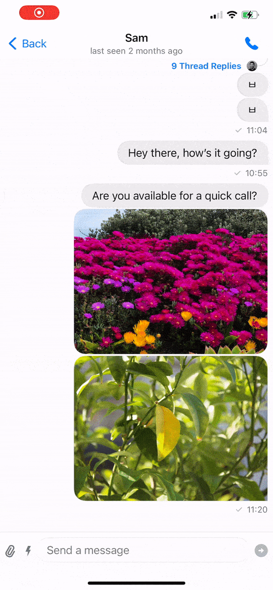

## Introduction

Video calls are common in chat applications. To help with this, we also offer a [Video SDK](https://getstream.io/video/docs/ios/), that works great with our chat SDKs.

In this guide, we will be adding a video functionality to a chat app. If you want to do the opposite - adding chat to a video calling app, please check [the guide](https://getstream.io/video/docs/ios/advanced/chat-integration/) in the video docs.

Since we are offering two UI SDKs for chat (in UIKit and SwiftUI), in this guide we will cover both integrations.

For both integrations, it's important that you ask for permissions to use the device microphone and the camera. Therefore, you should add the following entries in your `Info.plist` file:
- `Privacy - Camera Usage Description` - "YOUR_APP_NAME requires camera access in order to capture and transmit video"
- `Privacy - Microphone Usage Description` - "YOUR_APP_NAME requires microphone access in order to capture and transmit audio"

## Adding Video into a SwiftUI Chat App

In this example, you will integrate video capabilities to a SwiftUI chat app. Here is how the end result will look like:



:::info
The starting point for this guide is a chat application built with the Stream Chat SwiftUI SDK. Not sure were to start? Follow along [this step-by-step tutorial](https://getstream.io/tutorials/swiftui-chat/) and you are ready for this guide.
:::

You can also find a complete integration of a video calling feature into a chat app [in our samples repository](https://github.com/GetStream/stream-video-ios-examples/tree/main/ChatWithVideo/ChatWithVideo).

### Connecting the clients

Make sure you have configured both the video and chat clients. They should share the same API key and user token.

In the provided repository, you'll find a [`StreamWrapper`](https://github.com/GetStream/stream-video-ios-examples/blob/main/ChatWithVideo/ChatWithVideo/StreamWrapper.swift) that facilitates the initialization and connection of both clients.

Here's an example of how to set up the `StreamWrapper`:

```swift
let streamWrapper = StreamWrapper(
    apiKey: "YOUR_API_KEY",
    userCredentials: user,
    tokenProvider: { result in
        let token = \\ Retrieve the token from your backend
        result(.success(token))
    }
)
```

Keep in mind that there are alternative ways to configure the clients without using this wrapper. Additional details on setting up the Stream Video SDK can be found [here](https://getstream.io/video/docs/ios/basics/quickstart/).

### Adding a UI element

The simplest way to add video calling in a chat app is to customize the chat channel header and add a call icon in the top right corner.

To do this, you need to implement the `makeChannelHeaderViewModifier` function in your custom implementation of the `ViewFactory` from the Stream Chat SDK:

```swift
@MainActor
func makeChannelHeaderViewModifier(for channel: ChatChannel) -> some ChatChannelHeaderViewModifier {
    CallHeaderModifier(channel: channel, callViewModel: callViewModel)
}
```

For this code to compile you need a `CallHeaderModifier` that looks like this:

```swift
struct CallHeaderModifier: ChatChannelHeaderViewModifier {

    var channel: ChatChannel
    var callViewModel: CallViewModel

    func body(content: Content) -> some View {
        content.toolbar {
            CallChatChannelHeader(channel: channel, callViewModel: callViewModel)
        }
    }

}
```

This creates a toolbar with the content of type `CallChatChannelHeader` that can be created like this (this is simplified code, find the [full version here](https://github.com/GetStream/stream-video-ios-examples/blob/main/ChatWithVideo/ChatWithVideo/ChatViewFactory.swift)):

```swift
public struct CallChatChannelHeader: ToolbarContent {

    private var shouldShowTypingIndicator: Bool { /* ... */ }

    public var channel: ChatChannel
    @ObservedObject var callViewModel: CallViewModel

    public var body: some ToolbarContent {
        // highlight-next-line
        // 1. Add the title of the channel in the center position
        ToolbarItem(placement: .principal) {
            ChannelTitleView(
                channel: channel,
                shouldShowTypingIndicator: shouldShowTypingIndicator
            )
        }
        // highlight-next-line
        // 2. Add a trailing item to the toolbar with a phone icon
        ToolbarItem(placement: .navigationBarTrailing) {
            Button {
                // highlight-next-line
                // 3. Create and start a call with the participants from the channel
                let participants = channel.lastActiveMembers.map { member in
                    User(
                        id: member.id,
                        name: member.name,
                        imageURL: member.imageURL,
                        customData: [:]
                    )
                }
                callViewModel.startCall(callId: UUID().uuidString, type: "default", members: participants)
            } label: {
                Image(systemName: "phone.fill")
            }
        }
    }
}
```

The interesting code steps here are:

1. The header has the title (and typing indicator) of the channel in the center position (indicated by `placement: .principal`)
2. To initiate a call a trailing icon in the form of a phone is added
3. The call is initiated with the `lastActiveMembers` of the `channel` item and started with the convenient `startCall` method of the `callViewModel`

:::note
It's important that we're adding a unique call id (for example with the `UUID().uuidString`) in the `startCall` method, to invoke the ringing each time.
:::

In order to listen to incoming calls, you should attach the `CallModifier` to the parent view (for example the `ChatChannelListView`):

```swift
ChatChannelListView(viewFactory: ChatViewFactory.shared)
    .modifier(CallModifier(viewModel: callViewModel))
```

With that you have added video calling to a functioning Stream Chat application. If you want to have a look at other examples, feel free to check out [our iOS samples repository](https://github.com/GetStream/stream-video-ios-examples).

## Adding Video into a UIKit Chat App

Similarly to a SwiftUI chat app, let's add the Video SDK to a UIKit based app. The Video SDK has UI components that are written in SwiftUI, but we also offer UIKit wrappers to make the integration in UIKit apps easier.

:::info
To get started, you should already have a chat application built with the Stream Chat UIKit SDK. If you don't have such setup, follow [this step-by-step tutorial](https://getstream.io/tutorials/ios-uikit-chat/) and you are ready to proceed with this guide.
:::

You can also find a sample project of a video calling feature into a UIKit chat app [in our examples repository](https://github.com/GetStream/stream-video-ios-examples/tree/main/ChatWithVideoUIKit/ChatWithVideoUIKit).

### Connecting the clients

Similarly to the SwiftUI setup, you should configure both the video and chat client, with the same API key and user token.

In the provided repository, you'll find a [`StreamWrapper`](https://github.com/GetStream/stream-video-ios-examples/blob/main/ChatWithVideoUIKit/ChatWithVideoUIKit/StreamWrapper.swift) that helps with this process. Note that there are some subtle differences between the SwiftUI and UIKit chat setup process, so make sure to use the correct `StreamWrapper` for each SDK.

You can create the `StreamWrapper` in the following way:

```swift
let streamWrapper = StreamWrapper(
    apiKey: "YOUR_API_KEY",
    userCredentials: user,
    tokenProvider: { result in
        let token = \\ Retrieve the token from your backend
        result(.success(token))
    }
)
```

There are different ways to setup the clients without using this wrapper. You can find a quickstart on how to setup the Stream Video SDK [here](https://getstream.io/video/docs/ios/basics/quickstart/).

### Adding a UI element

We will add a call icon in the chat header view, that will invoke the calling experience.

To do this, we need to inject our custom implementation of the `channelVC` and `channelListRouter` properties in the `Components`. To do this, we will create a method `applyChatCustomizations` that we will call in the `init` of the `StreamWrapper`:

```swift
static func applyChatCustomizations() {
    Components.default.channelVC = ChatWithVideoViewController.self
    Components.default.channelListRouter = ChannelListRouter.self
}
```

We call the method in the init of the `StreamWrapper`:

```swift
init(
    apiKey: String,
    userCredentials: UserCredentials,
    tokenProvider: @escaping StreamTokenProvider
) {
        Self.applyChatCustomizations()
        /// ... other setup code
}
```

Next, let's see the implementation of the `ChannelListRouter`. We will extend the default `ChatChannelListRouter`, and override the `showChannel` method.

Instead of pushing the default chat view controller, we will push our new `ChatWithVideoViewController`.

```swift
class ChannelListRouter: ChatChannelListRouter {
    
    let modalTransitioningDelegate = StreamModalTransitioningDelegate()
    
    override func showChannel(for cid: ChannelId) {
        let vc = components.channelVC.init()
        vc.channelController = rootViewController.controller.client.channelController(
            for: cid,
            channelListQuery: rootViewController.controller.query
        )
        if let vc = vc as? ChatWithVideoViewController,
            let rootVC = rootViewController as? ChannelListViewController {
            vc.callViewModel = rootVC.callViewModel
        }
        
        if let splitVC = rootViewController.splitViewController {
            splitVC.showDetailViewController(UINavigationController(rootViewController: vc), sender: self)
        } else if let navigationVC = rootViewController.navigationController {
            navigationVC.show(vc, sender: self)
        } else {
            let navigationVC = UINavigationController(rootViewController: vc)
            navigationVC.transitioningDelegate = modalTransitioningDelegate
            navigationVC.modalPresentationStyle = .custom
            rootViewController.show(navigationVC, sender: self)
        }
    }
    
}
```

Let's see the `ChatWithVideoViewController` implementation next. 

```swift
class ChatWithVideoViewController: ChatChannelVC {
    
    var cancellables = Set<AnyCancellable>()
    
    var callViewModel: CallViewModel!
    
    override func viewDidLoad() {
        super.viewDidLoad()
        navigationItem.rightBarButtonItem = UIBarButtonItem(
            image: UIImage(systemName: "phone.fill"),
            style: .done,
            target: self,
            action: #selector(startCall)
        )
        listenToIncomingCalls()
    }
    
    @objc func startCall() {
        let participants = channelController.channel?.lastActiveMembers.map { member in
            User(
                id: member.id,
                name: member.name,
                imageURL: member.imageURL,
                customData: [:]
            )
        } ?? []
        callViewModel.startCall(
            callType: .default,
            callId: UUID().uuidString,
            members: participants.map { .init(custom: $0.customData, role: $0.role, userId: $0.id) }
        )

        let next = CallViewController.make(with: self.callViewModel)
        CallViewHelper.shared.add(callView: next.view)
    }
    
    private func listenToIncomingCalls() {
        callViewModel.$callingState.sink { [weak self] newState in
            guard let self = self else { return }
            if case .incoming(_) = newState, self == self.navigationController?.topViewController {
                let next = CallViewController.make(with: self.callViewModel)
                CallViewHelper.shared.add(callView: next.view)
            } else if newState == .idle {
                CallViewHelper.shared.removeCallView()
            }
        }
        .store(in: &cancellables)
    }
    
}
```

In the `viewDidLoad` method, we are changing the `rightBarButtonItem` in the navigation bar, to be a phone icon, that on tap will invoke the `startCall` method.

In the `startCall` method, we are fetching the members of the chat and we are trying to call them, with the `callViewModel`'s method `startCall`. You can also directly use the `Call` object for this, if you don't want to use view models in your app.

Additionally, in order to receive calls, we subscribe to incoming calls, by calling the `listenToIncomingCalls` method, which subscribes to the view model's calling state and changes the views shown accordingly.

With that, you can easily have a video calling experience from our UIKit Chat SDK.

### Conclusion

In this article, we have seen how to integrate video calling into chat applications, based on our SwiftUI and UIKit SDKs.

There are many different customization options and use-cases you can support by combining our SDKs. To learn more, check our [video docs](https://getstream.io/video/docs/ios/). 