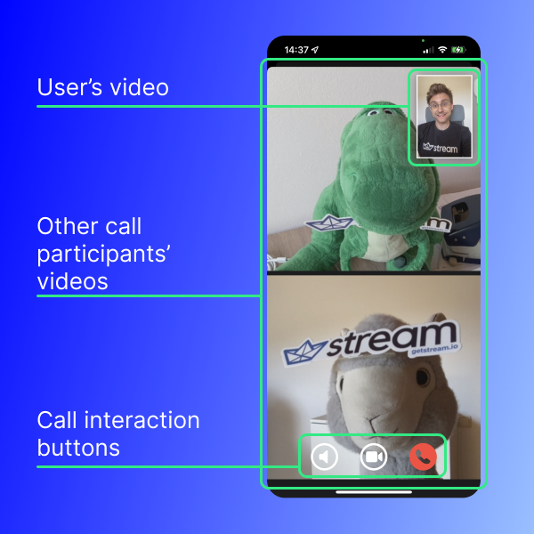
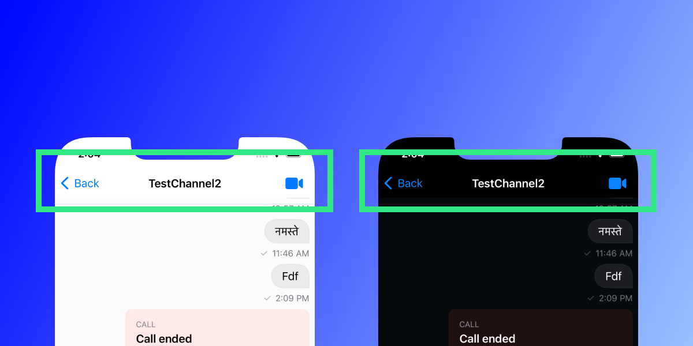
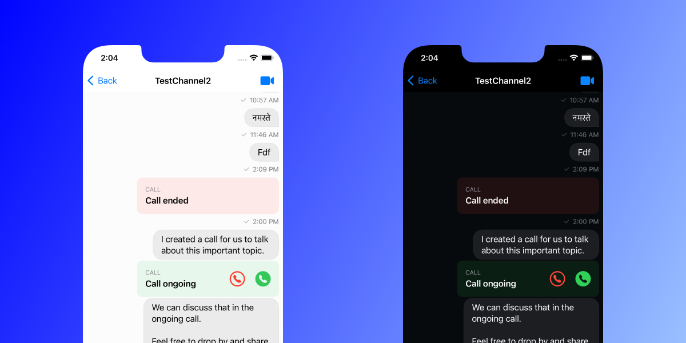

## Introduction

Video calls have become an integral part of daily life since the pandemic hit. Today, we take a look at how you can use the service of 100ms to integrate video calls into the Stream Chat SDK. 

100ms is an infrastructure provider for services like video, audio, and live streaming. They offer native SDKs for mobile platforms and the web and allow for simple integration with very few lines of code. They cover a wide range of use-cases such as video conferencing, Telehealth, classrooms, and many more.

There are a few necessary steps to follow to integrate video calling capabilities with the Stream Chat SDK, but we will go over each phase of the process to come up with a functional and reusable solution that allows your end-users to communicate with one another through a seamless video experience.

You will need to follow these steps to produce this app that allows your users to make video calls:

1. Set up an account for 100ms
2. Create a server (optional as we will provide one for you)
3. Set up basic app architecture
4. Layout UI
5. Send messages with the [Stream Chat SDK](https://getstream.io/chat/)
6. Hook up UI with 100ms 

<aside>
💡 On the second step of creating a server: we will provide [a solution](https://github.com/GetStream/iOS-video-integration-100ms) for you that you can reuse, so feel free to go there and use that for your project as well.

</aside>

If you want to avoid starting from the very beginning, our [SwiftUI tutorial](https://getstream.io/tutorials/swiftui-chat/) from [our website](https://getstream.io) is set as the starting point. If you followed this step-by-step tutorial before, you are ready to jump right in.

## 1. Setting up an Account for 100ms

First, let’s go over a quick introduction to [100ms](https://www.100ms.live). It is a service that allows you to do video conferencing, audio, and more. Their aim is to provide you with a wide range of extensible features, all while allowing you to very quickly get started with minimum effort.

To get started, you must [set up an account](https://dashboard.100ms.live/register) for the platform – click the **Try For Free** button for a trial to use for this tutorial. You can sign up with either a Google or Github account, or you can use any other email address. You will receive an email asking you to confirm your credentials.

Next, you’ll get a quick tour of how to create your own video conference. Here is an outline of the steps you must take:

1. Choose a template
Select **Video Conferencing**, hit **Next**
2. Add a few more details
Enter everything that is valid for you
3. Choose a subdomain
Create one that is suitable for your use case and select the closest region (e.g. in our case, “integrationguide” and “EU” make the most sense, resulting in the domain: **integrationguide.app.100ms.live**)
4. Your app is ready
You can join the room if you want to see a sample (not necessary)

From here, click the **Go to Dashboard** button at the bottom. After you get a quick introductory tour, you have finished setting up your account and created the required app to continue. Nice job!

You will come back to the Dashboard later, but we will move on to other steps next.

## 2. Create a Server

This guide will not go over each step required to create a server. However, we do offer a custom solution in *Node.js* that you can use, that supports all necessary steps and APIs. 

Go to the [Github page](https://github.com/GetStream/iOS-video-integration-100ms) to see an integration guide. We will assume that you followed the following steps, to have a server up and running on your local machine:

1. Clone the repo and set up your machine to have it running (install node / npm)
2. get the credentials from the Dashboard and copy them into a local `.env` file

With the server running you can create a new class that takes care of the communication with it. Create a new Swift file called `NetworkManager`:

```swift
import Foundation

enum MyError: Error {
	case urlCreationFailure(message: String), invalidServerResponse(message: String), unsupportedData
}

struct AuthTokenResponse: Codable {
	var token: String
	var userId: String
	var roomId: String
}

struct RoomCreationResponse: Codable {
	var roomId: String
	var roomName: String
	var userId: String
	var managementToken: String
}

class NetworkManager {
	
#if targetEnvironment(simulator)
	// simulator code
	let serverAddress: String = "http://localhost:3000"
#else
	// real device code (you need to check the IP address of your mac in network settings
	let serverAddress: String = "http://192.168.178.132:3000"
#endif
	
	static let shared = NetworkManager()

		private init() {}
	
	func createRoom(with name: String) async throws -> RoomCreationResponse {
		guard let url = URL(string: createRoomCreationUrlString()) else {
			throw MyError.urlCreationFailure(message: "Create Room URL could not be created")
		}
		var request = URLRequest(url: url)
		request.httpMethod = "POST"
		request.setValue("application/json", forHTTPHeaderField: "Content-Type")
		
		let postBody: [String: Any] = [
			"name": name
		]
		
		if let jsonData = createData(for: postBody) {
			request.httpBody = jsonData
		}
		
		let (data, response) = try await URLSession.shared.data(for: request)
		
		guard let httpResponse = response as? HTTPURLResponse, httpResponse.statusCode == 200 else {
			throw MyError.invalidServerResponse(message: response.debugDescription)
		}
		
		if let responseObject = try? JSONDecoder().decode(RoomCreationResponse.self, from: data) {
			print(responseObject)
			return responseObject
		} else {
			throw MyError.unsupportedData
		}
	}
	
	private func createData(for dict: [String: Any]) -> Data? {
		return try? JSONSerialization.data(withJSONObject: dict, options: .prettyPrinted)
	}
	
	func getAuthToken(for roomId: String) async throws -> AuthTokenResponse {
		guard let url = URL(string: createAuthUrlString(with: roomId)) else {
			throw MyError.urlCreationFailure(message: "URL could not be created")
		}
		
		var request = URLRequest(url: url)
		request.httpMethod = "GET"
		
		let (data, response) = try await URLSession.shared.data(for: request)
		
		guard let httpResponse = response as? HTTPURLResponse, httpResponse.statusCode == 200 else {
			throw MyError.invalidServerResponse(message: response.debugDescription)
		}
		
		if let responseObject = try? JSONDecoder().decode(AuthTokenResponse.self, from: data) {
			print(responseObject)
			return responseObject
		} else {
			throw MyError.unsupportedData
		}
	}
	
	func createAuthUrlString(with roomId: String) -> String {
		return "\(serverAddress)/authToken?roomId=\(roomId)"
	}
	
	func createRoomCreationUrlString() -> String {
		return "\(serverAddress)/createRoom"
	}
}
```

<aside>
💡 Note that you need to change the `serverAddress` variable on *line 27* to match the IP address of your Mac in order to connect your real device to the server.
Not sure where to find the correct IP? [Check out this guide](https://www.hellotech.com/guide/for/how-to-find-ip-address-on-mac).

</aside>

The server is now running and you have a helper class that allows you to interact with the backend without a need for customization.

## 3. Set up Basic App Architecture

The integration requires a bit of setup which is why you will create most of the necessary files right now. This will give a good overview of the overall architecture and you will fill up the files more and more over the course of this integration guide.

Before starting, you need to import the 100ms SDK into the project via CocoaPods. Note, that it is also supported to use Swift Package Manager (SPM), but the support seems to be subpar so far. [Follow the steps laid out on their website](https://www.100ms.live/docs/ios/v2/features/Integration#cocoapods) to include the required dependency in your `Podfile`.

For the implementation, you will need an object that conforms to the `ViewFactory` of the `StreamChatSwiftUI` SDK. This will be used to tailor the SDK to your needs so you will create a new Swift file called `CustomFactory`. You now only need to add a `chatClient` object to it and we will do all other work later. This is what it should look like for now:

```swift
import StreamChatSwiftUI
import StreamChat

class CustomFactory: ViewFactory {
	@Injected(\.chatClient) public var chatClient: ChatClient
}
```

Note: if you’re not sure how the dependency injection mechanism works, [we have a nice resource for you to read up on](https://getstream.io/chat/docs/sdk/ios/swiftui/dependency-injection/).

In order to have a clean architecture, you must separate the logic from the view code. One of the most common ways to do this is through the MVVM-Architecture (Model-View-View-Model). You will create the `CallViewModel` next and give it some basic properties that will be filled later with the necessary SDK logic. This will make it easier for you to layout the UI and have that in place.

Create a Swift file called `CallViewModel` and fill it with the following code:

```swift
import StreamChatSwiftUI
import HMSSDK

class CallViewModel: ObservableObject {
		// Video tracks of ourself and other people during a video call
	@Published var ownTrack: HMSVideoTrack?
	@Published var otherTracks: Set<HMSVideoTrack> = []

		// Handles for muting of audio / video
	@Published var isAudioMuted = false
	@Published var isVideoMuted = false

		// This published variable is responsible for handling if
	// we show the sheet containing the call UI
	@Published var isCallScreenShown = false

		// The channelId is needed for editing and sending messages
	var channelId: ChannelId?

		// Leave a call and use a potential completionHandler
		func leaveCall(completionHandler: @escaping () -> Void) {
				// fill later
		}
} 
```

If you need a refresher on MVVM architecture [there is a nice article here](https://www.hackingwithswift.com/books/ios-swiftui/introducing-mvvm-into-your-swiftui-project).

We used the `HMSVideoTrack` type here which is taken directly from the 100ms SDK (`HMSSDK`) that we import at the top of the file. This type is basically what its name suggests— a video track of a call participant. You will need the `@Published` properties later when you assemble the UI.

Speaking of UI, create a SwiftUI view called `VideoView` to fill in during the next chapter.

## 4. Layout basic UI

You saw the UI in the video at the beginning of this guide. It’s not a complicated setup, and luckily, the SDKs provide a lot of assistance. But there’s still work to be done, so let’s get to it!

### Create the Video call view

Start off by opening the view that you created at the end of the last chapter (`VideoView`) of the call.



The UI components of the call are:

1. A vertical list of all call participants
2. The user’s own video is placed at the top right above the other content
3. A row of buttons at the bottom to control certain call elements (namely toggle audio and video and end call)

You can achieve this effect with a `ZStack` that has the list of all call participants as the first element. Then, you can layout the user’s own video and the button rows with a combination of `VStack` and `HStack`.

Before you create the layout you will create a wrapper for the video representation of the tracks for each participant. The reason for that is that the 100ms SDK provides us with a `UIKit` view. Luckily, you can use that in your `SwiftUI` context very easily.

Create a file called `VideoViewRepresentable.swift` and put the following code inside:

```swift
struct VideoViewRepresentable: UIViewRepresentable {
	
	var track: HMSVideoTrack
	
	func makeUIView(context: Context) -> some UIView {
		let videoView = HMSVideoView()
		videoView.setVideoTrack(track)
		return videoView
	}
	
	func updateUIView(_ uiView: UIViewType, context: Context) {
		// nothing to do here, but necessary for the protocol
	}
}
```

Note: if you’re not sure how to bridge from `SwiftUI` to `UIKit` [Apple has created a nice tutorial about it](https://developer.apple.com/tutorials/swiftui/interfacing-with-uikit) to learn more.

Now, head over to your `VideoView.swift` and create the following three properties:

```swift
private let buttonSize: CGFloat = 50
@ObservedObject var viewModel: CallViewModel
@Environment(\.dismiss) var dismiss
```

The `buttonSize` is used for the buttons you show at the bottom of the screen. The `viewModel` variable is what you need to have access to the variables called `ownTrack` and `otherTracks` in order to show the video UI for the user and the other participants. The `dismiss` is used to close the view after a call is ended (since it will be shown with a `.sheet` modifier).

Add the layout to the `body` of `VideoView` now:

```swift
ZStack {
		// List of other attendees of the call
		VStack {
		ForEach(Array(viewModel.otherTracks), id: \.self) { track in
			VideoViewRepresentable(track: track)
				.frame(maxWidth: .infinity)
		}
		}
	
	VStack {
				// If we have video enabled, show our video track at the top right
		if let ownTrack = viewModel.ownTrack {
			HStack {
				Spacer()
				
				VideoViewRepresentable(track: ownTrack)
					.frame(width: 100, height: 150)
					.overlay(
						Rectangle().stroke(Color.primary, lineWidth: 2)
					)
					.shadow(radius: 10)
					.padding()
			}
		}
		
		Spacer()
		
				// Show the three icons (mute, toggle video, end call) at the bottom 
		HStack(spacing: 40) {
			Button {
				// mute
			} label: {
				Image(systemName: viewModel.isAudioMuted ? "speaker.slash.circle" : "speaker.circle")
					.resizable()
					.foregroundColor(viewModel.isAudioMuted ? .gray : .primary)
					.frame(width: buttonWidth, height: buttonWidth)
			}
			
			Button {
				// toggle video
			} label: {
				Image(systemName: viewModel.isVideoMuted ? "video.slash" : "video.circle")
					.resizable()
					.foregroundColor(viewModel.isVideoMuted ? .gray : .primary)
					.frame(width: buttonWidth, height: buttonWidth)
			}
			
			Button {
				// end call
								presentationMode.wrappedValue.dismiss()
			} label: {
				Image(systemName: "phone.circle.fill")
					.resizable()
					.foregroundColor(.red)
					.frame(width: buttonWidth, height: buttonWidth)
			}
		}
		.padding()
	}
}
```

This is all you need to do to show the UI of the video call. The advantage of the separated logic is that you can really focus on laying out UI in the `VideoView` itself.

The next step is to add a button to start a call to the `ChannelHeader`. Luckily, the StreamChatSwiftUI SDK offers a factory method called `makeChannelHeaderViewModifier` that you can use to customize it. 

### Customizing the ChannelHeader

Before you can use the methods from the SDK you need to build up the UI for the header itself.



You start off by creating a new Swift file called `CustomChatChannelHeader.swift`. It will define a toolbar and the content that should go there, which are two things:

1. The name of the channel in the middle
2. A button to start a call on the right of the toolbar

You will leverage the `ToolbarContent` type for that and create your items as `ToolbarItem`s with a placement parameter specifying the position.

There are a few things you need to make everything work as expected. Create the struct and add the following parameters to it:

```swift
public struct CustomChatChannelHeader: ToolbarContent {
		// Stream SDK related
	@Injected(\.fonts) var fonts
	@Injected(\.utils) var utils
	@Injected(\.chatClient) var chatClient
	
		// Parameters received upon creation
	@ObservedObject var viewModel: GeneralViewModel
	public var channel: ChatChannel
	@Binding var isCallShown: Bool
	public var onTapTrailing: () -> ()
	
	public var body: some ToolbarContent {
		// To fill
	}
}
```

The need for those will become clear once you add the layout in the `body` inside of `CustomChatChannelHeader`:

```swift
// Name of the channel
ToolbarItem(placement: .principal) {
	VStack {
		Text(utils.channelNamer(channel, chatClient.currentUserId) ?? "")
			.font(fonts.bodyBold)
	}
}

// Button to start a call
ToolbarItem(placement: .navigationBarTrailing) {
	Button {
		onTapTrailing()
	} label: {
		Image(systemName: "video.fill")
	}
}
```

This allows you to have the name of the channel with the `.principal` placement (the middle) and the button to start a call for the `.navigationBarTrailing` placement.

The action that is happening is handed in as a closure with the name `onTapTrailing`. The image for the button is taken from [SF Symbols](https://developer.apple.com/sf-symbols/).

You need to create one more element, which is the modifier for the channel header. It is the place where you will define the functionality of the `onTapTrailing` closure. You will also need to add a second, very important thing.

Here is where you’ll add a `.sheet` modifier that will hold the `VideoView` that will pop up when a call is entered. 

Create that below the definition of the `CustomChannelHeader`:

```swift
struct CustomChannelHeaderModifier: ChatChannelHeaderViewModifier {
	
	var channel: ChatChannel
	@ObservedObject var viewModel: GeneralViewModel
	
	func body(content: Content) -> some View {
		content.toolbar {
			CustomChatChannelHeader(viewModel: viewModel, channel: channel, isCallShown: $viewModel.isCallScreenShown) {
								Task {
					await viewModel.createCall()
				}
			}
		}
		.sheet(isPresented: $viewModel.isCallScreenShown, onDismiss: {
			viewModel.leaveCall {}
		}, content: {
			VideoView(viewModel: viewModel)
		})
	}
}
```

The code contains a `body` that is handed the content. Attach the `CustomChannelHeader` as a toolbar with the `.toolbar` modifier.

Then, create a `Task` and call the `createCall` method of the view model. This method will later be filled with functionality. It will make the sheet pop up and you can handle joining the call from the `VideoView` itself. The `VideoView` is set as the content of the sheet.

The last step is to add the `makeChannelHeaderViewModifier` override in the `CustomFactory`. Open up `CustomFactory` and add the following snippet:

```swift
func makeChannelHeaderViewModifier(for channel: ChatChannel) -> some ChatChannelHeaderViewModifier {
	// when we create the channel header we know that the channel has become active, so we notify the viewModel
	viewModel.channelId = channel.cid
	
	return CustomChannelHeaderModifier(channel: channel, viewModel: viewModel)
}
```

The reason why the `channelId` in the `viewModel` is set here is that it is needed to later join the call. When a user taps on a channel, its header will be rendered and it's a notification for you that you can safely set the ID.

### Creating custom call messages

You will show a custom UI for call messages in the message list that will look like this:



In order to create custom messages for calls, you will leverage [the custom attachments functionality of the StreamChat SDK](https://getstream.io/chat/docs/sdk/ios/swiftui/components/attachments/). It takes three steps:

1. Create a custom view to show the call messages
2. Detect when to show the custom call message (with a custom message resolver)
3. Use the `makeCustomAttachmentViewType` to render the view you created

You will need a few `String` constants to compare. First, you will create an extension to `String` and add them. Create a new Swift file called `String+Constants` and fill it with the following content:

```swift
import Foundation

extension String {
	// Extra data keys
	static let callKey = "isCall"
	static let roomIdKey = "roomId"
	
	// Message texts
	static let callOngoing = "Call ongoing"
	static let callEnded = "Call ended"
}
```

Second, create a new file called `VideoCallAttachmentView`. It will have two parameters handed to it: `viewModel` and the `message` (of type `ChatMessage`).

With the entire UI construction the view looks like this:

```swift
import SwiftUI
import StreamChat

struct VideoCallAttachmentView: View {
	
	@ObservedObject var viewModel: CallViewModel
	let message: ChatMessage
	
	var isActiveCall: Bool {
		message.text == .callOngoing
	}
	
	var body: some View {
		HStack(spacing: 20) {
			VStack(alignment: .leading, spacing: 4) {
				Text("CALL")
					.font(.caption)
					.foregroundColor(.secondary)
					.frame(maxWidth: .infinity, alignment: .leading)
				
				Text(message.text)
					.font(.headline)
					.bold()
			}
			
			if isActiveCall {
				Button {
					// End call, filled later
				} label: {
					Image(systemName: "phone.circle")
						.resizable()
						.foregroundColor(.red)
						.frame(width: 30, height: 30)
				}
				
				Button {
					// Join call, filled later
				} label: {
					Image(systemName: "phone.circle.fill")
						.resizable()
						.foregroundColor(.green)
						.frame(width: 30, height: 30)
				}
			}
		}
		.padding()
		.background(
			isActiveCall ? Color.green.opacity(0.1) : Color.red.opacity(0.1),
			in: RoundedRectangle(cornerRadius: 10, style: .continuous))
	}
}
```

The computed property `isActiveCall` is used to determine whether to show the UI for joining/ending the call. It’s simply determined by the text of the message.

The functionality of the `Button`s is not filled with anything yet, but you will add that once it’s available in the view model (part of the next chapter).

Next, you will create a message resolver. This tells the StreamChat SDK whether a message needs to be rendered in a custom way. Create a Swift file called `CustomMessageResolver` and fill it with this:

```swift
import StreamChat
import StreamChatSwiftUI

class CustomMessageResolver: MessageTypeResolving {
	func hasCustomAttachment(message: ChatMessage) -> Bool {
		if message.extraData.keys.contains(.callKey) {
			return true
		} else {
			return false
		}
	}
}
```

The only requirement for it is to have the `hasCustomAttachment` function that will check if the message has the `.callKey` string in its `extraData` field. If so, it will return `true` (it is, in fact, a call message), otherwise `false`.

You need to introduce that `CustomMessageResolver` into the *StreamChat* SDK. Go to the `AppDelegate` and replace the following line

```swift
streamChat = StreamChat(chatClient: chatClient)
```

with this piece of code:

```swift
let messageTypeResolver = CustomMessageResolver()
let utils = Utils(messageTypeResolver: messageTypeResolver)

streamChat = StreamChat(chatClient: chatClient, utils: utils)
```

Last, go to the `CustomFactory` you created earlier and paste the `makeCustomAttachmentViewType` function inside:

```swift
func makeCustomAttachmentViewType(
	for message: ChatMessage,
	isFirst: Bool,
	availableWidth: CGFloat,
	scrolledId: Binding<String?>
) -> some View {
	VideoCallAttachmentView(viewModel: viewModel, message: message)
}
```

All it does is render the previously created `VideoCallAttachmentView` in case it detects the call message in the `CustomMessageResolver`.

This finishes up all the UI that was necessary to create. The next step is to add the integration of the StreamChat SDK to send messages with the call information.

## 5. Send and edit chat messages for the calls

There are two use cases you need to cover for sending and editing messages. 

1. Starting a call— which will send a message to the channel with the necessary info for anybody to join it. 
2. Ending a call— which will edit the original message specifying that nobody can join anymore and the call has ended.

### Starting a call and sending the message

When the user hits the call button at the top right of the channel header a new message should be sent to the channel. Therefore, a new room needs to be created with the *100ms SDK*, which is happening on the backend. The `NetworkManager` that you added earlier has the `createRoom` function for that which returns the necessary information (we’re only interested in the `roomId` for now). The ID will be a randomly created `UUID` from the client, but can also be created from the backend directly.

After that, the `chatClient` can be used to get a `channelController` that you can use to call `createNewMessage`.

Finally, you can start the call screen by setting `isCallScreenShown` to `true`.

<aside>
💡 You need to make sure that the call to `isCallScreenShown` is happening on the main thread, so it’s necessary to wrap it into an `await MainActor.run {}` call.

</aside>

Head over to the `CallViewModel` and create the `createCall` function:

```swift
func createCall() async {
	do {
		let roomCreationResult = try await NetworkManager.shared.createRoom(with: UUID().uuidString)
		self.roomId = roomCreationResult.roomId
		
		guard let channelId = channelId else {
			return
		}
		chatClient
			.channelController(for: channelId)
			.createNewMessage(text: .callOngoing, extraData: createExtraData(with: roomCreationResult.roomId))
		
		await MainActor.run {
			isCallScreenShown = true
		}
	} catch {
		print(error.localizedDescription)
	}
}
```

In order for this code to work, you’ll need to add two more things to the `CallViewModel`. The first is the `chatClient` which can be easily added with the `@Injected` property wrapper from the StreamChatSwiftUI SDK. So, add that as a property:

```swift
@Injected(\.chatClient) var chatClient
```

Next, you’ll need to create a convenience function to create the extra data that is added to a message. Add that in the `CallViewModel` class as well:

```swift
private func createExtraData(with roomId: String) -> [String: RawJSON] {
	return [
		// Indicator that this message is attached to a call
		.callKey: .bool(true),
		// RoomId for the room the call is happening in
		.roomIdKey: .string(roomId)
	]
}
```

With that, the code will compile and messages will be sent to the channel when a call is initiated.

### End call and edit the message

The next step is to edit the message whenever a user is ending the call with the red button of the message. Since a reactive architecture is set up, the *StreamChatSwiftUI* SDK will automatically update the cells and adapt to the changes.

The code is straightforward and does three things. First, it unwraps the `channelId`, then it creates a `messageController` from it, and finally, it calls the `editMessage` function on top of it.

So, add this function to the `CallViewModel`:

```swift
func endCall(from messageId: MessageId) {
	guard let cid = channelId else { return }
	
	let messageController = chatClient.messageController(cid: cid, messageId: messageId)

	messageController.editMessage(text: .callEnded) { error in
		if let error = error {
			print("Error: \(error.localizedDescription)")
		}
	}
}
```

Now, you need to call that function. Head over to `VideoCallAttachmentView` and search for the following text inside of the button that ends the call:

```swift
// End call, filled later
```

Replace the comment with the call to the `viewModel`:

```swift
viewModel.endCall(from: message.id)
```

That’s all you need to customize in the *StreamChat* & *StreamChatSwiftUI* SDK.

## 6. Integration of the 100ms SDK

So far we have not dived into code that is specific to the *100ms* SDK too much (aside from UI code). This was intentional as it is demonstrating that the integration of any video service can be done with the same architecture that is wrapped around it.

Now, the integration of the framework is starting so the functionality is tailored towards the *100ms* SDK. First thing is to initialize the framework in the `CallViewModel`.

First, add the import at the top of the file:

```swift
import HMSSDK
```

Second, create a property variable called `hmsSDK` inside of the `CallViewModel` and initialize it like so:

```swift
var hmsSDK = HMSSDK.build()
```

You need a couple of convenience functions that’ll make it easier to perform the rest of the integration. 

Add the following two functions inside of the `CallViewModel`:

```swift
func toggleAudioMute() {
	isAudioMuted.toggle()
	hmsSDK.localPeer?.localAudioTrack()?.setMute(isAudioMuted)
}

func toggleVideoMute() {
	isVideoMuted.toggle()
	hmsSDK.localPeer?.localVideoTrack()?.setMute(isVideoMuted)
}
```

What they are doing is self-explanatory.

You can easily hook them up by calling them from the respective button in the `VideoView`. Head over to that file and locate the following line:

```swift
// mute
```

Replace it with the call to the function in the `CallViewModel` that we just added:

```swift
viewModel.toggleAudioMute()
```

Do the exact same with the `// toggle video` and replace it with `viewModel.toggleVideoMute()`.

### Joining a call

In order to join a call there are a few steps you need to do:

1. Get an auth token (the `NetworkManager` offers the `getAuthToken` function)
2. Create a `config` variable for the `hmsSDK` (of type `HMSConfig`)
3. call the `join` function of the `hmsSDK`

The following code snippet does exactly that, so add it to the `CallViewModel`:

```swift
func joinCall(with roomId: String) async {
	do {
		let authTokenResult = try await NetworkManager.shared.getAuthToken(for: roomId)
		
		let config = HMSConfig(userID: authTokenResult.userId, roomID: roomId, authToken: authTokenResult.token)
		
		hmsSDK.join(config: config, delegate: self)
	} catch {
		print(error.localizedDescription)
		isCallScreenShown = false
	}
}
```

The `joinCall` function will be called when the `VideoView` appears. It will get the `roomId` from the `viewModel` and then initiate an `async` call to `joinCall`.  That code needs to run inside of a `Task`.

Open up the `VideoView` and add the following modifier to the root `ZStack`:

```swift
.onAppear {
	guard let roomId = viewModel.roomId else {
		print("Couldn't join because no roomId was found!")
		return
	}
	
	Task {
		await viewModel.joinCall(with: roomId)
	}
}
```

Lastly, you need to set up the button in the `VideoCallAttachmentView` when a user wants to join the room.

Open up the `VideoCallAttachmentView` and find the button to join the call with the comment:

```swift
// Join call
```

Replace it with the following code:

```swift
guard case let .string(roomId) = message.extraData[.roomIdKey] else {
	print("Call didn't contain roomId (messageId: \(message.id))")
		return
}
viewModel.roomId = roomId
viewModel.isCallScreenShown = true
```

It extracts the `roomId` from the messages `extraData` array and sets it in the `viewModel`. After that, it updates the `isCallScreenShown` variable. Once the `VideoView` appears the previously created modifier takes over and calls the `joinCall` function.

### Listening for updates during a call

During a call, it is necessary to listen for people joining or leaving the call in order to update the UI. 

The previous code you added to the `joinCall` function will not build because it sets the `CallViewModel` to be the delegate of the `HMSSDK`. See this call:

```swift
hmsSDK.join(config: config, delegate: self)
```

In order to listen for updates, the `CallViewModel` needs to conform to the `HMSUpdateListener` protocol from the `HMSSDK`.

Create a new Swift file and call it `CallViewModel+HMSUpdateListener`. There are a few callbacks you need to listen to.

The first one is to listen when someone joins the current room that the user is currently in, which is called `on(join room: HMSRoom)`. It will iterate over all the peers in the room and check if they have video tracks attached. If yes, it will add it to either the local track (represented by the `ownTrack` variable in the view model) or insert it into the `otherTracks` set.

```swift
func on(join room: HMSRoom) {
	for peer in room.peers {
		// check if video track is attached to the peer
		if let videoTrack = peer.videoTrack {
			// if it's the user's own video we set it to their own track, else add it to the "other" video view's
			if peer.isLocal {
				ownTrack = videoTrack
			} else {
								otherTracks.insert(videoTrack)
			} 
		}
	}
}
```

The next thing you want to listen to is when a `peer` (= another participant of the call) is leaving the call because in this case, their video track needs to be removed.

The `HMSSDK` offers the `on(peer: HMSPeer, update: HMSPeerUpdate)` function for that and by checking the `update` variable you can detect if it’s of type `.peerLeft`. In that case, the `videoTrack` is extracted and removed from the `otherTracks` set.

```swift
func on(peer: HMSPeer, update: HMSPeerUpdate) {
	switch update {
	case .peerLeft:
		// remove video if the peer has a video track attached to them
		if let videoTrack = peer.videoTrack {
			otherTracks.remove(videoTrack)
		}
	default:
		break
	}
}
```

During a call, it can also happen that tracks are updated. It’s important to listen to the two update types `.trackAdded` and `.trackRemoved` and act accordingly. 

The logic is similar to the ones before, here’s the code for it:

```swift
func on(track: HMSTrack, update: HMSTrackUpdate, for peer: HMSPeer) {
	switch update {
	case .trackAdded:
		if let videoTrack = track as? HMSVideoTrack {
			if peer.isLocal {
				ownTrack = videoTrack
			} else {
				otherTracks.insert(videoTrack)
			}
		}
	case .trackRemoved:
		if let videoTrack = track as? HMSVideoTrack {
			if peer.isLocal {
				ownTrack = nil
			} else {
				otherTracks.remove(videoTrack)
			}
		}
	default:
		break
	}
}
```

With that, you are covering all relevant changes and always keep the `VideoView` in sync with what’s happening in the call.

### Leaving a call

The last functionality to add is to leave calls. At the beginning of this integration guide you already added the function signature in the view model for `leaveCall` and now you’re going to populate it with the following code:

```swift
func leaveCall(completionHandler: @escaping () -> Void) {
	hmsSDK.leave { success, error in
		guard success == true, error == nil else {
			print("hmsSDK.leave: Error: \(error?.message ?? "unknown")")
			return
		}
		
		completionHandler()
	}
}
```

It calls the `hmsSDK` function and listens for the result in its completion handler. You’re then calling the completion handler that’s being handed to it.

There are two occasions where it needs to be called. The first one is already covered in the `CustomChatChannelHeader`. When the `sheet` that is used for showing the `VideoView` is dismissed it will call `viewModel.leaveCall {}` (so with an empty completion handler) because there’s nothing more to do in that case.

If the user is in the `VideoView` itself and presses on the end call button however there’s nothing happening right now.

You need to fix that by going to the `VideoView` and locating the button with the following comment in it:

```swift
// leave call
```

Replace that with the the code:

```swift
viewModel.leaveCall {
	dismiss()
}
```

In order for this to work, you need to import the environment variable `dismiss` which is used to dismiss sheets programmatically. You did this earlier and now you make use of it.

That’s it. Leaving calls works now and all the necessary code is handled.

## Summary

In this guide, you completed the entire integration of a video service into a chat app created with the *StreamChat* SDK. All this happened with a clean architectural approach that makes it straightforward to also use other video services in case you want to experiment with that.

For the purpose of simplification, we have not offered audio calls in this guide. But the principle is applicable with very few changes as well. 

The 100ms SDK works really well in this case and allows you to quickly set up and use a video call service in your apps without complicated processes and manual work that needs to be done.

In case you have any more questions about this video integration or the work with other SDKs, feel free to [reach out to the team](https://getstream.io/contact/). We are happy to help and support you! 

Thank you for following along with this article!