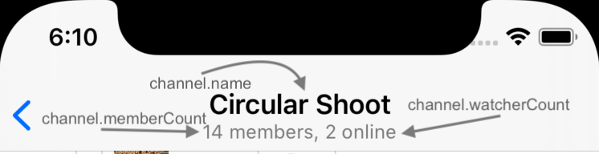

## Getting Channel Data



Here's how you can get data of a Channel you already know the Channel ID of:

```swift
let channelController = chatClient
    .channelController(for: ChannelId(type: .messaging, id: "general")
channelController.synchronize { error in
    if let error = error {
        // Handle error
    } else {
        let channel = channelController.channel
        let messages = channelController.messages
        // Use `channel` and `messages` as you please
    }
}
```

To create a new Channel, we can use `ChannelController` in slightly different way:
```swift
let channelController = chatClient
    .channelController(createChannelWithId: ChannelId(type: .messaging, id: "general"))
// Our channel is created on backend with the `synchronize` call
channelController.synchronize { error in
    if let error = error {
        // Handle error
    } else {
        let channel = channelController.channel
        let messages = channelController.messages
        // Use `channel` and `messages` as you please
    }
}
```

Let's dive deep into these.

## Channel ID

In StreamChat, each Channel has a unique Channel ID, created from `type` and `id`. These will be represented in the format `type:id` in requests and backend.
For example,
```swift
let channelId = ChannelId(type: .messaging, id: "general")
```
Encoded, this will be represented as `messaging:general`.
For more information about channel types, please refer to [Channel Types Documentation](https://getstream.io/chat/docs/ios-swift/channel_features/?language=swift)

## Different Initializers

There are multiple ways of creating a `ChannelController` instance from `ChatClient`. Each way represent a unique usecase, explained below.

Initializing | Use Case | Implications
-- | -- | --
`chatClient.channelController(for cid:)` | You already know the `ChannelId` and the Channel is already created on backend | You can directly call actions on this controller without having to call `synchronize`
`chatClient.channelController(createChannelWithId:)` | You want to create a new Channel on backend | You should call `synchronize` on the controller before calling any actions or accessing any data.
`chatClient.channelController(createDirectMessageChannelWith:)` | You want to create a direct message Channel between users. | Direct message Channel ID's are generated by backend. More information is explained below.
`chatClient.channelController(for query:)` | You want to have a finer control over which data is initally fetched from backend. | Using this initializer, you can control various parameters, explained below.

:::important
Using `channelController(create*:)` initializers behave the same as using the `cid` or `query` ones as long as `synchronize` is called on them. 
When the backend already has information about the Channel, it's not wiped out, and simply returned.
:::

## Importance of `synchronize`

Controllers are lightweight objects and they only fetch data when needed. When the `ChannelController` is created, it doesn't fetch local or remote data until it needs it.
`synchronize` makes sure StreamChat's local database and backend is in sync. It queries the backend for the latest state of the Channel and updates the database. In addition, `synchronize` call starts actually obversing the Channel for changes, so you will start getting live updates of the changes to the Channel, including it's messages.

If you only need the local data, you can just access it after creation, like so:
```swift
let channelController = chatClient.channelController(for: ChannelId(type: .messaging, id: "general"))
let channel = channelController.channel
let messages = channelController.messages
```

In addition, you don't need to call `synchronize` to be able to call actions on the channel, such as `freezeChannel`:
```swift
let channelController = chatClient.channelController(for: ChannelId(type: .messaging, id: "general"))
channelController.freezeChannel()
```
But as stated in the table above, if the Channel is not created in backend yet, you'll need to call `synchronize` first, else the action calls will fail.

Additionally, as with all StreamChat Controllers, `ChannelController` has `state` and a delegate function to observe it's `state`:
```swift
func controller(_ controller: DataController, didChangeState state: DataController.State) 
```
You can use this delegate function to show any error states you might see. For more information, see [DataController Overview](404).

## Observing Changes to Channel

After you call `synchronize`, the controller is subscribed to changes to the Channel. You can use UIKit delegates, Combine publishers or SwiftUI Wrappers to observe the changes.

### UIKit Delegates

On each change, you'll receive the delegate call:
```swift
func channelController(
        _ channelController: ChatChannelController,
        didUpdateChannel channel: EntityChange<ChatChannel>
    ) {
        // Handle the change
        // You can access `channel` directly by:
        print(channelController.channel.name)
}
```

### Combine Publishers

```swift
channelController
    .channelChangePublisher
    .receive(on: RunLoop.main)
    .sink { change in
        // Handle change
        // or you can access directly
        print(channelController.channel.name)
}.store(in: &cancellables)
```

### SwiftUI Wrappers

`ChannelController` has `observableObject` property available that can be used in SwiftUI easily:
```swift
struct ChannelListView: View {
    @ObservedObject var channelController: ChatChannelController.ObservableObject

    init(channelController: ChatChannelController) {
        self.channelController = channelController.observableObject
    }

    var body: some View {
        Text(channelController.channel.cid)
        .navigationBarTitle(channelController.channel.name)
        .onAppear { 
            // call `synchronize()` to update the locally cached data.
            channelController.controller.synchronize() 
        }
    }
}
```

## Getting and Paginating Messages

You can get and paginate messages of a Channel like so:

### UIKit Delegates

```swift
class MyViewController: UIViewController, ChatChannelControllerDelegate {
    var channelController: ChatChannelController!
    
    override func viewDidLoad() {
        super.viewDidLoad()

        channelController.delegate = self
        channelController.synchronize()
    }

    // This function is called when we need to load previous page of messages
    // For example, on `scrollViewDidBounce`
    func scrolledToEndOfList() {
        channelController.loadPreviousMessages()
    }
    
    // ChatChannelControllerDelegate Methods
    
    func channelController(_ channelController: ChatChannelController, didUpdateMessages changes: [ListChange<ChatMessage>]) {
        // Handle changes to messages
        // eg. pipe the changes to collectionView (shown below)
    }
}
```

There's also `loadNextMessages(after: MessageId)` function that you can call to get messages newer than the provided message id. Most often, new messages are automatically updated by the controller via WebSocket events, so you don't need to call this.

You can also access the messages directly:
```swift
let messages = channelController.messages
```
but in most cases, it's better to use delegate callbacks, since they provide live updates. You can pipe the delegate callback to a collectionView/tableView like so:
```swift
func channelController(_ channelController: ChatChannelController, didUpdateMessages changes: [ListChange<ChatMessage>]) {
        collectionView.erformBatchUpdates {
            for change in changes {
                switch change {
                case let .insert(_, index):
                    collectionView.insertItems(at: [index])
                case let .move(_, fromIndex, toIndex):
                    collectionView.moveItem(at: fromIndex, to: toIndex)
                case let .remove(_, index):
                    collectionView.deleteItems(at: [index])
                case let .update(_, index):
                    collectionView.reloadItems(at: [index])
                }
            }
        }
    }
```

### Combine Publishers

```swift
channelController.messagesChangesPublisher.receive(on: RunLoop.main).sink { change in
    // Handle change
    // or access messages directly
    print(channelController.messages.last?.text)
}.store(in: &cancellables)
```

### SwiftUI

```swift
struct ChannelListView: View {
    @ObservedObject var channelController: ChatChannelController.ObservableObject

    init(channelController: ChatChannelController) {
        self.channelController = channelController.observableObject
    }

    var body: some View {
        LazyVStack(alignment: .leading) {
            ForEach(channelController.messages, id: \.self) { message in
                Text(mesaage.text)
                .onAppear {
                    if self.channelController.messages.first == message {
                       self.channelController.controller.loadPreviousMessages()
                    }
                }
            }
        }
        .navigationBarTitle(channelController.channel.name)
        .onAppear { 
            // call `synchronize()` to update the locally cached data.
            channelController.controller.synchronize() 
        }
    }
}
```

## Channel Members

`ChannelController` allows you to access Channel's locally cached members, as shown:
```swift
channelController.channel?.cachedMembers
```
Since a Channel can have many members, the local database might not have all the members cached. For this reason, we have `MemberListController`, documented [here](./working-with-members.md).

`ChannelController` receives `MemberAdded`, `MemberUpdated` and `MemberRemoved` events, and reports the updated Member object via its delegate method:
```swift
func channelController(_ channelController: ChatChannelController, didReceiveMemberEvent: MemberEvent) {
    // handle the event
}
```
`channel.cachedMembers` are also updated with the new data.

### Adding/Removing Members

`ChannelController` has actions for adding and removing members to the channel.
```swift
channelController.addMembers(userIds: ["anakin-skywalker", "luke-skywalker", "leia-organa"])
channelController.removeMembers(userIds: ["anakin-skywalker"])
```
As a result of these calls, you will receive corresponding Member events and `channel.cachedMembers` will be updated accordingly.

## Unread Count for the Channel

You can use `didUpdateChannel` delegate callback to access the latest unread count for a channel. Like so:
```swift
func channelController(
        _ channelController: ChatChannelController,
        didUpdateChannel channel: EntityChange<ChatChannel>
    ) {
        let unreadMessages = channelController.channel?.unreadCount.messages
        let unreadMentions = channelController.channel?.unreadCount.mentionedMessages
}
```
Usually, you use `ChannelListController` to observe changes to unread counts, since it's displayed in the Channel List next to channel name. 
For info about handling Channel List, see [here](../guide/working-with-channel-list.md).

## Getting a Model Directly from ChannelController

Sometimes, as advanced usage, you may want to access arbitrary models from local database. You may want to do so as follows:
```swift
let dataStore = channelController.dataStore
// Get another channel. Ideally, you'd use another ChannelController
let otherChannel = dataStore.channel(cid: ChannelId(type: .messaging, id: "work"))

// Get some user. Ideally, you'd use UserController
let someUser = dataStore.user(id: "han-solo")

// Get current user. Ideally, you'd use CurrentUserController
let currentUser = dataStore.currentUser()
```

## Channel Actions

For all actions available on a Channel, such as muting, hiding, deleting, and truncating, please refer to [ChannelController documentation](404)