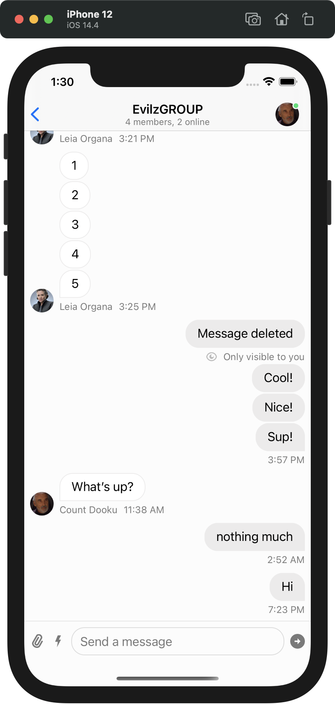
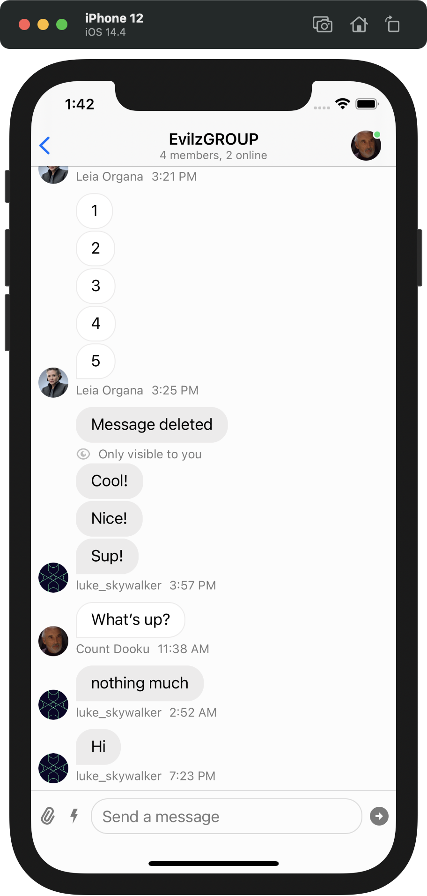
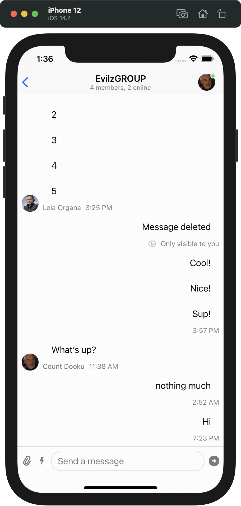
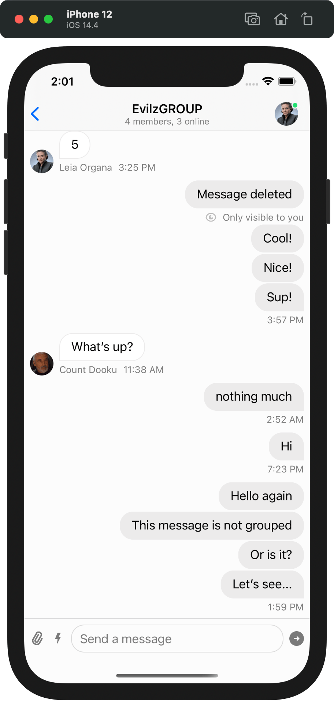
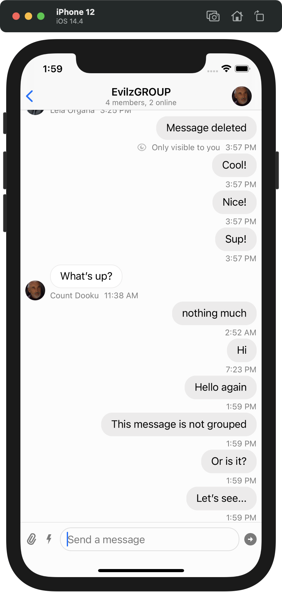
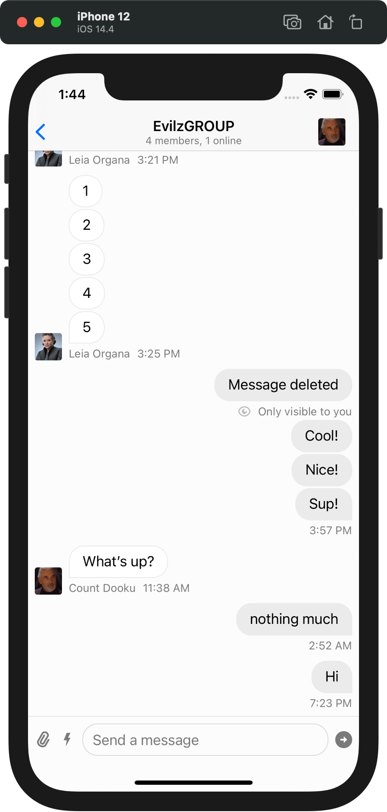
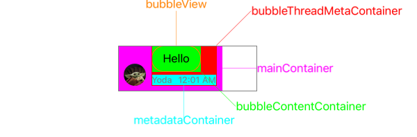
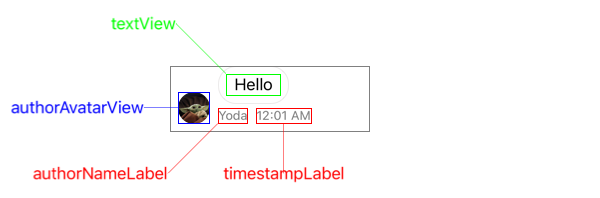
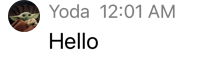
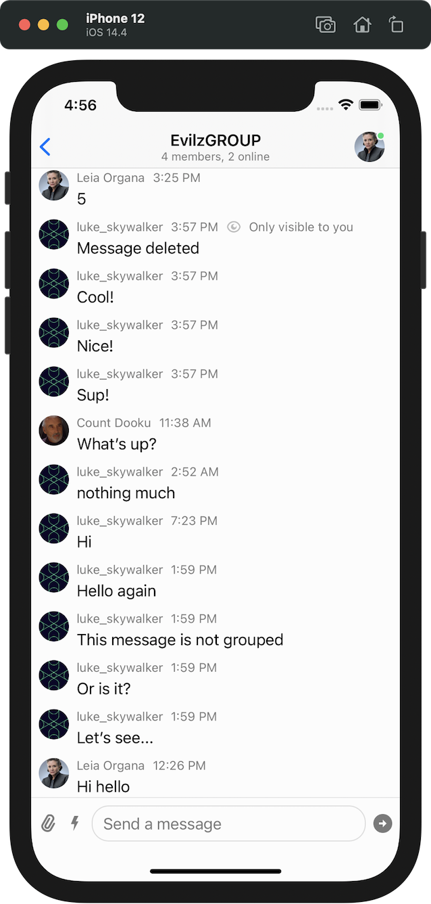

## `ChatMessageLayoutOptionsResolver`

Almost anything related to the layout and appearance of the message cell can be done by subclassing [`ChatMessageLayoutOptionsResolver`](../ReferenceDocs/Sources/StreamChatUI/ChatMessageList/ChatMessage/ChatMessageLayoutOptionsResolver.md). 
`ChatMessageLayoutOptionsResolver` uses function `optionsForMessage(at indexPath:,in channel:, with messages:)` which returns [ChatMessageLayoutOptions](../ReferenceDocs/Sources/StreamChatUI/ChatMessageList/ChatMessage/ChatMessageLayoutOptions.md)) for the given cell to setup it's layout and options.
If the desired customization can't be achieved via `ChatMessageLayoutOptions`, you'll need to subclass `ChatMessageContentView`, which we show [below](#moving-components-of-messages-in-the-layout)

## Left-aligning all messages
 To left-align all messages inside MessageList, start by creating your custom left-aligned `MessageLayoutOptionsResolver` like this:
 
 ```swift
 class LeftAlignedMessageLayoutOptionsResolver: ChatMessageLayoutOptionsResolver {
     override func optionsForMessage(at indexPath: IndexPath, in channel: _ChatChannel<NoExtraData>, with messages: AnyRandomAccessCollection<_ChatMessage<NoExtraData>>) -> ChatMessageLayoutOptions {
         // Get options for the message at given indexpath to change it. 
         var options = super.optionsForMessage(at: indexPath, in: channel, with: messages)
         // First it's needed to disable the flipping of sides when messages is sent from current user
         options.remove(.flipped)
         // After that we need to ensure that for current user there will be avatar included in the message.
         options.insert(.avatar)
         // If you want, you can include the author name for the message as well.
         options.insert(.authorName)
         return options
     }
 }
 ```
 
 When your custom `ChatMessageLayoutOptionsResolver` is created, set this class to `Components` before displaying the `MessageList`:
 
 ```swift
 Components.default.messageLayoutOptionsResolver = LeftAlignedMessageLayoutOptionsResolver()
 ```
  
  | Default alignment | Left-side alignment |
  | ------------- | ------------- |
  |   |   |
   
   
## Hiding bubbles

If you need to hide only the bubbles, consider implementing a custom subclass of  `MessageLayoutOptionsResolver`. Then, remove the `bubble` option.

```swift

class NoBubblesMessageLayoutOptionsResolver: ChatMessageLayoutOptionsResolver {
    override func optionsForMessage(at indexPath: IndexPath, in channel: _ChatChannel<NoExtraData>, with messages: AnyRandomAccessCollection<_ChatMessage<NoExtraData>>) -> ChatMessageLayoutOptions {
        // Get options for the message at given indexPath to change it.
        var options = super.optionsForMessage(at: indexPath, in: channel, with: messages)
        options.remove(.bubble)
        return options
    }
}
``` 

After creating your custom `ChatMessageLayoutOptionsResolver`, set this class to `Components` before displaying the `MessageList`:

```swift
Components.default.messageLayoutOptionsResolver = NoBubblesMessageLayoutOptionsResolver()
```

| visible bubbles | hidden bubbles |
| ------------- | ------------- |
|   |   |

## Disabling grouping of messages
The default behaviour of `ChatMessageLayoutOptionsResolver` is to check whether messages are grouped or not. 
The `isLastInSequence` property enables this operation when grouping messages. 

```swift

class NotGroupedMessageLayoutOptionsResolver: ChatMessageLayoutOptionsResolver {
    override func optionsForMessage(at indexPath: IndexPath, in channel: _ChatChannel<NoExtraData>, with messages: AnyRandomAccessCollection<_ChatMessage<NoExtraData>>) -> ChatMessageLayoutOptions {
        // Get options for the message at given indexPath to change it.
        var options = super.optionsForMessage(at: indexPath, in: channel, with: messages)

        options.insert(.continuousBubble)
        options.insert(.timestamp)
        options.insert(.avatar)
        
        // Let's add authorName to the message when it's not send by current user.
        if !message.isSentByCurrentUser && !channel.isDirectMessageChannel {
            options.insert(.authorName)
        }
        
        return options
    }
}
``` 

| Message grouped | Messages separated |
| ------------- | ------------- |
|   |   |

## Square avatars

First create a subclass of `ChatAvatarView` and set it according to your needs. 

```swift
final class SquareAvatarView: ChatAvatarView {
    override func layoutSubviews() {
        super.layoutSubviews()
        imageView.layer.cornerRadius = 3
    }
}
``` 

Next, you need to set this custom view to `Components` somewhere where your customisation takes place. 

```swift
Components.default.avatarView = SquareAvatarView.self
```

| Default avatars | Square avatars |
| ------------- | ------------- |
|   |   |

 
## Moving components of Messages in the layout

To change the message layout, you need to create a subclass subclass of [`ChatMessageContentView` ](../ReferenceDocs/Sources/StreamChatUI/ChatMessageList/ChatMessage/ChatMessageContentView)
It's important to understand the structure of `ChatMessageContentView` so you can move around views, add your custom ones or creating complex layouts.

###  Custom layout 

#### Containers positions



#### Labels positions



- `mainContainer` is basically the whole view. It's horizontal container which holds all top-hierarchy views inside the `ChatMessageContentView` - `AvatarView`, `Spacer` and `BubbleThreadMetaContainer`.
- `bubbleThreadMetaContainer` is a vertical container which holds `bubbleView` at the top and `metadataContainer` at the bottom by default. You can easily switch the positions for those elements or even add your own according to your needs.
- `metadataContainer` is a horizontal container which holds  `authorNameLabel` , `timestampLabel` and `onlyVisibleForYouLabel`. 
- `bubbleView`  is view that embeds inside `bubbleContentContainer` which is responsible for displaying `quotedMessageView` and `textView`


:::danger `bubbleView` vs `bubbleContentContainer`
 When `ChatMessageContentView`'s `options` contain `.bubble` option, the `bubbleView` is added to `bubbleThreadMetaContainer`. If the option is not contained, the hierarchy contains only `bubbleContentContainer` as subview of `bubbleThreadMetaContainer`
:::

### Let's achieve this layout: 

 

With knowledge from few lines above, it implicates that we need to subclass `ChatMessageContentView` and only switch the `metadataContainer` with `bubbleView`/`bubbleThreadContainer`. 

So let's start: 

First we need to delete the bubble from `layoutOptionsResolver`
```swift

final class CustomMessageOptionsResolver: ChatMessageLayoutOptionsResolver {
    override func optionsForMessage(
        at indexPath: IndexPath,
        in channel: ChatChannel,
        with messages: AnyRandomAccessCollection<ChatMessage>
    ) -> ChatMessageLayoutOptions {
        // First let's get the default options for the message and clean them up.
        var options = super.optionsForMessage(at: indexPath, in: channel, with: messages)
        options.remove([.flipped, .bubble, .timestamp, .avatar, .avatarSizePadding, .authorName, .threadInfo, .reactions])

        // Little helper to figure out if the message is first in group.
        let isFirstInGroup: Bool = {
            let messageIndex = messages.index(messages.startIndex, offsetBy: indexPath.item)
            let message = messages[messageIndex]
            guard messageIndex < messages.index(before: messages.endIndex) else { return true }
            let previousMessage = messages[messages.index(after: messageIndex)]
            guard previousMessage.author == message.author else { return true }
            let delay = previousMessage.createdAt.timeIntervalSince(message.createdAt)
            return delay > minTimeIntervalBetweenMessagesInGroup
        }()

        // If the message is first in group and sent by someone, let's add metadata to it.
        if isFirstInGroup {
            options.insert([.avatar, .timestamp, .authorName])
        } else {
            // The message needs to have avatarView-sized padding otherwise the message below the first one would 
            // have leading on the level of the avatar displayed in first message.
            options.insert(.avatarSizePadding)
        }
        return options
    }
}
```

Now let's subclass the  `ChatMessageContentView`  and change the layout of it. 

```swift 

final class CustomChatMessageContentView: ChatMessageContentView {
    override var maxContentWidthMultiplier: CGFloat { 1 }

    // Let's override the layout function to implement custom layout:
    override func layout(options: ChatMessageLayoutOptions) {
        super.layout(options: options)

        // To have the avatarView aligned at top with rest of the we need to set leading alignment to `mainContainer`.
        mainContainer.alignment = .leading
        
        // Get subviews of container holding `bubbleContentContainer` when we disabled `.bubble` option.
        let subviews = bubbleThreadMetaContainer.subviews
        // Remove the subviews.
        bubbleThreadMetaContainer.removeAllArrangedSubviews()
        // Simply add the subviews in reversed order
        bubbleThreadMetaContainer.addArrangedSubviews(subviews.reversed())
        // By default, there are directionalLayoutMargins with system value because of the bubble border option.
        // We need to disable them to get cleaner 
        bubbleContentContainer.directionalLayoutMargins = .zero
    }
}

```

Everything that is left is to assign those custom subclasses to `Components` :

```swift
Components.default.messageLayoutOptionsResolver = CustomMessageOptionsResolver()
Components.default.messageContentView = CustomChatMessageContentView.self // Assign type, not instance.
```

 
:::tip Learn more about custom messagelist layout in reference docs

Please take a look at our reference documentation for [`ChatMessageLayoutOptionsResolver`](../ReferenceDocs/Sources/StreamChatUI/ChatMessageList/ChatMessage/ChatMessageLayoutOptionsResolver.md),  [`ChatMessageLayoutOptions`](../ReferenceDocs/Sources/StreamChatUI/ChatMessageList/ChatMessage/ChatMessageLayoutOptions.md) and [`ChatMessageContentView`](../ReferenceDocs/Sources/StreamChatUI/ChatMessageList/ChatMessage/ChatMessageContentView.md) to find out more about how custom message layout works.
:::
