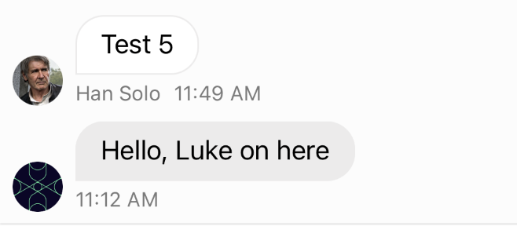
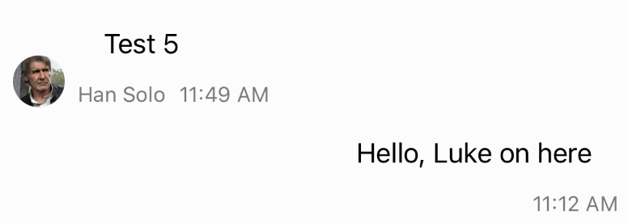
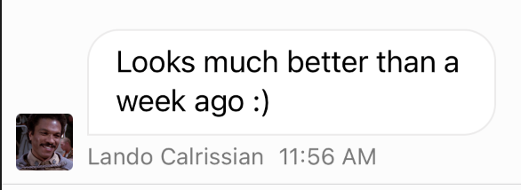

## `ChatMessageLayoutOptionsResolver`

Almost anything related to the layout and appearance of the message cell can be done by subclassing [`ChatMessageLayoutOptionsResolver`](../ReferenceDocs/Sources/StreamChatUI/ChatMessageList/ChatMessage/ChatMessageLayoutOptionsResolver.md). 
On  `ChatMessageLayoutOptionsResolver` there is intance property `options` ([ChatMessageLayoutOptions](../ReferenceDocs/Sources/StreamChatUI/ChatMessageList/ChatMessage/ChatMessageLayoutOptions.md)) which holds available options for the cell. 
See guides below for concrete examples.

## Left-aligning all messages
 To left-align all messages inside MessageList, you first need to create your custom left-aligned `MessageLayoutOptionsResolver` like this:
 
 ```swift
 class LeftAlignedMessageLayoutOptionsResolver: ChatMessageLayoutOptionsResolver {
     override func optionsForMessage(at indexPath: IndexPath, in channel: _ChatChannel<NoExtraData>, with messages: AnyRandomAccessCollection<_ChatMessage<NoExtraData>>) -> ChatMessageLayoutOptions {
         // Get options for the message at given indexpath to change it. 
         var options = super.optionsForMessage(at: indexPath, in: channel, with: messages)
         // First it's needed to disable the flipping of sides when messages is sent from current user
         options.remove(.flipped)
         // After that we need to ensure that for current user there will be avatar included in the message.
         options.insert(.avatar)
         // If you want, you can include the author name for the message as well.
         options.insert(.authorName)
         return options
     }
 }
 ```
 
 When your custom `ChatMessageLayoutOptionsResolver` is created, all you need to do is to set this class to `Components` before displaying the `MessageList`:
 
 ```swift
 Components.default.messageLayoutOptionsResolver = LeftAlignedMessageLayoutOptionsResolver()
 ```
 Here is the result: 
 
  
 
## Hiding bubbles

If you need to hide only the bubbles, we suggest you to implement custom subclass of  `MessageLayoutOptionsResolver`  as well. 
After that all you need to do is to remove the `bubble` option.

```swift

class NoBubblesMessageLayoutOptionsResolver: ChatMessageLayoutOptionsResolver {
    override func optionsForMessage(at indexPath: IndexPath, in channel: _ChatChannel<NoExtraData>, with messages: AnyRandomAccessCollection<_ChatMessage<NoExtraData>>) -> ChatMessageLayoutOptions {
        // Get options for the message at given indexPath to change it.
        var options = super.optionsForMessage(at: indexPath, in: channel, with: messages)
        options.remove(.bubble)
        return options
    }
}
``` 

When your custom `ChatMessageLayoutOptionsResolver` is created, all you need to do is to set this class to `Components` before displaying the `MessageList`:

```swift
Components.default.avatarView = NoBubblesMessageLayoutOptionsResolver()
```



## Disabling grouping of messages
The default behaviour of `ChatMessageLayoutOptionsResolver` is that it checks the messages if they are grouped or not. 
For this being possible we have created `isLastInSequence` property which is used for grouping the messages. 

```swift
...
// Check if the messages is sent last to create continuous bubble effect.
if !isLastInSequence {
    options.insert(.continuousBubble)
}
// For current user, add Padding to avatar
if !isLastInSequence && !message.isSentByCurrentUser {
    options.insert(.avatarSizePadding)
}
// And to make the group effect, let's add timestamp to the bottom.
if isLastInSequence {
    options.insert(.timestamp)
}
...
```

So if you want to disable grouping of messages, just subclass `ChatMessageLayoutOptionsResolver` and do not use `isLastInSequence`.  

## Square avatars

First subclass `ChatAvatarView` and set it according to your needs 

```swift
final class SquareAvatarView: ChatAvatarView {
    override func layoutSubviews() {
        super.layoutSubviews()
        imageView.layer.cornerRadius = 3
    }
}
``` 

After doing that, you need to set this custom view to `Components` somewhere where your customisation takes place.. 

```swift
Components.default.avatarView = SquareAvatarView.self
```


## Moving components of Messages in the layout

To change the layout of the message, you need to subclass [`ChatMessageContentView` ](../ReferenceDocs/Sources/StreamChatUI/ChatMessageList/ChatMessage/ChatMessageBubbleView)

### Changing layout to reverse order: 

```swift

final class ReversedMessageContentView: ChatMessageContentView {
    
    override func layout(options: ChatMessageLayoutOptions) {
        super.layout(options: options)
    
        // Get subviews from bubbleThreadView
        let bubbleViewSubviews = bubbleThreadMetaContainer.subviews
        // Remove the subviews
        bubbleThreadMetaContainer.removeAllArrangedSubviews()
        // After the subviews are removed, let's add them in reverse order.
        bubbleThreadMetaContainer.addArrangedSubviews(bubbleViewSubviews.reversed())
    }
}
```
