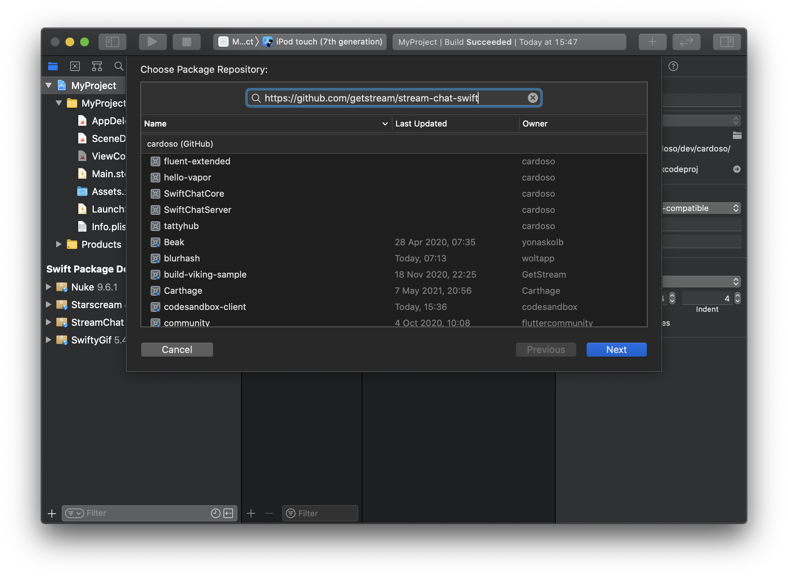
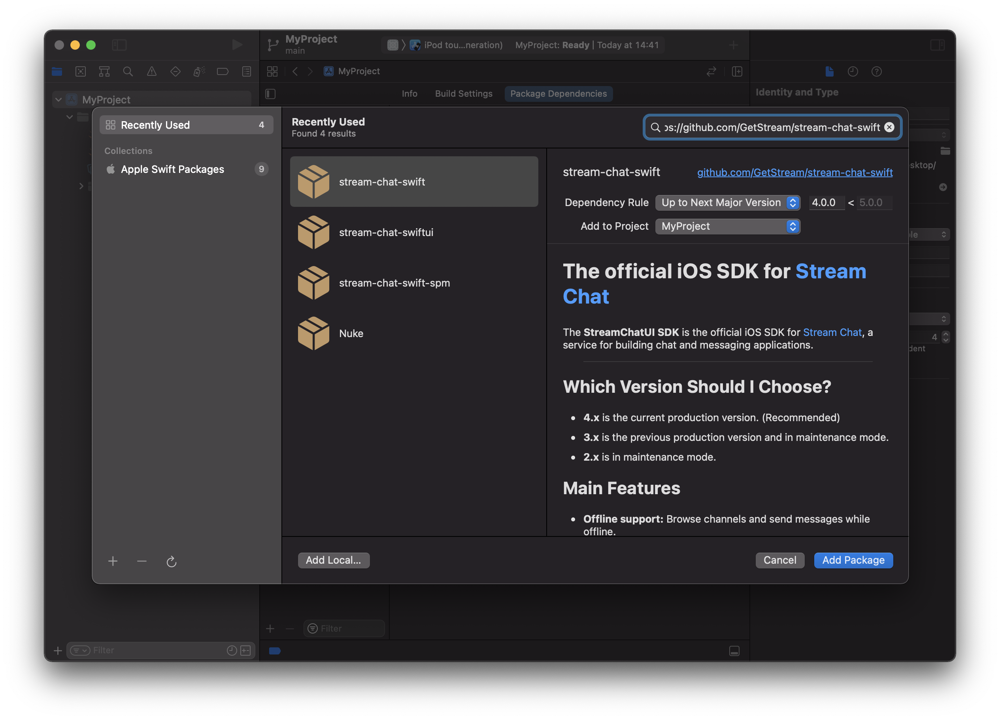
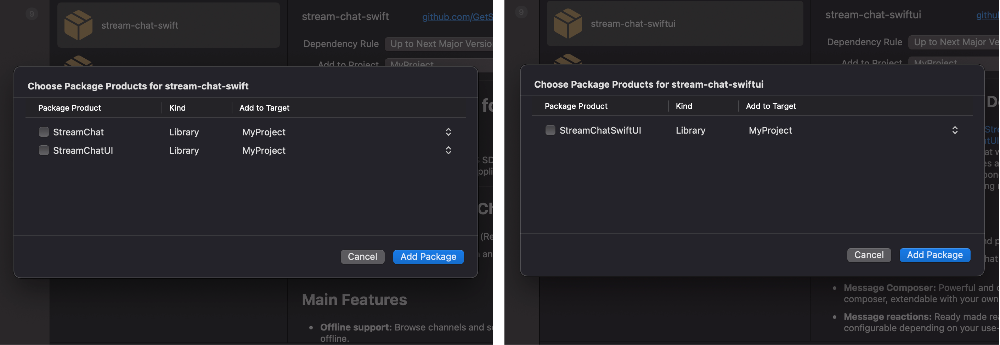
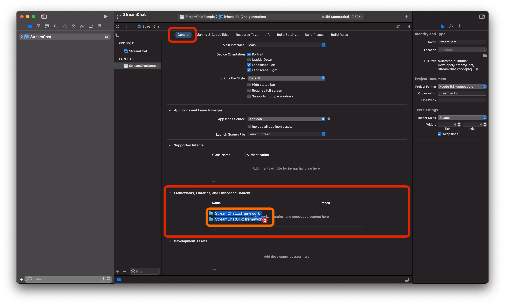

# Getting started

Building on top of the the Stream Chat API, the Stream Chat libraries include everything you need to build feature-rich and high-functioning chat user experiences out of the box.

We have a component libraries available for both UIKit and SwiftUI, together with a LLC (low level client). Each library includes an extensive set of performant and customizable UI components which allow you to get started quickly with little to no plumbing required. The libraries supports:

- Rich media messages
- Reactions
- Threads and quoted replies
- Text input commands (ex: Giphy and @mentions)
- Image and file uploads
- Video playback
- Read state and typing indicators
- Channel and message lists
- Push (APN or Firebase)
- Offline storage
- OSX (only for our LLC)

## Integration

To integrate Stream Chat in your app, you can use one of the following dependency managers:

- [**Swift Package Manager**](#swift-package-manager)
- [**CocoaPods**](#cocoapods)
- [**Carthage**](#carthage)

We also provide pre-built XCFramework support, read more [here](#xcframeworks).

### Swift Package Manager

Open your `.xcodeproj`, select the option "Add Package Dependency" in File > Swift Packages, and paste the URL for the library you want to integrate:

- For the LLC (**StreamChat**) use:
  - `https://github.com/getstream/stream-chat-swift`
- For the UIKit components (**StreamChatUI**, which depends on **StreamChat**) use:
  - `https://github.com/getstream/stream-chat-swift`
- For the SwiftUI components (**StreamChatSwiftUI**, which depends on **StreamChat**) use:
  - `https://github.com/getstream/stream-chat-swiftui`

<details><summary>Using <b>XCFrameworks</b></summary>
<p>

:::caution
Our XCFrameworks are built with **Swift 5.5**. In order to use them you need **Xcode 13** or above
:::

You can learn more about [our Module Stable XCFrameworks](#xcframeworks)

- For the LLC (**StreamChat**) use:
  - `https://github.com/getstream/stream-chat-swift-spm`
- For the UIKit components (**StreamChatUI**, which depends on **StreamChat**) use:
  - `https://github.com/getstream/stream-chat-swift-spm`

</p>
</details>



After pressing next, Xcode will look for the Packages available in the repository and automatically select the latest version tagged. Press next and Xcode will download the dependency.



Based on the repository you select you can find 3 different targets: StreamChat, StreamChatUI and StreamChatSwiftUI.

- If you want to use the UIKit components, select **StreamChatUI**.
- If you want to use the SwiftUI components, select **StreamChatSwiftUI**.
- If you don't need any UI components, select **StreamChat**.



After you press finish, it's done!

:::caution
Because StreamChat SDKs have to be distributed with its resources, the minimal Swift version requirement for this installation method is 5.3. If you need to support older Swift version, please install it using CocoaPods.
:::

_More information about Swift Package Manager [can be found here](https://www.swift.org/package-manager/)_

### CocoaPods

In your project's `Podfile`, add one of these options

- For the LLC (**StreamChat**) use:
  - `pod 'StreamChat', '~> 4.0.0'`
- For the UIKit components (**StreamChatUI**, which depends on **StreamChat**) use:
  - `pod 'StreamChatUI', '~> 4.0.0'`
- For the SwiftUI components (**StreamChatSwiftUI**, which depends on **StreamChat**) use:
  - `pod 'StreamChatSwiftUI', '~> 4.0.0'`

<details><summary>Using <b>XCFrameworks</b></summary>
<p>

:::caution
Our XCFrameworks are built with **Swift 5.5**. In order to use them you need **Xcode 13** or above
:::

You can learn more about [our Module Stable XCFrameworks](#xcframeworks)

- For the LLC (**StreamChat**) use:
  - `pod 'StreamChat-XCFramework', '~> 4.0.0'`
- For the UIKit components (**StreamChatUI**, which depends on **StreamChat**) use:
  - `pod 'StreamChatUI-XCFramework', '~> 4.0.0'`

</p>
</details>

Example: If you want to use the UIKit components, it should look similar the snippet below.

```ruby
target 'MyProject' do
  use_frameworks!

  # Pods for MyProject
  pod 'StreamChatUI', '~> 4.0.0'
end
```

StreamChatUI and StreamChatSwiftUI pod will automatically include the StreamChat dependency. If you want just the StreamChat dependency, without the UI components, use StreamChat as shown above.

Now that we’ve modified our Podfile, let’s go ahead and install the project dependencies via the terminal with one simple command:

```bash
pod install --repo-update
```

The above command will generate the **MyProject.xcworkspace** file automatically.

With our workspace now containing our Pods project with dependencies, as well as our original project, let’s go ahead and move over to Xcode to complete the process.

_More information about CocoaPods [can be found here](https://cocoapods.org/)_

### Carthage

In your project's `Cartfile`, add one of these options

- For the LLC (**StreamChat**) use:
  - `github "getstream/stream-chat-swift" ~> 4.0.0`
- For the UIKit components (**StreamChatUI**, which depends on **StreamChat**) use:
  - `github "getstream/stream-chat-swift" ~> 4.0.0`
- For the SwiftUI components (**StreamChatSwiftUI**, which depends on **StreamChat**) use:
  - `github "getstream/stream-chat-swiftui" ~> 4.0.0`

<details><summary>Using <b>XCFrameworks</b></summary>
<p>

:::caution
Our XCFrameworks are built with **Swift 5.5**. In order to use them you need **Xcode 13** or above
:::

You can learn more about [our Module Stable XCFrameworks](#xcframeworks)

- For the LLC (**StreamChat**) use:
  - `binary "https://raw.githubusercontent.com/GetStream/stream-chat-swift/main/StreamChatArtifacts.json" ~> 4.0`
- For the UIKit components (**StreamChatUI**, which depends on **StreamChat**) use:
  - `binary "https://raw.githubusercontent.com/GetStream/stream-chat-swift/main/StreamChatArtifacts.json" ~> 4.0`

</p>
</details>

Now that we’ve modified our Cartfile, let’s go ahead and install the project dependencies via the terminal with one simple command:

```bash
carthage update --use-xcframeworks
```

This command will create pre-built XCFrameworks built from our source code. You now need to add those to your project.

Open the `Carthage/Build` folder that has been created in the root of your project, and drag and drop the frameworks you want to use. Those should be added to the "Frameworks, Libraries, and Embedded Content" section under General settings:



_More information about Carthage [can be found here](https://github.com/Carthage/Carthage)_

## XCFrameworks

In an effort to have [**Module Stability**](https://www.swift.org/blog/library-evolution/), we have started distributing **pre-built XCFrameworks** starting ***4.6.0***

:::info
Our XCFrameworks are built with Swift 5.5. In order to use them you need Xcode 13 or above
:::

An **XCFramework** is a package that contains binaries for multiple architectures/platforms, but only the particular slice of that package required for your architecture/platform will be used.

**Benefits of XCFrameworks:**
- Conveniently import a single package
- Supports all platforms and architectures (We support iOS in StreamChatUI and iOS/macOS in StreamChat )
- No more fat binaries. No more architectures stripping

> Does this mean that from now on, I will need to import Stream manually?

**No**, [all the known dependency managers support this format](#), and this most likely happens without you even noticing.


**Module Stability:**

While ABI Stability was allowing us to have code written with different Swift versions in the same runtime, Module Stability enables us to use a library built in a particular version of the compiler running in a different version of the compiler (Think of a framework that is built using Swift X to work on an app built with Swift X+1).