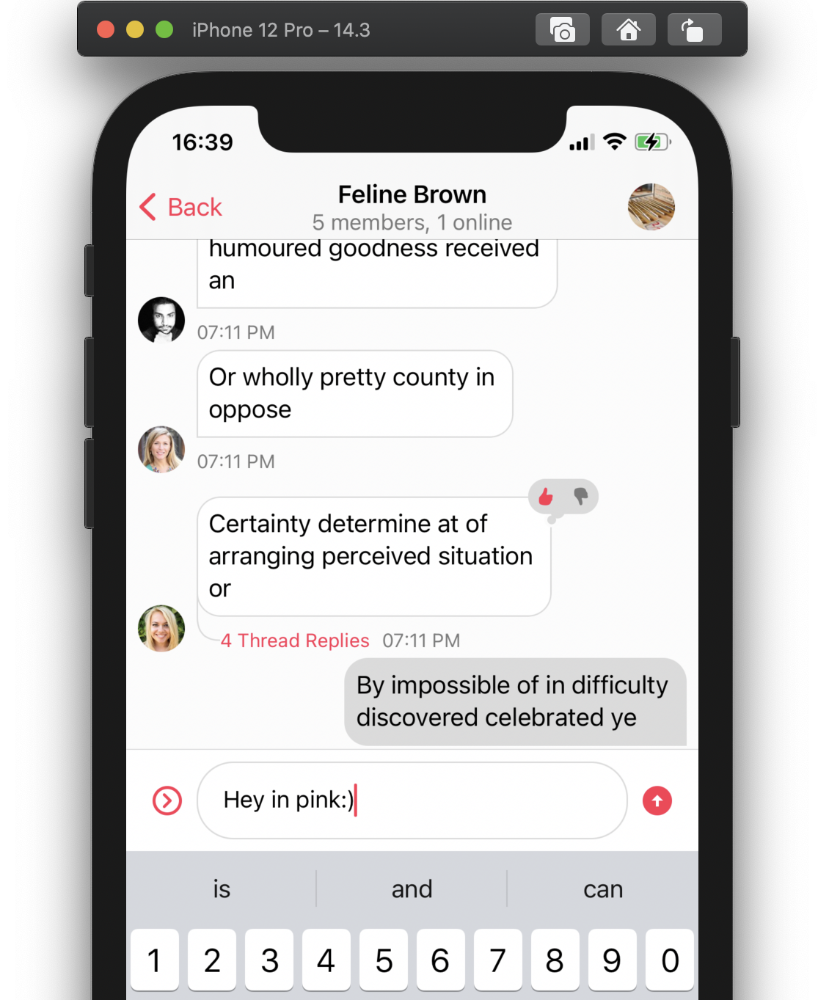
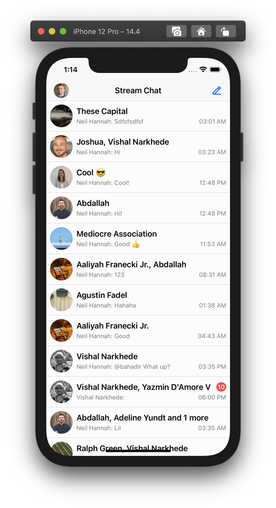
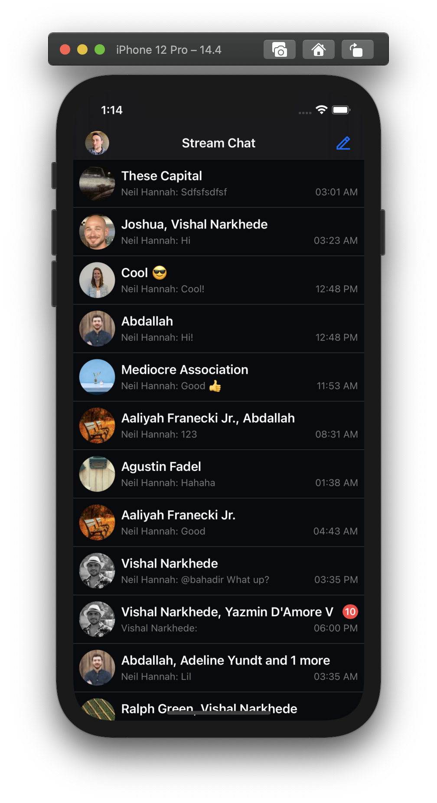
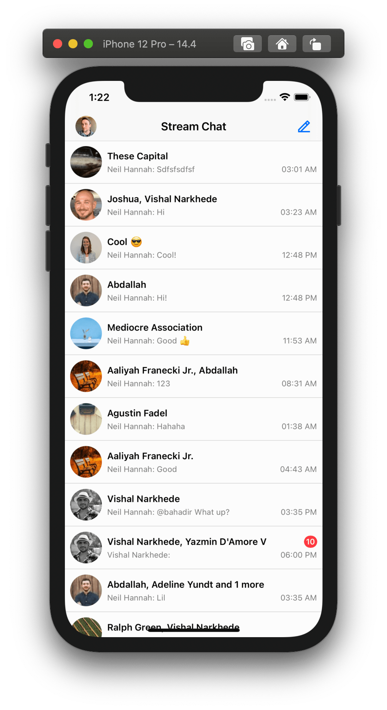
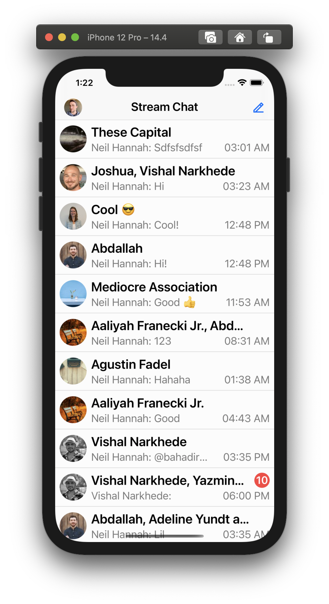
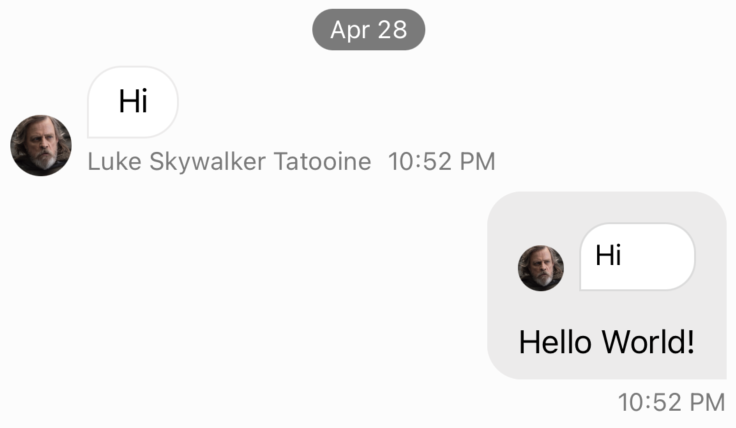
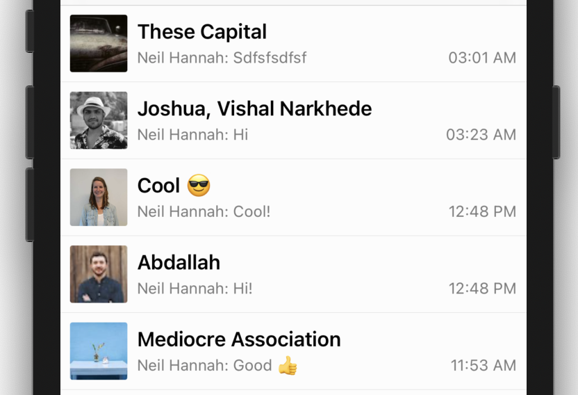

As step 0, we recommend visiting [our webpage](getstream.io) and creating an account. You'll need to create an account, and acquire an [API key](https://getstream.io/try-for-free/) to be able to use our platform.

## Overview

StreamChat Swift SDK consists of two separate frameworks:

- `StreamChat` is the low-level client that provides the main chat functionality including offline storage and optimistic updates. You can use it directly in case you want to build your own UI layer for the chat.

- `StreamChatUI` is the `UIKit` and `SwiftUI` framework that provides the complete set of reusable and customizable UI components for the common chat experience in iOS apps. It uses `StreamChat` under the hood.

We suggest using `StreamChatUI` for most of our users. Unless your UI is completely different from the common industry standard, you should be able to customize the built-in components to match your needs.


## SDK Basics

The `StreamChat` framework has three main types of components:

- `ChatClient` is the center point of the SDK. It represents the Stream Chat service. In most cases, you will need a single instance of `ChatClient` in your app.

- `xxxController` objects are lightweight and disposable objects that let you interact with entities in the chat system. You can create controllers the `ChatClient` object. See below for more info about controllers.

- Model objects like `ChatUser`, `ChatChannel`, `ChatMessage`, etc. are lightweight immutable snapshots of the underlying chat objects at the given time. You can access the model objects anytime via its respective controller counterpart.

:::note
If you're using `StreamChatUI` SDK, you don't need to know much about `StreamChat` Controllers. The UI SDK handles interactions with Controllers.
:::

### StreamChat Controllers

The most typical interaction with the StreamChat SDK is asking `ChatClient` for a controller and using it to get/observe data.

#### Use controllers for simple mutations

Controllers are lightweight, disposable objects. You can quickly create them, perform a mutation on the underlying entity, and throw them away:
```swift
chatClient
  .channelController(for: <ChannelId>)
  .createNewMessage(text: "My first message")
```

#### Use controllers for continuous observation of an object

Controllers can also act as entity observers and monitor changes of the represented entity. There's no limitation to the number of controllers that can observe the same entity.

You can choose you preferred to receive notification about the changes:

##### Using delegates

This is the way we recommend using in your UIKit apps. StreamChat Delegates acts like traditional delegates.

```swift
let channelController = chatClient.channelController(for: <ChannelId>)
channelController.delegate = self
channelController.synchronize()

func channelController(
  _ channelController: ChatChannelController,
  didUpdateChannel channel: EntityChange<ChatChannel>
) {
  self.title = channel.name
}
```

##### Using `Combine` publishers

If your app is using Combine, StreamChat SDK supports it out of the box.

```swift
let channelController = chatClient.channelController(for: <ChannelId>)

channelController
    .channelChangePublisher
    .map(\.item)
    .map(\.name)
    .assign(to: \.title, on: self)
    .store(in: &cancellables)
```

##### Use a controller directly in `SwiftUI` as `@ObservedObject`

```swift
struct ChannelView: View {
    @ObservedObject var channelController: ChatChannelController.ObservableObject
    var body: some View {
        Text(channelController.channel.name)
    }
}
```

### StreamChatUI Components

UI SDK components behave similarly to native UIKit components:

#### Components respect the `tintColor` of their current view hierarchy 

<!-- side by side component -->
| default `tintColor`  | `tintColor = .systemPink` |
| ------------- | ------------- |
|   |   |

<p>&nbsp;</p>

#### Components support light/dark user interface style

<!-- side by side component -->
| `userInterfaceStyle = .light`  | `userInterfaceStyle = .dark` |
| ------------- | ------------- |
|    |   |

<p>&nbsp;</p>

#### Components support dynamic content size categories

<!-- side by side component -->
| `preferredContentSizeCategory = .small`  | `preferredContentSizeCategory = .extraLarge` |
| ------------- | ------------- |
|    |   |

<p>&nbsp;</p>

#### Custom Components can be injected into the SDK

You can replace all `StreamChatUI` components with your custom subclasses using the `Components` object. It doesn't matter how deep in the hierarchy the component lives:

```swift
// Your custom subclass that changes the behavior of avatars
class RectangleAvatarView: ChatAvatarView { 
    override func layoutSubviews() {
        super.layoutSubviews()
        imageView.layer.cornerRadius = 2
    }
}

// Register it with `UIConfig`
Components.default.avatarView = RectangleAvatarView.self
```

| default `ChatAvatarView`  | custom `RectangleAvatarView ` |
| ------------- | ------------- |
|    |   |

<p>&nbsp;</p>

## Up & Running

To get started with StreamChat, we suggest you register and acquire an API token [on our website](getstream.io). Please enable developer tokens for your app before moving on with the guide, since we'll use them for prototyping.

On the [Dashboard](https://getstream.io/dashboard/):

1. Open Select App.
1. Select the App you want to enable developer tokens on.
1. Open Chat dropdown and select overview
1. Scroll to Chat Events > Authentication
1. Toggle Disable Auth Checks
1. Save these settings.

---

Getting up & running with our SDK is a couple of lines:

```swift
// Create a token
let userId = "first-user"
let token = Token.development(userId: userId)

// Create client
let config = ChatClientConfig(apiKey: <# Your API Key Here #>)
let chatClient = ChatClient(config: config, tokenProvider: .static(token))

// Channels with the current user
let controller = chatClient.channelListController(query: .init(filter: .containMembers(userIds: [userId])))
let channelListVC = ChatChannelListVC()
channelListVC.controller = controller

// Present the ChatListViewController
present(channelListVC, animated: true)
```

In the snippet above, we've:
* created our `ChatClient` instance that we'll use to interact with the SDK,
* created `ChatChannelListController` instance that'll allow us to get the list of Channels for a given query,
* created `ChatChannelListVC` instance that'll use the controller to display the list of Channels

### User Tokens

User Tokens are JWT tokens containing a User ID and used to authenticate a user. In this guide, we use development tokens, since they're the easiest to start with, and are great for prototyping an application before implementing a backend handling for tokens.

For more information regarding user tokens, please check [Working with User guide](working-with-user).

### [`ChatClientConfig`](../ReferenceDocs/Sources/StreamChat/Config/ChatClientConfig)

The `ChatClientConfig` object holds properties that the chat client will use to determine certain behaviors. For example, the `apiKey`, which tells the chat client which chat server to communicate with. It also has the `baseURL` property which tells the chat client which region of the world your server is at, which can be useful to reduce overall latency.

```swift
/// 1: Create a `ChatClientConfig` instance with the API key.
let config = ChatClientConfig(apiKeyString: "YOUR_API_KEY")

/// 2: Set the baseURL.
/// This is important, since using a different baseURL 
/// than in your dashboard config will increase latency.
config.baseURL = .usEast

/// 3: Create a `ChatClient` instance with the config and the tokenProvider.
let chatClient = ChatClient(config: config, tokenProvider: tokenProvider)
```

For more information regarding available regions, please check [Multi-region Support](https://getstream.io/chat/docs/ios-swift/multi_region/?language=swift)
For more information regarding the configuration options, please check [ChatClientConfig Reference doc](../ReferenceDocs/Sources/StreamChat/Config/ChatClientConfig).

### [`ChatClient`](../ReferenceDocs/Sources/StreamChat/ChatClient)

`ChatClient` is the main interaction point with our SDK. From it, you ask a certain Controller and use the controller to interact with StreamChat platform.

For the list of possible controllers you can get from `ChatClient`, please check [Controllers Overview](../controllers/controllers-overview)

### [`ChatChannelListVC`](../ReferenceDocs/Sources/StreamChatUI/ChatChannelList/ChatChannelListVC)

This `UIViewController` subclass is the UI component to display a list of Channels. You can configure its behaviour by subclassing and overriding functions.