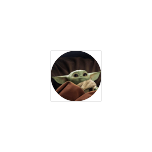

A view that displays the avatar image. By default a circular image.

``` swift
open class ChatAvatarView: _View 
```

## Inheritance

[`_View`](../_view.md)

## Properties

### `imageView`

The `UIImageView` instance that shows the avatar image.

``` swift
open private(set) var imageView: UIImageView = UIImageView().withoutAutoresizingMaskConstraints
```

### `intrinsicContentSize`

``` swift
override open var intrinsicContentSize: CGSize 
```

## Methods

### `layoutSubviews()`

``` swift
override open func layoutSubviews() 
```

### `setUpAppearance()`

``` swift
override open func setUpAppearance() 
```

### `setUpLayout()`

``` swift
override open func setUpLayout() 
```
