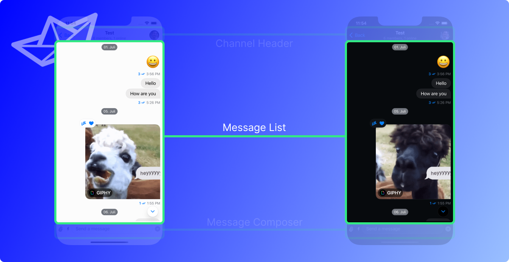
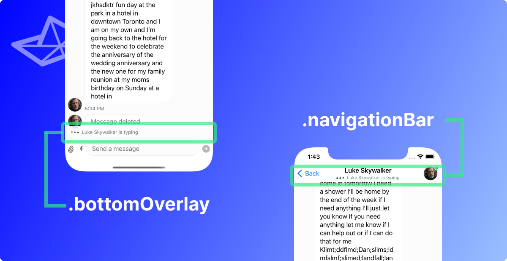
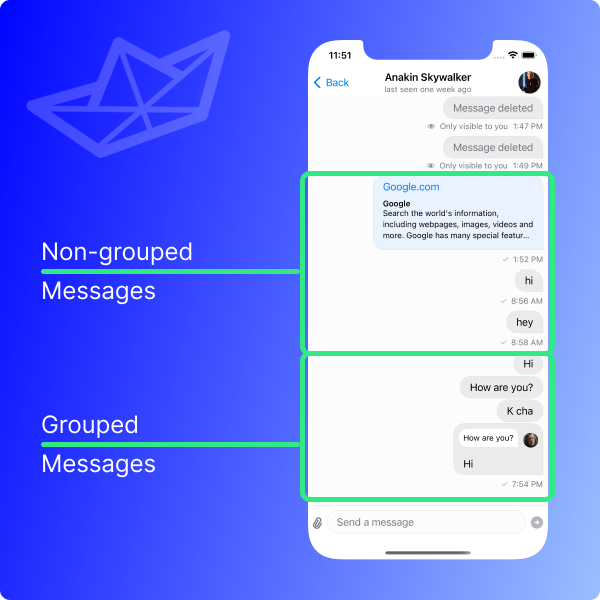
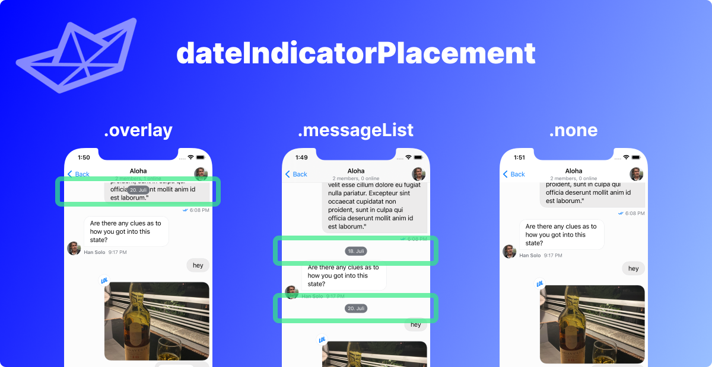
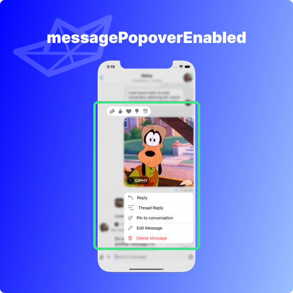
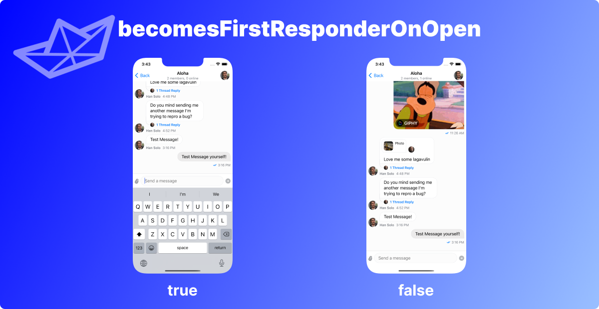
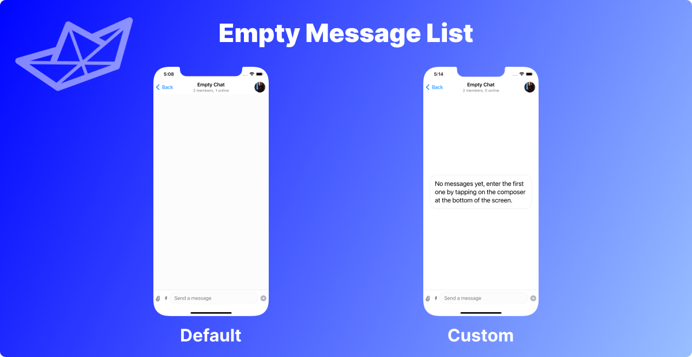
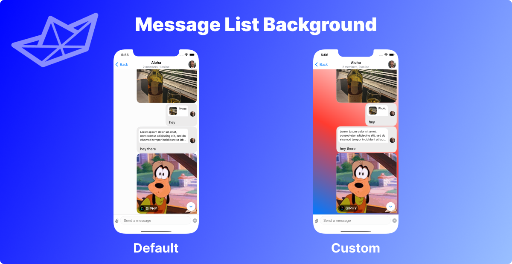

## What is the Message List?



The message list is the place to show a list of the messages of a specific channel.

A message can come in **many different forms**. If you are looking for the different types of messages and how to customize them the place to look for is the [Message Components](../message-components/custom-avatar) section. The Message List is really handling the **list of the messages** that a channel contains.

The **default message list implementation** in the SDK follows the style of **other messaging apps** such as Apple's iMessage, Facebook Messenger, WhatsApp, Viber, and many other. In these kinds of apps, the **current sender's messages** are displayed on the **right side**, while the **other participants' messages** are displayed on the **left side**. In addition to that, there is an **avatar** of the user sending a message shown.

## Customization options

For general customizations, the best place to start is the `MessageListConfig`. This is a configuration file that can be used in the `Utils` class that is handed to the `StreamChat` object upon initialization. The [Message List Configuration](#message-list-configuration) chapter is handling everything related to this type of customization.

:::note
Reminder: The configuration of the `StreamChat` object is recommended to be happening in the `AppDelegate` file. A guide on how to do this can be found [here](../getting-started.md).
:::

It is also possible to replace the screen that is shown when there are no messages yet in the current channel. This can be achieved by overriding the `makeEmptyMessagesView` function in the `ViewFactory`. Read more in the [No Messages](#no-messages-view) section.

In order to change the background of the Message List the `makeMessageListBackground` function in the `ViewFactory` can be overridden. A more detailed explanation together with an example can be found in the [Message List Background](#message-list-background) section.

Another option is to create a custom `ViewModifier` that is applied to the message list using the `makeMessageListModifier` function in the `ViewFactory`. This offers a lot of freedom and more details, togther with an example implementatino can be found in the [Custom modifier for the Message List](#custom-modifier-for-the-message-list) section.

## Message List Configuration

The `MessageListConfig` is a helper struct that allows customization of the `MessageList` in a unified, straightforward manner. The way this is done is by handing it into the `Utils` class that is then handed to the `StreamChat` initializer upon creation.

Here is an example of how to do this:

```swift
let messageListConfig = MessageListConfig()
let utils = Utils(messageListConfig: messageListConfig)
streamChat = StreamChat(chatClient: chatClient, utils: utils)
```

:::note
This code snippet is normally located in the `AppDelegate.swift` file inside of the `didFinishLaunchingWithOptions` function. If you are unsure of where to put that, you can follow the [Getting Started](../getting-started.md) for a detailed description.
:::

This does **not** do any customization as it only uses the default parameters from the `MessageListConfig`. Due to the fact that there are default parameters for every option it is easy to only specify the customization options that are needed in the specific use-case.

Every one of them is discussed in the next chapters, but here is an overview over all the options that are configureable in the `MessageListConfig` together with their types and default values (click on the parameter name to jump directly to the section where they are explained in more detail):

| Parameter                                                                       | Type                       | Default                          |
| ------------------------------------------------------------------------------- | -------------------------- | -------------------------------- |
| [messageListType](#messagelisttype)                                             | `MessageListType`          | `.messaging`                     |
| [typingIndicatorPlacement](#typingindicatorplacement)                           | `TypingIndicatorPlacement` | `.bottomOverlay`                 |
| [groupMessages](#groupmessages)                                                 | `Bool`                     | `true`                           |
| [messageDisplayOptions](#messagedisplayoptions)                                 | `MessageDisplayOptions`    | `MessageDisplayOptions()`        |
| [messagePaddings](#messagepaddings)                                             | `MessagePaddings`          | `MessagePaddings(horizontal: 8)` |
| [dateIndicatorPlacement](#dateindicatorplacement)                               | `DateIndicatorPlacement`   | `.overlay`                       |
| [pageSize](#pagesize)                                                           | `Int`                      | `50`                             |
| [messagePopoverEnabled](#messagepopoverenabled)                                 | `Bool`                     | `true`                           |
| [doubleTapOverlayEnabled](#doubletapoverlayenabled)                             | `Bool`                     | `false`                          |
| [becomesFirstResponderOnOpen](#becomesfirstresponderonopen)                     | `Bool`                     | `false`                          |
| [maxTimeIntervalBetweenMessagesInGroup](#maxtimeintervalbetweenmessagesingroup) | `TimeInterval`             | `60`                             |
| [cacheSizeOnChatDismiss](#cachesizeonchatdismiss)                               | `Int`                      | `1024 * 1024 * 100`              |

The next sections will go through these values and discuss the impact they have when altered.

### messageListType

The `MessageListType` enum has four cases:

- `.messaging`
- `.team`
- `.livestream`
- `.commerce`

The goal with that is to have an easy configuration option to support different types of chat interfaces that are tailored towards specific use-cases.

Currently, the only one supported is the `.messaging` case, which is also the default. The documentation will be updated once the other cases are supported as well.

### typingIndicatorPlacement

When the user is located in the message list and another user is typing a message an indicator is shown. The SDK allows for two different configuration options in this case.

The default is the `.bottomOverlay`. Here, the typing indicator is shown in the bottom part of the message list. The alternate option, `.navigationBar`, is showing the typing indicator in the navigation bar, as the name suggests.

Here is an example for both of the options:



In case you want to set the `.navigationBar` option here is a snippet of code that achieves that. This goes into the `didFinishLaunchingWithOptions` function of the `AppDelegate.swift` file:

```swift
let messageListConfig = MessageListConfig(
// highlight-start
    typingIndicatorPlacement: .navigationBar
// highlight-end
)
let utils = Utils(
    messageListConfig: messageListConfig
)
streamChat = StreamChat(chatClient: chatClient, utils: utils)
```

### groupMessages

The SDK offers the option to group messages of a user together to show them in a more compact way. The `groupMessages` parameter specifies if this behavior is wanted or not.

The default value is `true`, an example for both looks can be seen below:



:::note
To identify which messages to group together the SDK uses the `maxTimeIntervalBetweenMessagesInGroup` parameter that is also part of the `MessageListConfig`. For more details on this parameter the [`maxTimeIntervalBetweenMessagesInGroup`](#maxtimeintervalbetweenmessagesingroup) section is provided.
:::

### messageDisplayOptions

The `messageDisplayOptions` parameter allows to customize the overall behavior and appearance of messages in the message list.

For more details on what you can change and customize with the `MessageDisplayOptions` object, go to the [Message Display Options](../../message-components/message-display-options) page in the Message Components section.

It has the following parameters:

- **showAvatars**: `Bool`
- **showMessageDate**: `Bool`
- **showAuthorName**: `Bool`
- **animateChanges**: `Bool`
- **dateLabelSize**: `CGFloat`
- **lastInGroupHeaderSize**: `CGFloat`
- **minimumSwipeGestureDistance**: `CGFloat`
- **currentUserMessageTransition**: `AnyTransition`
- **otherUserMessageTransition**: `AnyTransition`
- **shouldAnimateReactions**: `Bool`
- **messageLinkDisplayResolver**: `(ChatMessage) -> [NSAttributedString.Key: Any]`

In order to set the `messageDisplayOptions` in the `MessageListConfig` here is an example (with an empty `MessageDisplayOptions` object):

```swift
let messageListConfig = MessageListConfig(
// highlight-start
    messageDisplayOptions: MessageDisplayOptions()
// highlight-end
)
let utils = Utils(messageListConfig: messageListConfig)
streamChat = StreamChat(chatClient: chatClient, utils: utils)
```

### messagePaddings

The `messagePaddings` parameter is intended to be able to specify horizontal padding (left & right) to all messages. This can be done by intialization of a `MessagePaddings` object with the only parameter being `horizontal`. The default value it has is `8` and any other `CGFloat` can be specified.

An example of how to set the padding to e.g. a value of `40` can be found here:

```swift
let messageListConfig = MessageListConfig(
// highlight-start
    messagePaddings: MessagePaddings(horizontal: 40)
// highlight-end
)
let utils = Utils(messageListConfig: messageListConfig)
streamChat = StreamChat(chatClient: chatClient, utils: utils)
```

### dateIndicatorPlacement

The date indicator describes an element that displays the date in the message list. It must not be confused with the date of a specific message (TODO: link to the docs here.) The SDK supports three types of date indicators

- floating overlay (`.overlay`)
- date separators in-between the messages (`.messageList`)
- show no date indicators (`.none`)



This feature can be configured via the `dateIndicatorPlacement` in the `MessageListConfig`. With the floating overlay option (`.overlay`), the date indicator is shown for a short time whenever a new message appears and during scrolling. On the other hand, in order to always show the date between messages, similarly to Apple Messages and WhatsApp, the `.messageList` option should be used. Both options can be turned off by using the `.none` option.

The default option is `.overlay`. In order to change that e.g. to the `messageList` option, this code can be used:

```swift
let messageListConfig = MessageListConfig(
// highlight-start
    dateIndicatorPlacement: .messageList
// highlight-end
)
let utils = Utils(messageListConfig: messageListConfig)
let streamChat = StreamChat(chatClient: chatClient, utils: utils)
```

### pageSize

The `pageSize` parameter specifies how many messages are loaded by the SDK in a chunk before requesting new messages. The default value of `50` specifies that 50 messages are loaded when entering the channel. When the user scrolls to previous messages and the first 50 are passed the next chunk of 50 messages are loaded again.

This value can be changed to any other `Int`. It should be considered, however, that there might be performance and networking considerations to take into account when changing up this value.

In order to change this value e.g. to have a `pageSize` of `100`, this code can be used:

```swift
let messageListConfig = MessageListConfig(
// highlight-start
    pageSize: 100
// highlight-end
)
let utils = Utils(messageListConfig: messageListConfig)
streamChat = StreamChat(chatClient: chatClient, utils: utils)
```

### messagePopoverEnabled

The `messagePopoverEnabled` parameter allows for an easy configuration option to allow to have things like reactions, threads, and other options available when users long-press a message. These options are available when the value is set to `true` (the default) and are disabled when set to `false`.

When set to `true` the following example shows when a user is long-pressing a GIF inside of the message list (works the same with any other type of message):



When `messagePopoverEnabled` is set to `false`, this menu does not show up. Here is the code to set this configuration:

```swift
let messageListConfig = MessageListConfig(
// highlight-start
    messagePopoverEnabled: false
// highlight-end
)
let utils = Utils(messageListConfig: messageListConfig)
streamChat = StreamChat(chatClient: chatClient, utils: utils)
```

### doubleTapOverlayEnabled

The `doubleTapOverlayEnabled` parameter is related to the [`messagePopoverEnabled`](#messagepopoverenabled) parameter. If `doubleTapOverlayEnabled` is set to true, the user can also summon the message overlay menu on a double tap in addition to the regularly enabled long-press gesture.

:::note
If unsure what kind of overlay is meant here, feel free to check the section about the [`messagePopoverEnabled`](#messagepopoverenabled) to see an example how it looks.
:::

The default is set to `false` so that the menu overlay is not showing up on a double tap. To set this to `true` the following code can be used:

```swift
let messageListConfig = MessageListConfig(
// highlight-start
    doubleTapOverlayEnabled: true
// highlight-end
)
let utils = Utils(messageListConfig: messageListConfig)
streamChat = StreamChat(chatClient: chatClient, utils: utils)
```

### becomesFirstResponderOnOpen

The `becomesFirstResponderOnOpen` parameter describes if the composer is active once the user is entering the chat channel screen. If set to `true` the keyboard will open and the user is directly ready to enter a message.

If set to `false` (the default) the keyboard will not be active and it requires another tap from the user onto the composer. However, the entire list of messages is present, showing more messages initially.

Here, the different options are shown when a user enters a channel:



In order to set this option e.g. to `true`, the following code can be used:

```swift
let messageListConfig = MessageListConfig(
// highlight-start
    becomesFirstResponderOnOpen: true
// highlight-end
)
let utils = Utils(messageListConfig: messageListConfig)
streamChat = StreamChat(chatClient: chatClient, utils: utils)
```

### maxTimeIntervalBetweenMessagesInGroup

The messages in the message list are grouped based on the `maxTimeIntervalBetweenMessagesInGroup` value in the `MessageListConfig` (if the [`groupMessages`](#groupmessages) option is set to `true`). It specifies a `TimeInterval` which determines how far apart messages can maximally be to be grouped together.

The default value of this property is 60 seconds, which means messages that are 60 seconds (or less) apart, will be grouped together. Messages that are farther apart are not grouped together and appear as standalone messages. An example for that can be seen in the [groupMessages](#groupmessages) section.

To change it up from the default value (`60` seconds) a different value (in this case: `20` seconds) can be specified like this:

```swift
let messageListConfig = MessageListConfig(
// highlight-start
    maxTimeIntervalBetweenMessagesInGroup: 20
// highlight-end
)
let utils = Utils(messageListConfig: messageListConfig)
streamChat = StreamChat(chatClient: chatClient, utils: utils)
```

### cacheSizeOnChatDismiss

The `cacheSizeOnChatDismiss` parameter specifies how large the image cache is after leaving a channel. The default is set to `1024 * 1024 * 100` bytes and it means that when the user is leaving a channel, the image cache that [Nuke](https://github.com/kean/Nuke) uses is trimmed down to that size so that it doesn't take up too much memory.

:::note
Changing this parameter needs careful consideration of memory allocation limits, so this should only be changed when knowing the exact impacts of it.
:::

In case this is required to be changed however, here is a code example on how to do it (limiting the cache size to half of what it is per default):

```swift
let messageListConfig = MessageListConfig(
// highlight-start
    cacheSizeOnChatDismiss: 1024 * 1024 * 50
// highlight-end
)
let utils = Utils(messageListConfig: messageListConfig)
streamChat = StreamChat(chatClient: chatClient, utils: utils)
```

## No Messages View

When there are no messages available in the channel, a custom view can be provided. In order to do this, the `makeEmptyMessagesView` method needs to be implemented in the `ViewFactory`. In this method, the `channel` is provided as a parameter, allowing for a personalized message for starting a conversation. The `colors` are provided as a parameter too. The default implementation in the SDK just shows the message list background in this slot.

In order to change this up, here is an example usage of an override in the custom `ViewFactory`:

```swift
func makeEmptyMessagesView(for channel: ChatChannel, colors: ColorPalette) -> some View {
    Text("No messages yet, enter the first one by tapping on the composer at the bottom of the screen.")
        .padding()
        .background(RoundedRectangle(cornerRadius: 20, style: .continuous)
            .stroke(Color(UIColor.secondarySystemBackground), lineWidth: 2)
        )
        .frame(maxWidth: .infinity, maxHeight: .infinity)
        .padding()
}
```

Here's how that custom implementation looks compared to the default one:



:::info
Reminder: the custom `ViewFactory` needs to be injected into e.g. the `ChatChannelListView`. If unsure how to do that, there is a more detailed explanation in the [Getting started](../../getting-started) page.
:::

## Message List Background

It is possible to change the background of the Message List entirely. This can be done by creating a custom `View` that allows for complete freedom of handing it whatever object that is desired.

The way to do this is to override the `makeMessageListBackground` function in the `ViewFactory` (see [Getting started](../../getting-started) on how to add a custom `ViewFactory` to your app).

The function gets two parameters. The first one is `colors` which is the `ColorPalette` of the app that can be used to customize the background to match the color theme of the applocation itself. The second one is a `Boolean` called `isInThread`, and it specifies whether or not the message list is part of a message thread.

Here is an example on how to create a gradient background for the background of the Message List (the code goes inside of the custom `ViewFactory` of the app):

```swift
func makeMessageListBackground(
    colors: ColorPalette,
    isInThread: Bool
) -> some View {
    LinearGradient(gradient: Gradient(
        colors: [.blue, .red, .white]),
        startPoint: .topLeading,
        endPoint: .bottomTrailing
    )
}
```

See how this looks compared to the default Message List background:



## Custom modifier for the Message List

It is possible to customize the message list further by creating a custom view modifier for it using the `makeMessageListModifier` function in the `ViewFactory`. This gives complete freedom over the type of implementation and customization that will be applied to the message list.

The first step in order to implement this is to create a custom `ViewModifier`. In this example this adds a vertical padding to the `View`;

```swift
struct VerticalPaddingViewModifier: ViewModifier {
    public func body(content: Content) -> some View {
        content
            .padding(.vertical, 8)
    }
}
```

This modifier can then be applied in the custom `ViewFactory` by overriding the `makeMessageListModifier` function:

```swift
func makeMessageListModifier() -> some ViewModifier {
    VerticalPaddingViewModifier()
}
```

Having this kind of freedom allows for more complex modifiers as well.
