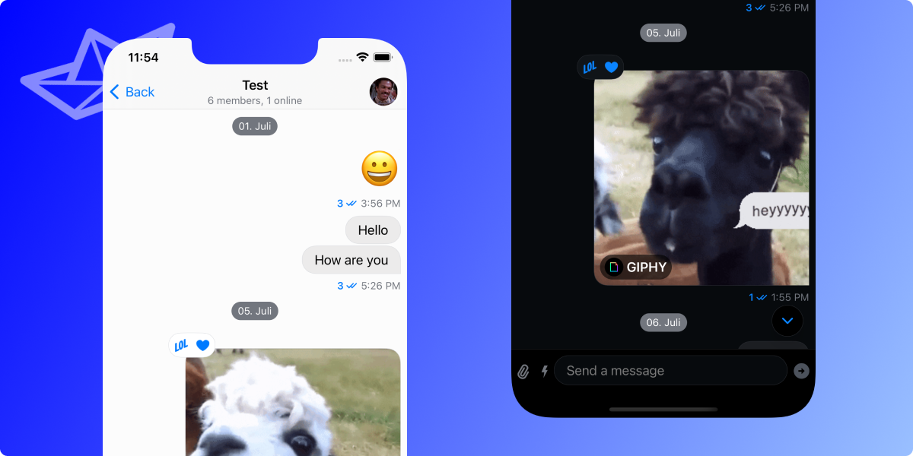
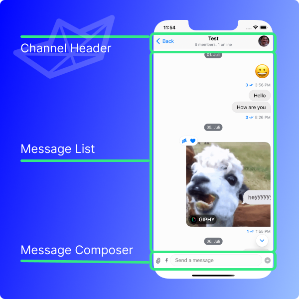

## What is the Chat Channel?



The chat channel describes all the content that is shown for a specific channel. It consists of three main parts:

- Channel Header
- Message List
- Message Composer

There are **many components** that make up the chat channel screen. The **channel header** is shown on the top to give an overview of the channel as well as provide other **helpful information**. It can take care of navigation (e.g. using a back button) and allow the user to see more information about the name, members, and other properties of a channel. All of these components are **customizable and easily replaceable**.

The **message list** in the SwiftUI SDK is the view that shows all the messages in a channel. These include all kinds of types like **text, images, links, GIFs, and many more**. Also, it includes features such as message **reactions** and **threads**.

In order to compose messages there is the message **composer**. It can not only send messages but also all **other kinds of attachments**, such as photos, videos, voicemails, and many more. Also, it is possible to build **customized, personalized attachments** tailored for specific use-cases. The composer also supports advanced features such as **message commands** using e.g. the `/` shortcut.



## Customizing Message Components

The modular architecture of the Stream Chat SwiftUI SDK allows developers to change and customize the message components to match their functionalities and needs.

There are dedicated sections for each of the components that can be customized with detailed explanations how to do it:

- [Channel Header](../channel-header)
- [Message List](../message-list)
- [Message Composer](../message-composer)

In case there is anything missing from that list that you'd like to see, then please [let us know](https://twitter.com/getstream_io).

:::info
There is more content to be found on our [Youtube channel](https://www.youtube.com/channel/UC2xOn0xQj1HIpHJpOy5tvpA) in a video about [recreating the message list from iMessage](https://youtu.be/8Nkmk85H8HQ).
:::

## Showing a Channel programmatically

While the general use-case is that users navigate from a Channel List to a chat channel there can be exceptions to that. In some cases, it is required to directly show a channel. Not only that, it can also be helpful to have the option to programmatically navigate to a certain channel.

The SDK makes this easy as it exposes the `ChatChannelView` as the view that holds the UI and logic for showing the chat channel. It requires two parameters:

- `viewFactory`: with the common practices using e.g. a singleton the view factory that is used in the application needs to be handed to the `ChatChannelView`
- `channelController`: the controller (of type `ChatChannelController`) handles what the `ChatChannelView` shows and the channel that is specified to be shown

The `channelController` can be initialized from the `chatClient` (using the [injection mechanism described here](../dependency-injection.md)). It requires a `ChannelId` and the specification of the `messageOrdering` (e.g. with the `.topToBottom` option). The creation of the channel id can be done with the knowledge of the id.

:::info
The `ChatChannelView` is still respecting the replacements that are applied in the custom `ViewFactory` implementation. All customizations are still used there as it pulls its contents dynamically from the factory.
:::

The following code shows the example of displaying a certain channel (with the id `"my-channel-id"`) when the app starts:

```swift
@main
struct ExampleApp: App {

    @Injected(\.chatClient) var chatClient
    @UIApplicationDelegateAdaptor(AppDelegate.self) var appDelegate

    var body: some Scene {
        WindowGroup {
            // highlight-start
            ChatChannelView(
                viewFactory: MyViewFactory.shared,
                channelController: chatClient.channelController(
                   for: try! ChannelId(cid: "my-channel-id"),
                    messageOrdering: .topToBottom
                )
            )
            // highlight-end
        }
    }
}
```

:::info
This example shows how to display the `ChatChannelView` on app startup. It is perfectly applicable everywhere else in an app (e.g. embedding it in a `NavigationLink` as the `destination`).
:::
