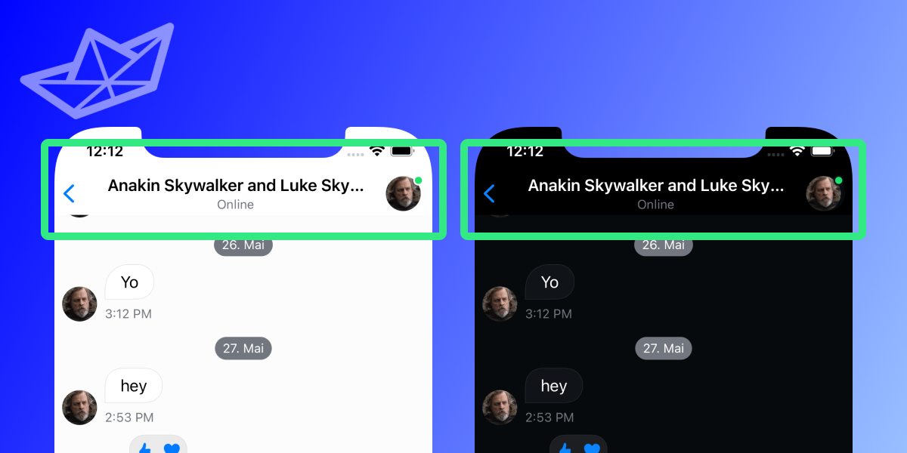
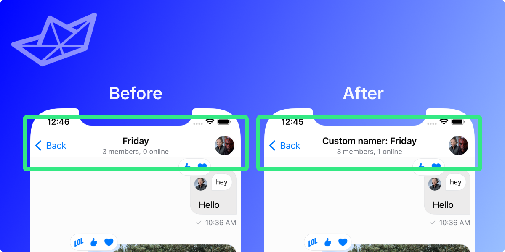
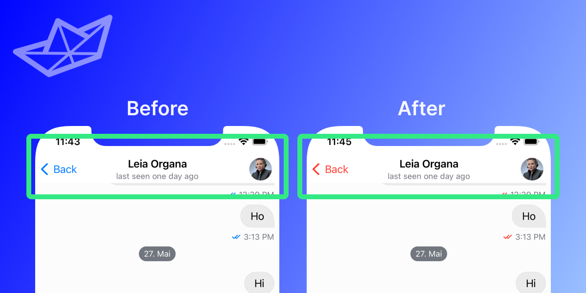
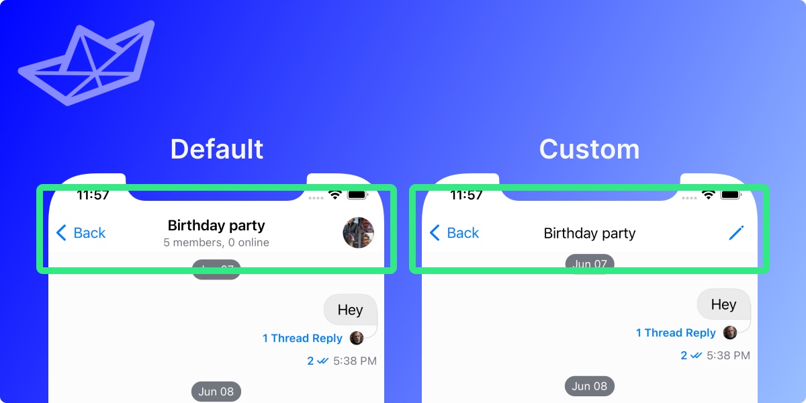
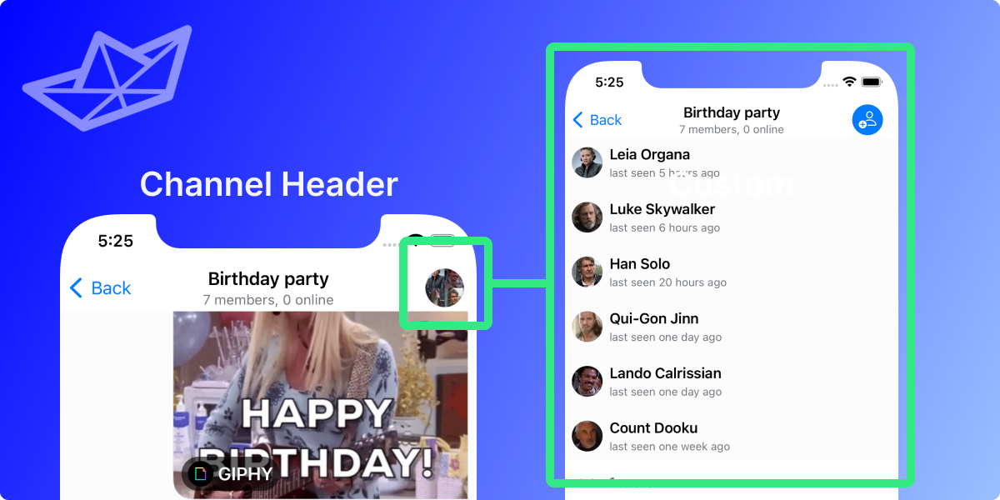

## What is the Channel Header?



The channel header appears at the top of the list of messages. It serves the purpose of displaying the name of the channel (top line) as well as additional information (bottom line).

In addition to that it can offer buttons on the trailing edge (here: right). They can server different purposes, such as showing additional information about the channel, or other custom actions.

## Customizing the Channel Header

You might want to customize the channel header to fit in with the rest of your app. The SwiftUI SDK provides several customization options, from minor tweaks to ultimately providing your own header.

For the customization you have 3 options:

1. the `ChatChannelNamer` in the `Utils` class that can be handed to `StreamChat` upon creation
2. the `tintColor` in the `Appearance` class that can be handed to `StreamChat` upon creation
3. creating your own header completely

Each option servers different purposes, so here are examples for all of them.

### Customizing the name of the channel

You can change the header's title while keeping the same look and feel of it. To do this, you need to provide your own implementation of the `ChannelNamer` protocol and inject it in the `Utils` class of the `StreamChat` context provider object.

```swift
let channelNamer: ChatChannelNamer = { channel, currentUserId in
    "Custom namer: \(channel.name ?? "no name")"
}
let utils = Utils(channelNamer: channelNamer)

let streamChat = StreamChat(chatClient: chatClient, utils: utils)
```

Below you can see the comparison of the before and after of this change.



> 💡 The best place to do this would be in the `AppDelegate` file of your project. Not sure how to set this one up? We got you covered in our [Getting started guide](../getting-started.md).

### Changing the color of the header

Another simple change you can do is to change the tint color of the header. This will change the navigation bar buttons in all of the SDK components. To do this, simply initialize the `StreamChat` object with your preferred tint color.

```swift
var colors = ColorPalette()
colors.tintColor = Color.red

let appearance = Appearance(colors: colors)

let streamChat = StreamChat(chatClient: chatClient, appearance: appearance)
```

Below you can see the comparison of the before and after of this change.



### Creating Your Own Header

There are cases where you want to customize the navigation bar even further - either by adding branding information, like logo and text, or even additional buttons that will either push a new view, display a modal sheet or an alert.

In order to do this, you will need to perform four steps:

1. Create a header conforming to `ToolbarContent`
2. Create a modifier conforming to `ChatChannelHeaderViewModifier`
3. Override `makeChannelHeaderViewModifier` in a custom `ViewFactory`
4. Inject the custom `ViewFactory` into the view hierarchy.

First, you need to create your own header, conforming to SwiftUI's `ToolbarContent` protocol. Let's create a header that will show an additional button to the right, to do changes to the channel instead of the default avatar view.

```swift
struct CustomChatChannelHeader: ToolbarContent {

    var channelName: String
    var onTapTrailing: () -> ()

    var body: some ToolbarContent {
        ToolbarItem(placement: .principal) {
            Text(channelName)
        }

        ToolbarItem(placement: .navigationBarTrailing) {
            Button {
                onTapTrailing()
            } label: {
                Image(systemName: "pencil")
                    .resizable()
            }
        }
    }
}
```

The custom header implementation exposes an onTapTrailing callback, that will be called when the trailing button is tapped (e.g. for displaying an edit view). The implementation of this button will be done in a `ViewModifier`, since the `ToolbarContent` can't keep `@State` variables.

The next step is to provide a new implementation of the `ChatChannelHeaderViewModifier`. In this case, you need to provide handling for the `onTapTrailing` method from the `CustomChatChannelHeader`. To do this, you introduce a new `@State` variable in the modifier and change its state to true when the button is tapped.

```swift
struct CustomChatChannelModifier: ChatChannelHeaderViewModifier {

    @State private var editShown = false
    var channel: ChatChannel

    func body(content: Content) -> some View {
        content.toolbar {
            CustomChatChannelHeader(channelName: channel.name ?? "Unkown") {
                editShown = true
            }
        }
        .sheet(isPresented: $editShown) {
            Text("Edit View")
        }
    }
}

```

The next step is to create a custom view factory (or update the existing one if it was already created) to return the newly created channel view modifier.

```swift
class CustomFactory: ViewFactory {

    @Injected(\.chatClient) public var chatClient

    private init() {}

    public static let shared = CustomFactory()

    func makeChannelHeaderViewModifier(for channel: ChatChannel) -> some ChatChannelHeaderViewModifier {
        CustomChatChannelModifier(channel: channel)
    }

}
```

Finally, you need to inject the `CustomFactory` in your view hierarchy.

```swift
var body: some Scene {
    WindowGroup {
        ChatChannelListView(viewFactory: CustomFactory.shared)
    }
}
```

These are all the steps needed to provide your own navigation header in the chat channel. Take a look at the comparison between the default implementation and the custom one.



## Using the Chat Info Screen

In many chat apps, the navigation bar contains a link to a screen that contains information about the chat, such as its participants, list of the pinned messages, files, media, etc, as well as a possibility to add members to the chat. This view is displayed by default if you tap on the right navigation bar button in the channel header.

If you want to use this screen in your custom navigation bar (or anywhere else), you can simply initalize the `ChatChannelInfoView` with a channel.

In order for it to be integrated in the same context as above, your `CustomChatChannelHeader` would now look like this:

```swift
public struct CustomChatChannelHeader: ToolbarContent {

    public var channelName: String
    // highlight-next-line
    public var channel: ChatChannel
    public var onTapTrailing: () -> ()

    public var body: some ToolbarContent {
        ToolbarItem(placement: .principal) {
            Text(channelName)
        }

        ToolbarItem(placement: .navigationBarTrailing) {
            // highlight-start
            NavigationLink(destination: ChatChannelInfoView(channel: channel)) {
                Image(systemName: "info.circle")
                    .resizable()
            }
            // highlight-end
        }
    }
}
```

This will display the info button on the trailing edge of the header view and navigate to the detail screen once the user taps on it.


