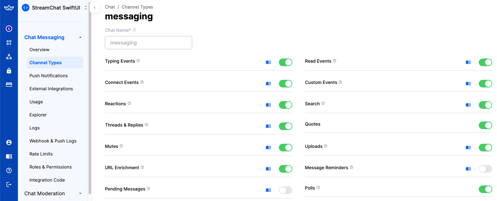
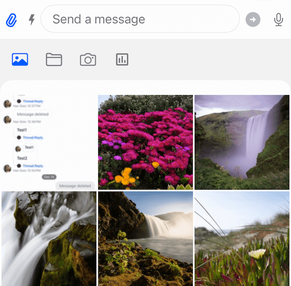
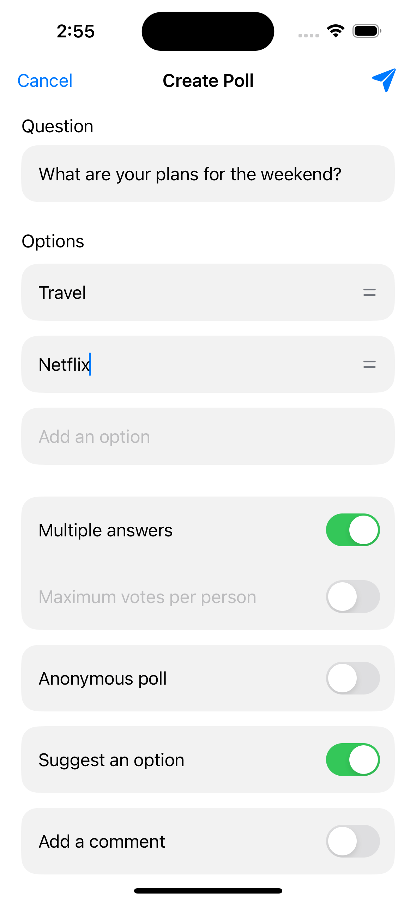
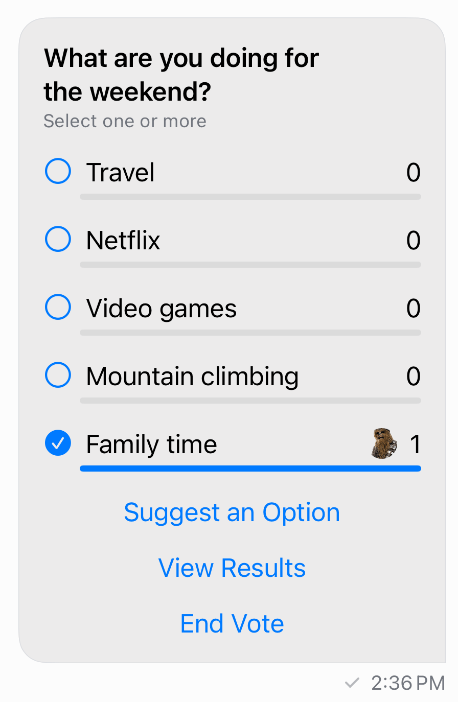

Stream Chat's SwiftUI SDK includes the capability to create polls within your chat application. Polls are an effective tool for enhancing user interaction and engagement, providing a dynamic way to gather opinions and feedback.

:::note
Polls on SwiftUI are available since version [4.57.0](https://github.com/GetStream/stream-chat-swiftui/releases/tag/4.57.0).
:::

Polls are disabled by default. In order to enable this feature, you need to go to the Stream dashboard for your app, and enable the "Polls" flag for your channel type.



As soon as you do that, an additional "Polls" icon would be shown in the attachment picker in the default composer implementation in the SDK.



### Polls configuration

When you tap the "Polls" icon, a new screen for creating polls would be shown. On this screen, you can configure the poll title, the options, as well as several other settings, such as the maximum number of votes, whether the poll is anonymous and if it allows comments.



You can setup which of these options are going to be configurable for the users creating the poll. In order to do that, you need to provide your own `PollsConfig`.

For example, let's create a new configuration which will hide the "Comments" option, and it will allow multiple votes by default.

```swift
let pollsConfig = PollsConfig(
    multipleAnswers: PollsEntryConfig(configurable: true, defaultValue: true),
    anonymousPoll: .default,
    suggestAnOption: .default,
    addComments: PollsEntryConfig(configurable: false, defaultValue: false),
    maxVotesPerPerson: .default
)

let utils = Utils(
    pollsConfig: pollsConfig
)

let streamChat = StreamChat(chatClient: chatClient, utils: utils)
```

### Poll creation view

You can also swap the whole view that shows the poll creation sheet. To do that, you need to implement the method `makeComposerPollView` in the `ViewFactory` protocol:

```swift
func makeComposerPollView(
        channelController: ChatChannelController,
        messageController: ChatMessageController?
) -> some View {
    CustomComposerPollView(channelController: channelController, messageController: messageController)
}
```

The `CustomComposerPollView` can then show your custom poll creation flow with a code similar to this one:

```swift
struct CustomComposerPollView: View {
    @State private var showsOnAppear = true
    @State private var showsCreatePoll = false
    
    let channelController: ChatChannelController
    var messageController: ChatMessageController?
    
    var body: some View {
        VStack {
            Spacer()
            Button {
                showsCreatePoll = true
            } label: {
                Text("Create poll")
            }

            Spacer()
        }
        .fullScreenCover(isPresented: $showsCreatePoll) {
            CustomCreatePollView(chatController: channelController, messageController: messageController)
        }
        .onAppear {
            guard showsOnAppear else { return }
            showsOnAppear = false
            showsCreatePoll = true
        }
    }
}
```

### Poll attachment view

When a message contains a poll, the optional `poll` property inside `ChatMessage` would have a value of type `Poll`. In those cases, the `PollAttachmentView` would be shown. 

Poll attachments have the same behaviour as other types of messages - you can send reactions, reply, delete them or pin them.

The default poll attachment view has the following UI:



You can swap the default view with your own implementation. To do that, you would need to implement the `makePollView` in the `ViewFactory` protocol:

```swift
func makePollView(message: ChatMessage, poll: Poll, isFirst: Bool) -> some View {
    CustomPollAttachmentView(factory: self, message: message, poll: poll, isFirst: isFirst)
}
```

The `message`, the `poll` and whether the message is first in the group are provided in this method.

To facilitate your custom implementation, you can use the public `PollAttachmentViewModel` class, that is used by the default `PollAttachmentView`.

### Poll State

The `Poll` model contains the data needed to present a poll:

- `allowAnswers: Bool` - Indicates whether the poll allows answers.
- `allowUserSuggestedOptions: Bool` - Indicates whether the poll allows user-suggested options.
- `answersCount: Int` - The count of answers received for the poll.
- `createdAt: Date` - The date and time when the poll was created.
- `pollDescription: String?` - A brief description of the poll. This property is optional and may be `nil`.
- `enforceUniqueVote: Bool` - Indicates whether the poll enforces unique votes.
- `id: String` - The unique identifier of the poll.
- `name: String` - The name of the poll.
- `updatedAt: Date?` - The date and time when the poll was last updated. This property is optional and may be `nil`.
- `voteCount: Int` - The count of votes received for the poll.
- `extraData: [String: RawJSON]` - A dictionary containing custom fields associated with the poll.
- `voteCountsByOption: [String: Int]?` - A dictionary mapping option IDs to the count of votes each option has received. This property is optional and may be `nil`.
- `isClosed: Bool` - Indicates whether the poll is closed.
- `maxVotesAllowed: Int?` - The maximum number of votes allowed per user. This property is optional and may be `nil`.
- `votingVisibility: VotingVisibility?` - Represents the visibility of the voting process. This property is optional and may be `nil`.
- `createdBy: ChatUser?` - The user who created the poll. This property is optional and may be `nil`.
- `latestAnswers: [PollVote]` - A list of the latest answers received for the poll.
- `options: [PollOption]` - An array of options available in the poll.
- `latestVotesByOption: [PollOption]` - A list of the latest votes received for each option in the poll.

In order to create a poll in your custom UI components, you need to use the `ChatChannelController` method `createPoll`:

```swift
chatController.createPoll(
    name: question.trimmed,
    allowAnswers: allowComments,
    allowUserSuggestedOptions: suggestAnOption,
    enforceUniqueVote: !multipleAnswers,
    maxVotesAllowed: maxVotesAllowed,
    votingVisibility: anonymousPoll ? .anonymous : .public,
    options: pollOptions
) { [weak self] result in
    switch result {
    case let .success(messageId):
        log.debug("Created poll in message with id \(messageId)")
        completion()
    case let .failure(error):
        log.error("Error creating a poll: \(error.localizedDescription)")
        self?.errorShown = true
    }
}
```

To perform operations on a poll (for example, adding and removing votes), you need a `PollController`.

Poll controllers can be created with the `ChatClient`, by specifying the message id and the poll id:

```swift
let pollController = chatClient.pollController(
    messageId: message.id,
    pollId: poll.id
)
```

### `PollController` Operations

In order to cast a vote for an option in a poll, you can use the `castPollVote` method:

```swift
pollController.castPollVote(
    answerText: nil,
    optionId: option.id
) { [weak self] error in
    if let error {
        // handle error
    }
}
```

You can also use this method to add a comment to a poll, without voting for an option.

```swift
pollController.castPollVote(
    answerText: "comment",
    optionId: nil
) { [weak self] error in
    if let error {
        // handle error
    }
}
```

To remove a vote, you can use the `removePollVote` method:

```swift
pollController.removePollVote(
    voteId: vote.id
) { [weak self] error in
    if let error {
        // handle error
    }
}
```

In order to suggest a new option to a poll, you can use the `suggestPollOption` method:

```swift
pollController.suggestPollOption(text: "option") { [weak self] error in
    if let error {
        // handle error
    }
}
```

To close voting for a poll, you should use the `closePoll` method:

```swift
pollController.closePoll { [weak self] error in
    if let error {
        // handle error
    }
}
```

To get the current user's votes, you can simply call `pollController.ownVotes`.

### `PollControllerDelegate`

You can implement the `PollControllerDelegate`'s methods to listen for poll and votes updates:

```swift
/// Called when there is an update to a poll.
///
/// - Parameters:
///   - pollController: The instance of `PollController` that is providing the update.
///   - poll: An `EntityChange<Poll>` object representing the changes to the poll.
///   This includes information about what kind of change occurred (e.g., insert, update, delete) and the updated poll entity.
func pollController(
    _ pollController: PollController,
    didUpdatePoll poll: EntityChange<Poll>
)

/// Called when there is an update to the current user's votes.
///
/// - Parameters:
///   - pollController: The instance of `PollController` that is providing the update.
///   - votes: An array of `ListChange<PollVote>` objects representing the changes to the user's votes.
func pollController(
    _ pollController: PollController,
    didUpdateCurrentUserVotes votes: [ListChange<PollVote>]
)
```

### `PollVoteListController`

In order to paginate through votes (and answers), you should create a `PollVoteListController`, through the `ChatClient` instance.

For example, if you want to paginate through all the votes for a given option, you can use the following code:

```swift
let query = PollVoteListQuery(
    pollId: poll.id, 
    optionId: option.id, 
    filter: .equal(.optionId, to: option.id)
)
let controller = chatClient.pollVoteListController(query: query)
```

To paginate through all the comments (answers) in a poll, you can use the following query:

```swift
let query = PollVoteListQuery(
    pollId: poll.id,
    optionId: nil,
    filter: .and(
        [.equal(.pollId, to: poll.id), .equal(.isAnswer, to: true)]
    )
)
let commentsController = chatClient.pollVoteListController(query: query)
```

### `PollVoteListControllerDelegate`

To listen to updates of the `PollVoteListController` you should implement the `PollVoteListControllerDelegate` method:

```swift
/// The controller changed the list of observed votes.
///
/// - Parameters:
///   - controller: The controller emitting the change callback.
///   - changes: The change to the list of votes.
func controller(
    _ controller: PollVoteListController,
    didChangeVotes changes: [ListChange<PollVote>]
)
```