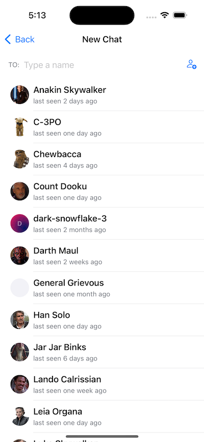
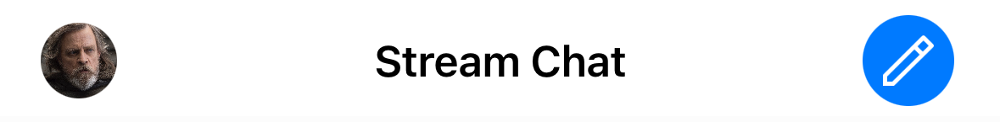

Different apps have different UI for starting a chat with other users. For example, there can be a way to search through the available users, or show a button to invoke a chat with a user from their profile.

In this cookbook, we will build a UI that will allow creation of channels by searching the users on the platform.



## Custom Channel List Header

The screen will be invoked from the channel list's header, which will contain a new button on the trailing navigation bar area.



To modify the header of the channel list, we need to provide our own version of the view factory method `makeChannelListHeaderViewModifier`.

To do this, create a new file called `DemoAppFactory` and add the following contents.

```swift
import StreamChat
import StreamChatSwiftUI
import SwiftUI

class DemoAppFactory: ViewFactory {

    @Injected(\.chatClient) public var chatClient

    func makeChannelListHeaderViewModifier(title: String) -> some ChannelListHeaderViewModifier {
        CustomChannelModifier(title: title)
    }
}
```

Next, let's implement the `CustomChannelModifier`. Create a new file with the same name, and add the following contents.

```swift
import StreamChat
import StreamChatSwiftUI
import SwiftUI

struct CustomChannelModifier: ChannelListHeaderViewModifier {

    @Injected(\.chatClient) var chatClient

    var title: String

    @State var isNewChatShown = false

    func body(content: Content) -> some View {
        ZStack {
            content.toolbar {
                CustomChannelHeader(
                    title: title,
                    currentUserController: chatClient.currentUserController(),
                    isNewChatShown: $isNewChatShown
                )
            }

            NavigationLink(isActive: $isNewChatShown) {
                NewChatView(isNewChatShown: $isNewChatShown)
            } label: {
                EmptyView()
            }
            .isDetailLink(UIDevice.current.userInterfaceIdiom == .pad)
        }
    }
}
```

The code above contains a `toolbar` modifier that attaches a `CustomChannelHeader`, as well as a navigation link that will open the new chat. The visibility of the new chat view is controlled by the state variable `isNewChatShown`.

Here is how the `CustomChannelHeader` looks like.

```swift
import StreamChat
import StreamChatSwiftUI
import SwiftUI

public struct CustomChannelHeader: ToolbarContent {

    @Injected(\.fonts) var fonts
    @Injected(\.images) var images
    @Injected(\.colors) var colors

    var title: String
    var currentUserController: CurrentChatUserController
    @Binding var isNewChatShown: Bool

    @MainActor
    public var body: some ToolbarContent {
        ToolbarItem(placement: .principal) {
            Text(title)
                .font(fonts.bodyBold)
        }
        ToolbarItem(placement: .navigationBarTrailing) {
            Button {
                isNewChatShown = true
            } label: {
                Image(uiImage: images.messageActionEdit)
                    .resizable()
                    .scaledToFit()
                    .foregroundColor(Color.white)
                    .padding(.all, 8)
                    .background(colors.tintColor)
                    .clipShape(Circle())
            }
        }
        ToolbarItem(placement: .navigationBarLeading) {
            StreamLazyImage(url: currentUserController.currentUser?.imageURL)
        }
    }
}
```

It's an implementation of the `ToolbarContent` protocol for creating navigation bar layouts. Our implementation consists of a title, a leading view showing the user's profile image, as well as a trailing view that contains our button for starting the flow for adding a new chat. The button sets the `isNewChatShown` binding to `true`.

## View for adding chats

Now that we have our header setup, let's implement the view that is displayed when the button is tapped.

To do this, create a new file called `NewChatView` and add the following content.

```swift
import StreamChat
import StreamChatSwiftUI
import SwiftUI

struct NewChatView: View, KeyboardReadable {

    @Injected(\.fonts) var fonts
    @Injected(\.colors) var colors

    @StateObject var viewModel = NewChatViewModel()

    @Binding var isNewChatShown: Bool

    @State private var keyboardShown = false

    let columns = [GridItem(.adaptive(minimum: 120), spacing: 2)]

    var body: some View {
        VStack(spacing: 0) {
            HStack {
                Text("TO:")
                    .font(fonts.footnote)
                    .foregroundColor(Color(colors.textLowEmphasis))

                VStack {
                    if !viewModel.selectedUsers.isEmpty {
                        LazyVGrid(columns: columns, alignment: .leading) {
                            ForEach(viewModel.selectedUsers) { user in
                                SelectedUserView(user: user)
                                    .onTapGesture(
                                        perform: {
                                            withAnimation {
                                                viewModel.userTapped(user)
                                            }
                                        }
                                    )
                            }
                        }
                    }

                    SearchUsersView(viewModel: viewModel)
                }
            }
            .padding()

            if viewModel.state == .loading {
                VerticallyCenteredView {
                    ProgressView()
                }
            } else if viewModel.state == .loaded {
                List(viewModel.chatUsers) { user in
                    Button {
                        withAnimation {
                            viewModel.userTapped(user)
                        }
                    } label: {
                        ChatUserView(
                            user: user,
                            onlineText: viewModel.onlineInfo(for: user),
                            isSelected: viewModel.isSelected(user: user)
                        )
                        .onAppear {
                            viewModel.onChatUserAppear(user)
                        }
                    }
                }
                .listStyle(.plain)
            } else if viewModel.state == .noUsers {
                VerticallyCenteredView {
                    Text("No user matches these keywords")
                        .font(.title2)
                        .foregroundColor(Color(colors.textLowEmphasis))
                }
            } else if viewModel.state == .error {
                VerticallyCenteredView {
                    Text("Error loading the users")
                        .font(.title2)
                        .foregroundColor(Color(colors.textLowEmphasis))
                }
            } else if viewModel.state == .channel, let controller = viewModel.channelController {
                Divider()
                ChatChannelView(
                    viewFactory: DemoAppFactory.shared,
                    channelController: controller
                )
            } else {
                Spacer()
            }
        }
        .navigationTitle("New Chat")
        .onReceive(keyboardWillChangePublisher) { visible in
            keyboardShown = visible
        }
        .modifier(HideKeyboardOnTapGesture(shouldAdd: keyboardShown))
    }
}
```

The code above builds the UI for adding new channels. It consists of a text input view, where you can search for users available on the platform. When you select a user, it creates a channel view to start sending messages and shows the added users above the text input. 

In the trailing part of the text input, there's a button to add additional users to the chat. 

Below the text input view, there is a list that shows the available users to add to a chat.

In the code above, we are also using some helper views, that help us achieve the desired user interface.

```swift
struct SelectedUserView: View {

    @Injected(\.colors) var colors

    var user: ChatUser

    var body: some View {
        HStack {
            MessageAvatarView(
                avatarURL: user.imageURL,
                size: CGSize(width: 20, height: 20)
            )

            Text(user.name ?? user.id)
                .lineLimit(1)
                .padding(.vertical, 2)
                .padding(.trailing)
        }
        .background(Color(colors.background1))
        .cornerRadius(16)
    }
}

struct SearchUsersView: View {

    @StateObject var viewModel: NewChatViewModel

    var body: some View {
        HStack {
            TextField("Type a name", text: $viewModel.searchText)
            Button {
                if viewModel.state == .channel {
                    withAnimation {
                        viewModel.state = .loaded
                    }
                }
            } label: {
                Image(systemName: "person.badge.plus")
            }
        }
    }
}

struct VerticallyCenteredView<Content: View>: View {

    var content: () -> Content

    var body: some View {
        VStack {
            Spacer()
            content()
            Spacer()
        }
    }
}

struct CreateGroupButton: View {

    @Injected(\.colors) var colors
    @Injected(\.fonts) var fonts

    @Binding var isNewChatShown: Bool

    var body: some View {
        NavigationLink {
            CreateGroupView(isNewChatShown: $isNewChatShown)
        } label: {
            HStack {
                Image(systemName: "person.3")
                    .renderingMode(.template)
                    .foregroundColor(colors.tintColor)

                Text("Create a group")
                    .font(fonts.bodyBold)
                    .foregroundColor(Color(colors.text))

                Spacer()
            }
            .padding()
        }
        .isDetailLink(false)
    }
}

struct ChatUserView: View {

    @Injected(\.colors) var colors
    @Injected(\.fonts) var fonts

    var user: ChatUser
    var onlineText: String
    var isSelected: Bool

    var body: some View {
        HStack {
            LazyView(
                MessageAvatarView(avatarURL: user.imageURL)
            )

            VStack(alignment: .leading, spacing: 4) {
                Text(user.name ?? user.id)
                    .lineLimit(1)
                    .font(fonts.bodyBold)
                Text(onlineText)
                    .font(fonts.footnote)
                    .foregroundColor(Color(colors.textLowEmphasis))
            }
            Spacer()

            if isSelected {
                Image(systemName: "checkmark")
                    .renderingMode(.template)
                    .foregroundColor(colors.tintColor)
            }
        }
    }
}

struct UsersHeaderView: View {

    @Injected(\.colors) var colors
    @Injected(\.fonts) var fonts

    var title = "On the platform"

    var body: some View {
        HStack {
            Text(title)
                .padding(.horizontal)
                .padding(.vertical, 2)
                .font(fonts.body)
                .foregroundColor(Color(colors.textLowEmphasis))

            Spacer()
        }
        .background(Color(colors.background1))
    }
}

```

## New Chat View Model

Next, let's see the view model that provides the state and logic for this view.

The view model should provide us with the list of users, as well as the actions we perform, such as searching and creating new channels.

Let's see its implementation.

```swift
import StreamChat
import StreamChatSwiftUI
import SwiftUI

class NewChatViewModel: ObservableObject, ChatUserSearchControllerDelegate {

    @Injected(\.chatClient) var chatClient

    @Published var searchText: String = "" {
        didSet {
            searchUsers(with: searchText)
        }
    }

    @Published var messageText: String = ""
    @Published var chatUsers = [ChatUser]()
    @Published var state: NewChatState = .initial
    @Published var selectedUsers = [ChatUser]() {
        didSet {
            if !updatingSelectedUsers {
                updatingSelectedUsers = true
                if !selectedUsers.isEmpty {
                    do {
                        try makeChannelController()
                    } catch {
                        state = .error
                        updatingSelectedUsers = false
                    }

                } else {
                    withAnimation {
                        state = .loaded
                        updatingSelectedUsers = false
                    }
                }
            }
        }
    }

    private var loadingNextUsers: Bool = false
    private var updatingSelectedUsers: Bool = false

    var channelController: ChatChannelController?

    private lazy var searchController: ChatUserSearchController = chatClient.userSearchController()
    private let lastSeenDateFormatter = DateUtils.timeAgo

    init() {
        chatUsers = searchController.userArray
        searchController.delegate = self
        // Empty initial search to get all users
        searchUsers(with: nil)
    }

    func userTapped(_ user: ChatUser) {
        if updatingSelectedUsers {
            return
        }

        if selectedUsers.contains(user) {
            selectedUsers.removeAll { selected in
                selected == user
            }
        } else {
            selectedUsers.append(user)
        }
    }

    func onlineInfo(for user: ChatUser) -> String {
        if user.isOnline {
            return "Online"
        } else if let lastActiveAt = user.lastActiveAt,
                  let timeAgo = lastSeenDateFormatter(lastActiveAt) {
            return timeAgo
        } else {
            return "Offline"
        }
    }

    func isSelected(user: ChatUser) -> Bool {
        selectedUsers.contains(user)
    }

    func onChatUserAppear(_ user: ChatUser) {
        guard let index = chatUsers.firstIndex(where: { element in
            user.id == element.id
        }) else {
            return
        }

        if index < chatUsers.count - 10 {
            return
        }

        if !loadingNextUsers {
            loadingNextUsers = true
            searchController.loadNextUsers(limit: 50) { [weak self] _ in
                guard let self = self else { return }
                self.chatUsers = self.searchController.userArray
                self.loadingNextUsers = false
            }
        }
    }

    // MARK: - ChatUserSearchControllerDelegate

    func controller(
        _ controller: ChatUserSearchController,
        didChangeUsers changes: [ListChange<ChatUser>]
    ) {
        chatUsers = controller.userArray
    }

    // MARK: - private

    private func searchUsers(with term: String?) {
        state = .loading
        searchController.search(term: term) { [weak self] error in
            if error != nil {
                self?.state = .error
            } else {
                self?.state = .loaded
            }
        }
    }

    private func makeChannelController() throws {
        let selectedUserIds = Set(selectedUsers.map(\.id))
        channelController = try chatClient.channelController(
            createDirectMessageChannelWith: selectedUserIds,
            name: nil,
            imageURL: nil,
            extraData: [:]
        )
        channelController?.synchronize { [weak self] error in
            if error != nil {
                self?.state = .error
                self?.updatingSelectedUsers = false
            } else {
                withAnimation {
                    self?.state = .channel
                    self?.updatingSelectedUsers = false
                }
            }
        }
    }
}

enum NewChatState {
    case initial
    case loading
    case noUsers
    case error
    case loaded
    case channel
}
```

The most important bits here are the searching of users and the creation of new channels.

To perform the searching part, we listen to changes of the `searchText`. When that happens, we call the method `searchUsers`, which uses the `searchController`'s method `search(term:)`, and provides its results via the `ChatUserSearchControllerDelegate`'s method `didChangeUsers`.

For the creation of the channel, we use the `chatClient`'s method `createDirectMessageChannelWith`. In this method, we provide the IDs of the users that were selected by the user.

With that, we have completed the functionality for our new chat users view.

If you now run the app, you should see a UI similar to the one below.


## Summary

In this cookbook, you learnt how to implement a view that allows you to create direct messaging channels with particular users easily. 

You can find more ways how to create channels in our docs [here](https://getstream.io/chat/docs/ios-swift/creating_channels/?language=swift).

As a next step, you can also explore other parts of our cookbook, where we build many interesting customizations. Furthermore, for a complete social experience, we recommend looking into our [Video SDK](https://getstream.io/video/docs/ios/).
