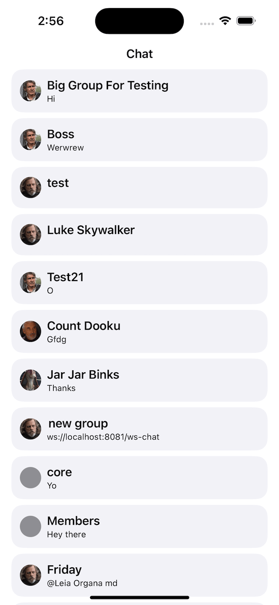

There are different variations on how to present a list of channels. Our `ChatChannelListView` component provides a lot of customization options to support those variations.

However, in some cases, you would need to build a completely custom UI. In this cookbook, we will build a simple channel list view, without using our UI components, only the low-level client state.



## Channels State

We will expose the channels state with a view model, for example `CustomChannelListViewModel`. The view model will be an observable object, and it will implement the `ChatChannelListControllerDelegate`.

We will keep the channels as a published variable in the view model.

```swift
@Published public var channels = LazyCachedMapCollection<ChatChannel>()
```

The `ChatChannelListControllerDelegate` has a method called `controller:didChangeChannels`, that sends updates when the channels are updated.

```swift
public func controller(
    _ controller: ChatChannelListController,
    didChangeChannels changes: [ListChange<ChatChannel>]
) {
    channels = controller.channels
}
```

In order to support pagination, we will use the `ChatChannelListController`'s method `loadNextChannels`. We can call this method when the channel list items appear on the screen.

```swift
public func checkForChannels(index: Int) {
    if index < (controller?.channels.count ?? 0) - 15 {
        return
    }

    if !loadingNextChannels {
        loadingNextChannels = true
        controller?.loadNextChannels(limit: 30) { [weak self] _ in
            guard let self = self else { return }
            self.loadingNextChannels = false
        }
    }
}
```

Those are the most important bits for fetching and listening to the channels data. For reference, here's the full implementation of the view model.

```swift
import StreamChat
import StreamChatSwiftUI
import SwiftUI

class CustomChannelListViewModel: ObservableObject, ChatChannelListControllerDelegate {
    
    @Injected(\.chatClient) var chatClient
    
    @Published public var channels = LazyCachedMapCollection<ChatChannel>()
    
    public private(set) var loadingNextChannels: Bool = false
    
    private var controller: ChatChannelListController?
    private var timer: Timer?
    
    init() {
        setupChannelListController()
    }
    
    public func controller(
        _ controller: ChatChannelListController,
        didChangeChannels changes: [ListChange<ChatChannel>]
    ) {
        channels = controller.channels
    }
    
    public func checkForChannels(index: Int) {
        if index < (controller?.channels.count ?? 0) - 15 {
            return
        }

        if !loadingNextChannels {
            loadingNextChannels = true
            controller?.loadNextChannels(limit: 30) { [weak self] _ in
                guard let self = self else { return }
                self.loadingNextChannels = false
            }
        }
    }
    
    func imageURL(for channel: ChatChannel) -> URL? {
        channel.lastActiveMembers.first(where: { member in
            member.id != chatClient.currentUserId
        })?.imageURL
    }
    
    //MARK: - private
    
    private func updateChannels() {
        channels = controller?.channels ?? LazyCachedMapCollection<ChatChannel>()
    }
    
    private func setupChannelListController() {
        guard let currentUserId = chatClient.currentUserId else {
            observeClientIdChange()
            return
        }
        controller = chatClient.channelListController(
            query: .init(filter: .containMembers(userIds: [currentUserId]))
        )
        
        controller?.delegate = self

        updateChannels()

        controller?.synchronize { [weak self] error in
            guard let self = self else { return }
            if error != nil {
                print("handle error here")
            } else {
                self.updateChannels()
            }
        }
    }
    
    private func observeClientIdChange() {
        timer?.invalidate()
        timer = Timer.scheduledTimer(withTimeInterval: 1.0, repeats: true, block: { [weak self] _ in
            guard let self = self else { return }
            if self.chatClient.currentUserId != nil {
                self.timer?.invalidate()
                self.timer = nil
                self.setupChannelListController()
            }
        })
    }
}
```

## Channel List View

Next, let's implement the channel list view. We will call it `CustomChannelListView`.

Since the list of channels is exposed via a view model, you can easily build any UI you prefer with SwiftUI. Our implementation is a pretty simple one.

Here's the code.

```swift
import StreamChat
import StreamChatSwiftUI
import SwiftUI

struct CustomChannelListView: View {
    
    @Injected(\.chatClient) var chatClient
    
    @StateObject var viewModel = CustomChannelListViewModel()
    
    var body: some View {
        NavigationStack {
            ScrollView {
                LazyVStack {
                    ForEach(viewModel.channels) { channel in
                        NavigationLink {
                            ChatChannelView(
                                channelController: chatClient.channelController(for: channel.cid)
                            )
                        } label: {
                            HStack {
                                if let imageURL = viewModel.imageURL(for: channel) {
                                    StreamLazyImage(url: imageURL)
                                } else {
                                    Circle()
                                        .fill(Color.gray)
                                        .frame(width: 30)
                                }
                                VStack(alignment: .leading) {
                                    Text(DefaultChatChannelNamer()(channel, chatClient.currentUserId) ?? "")
                                        .lineLimit(1)
                                        .bold()
                                    Text("\(channel.previewMessage?.text ?? "No messages")")
                                        .font(.caption)
                                }
                                Spacer()
                            }
                            .padding(.all, 12)
                            .foregroundColor(.primary)
                            .background(Color(uiColor: .secondarySystemBackground))
                            .cornerRadius(16)
                            .padding(.horizontal)
                        }
                        .onAppear {
                            if let index = viewModel.channels.firstIndex(where: { chatChannel in
                                chatChannel.id == channel.id
                            }) {
                                viewModel.checkForChannels(index: index)
                            }
                        }
                    }
                }
            }
            .navigationTitle("Chat")
            .navigationBarTitleDisplayMode(.inline)
        }
    }
}
```

The most interesting part here is the navigation. On tap of a channel item, we want to show the selected channel.

For this reason, we are using a `NavigationLink`. Its destination is a `ChatChannelView`, which is the default channel view component from the SDK. However, you can also implement your own implementation here.

For loading new channels, we rely on the `onAppear` modifier on each channel list item. Whenever a new entry appears on screen, we find its index and check if we should load more channels by calling the view model's `checkForChannels` method.

With that, you can use the custom channel list anywhere in your code.

```swift
    var body: some Scene {
        WindowGroup {
            CustomChannelListView()
        }
    }
```

Make sure that you have previously created and connected the `StreamChat` client, as described in the [getting started](../getting-started.md) section.

## Summary

In this cookbook, you learnt how to implement a completely custom channel list view. For customizations of the existing component, please check the following [page](../channel-list-components/helper-views.md).

You can learn more about the channel list state exposed by the low-level client [here](../../client/controllers/channels.md).

As a next step, you can also explore other parts of our cookbook, where we build many interesting customizations. Furthermore, for a complete social experience, we recommend looking into our [Video SDK](https://getstream.io/video/docs/ios/).
