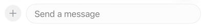
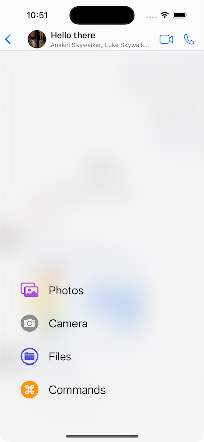
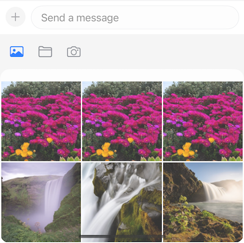

The message composer is an important part of a good messaging experience. It provides users different ways to communicate, whether that's text, media or custom attachments.

In this section, we will re-create Apple's composer, introduced in iOS 17, and integrate it with the `StreamChat` SDK.



At first look, the composer is pretty standard - just a plus button and a text input field. However, when you press the plus icon, a nice animated popup with the different attachment options appears.



Let's see how we can build this, while reusing some of our standard UI components.

## Custom Composer View

To get started, create a new file called `AppleMessageComposerView`, and add the following initial code.

```swift
import StreamChat
import StreamChatSwiftUI
import SwiftUI

struct AppleMessageComposerView<Factory: ViewFactory>: View, KeyboardReadable {}
```

The `AppleMessageComposerView` is a SwiftUI view that's generic over a `ViewFactory` protocol, for providing customizations of the lower-level building blocks. It also implements our `KeyboardReadable` protocol, which provides useful keyboard handling out of the box.

Next, let's define few properties that we are going to use in our implementation.

```swift
    @Injected(\.colors) private var colors
    @Injected(\.fonts) private var fonts
        
    // Initial popup size, before the keyboard is shown.
    @State private var popupSize: CGFloat = 350
    @State private var composerHeight: CGFloat = 0
    @State private var keyboardShown = false

    private var factory: Factory
    private var channelConfig: ChannelConfig?
    
    @State private var state: AnimationState = .initial
    @State private var listScale: CGFloat = 0
    
    @StateObject var viewModel: MessageComposerViewModel

    var onMessageSent: () -> Void
```

The `@Injected` properties provide access to `StreamChat`'s SDK specific objects, such as fonts and colors.
The `@State` properties track the view state, such as the size of the composer popup and whether it's expanded or not. We also create a `MessageComposerViewModel` view model that handles the entered text, validation, presentation logic, as well as the sending of a message.

Let's add the `init` method next.

```swift
public init(
    viewFactory: Factory,
    viewModel: MessageComposerViewModel? = nil,
    channelController: ChatChannelController,
    onMessageSent: @escaping () -> Void
) {
    factory = viewFactory
    channelConfig = channelController.channel?.config
    let vm = viewModel ?? ViewModelsFactory.makeMessageComposerViewModel(
        with: channelController,
        messageController: nil
    )
    _viewModel = StateObject(
        wrappedValue: vm
    )
    self.onMessageSent = onMessageSent
}
```

Now, we can implement the `body` of the SwiftUI view. The composer's visible part consists of a horizontal stack with a plus button and a text input field. When a certain attachment picker is selected, the composer expands and moves up, providing users with the possibility to pick the attachment they need.



This means that we need to use a vertical stack as a container, where we would hide the picker in a compacted state and move it up with an animation when needed.

Therefore, the key components of the composer are the plus button, the input view, and the bottom attachment picker. Here's how this looks like in code.

```swift
var body: some View {
    VStack(spacing: 0) {
        HStack(alignment: .bottom) {
            plusButton

            ComposerInputView(
                factory: DefaultViewFactory.shared,
                text: $viewModel.text,
                selectedRangeLocation: $viewModel.selectedRangeLocation,
                command: $viewModel.composerCommand,
                addedAssets: viewModel.addedAssets,
                addedFileURLs: viewModel.addedFileURLs,
                addedCustomAttachments: viewModel.addedCustomAttachments,
                quotedMessage: .constant(nil),
                maxMessageLength: channelConfig?.maxMessageLength,
                cooldownDuration: viewModel.cooldownDuration,
                onCustomAttachmentTap: viewModel.customAttachmentTapped(_:),
                removeAttachmentWithId: viewModel.removeAttachment(with:)
            )
            .overlay(
                viewModel.sendButtonEnabled ? sendButton : nil
            )
        }
        .padding(.all, 8)

        factory.makeAttachmentPickerView(
            attachmentPickerState: $viewModel.pickerState,
            filePickerShown: $viewModel.filePickerShown,
            cameraPickerShown: $viewModel.cameraPickerShown,
            addedFileURLs: $viewModel.addedFileURLs,
            onPickerStateChange: viewModel.change(pickerState:),
            photoLibraryAssets: viewModel.imageAssets,
            onAssetTap: viewModel.imageTapped(_:),
            onCustomAttachmentTap: viewModel.customAttachmentTapped(_:),
            isAssetSelected: viewModel.isImageSelected(with:),
            addedCustomAttachments: viewModel.addedCustomAttachments,
            cameraImageAdded: viewModel.cameraImageAdded(_:),
            askForAssetsAccessPermissions: viewModel.askForPhotosPermission,
            isDisplayed: viewModel.overlayShown,
            height: viewModel.overlayShown ? popupSize : 0,
            popupHeight: popupSize
        )
    }
    .background(
        GeometryReader { proxy in
            let frame = proxy.frame(in: .local)
            let height = frame.height
            Color.clear.preference(key: HeightPreferenceKey.self, value: height)
        }
    )
    .onPreferenceChange(HeightPreferenceKey.self) { value in
        if let value = value, value != composerHeight {
            self.composerHeight = value
        }
    }
    .onReceive(keyboardWillChangePublisher) { visible in
        if visible && !keyboardShown {
            if viewModel.composerCommand == nil {
                withAnimation(.easeInOut(duration: 0.02)) {
                    viewModel.pickerTypeState = .expanded(.none)
                }
            }
        }
        keyboardShown = visible
    }
    .onReceive(keyboardHeight) { height in
        if height > 0 && height != popupSize {
            self.popupSize = height - bottomSafeArea
        }
    }
    .overlay(
        viewModel.showCommandsOverlay ?
            factory.makeCommandsContainerView(
                suggestions: viewModel.suggestions,
                handleCommand: { commandInfo in
                    viewModel.handleCommand(
                        for: $viewModel.text,
                        selectedRangeLocation: $viewModel.selectedRangeLocation,
                        command: $viewModel.composerCommand,
                        extraData: commandInfo
                    )
                }
            )
            .offset(y: -composerHeight)
            .animation(nil) : nil,
        alignment: .bottom
    )
    .modifier(factory.makeComposerViewModifier())
    .accessibilityElement(children: .contain)
    .overlay(
        ComposerActionsView(viewModel: viewModel, state: $state, listScale: $listScale)
            .offset(y: -(UIScreen.main.bounds.height - composerHeight) / 2 + 80)
            .allowsHitTesting(state == .expanded)
    )
}
```

Additionally, there are few modifiers attached to the view, for reading the height of the popup, keyboard related actions, as well as showing the commands overlay.

What's interesting for us is the last `overlay` modifier, which allows us to show the animated composer actions view.


Next, let's see how we can build this view.

## Composer Actions View

First, create a new struct called `ComposerAction`, with the following properties. 

```swift
struct ComposerAction: Equatable, Identifiable {
    static func == (lhs: ComposerAction, rhs: ComposerAction) -> Bool {
        lhs.id == rhs.id
    }
    
    var imageName: String
    var text: String
    var color: Color
    var action: () -> Void
    var id: String {
        "\(imageName)-\(text)"
    }
}
```

This struct will provide information about the items shown in the list of actions.

Next, we can create the `ComposerActionsView`. The composer actions view consists of a blurred background, and a list of different composer actions. Additionally, it contains the bouncy animation, which animates the scaling of the list, as well as its offset.

```swift
struct ComposerActionsView: View {
    
    @ObservedObject var viewModel: MessageComposerViewModel
    
    @State var composerActions: [ComposerAction] = []
    
    @Binding var state: AnimationState
    @Binding var listScale: CGFloat
    
    var body: some View {
        ZStack(alignment: .bottomLeading) {
            Color.white.opacity(state == .initial ? 0.2 : 0.5)
            
            BlurredBackground()
                .opacity(state == .initial ? 0.0 : 1.0)
            
            VStack(alignment: .leading, spacing: 30) {
                ForEach(composerActions) { composerAction in
                    Button {
                        withAnimation {
                            state = .initial
                            composerAction.action()
                        }
                    } label: {
                        ComposerActionView(composerAction: composerAction)
                    }
                }
            }
            .padding(.leading, 40)
            .padding(.bottom, 84)
            .scaleEffect(
                CGSize(
                    width: state == .initial ? 0 : 1,
                    height: state == .initial ? 0 : 1
                )
            )
            .offset(
                x: state == .initial ? -75 : 0,
                y: state == .initial ? 90 : 0
            )
        }
        .onAppear {
            setupComposerActions()
        }
        .edgesIgnoringSafeArea(.all)
        .onTapGesture {
            withAnimation(.bouncy) {
                switch state {
                case .initial:
                    listScale = 1
                    state = .expanded
                case .expanded:
                    listScale = 0
                    state = .initial
                }
            }
        }
    }
}
```

In the `onAppear` modifier, we are calling a method `setupComposerActions`, which creates the items that will be presented. Let's see this method next.

```swift
private func setupComposerActions() {
    let imageAction: () -> Void = {
        viewModel.pickerTypeState = .expanded(.media)
        viewModel.pickerState = .photos
    }
    let commandsAction: () -> Void = {
        viewModel.pickerTypeState = .expanded(.instantCommands)
    }
    let filesAction: () -> Void = {
        viewModel.pickerTypeState = .expanded(.media)
        viewModel.pickerState = .files
    }
    let cameraAction: () -> Void = {
        viewModel.pickerTypeState = .expanded(.media)
        viewModel.pickerState = .camera
    }

    composerActions = [
        ComposerAction(
            imageName: "photo.on.rectangle",
            text: "Photos",
            color: .purple,
            action: imageAction
        ),
        ComposerAction(
            imageName: "camera.circle.fill",
            text: "Camera",
            color: .gray,
            action: cameraAction
        ),
        ComposerAction(
            imageName: "folder.circle",
            text: "Files",
            color: .indigo,
            action: filesAction
        ),
        ComposerAction(
            imageName: "command.circle.fill",
            text: "Commands",
            color: .orange,
            action: commandsAction
        )
    ]
}
```

The actions provided here, manipulate the state of the picker state and the picker type, based on the user's selection.

Next, let's see the implementation of a `ComposerActionView`, that presents a `composerAction`.

```swift
struct ComposerActionView: View {
    
    private let imageSize: CGFloat = 34
    
    var composerAction: ComposerAction
    
    var body: some View {
        HStack(spacing: 20) {
            Image(systemName: composerAction.imageName)
                .resizable()
                .scaledToFit()
                .foregroundColor(composerAction.color)
                .frame(width: imageSize, height: imageSize)
            
            Text(composerAction.text)
                .foregroundColor(.primary)
                .font(.title2)
        }
    }
}
```

Additionally, we need to add few utility types, that will help us achieve our desired UI, such as the blurred background.

```swift
struct BlurredBackground: View {
    var body: some View {
        Color.clear
            .frame(
                width: UIScreen.main.bounds.width,
                height: UIScreen.main.bounds.height
            )
            .background(
                .ultraThinMaterial,
                in: RoundedRectangle(cornerRadius: 16.0)
            )
    }
}

struct HeightPreferenceKey: PreferenceKey {
    static var defaultValue: CGFloat? = nil

    static func reduce(value: inout CGFloat?, nextValue: () -> CGFloat?) {
        value = value ?? nextValue()
    }
}

enum AnimationState {
    case initial, expanded
}
```

## Integrating the Composer

Our final step is providing the newly created composer view to the SwiftUI SDK. For this, create a new file called `CustomViewFactory` and implement the `makeMessageComposerViewType` from the `ViewFactory` protocol.

```swift
import StreamChat
import StreamChatSwiftUI
import SwiftUI

class CustomViewFactory: ViewFactory {

    @Injected(\.chatClient) public var chatClient
    
    func makeMessageComposerViewType(
        with channelController: ChatChannelController,
        messageController: ChatMessageController?,
        quotedMessage: Binding<ChatMessage?>,
        editedMessage: Binding<ChatMessage?>,
        onMessageSent: @escaping () -> Void
    ) -> some View {
        AppleMessageComposerView(
            viewFactory: self,
            channelController: channelController,
            onMessageSent: onMessageSent
        )
    }
}
```

Depending on which components you use, you should provide this view factory instead of the default one. For example, if you are using a `ChatChannelListView`, you can pass it in the creation process.

```swift
var body: some Scene {
    WindowGroup {
        ChatChannelListView(viewFactory: CustomViewFactory())
    }
}
```

If you run your app now, you should see the updated composer, as shown on the screenshot.


## Summary

In this cookbook, you learnt how to implement your own version of the message composer view, using Apple's composer view as an inspiration. We have also shown you how to integrate it with our SwiftUI SDK.

As a next step, you can explore other parts of our cookbook, where we build many interesting customizations. Furthermore, for a complete social experience, we recommend looking into our [Video SDK](https://getstream.io/video/docs/ios/).