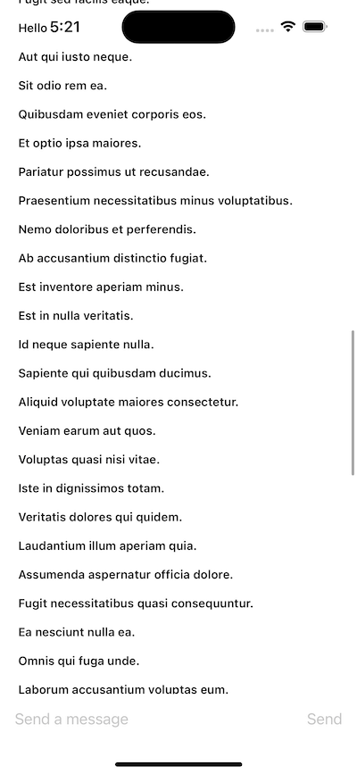

The beauty of SwiftUI is that it's easy to mix and match components. You can use the built-in components as a way to quickly build in-app chat. 
Stream exposes a full [low level client](https://getstream.io/chat/docs/ios-swift/?language=swift) with offline storage support. So it's also easy to build any UI component on top of that.

To showcase the usage of our low-level client, we will build a simple livestream chat view, similar to Twitch. 



The state for a given channel is available via the [ChatChannelController](https://getstream.io/chat/docs/sdk/ios/client/controllers/channels/#channelcontroller). 
You can create a channel controller using the `ChatClient` for a given channel id. In this example, for simplicity we will use a hardcoded channel id.
If you want to listen to the changes of the channel controller (for example messages changes), you need to implement methods from the `ChatChannelControllerDelegate` or listen to the Combine publisher changes.

To make the usage easier from SwiftUI views, we will create a view model that will manage the state and listen for the channel controller state updates.

```swift
import Combine
import StreamChat

class LivestreamChatViewModel: ObservableObject, ChatChannelControllerDelegate {
    
    @Published var messages = LazyCachedMapCollection<ChatMessage>()
    @Published var text = ""
    
    private let channelController: ChatChannelController
    private var loadingPreviousMessages = false
    private var cancellables = Set<AnyCancellable>()
    
    init(chatClient: ChatClient) {
        channelController = chatClient.channelController(
            for: try! ChannelId(cid: "messaging:5A9427AD-E")
        )
        channelController.delegate = self
        channelController.synchronize { [weak self] error in
            guard let self else { return }
            self.messages = self.channelController.messages
        }
        channelController.messagesChangesPublisher.sink { [weak self] changes in
            guard let self else { return }
            self.messages = self.channelController.messages
        }
        .store(in: &cancellables)
    }
    
    func sendMessage() {
        channelController.createNewMessage(text: text)
        text = ""
    }
    
    func handleMessageAppear(index: Int) {
        if index >= messages.count {
            return
        }
        
        checkForPreviousMessages(index: index)
    }
    
    //MARK: - private
    
    private func checkForPreviousMessages(index: Int) {
        if index < messages.count - 25 {
            return
        }

        if !loadingPreviousMessages {
            loadingPreviousMessages = true
            channelController.loadPreviousMessages(
                before: nil,
                limit: 50,
                completion: { [weak self] _ in
                    guard let self = self else { return }
                    self.loadingPreviousMessages = false
                }
            )
        }
    }
}
``` 

The `LivestreamChatViewModel` in the code above, provides the list of messages, by listening to the updates of the `messagesChangesPublisher` from the `channelController`. You can find more details about the available Combine publishers [here](https://getstream.io/chat/docs/sdk/ios/combine/channels/).
Alternatively, you can also implement the delegate method `didUpdateMessages` to listen to these changes.

The `LivestreamChatViewModel` also provides a basic pagination support, by loading the previous messages when a message near the end of the current page appears on the screen. 
The channel controller's `loadPreviousMessages` is responsible for loading the previous messages.

We also provide a way for the users to send a message. 
For simplicity, we only allow text messages in our example. 
However, you can easily provide more types of attachments, by either using our UI building blocks or creating your own views. 
The `channelController`'s method `createNewMessage` needs to be used for sending messages.

Next, let's see how the UI implementation would look like:

```swift
import StreamChat
import SwiftUI

struct LivestreamChatView: View {
    
    @StateObject var viewModel: LivestreamChatViewModel
        
    init(chatClient: ChatClient) {
        let viewModel = LivestreamChatViewModel(chatClient: chatClient)
        _viewModel = StateObject(wrappedValue: viewModel)
    }
    
    var body: some View {
        ZStack {
            ScrollView {
                LazyVStack {
                    ForEach(viewModel.messages) { message in
                        if !message.text.isEmpty {
                            HStack {
                                Text(message.text)
                                    .font(.footnote)
                                    .bold()
                                Spacer()
                            }
                            .padding(.all, 4)
                            .onAppear {
                                let index = viewModel.messages.firstIndex { msg in
                                    msg.id == message.id
                                }
                                guard let index else { return }
                                viewModel.handleMessageAppear(index: index)
                            }
                        }
                    }
                }
                .padding()
            }
            
            VStack {
                Spacer()
                HStack {
                    TextField("Send a message", text: $viewModel.text)
                    Spacer()
                    Button(action: {
                        viewModel.sendMessage()
                    }, label: {
                        Text("Send")
                    })
                    .disabled(viewModel.text.isEmpty)
                }
                .padding()
                .background(Color(uiColor: .systemBackground))
            }
        }
    }
}
```

We are using a `ScrollView` with a `LazyVStack` to iterate through the messages and present the text. 
At the bottom, we also provide a simplified composer that consists of a text field and a button to send the message.

Finally, we just need to use the `LivestreamChatView` in our app, instead of the `ChatChannelListView`:

```swift
var body: some Scene {
    WindowGroup {
        LivestreamChatView(chatClient: chatClient)
    }
}
```

If you run the app now, you should see the following UI:


This example shows how easy it is to build your own message list view, if you need a more custom messaging experience.