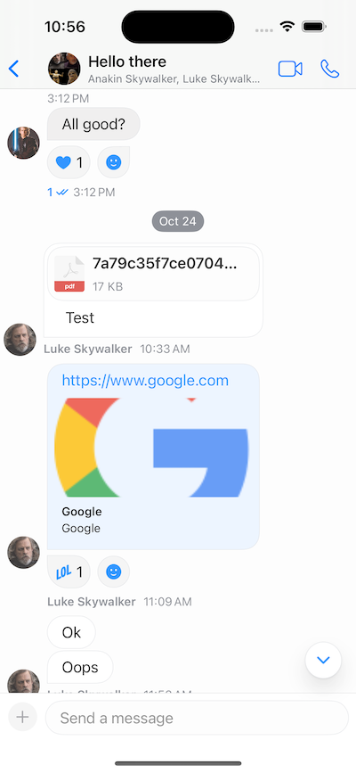

Some apps, like Slack, have all the messages aligned on the left - they don't put the current user's messages on the right.



Stream's SwiftUI chat SDK can also support this case, with a simple configuration change.

The change needs to be done in the `MessageListConfig`, more specifically the `messageListAlignment`, which needs to be set to `.leftAligned`.

```swift
let utils = Utils(
    messageListConfig: MessageListConfig(messageListAlignment: .leftAligned)
)
let streamChat = StreamChat(chatClient: chatClient, utils: utils)
```

That code will align all messages on the left. 

Additionally, some apps cover the full available width for longer messages. You can control this by the `spacerWidth` closure in the `MessageDisplayOptions`.

The `spacerWidth` tells the message list how much space of the available width should be left empty. The default value is quarter of the available width.

You can change this to a small value (or 0), if you want to cover as much as possible of the available width.

Here's an example on how to accomplish that.

```swift
let messageDisplayOptions = MessageDisplayOptions(spacerWidth: { _ in
    return 20
})
let utils = Utils(
    messageListConfig: MessageListConfig(
        messageDisplayOptions: messageDisplayOptions,
        messageListAlignment: .leftAligned
    )
)
let streamChat = StreamChat(chatClient: chatClient, utils: utils)
```

The end result will look like this.

