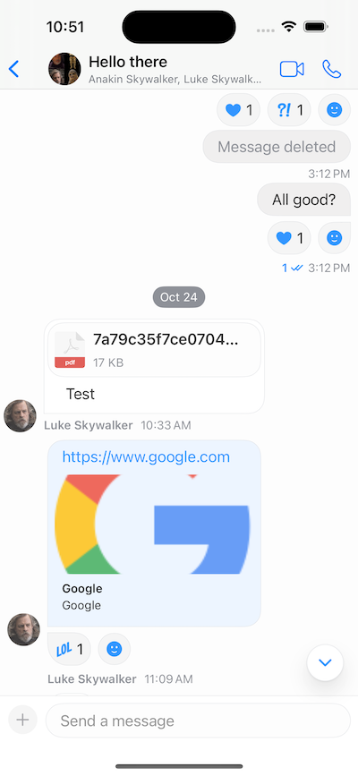
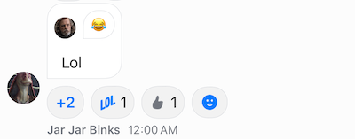

In the StreamChat product, by default, the reactions are shown above a message, similarly to the Apple Messages app.

However, some apps place them at the bottom, such as Slack and WhatsApp. Luckily, the SDK provides a configuration to move the reactions below the message, like the mentioned apps.



## Reactions Placement

Configuring the SDK to use the bottom placement of reactions can be done with the following code.

```swift
let displayOptions = MessageDisplayOptions(reactionsPlacement: .bottom)
let utils = Utils(
    messageListConfig: MessageListConfig(messageDisplayOptions: displayOptions)
)
let streamChat = StreamChat(chatClient: chatClient, utils: utils)
```

Additionally, you can swap the reactions view with your own implementation. To do this, you need to implement the `makeBottomReactionsView` in the `ViewFactory`.

```swift
public func makeBottomReactionsView(
    message: ChatMessage,
    showsAllInfo: Bool,
    onTap: @escaping () -> (),
    onLongPress: @escaping () -> ()
) -> some View {
    CustomReactionsView(
        message: message,
        showsAllInfo: showsAllInfo,
        onTap: onTap,
        onLongPress: onLongPress
    )
}
```

## Custom Reactions View

For example, some apps show the reactions only in one row. If the number of reactions is larger and it doesn't fit in the row, there's a more button that shows all reactions.



Let's create a new file called `CustomReactionsView`, and add the following initial contents.

```swift
import StreamChat
import StreamChatSwiftUI
import SwiftUI

struct CustomBottomReactionsView: View {
    
    @Injected(\.chatClient) var chatClient
    @Injected(\.utils) var utils
    @Injected(\.colors) var colors
    @Injected(\.images) var images
    
    var showsAllInfo: Bool
    var reactionsPerRow: Int
    var onTap: () -> ()
    var onLongPress: () -> ()
    
    @StateObject var viewModel: ReactionsOverlayViewModel
    
    private let cornerRadius: CGFloat = 12
    private let reactionSize: CGFloat = 20

    init(
        message: ChatMessage,
        showsAllInfo: Bool,
        reactionsPerRow: Int = 4,
        onTap: @escaping () -> (),
        onLongPress: @escaping () -> ()
    ) {
        self.showsAllInfo = showsAllInfo
        self.onTap = onTap
        self.reactionsPerRow = reactionsPerRow
        self.onLongPress = onLongPress
        _viewModel = StateObject(wrappedValue: ReactionsOverlayViewModel(message: message))
    }
}
```

With the `@Injected` properties, we provide access to the fonts, colors, images and the chat client. Then, we also add the values passed from the factory method, as well as we create a `ReactionsOverlayViewModel` that handles the business logic for adding and removing reactions.

Next, let's implement the `body` of the SwiftUI view.

```swift
var body: some View {
    if reactions.count > 2 {
        HStack {
            let firstThree = Array(reactions[0..<2])
            let moreButtonCount = reactions.count - firstThree.count
            content(for: firstThree, moreButtonCount: moreButtonCount)
        }
    } else {
        HStack {
            content(for: reactions)
        }
    }
}

private var message: ChatMessage {
    viewModel.message
}

private var reactions: [MessageReactionType] {
    message.reactionScores.keys.filter { reactionType in
        (message.reactionScores[reactionType] ?? 0) > 0
    }
    .sorted(by: utils.sortReactions)
}
```

In the code above, we check if the number of reactions exceeds the allowed number (2 in this case). If yes, we compute the difference, and we pass it to our `content` method that creates the view. Otherwise, we just call the `content` method, wrapped in `HStack`.

Next, let's see the `content` implementation.

```swift
private func content(
    for reactions: [MessageReactionType],
    moreButtonCount: Int? = nil
) -> some View {
    Group {
        if let moreButtonCount {
            Button(action: {
                onLongPress()
            }, label: {
                Text("+\(moreButtonCount)")
                    .bold()
            })
            .padding(.all, 8)
            .padding(.horizontal, 2)
            .modifier(
                BubbleModifier(
                    corners: .allCorners,
                    backgroundColors: [Color(colors.background1)],
                    cornerRadius: cornerRadius
                )
            )
        }
        
        ForEach(reactions) { reaction in
            if let image = icon(for: reaction, useLargeIcons: false) {
                HStack(spacing: 4) {
                    ReactionIcon(
                        icon: image,
                        color: color(
                            for: reaction,
                            userReactionIDs: userReactionIDs
                        )
                    )
                    .frame(width: reactionSize, height: reactionSize)
                    Text("\(count(for: reaction))")
                }
                .padding(.all, 8)
                .background(Color(colors.background1))
                .modifier(
                    BubbleModifier(
                        corners: .allCorners,
                        backgroundColors: [Color(colors.background1)],
                        cornerRadius: cornerRadius
                    )
                )
                .onTapGesture {
                    viewModel.reactionTapped(reaction)
                }
                .onLongPressGesture {
                    onLongPress()
                }
            }
        }
        
        Button(
            action: onTap,
            label: {
                Image(systemName: "face.smiling.inverse")
                    .padding(.all, 8)
                    .padding(.horizontal, 2)
                    .modifier(
                        BubbleModifier(
                            corners: .allCorners,
                            backgroundColors: [Color(colors.background1)],
                            cornerRadius: cornerRadius
                        )
                    )
            }
        )
    }
}
```

In the code above, we optionally add the "more" button, depending on whether the number of allowed reactions is exceeded. 

Then, we iterate through the reactions, and we display them using the `ReactionIcon` component from our UI SDK and the `BubbleModifier`. 

Finally, we add the button for adding additional reactions.

Additionally, we have few more computed variables that are used in the code above, that you should add in the `CustomBottomReactionsView`.

```swift
private var userReactionIDs: Set<MessageReactionType> {
    Set(message.currentUserReactions.map(\.type))
}

private func count(for reaction: MessageReactionType) -> Int {
    message.reactionScores[reaction] ?? 0
}

func icon(for reaction: MessageReactionType, useLargeIcons: Bool) -> UIImage? {
    if useLargeIcons {
        return images.availableReactions[reaction]?.largeIcon
    } else {
        return images.availableReactions[reaction]?.smallIcon
    }
}

func color(for reaction: MessageReactionType, userReactionIDs: Set<MessageReactionType>) -> Color? {
    var colors = colors
    let containsUserReaction = userReactionIDs.contains(reaction)
    let color = containsUserReaction ? colors.reactionCurrentUserColor : colors.reactionOtherUserColor

    if let color = color {
        return Color(color)
    } else {
        return nil
    }
}
```

These are used for determining the icon, color and count of a specific reaction.

With that, you can now run the app and see the updated bottom reactions view.

## Custom Message Container View

If you need further customizations, you can also implement the `makeMessageContainerView` method and provide different layout for the whole message container.

```swift
public func makeMessageContainerView(
    channel: ChatChannel,
    message: ChatMessage,
    width: CGFloat?,
    showsAllInfo: Bool,
    isInThread: Bool,
    scrolledId: Binding<String?>,
    quotedMessage: Binding<ChatMessage?>,
    onLongPress: @escaping (MessageDisplayInfo) -> Void,
    isLast: Bool
) -> some View {
    CustomMessageContainerView(
        factory: self,
        channel: channel,
        message: message,
        width: width,
        showsAllInfo: showsAllInfo,
        isInThread: isInThread,
        isLast: isLast,
        scrolledId: scrolledId,
        quotedMessage: quotedMessage,
        onLongPress: onLongPress
    )
}
```

## Summary

In this section, we have shown you how to configure the SDK to use bottom reactions. 

Additionally, we have seen how you can implement your custom view for bottom reactions, as well as how to build your own message container view from scratch.

As a next step, you can explore other parts of our cookbook, where we build many interesting customizations. Furthermore, for a complete social experience, we recommend looking into our [Video SDK](https://getstream.io/video/docs/ios/).