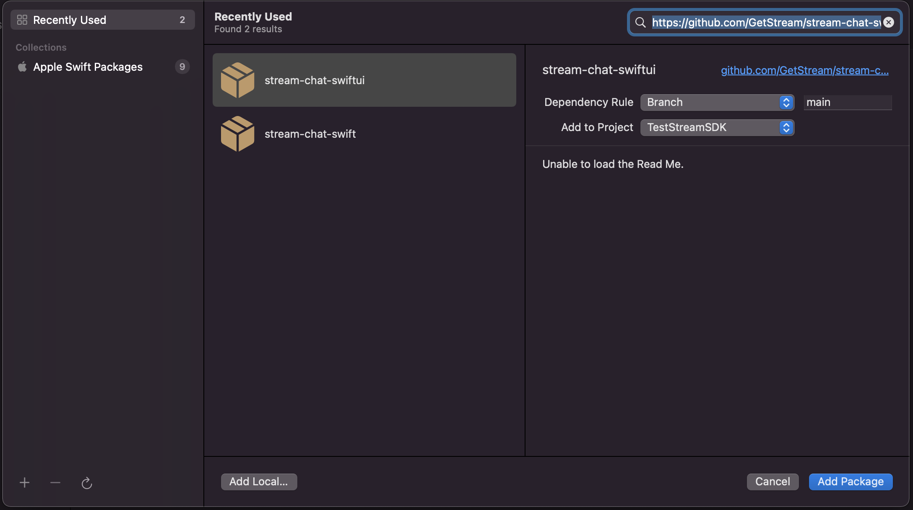
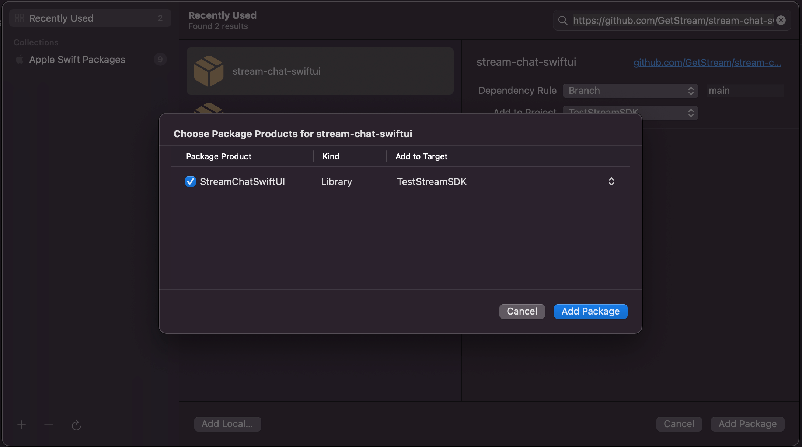

The SwiftUI SDK is built on top of the `StreamChat` framework, and it's a SwfitUI alternative to the `StreamChatUI` SDK. It's made entirely in SwiftUI, using declarative patterns that will be familiar to developers working with SwiftUI. In addition, the SDK includes an extensive set of performant and customizable UI components which allow you to get started quickly with little to no plumbing required.

## Architecture

The SwiftUI SDK offers three types of components:

- Screens - Easiest to integrate, but offer minor customizations, like branding and text changes.
- Stateful components - Offer more customization options and the possibility to inject custom views. Also relatively simple to integrate if the extension points are suitable for your chat use case. These components come with view models.
- Stateless components - These are the building blocks for the other two types of components. To use them, you would have to provide the state and data. Using these components only make sense if you want to implement a completely custom chat experience.

### Dependencies

This SDK tries to keep the list of external dependencies to a minimum, and these are the dependencies currently used:

#### StreamChatSwiftUI

- [Nuke](https://github.com/kean/Nuke) for loading images
- [NukeUI](https://github.com/kean/NukeUI) for SwiftUI async image loading  
- [SwiftyGif](https://github.com/kirualex/SwiftyGif) for high performance GIF rendering
- StreamChat the low-level client to Stream Chat API

#### StreamChat

- [Starscream](https://github.com/daltoniam/Starscream) to handle WebSocket connections

## Installation

To start integrating Stream Chat in your iOS app, install the `StreamChatSwiftUI` dependency using one of the following dependency managers.

### Install With Swift Package Manager

Open your `.xcodeproj`, select the option "Add Package Dependency" in File > Add Packages, and paste the URL: https://github.com/GetStream/stream-chat-swiftui.git.

Xcode will look for the repository and automatically select the latest version tagged. Press next, and Xcode will download the dependency. While the SDK is in beta mode, it's best to stay on the main branch as a dependency.



The repository contains 1 target - StreamChatSwiftUI.



After you press finish, it's done!

:::caution
Because StreamChat SDKs have to be distributed with its resources, the minimal Swift version requirement for this installation method is 5.3. If you need to support older Swift version, please install it using CocoaPods.
:::

### Install With CocoaPods

In your project's Podfile, add: `pod 'StreamChatSwiftUI', '~> 4.6.0'`. It should look similar to the snippet below.

```ruby
target 'MyProject' do
  # Comment the next line if you don't want to use dynamic frameworks
  use_frameworks!

  # Pods for MyProject
  pod 'StreamChatSwiftUI', '~> 4.6.0'
end
```

The StreamChatSwiftUI pod will automatically include the StreamChat dependency. If you want just the StreamChat dependency, without the SwiftUI components, add `pod 'StreamChat', '~> 4.0'` to your Podfile instead. It should look similar to the snippet below.

```ruby
target 'MyProject' do
  # Comment the next line if you don't want to use dynamic frameworks
  use_frameworks!

  # Pods for MyProject
  pod 'StreamChat', '~> 4.0.0'
end
```

Now that we’ve modified our Podfile, let’s go ahead and install the project dependencies via the terminal with a straightforward command:

```bash
pod install --repo-update
```

The above command will generate the **MyProject.xcworkspace** file automatically.

To stay up-to-date with our updates and get a detailed breakdown of what's new, subscribe to the releases of [getstream/stream-chat-swift](https://github.com/GetStream/stream-chat-swiftui/releases) by clicking the "watch" button. You can further tweak your watch preferences and subscribe only to the release events.
