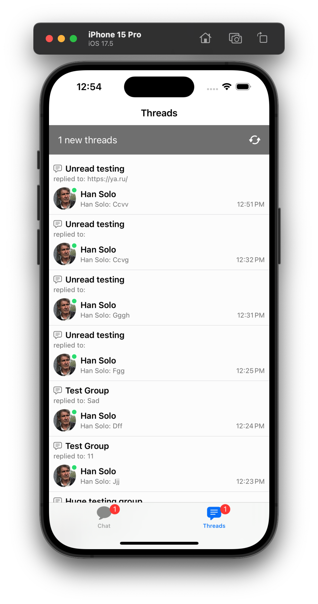
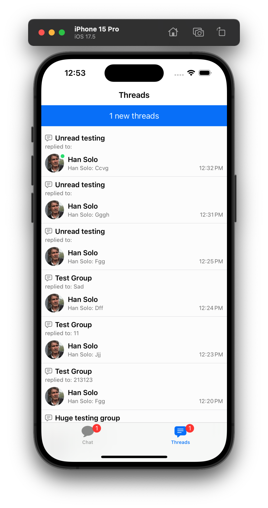
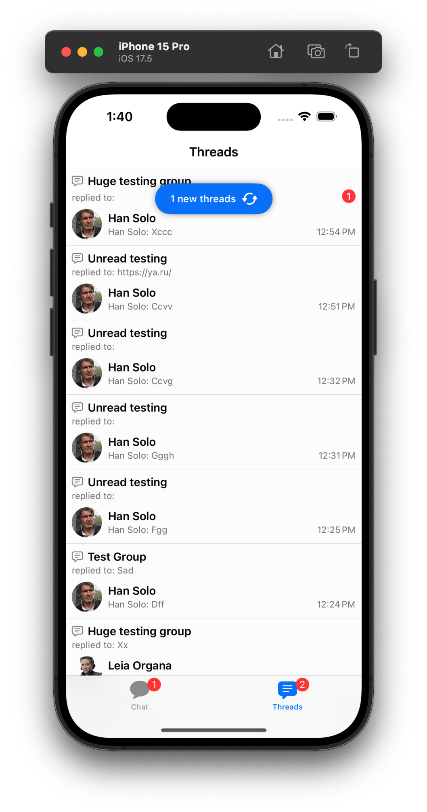

The `ChatThreadListView` is the UI component that displays the list of threads that the current user is participating in.

:::note
The Thread List component is available on the SwiftUI SDK since version [4.65.0](https://github.com/GetStream/stream-chat-swiftui/releases/tag/4.65.0).
:::

## Basic Usage

You can show this component in your app by creating a `ChatThreadListView` instance, here is a simple example of an app with two tabs, one for the channel list and another for the thread list:

```swift
struct ChatApp: App {
    var body: some Scene {
        WindowGroup {
            TabView {
                ChatChannelListView()
                    .tabItem { Label("Chat", systemImage: "message") }
                ChatThreadListView()
                    .tabItem { Label("Threads", systemImage: "text.bubble") }
            }
        }
    }
}
```

The `ChatThreadListView` has the following parameters:
- `viewFactory`: The view factory used for creating views used by the thread list.
- `viewModel`: The view model used for managing the thread list presentation logic. A default view model is provided if not specified.
- `threadListController`: The thread list controller managing the list of threads. A custom `ChatThreadListQuery` can be provided here to customize the list of threads.
- `title`: A custom title used as the navigation bar title.
- `embedInNavigationView`: A boolean indicating whether to embed the view in a `NavigationView` or not. The default is `true`.

## Thread List Query

The `ThreadListQuery` is responsible to configure the list of threads that will be displayed in the `ChatThreadListController`. These are the available parameters:

- `watch`: A boolean indicating whether to watch for changes in the thread list or not.
- `limit`: The amount of threads fetched per page. The default is 20.
- `replyLimit`: The amount of replies fetched per thread. The default is 3.
- `participantLimit`: The amount of participants fetched per thread. The default is 10.
- `next`: The pagination token from the previous response to fetch the next page.

All the parameters are customizable and you can change them according to your needs. The default values are a good compromise between performance and user experience.

If you are using the `ChatThreadListView` component, you don't need to worry about the `next` parameter, since pagination is handled for you. If not, you can use the `next` parameter from the previous response to fetch the next page of threads.

## UI Customization

You can customize the Thread List component by providing a custom `ViewFactory`. The view factory is responsible for creating the views used by the thread list. Below his all the views and modifiers related to the thread list that can be customized:
- `makeThreadDestination()` - Creates the destination view for the thread detail view. By default it shows the thread view.
- `makeThreadListItem(thread:threadDestination:selectedThread:)` - Creates the view for each thread in the list.
- `makeNoThreadsView()` - Creates the view displayed when the thread list is empty.
- `makeThreadsListErrorBannerView(onRefreshAction:)` - Creates the view displayed when an error occurs while loading the thread list.
- `makeThreadListLoadingView()` - Creates the view displayed while loading the thread list.
- `makeThreadListContainerViewModifier(viewModel:)` - Creates the view modifier applied to the thread list container view. It can be used to provide additional state or behavior to the thread list.
- `makeThreadListHeaderViewModifier(title:)` - Responsible for the navigation header of the thread list. It can be used to customize the navigation bar title, buttons, and other properties.
- `makeThreadListHeaderView(viewModel:)` - Creates the header view for the thread list. By default it shows a loading spinner if it is refetching the threads or shows a banner notifying that there are new threads to be fetched.
- `makeThreadListFooterView(viewModel:)` - Creates the footer view for the thread list. By default shows a loading spinner when loading more threads.
- `makeThreadListBackground()` - Creates the background view for the thread list.
- `makeThreadListItemBackground(thread:isSelected:)` - Creates the background view for each thread in the list.
- `makeThreadListDividerItem()` - Creates the divider view between threads in the list.

### Thread List Navigation Header

The navigation header of the thread list can be configured through the `makeThreadListHeaderViewModifier()` view factory method. Here is sample example on how to change the header to a large title navigation style:

```swift
class AppFactory: ViewFactory {

    public static let shared = AppFactory()

    func makeThreadListHeaderViewModifier(title: String) -> some ViewModifier {
        ThreadListLargeTitleViewModifier(
            title: title
        )
    }
}

struct ThreadListLargeTitleViewModifier: ViewModifier {
    let title: String

    func body(content: Content) -> some View {
        content
            .navigationBarTitleDisplayMode(.large)
            .navigationTitle(title)
    }
}
```

As you can see, the customization is quite similar to the Channel List header modifier. If you need a more advanced customization, you can take a look at the [`ChannelListHeaderViewModifier`](../swiftui/channel-list-components/channel-list-header.md) customization.

### Thread List Header View

By default, the Thread List header view shows a loading spinner when re-fetching the threads or a banner when there are new threads to be fetched. You can customize this view by providing a custom implementation of `makeThreadListHeaderView()`.

As an example customization, lets keep the same loading spinner but change the header when there are new threads to be fetched:

```swift
struct CustomChatThreadListHeaderView: View {
    @Injected(\.colors) private var colors
    @Injected(\.images) private var images

    @ObservedObject private var viewModel: ChatThreadListViewModel

    init(
        viewModel: ChatThreadListViewModel
    ) {
        self.viewModel = viewModel
    }

    var body: some View {
        Group {
            if viewModel.isReloading {
                loadingView
            } else if viewModel.hasNewThreads {
                newThreadsBannerView
            } else {
                EmptyView()
            }
        }
    }

    var loadingView: some View {
        VStack {
            Spacer()
            ProgressView()
            Spacer()
        }
        .frame(height: 40)
    }

    var newThreadsBannerView: some View {
        HStack(alignment: .center) {
            Spacer()
            Text("\(viewModel.newThreadsCount) new threads")
                .foregroundColor(Color(colors.staticColorText))
            Spacer()
        }
        .padding(.all, 12)
        .background(colors.tintColor)
        .onTapGesture {
            viewModel.loadThreads()
        }
    }
}
```

Then, don't forget to provide the custom view in the view factory:
```swift
func makeThreadListHeaderView(viewModel: ChatThreadListViewModel) -> some View {
    CustomChatThreadListHeaderView(viewModel: viewModel)
}
```

**Result:**

| Before| After |
| ------------- | ------------- |
|  |  |

#### Advanced Customization

Let's imagine that you do not want the new threads banner to appear in the thread list header view, but instead you want to show a floating banner on the top of the thread list. You can do this by first, changing the `makeThreadListHeaderView()` method to return only the loading view when it is reloading, and then provide a custom `makeThreadListContainerViewModifier()` to add the floating banner on top of the thread list.

First, we change the thread list header view to only show the loading spinner:
```swift
struct CustomChatThreadListHeaderView: View {
    @ObservedObject private var viewModel: ChatThreadListViewModel

    init(
        viewModel: ChatThreadListViewModel
    ) {
        self.viewModel = viewModel
    }

    var body: some View {
        Group {
            if viewModel.isReloading {
                loadingView
            } else {
                EmptyView()
            }
        }
    }

    var loadingView: some View {
        VStack {
            Spacer()
            ProgressView()
            Spacer()
        }
        .frame(height: 40)
    }
}
```

Then, we provide a custom view modifier to add the floating banner on top of the thread list:
```swift
struct CustomChatThreadListContainerModifier: ViewModifier {
    @Injected(\.colors) private var colors
    @Injected(\.images) private var images

    @ObservedObject private var viewModel: ChatThreadListViewModel

    init(
        viewModel: ChatThreadListViewModel
    ) {
        self.viewModel = viewModel
    }

    func body(content: Content) -> some View {
        if viewModel.hasNewThreads && !viewModel.isReloading {
            ZStack(alignment: .top) {
                content
                newThreadsBannerView
            }
        } else {
            content
        }
    }

    var newThreadsBannerView: some View {
        VStack(alignment: .center) {
            HStack(alignment: .center) {
                Text("\(viewModel.newThreadsCount) new threads")
                    .font(.footnote.bold())
                    .foregroundColor(Color(colors.staticColorText))
                Image(uiImage: images.restart)
                    .customizable()
                    .frame(width: 20, height: 20)
                    .foregroundColor(Color(colors.staticColorText))
            }
            .frame(width: 140, height: 25)
            .padding(.all, 8)
            .background(colors.tintColor)
            .clipShape(.capsule)
            .shadow(radius: 4)
            .onTapGesture {
                viewModel.loadThreads()
            }
        }
        .padding(.top, 20)
    }
}
```

Make sure you set the custom view modifier in the view factory:
```swift
func makeThreadListContainerViewModifier(viewModel: ChatThreadListViewModel) -> some ViewModifier {
    CustomChatThreadListContainerModifier(viewModel: viewModel)
}
```

**Result:**

| Before| After |
| ------------- | ------------- |
|  |  |
