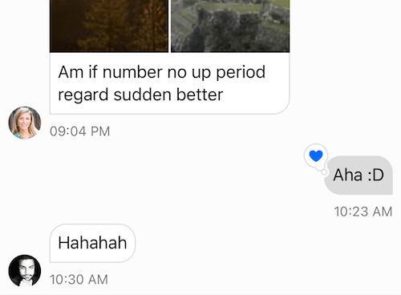
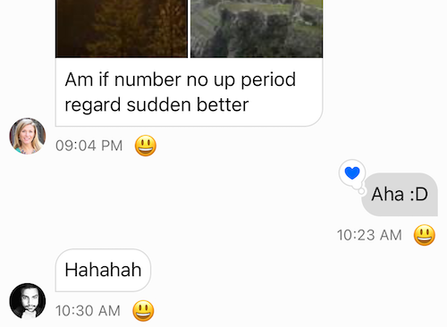
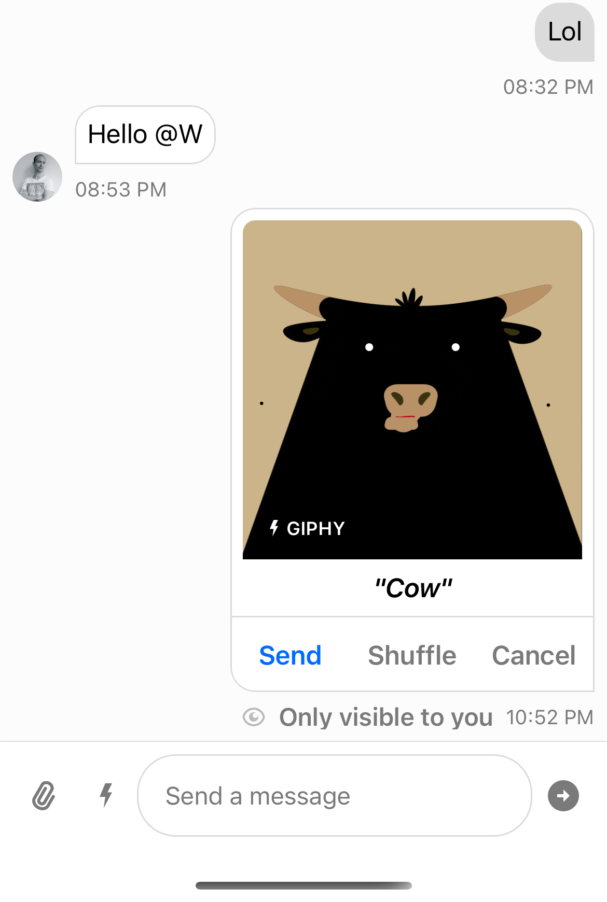
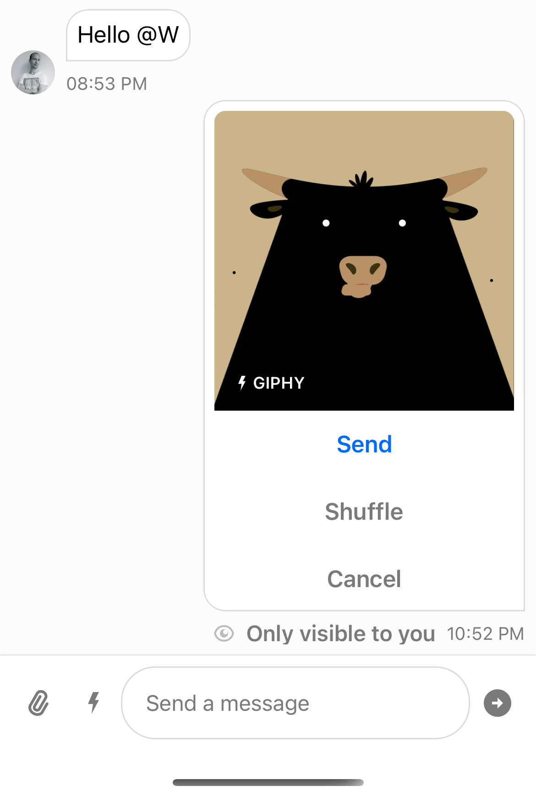
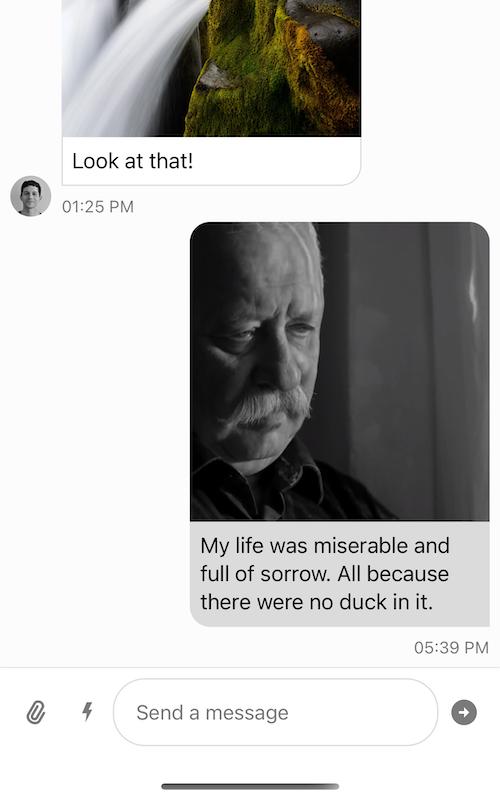
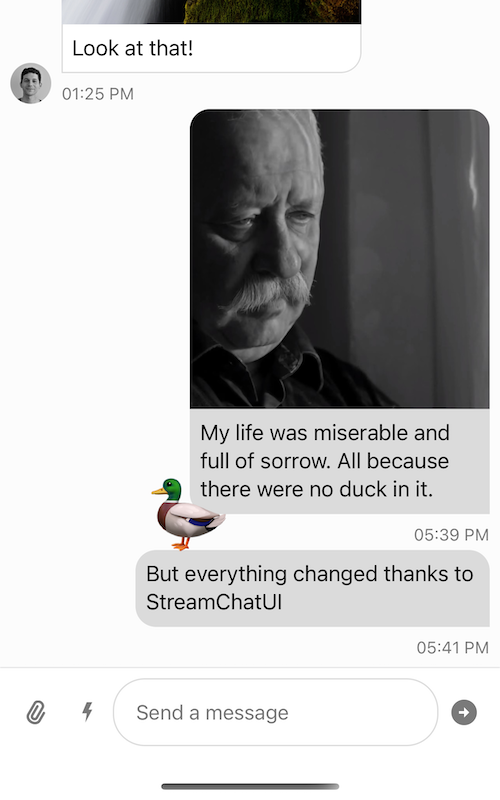

This cheat sheet provides additional information on how to use `StreamChatUI` SDK. It offers rich code snippets, detailed explanations, and commentary on the provided solutions.

Some features explained here are in beta release only and will be marked with "**🅱️ Beta only**"

#### Summary

* [Setup](#setup)
  * [Integrating with `StreamChat`](#integrating-with-streamchat)
    * [Displaying the list of Channels](#displaying-the-list-of-channels)
    * [Displaying a single chat (Channel)](#displaying-a-single-chat-channel)
* [Customizing Views](#customizing-views)
  * [View Lifecycle Methods](#view-lifecycle-methods)
  * [Changing Main Color](#changing-main-color)
  * [Changing Appearance](#changing-appearance)
  * [Changing Layout](#changing-layout)
    * [Subclassing Components](#subclassing-components)
      * [Adding a new subview to the UI component](#adding-a-new-subview-to-the-ui-component)
      * [Changing component subview's relative arrangement, or removing subview](#changing-component-subviews-relative-arrangement-or-removing-subview)
    * [Injecting Custom Subclass](#injecting-custom-subclass)


---

Didn't find what you were looking for? Open an [issue in our repo](https://github.com/GetStream/stream-chat-swift/issues) and suggest a new topic!

---

## Setup

### Integrating with `StreamChat`
`StreamChat` is the backbone powering the `StreamChatUI`. UI SDK offers flexible components able to display data provided by `StreamChat`.

In short, using `StreamChatUI` can be summarized as: create the UI component, inject the necessary `StreamChat` controller and use it. Below we will look at examples of displaying a list of chats (channels) and a single chat (channel) in detail.

#### Displaying the List of Channels
Displaying the list of Channels a user belongs to can be summarized in 5 steps:
- Create the `ChatClient` instance (outlined [here](https://github.com/GetStream/stream-chat-swift/wiki/Cheat-Sheet#creating-a-new-instance-of-chat-client))
- Set your user to login (outlined [here](https://github.com/GetStream/stream-chat-swift/wiki/Cheat-Sheet#setting-the-current-user))
- Create the `ChatChannelListVC`:
```swift
let channelList = ChatChannelListVC()
```
- Pass a `ChatChannelListController` instance to `channelList`:
```swift
let channelListController = chatClient
    .channelListController(
        query: ChannelListQuery(
            filter: .containMembers(
                userIds: [chatClient.currentUserId!]
            )
        )
    )
channelList.controller = channelListController
```
- Embed the `channelList` into a `UINavigationController` and present:
```swift
let navigationController = UINavigationController(rootViewController: channelList)
// Your logic for presenting `navigationController`, for example:
UIView.transition(with: view.window!,
                  duration: 0.5,
                  options: .transitionFlipFromLeft,
                  animations: {
                    self.view.window?.rootViewController = navigation
                  })
```
> **- 🅱️ Beta only -** Using a `UINavigationController` is not required but strongly recommended. If you don't want to use a Navigation Controller, you'd need to subclass `ChatChannelListRouter`, override `func openChat` and implement your logic for showing the chat. This is explained [here](#injecting-custom-subclass).

`ChatChannelListController` will take care of opening individual channels from this point.

To reiterate, the process is similar for nearly all UI components `StreamChatUI` SDK provides: create the component, inject the necessary `StreamChat` controller, and use it.

#### Displaying a Single Chat (Channel)
If we want to display a single chat, we can do so as:
- Create the `ChatClient` instance (outlined [here](https://github.com/GetStream/stream-chat-swift/wiki/Cheat-Sheet#creating-a-new-instance-of-chat-client))
- Set your user to login (outlined [here](https://github.com/GetStream/stream-chat-swift/wiki/Cheat-Sheet#setting-the-current-user))
- Create the `ChatChannelVC` instance:
```swift
let chatChannelVC = ChatChannelVC()
```
- Pass a `ChatChannelController` instance to `chatChannelVC`:
```swift
let channelController = chatClient.channelController(for: .init(type: .messaging, id: "general"))
chatChannelVC.channelController = channelController
```
> If the passed Channel does not exist on the backend, it will be created after VC is presented.
- Present `chatChannelVC`:
```swift
// Your logic for presenting `chatChannelVC`, for example:
show(chatChannelVC, sender: self)
```


## Customizing Views

### View Lifecycle Methods

**- 🅱️ Beta only -**

To make subclassing and customization simple, almost all view components in `StreamChatUI` has the following set of lifecycle methods:

```swift
/// Main point of customization for the view functionality. It's called zero or one time(s) during the view's
/// lifetime. Calling super implementation is required.
func setUp()

/// Main point of customization for the view appearance. It's called zero or one time(s) during the view's
/// lifetime. Calling super implementation is recommended but not needed as you might want to keep some of the default appearance.
func setUpAppearance()

/// Main point of customization for the view layout. It's called zero or one time(s) during the view's
/// lifetime. Calling super is recommended but not required if you provide a complete layout for all subviews.
func setUpLayout()

/// Main point of customization for the view appearance. It's called every time view's content changes.
/// Calling super is recommended but not required if you update the content of all subviews of the view.
func updateContent()
```

### Changing Main Color

If suitable, UI elements respect `UIView.tintColor` as the main (brand) color. The current `tintColor` depends on the tint color of the view hierarchy the UI element is presented on.

For example, by changing the tint color of the `UIWindow` of the app, you can easily modify the brand color of the whole chat UI:

```swift
class SceneDelegate: UIResponder, UIWindowSceneDelegate {
    func scene(_ scene: UIScene, willConnectTo session: UISceneSession, options connectionOptions: UIScene.ConnectionOptions) {
        guard let scene = scene as? UIWindowScene else { return }
        scene.windows.forEach { $0.tintColor = .systemPink }
    }
}
```

| default `tintColor`  | `tintColor = .systemPink` |
| ------------- | ------------- |
|   |   |

### Changing Layout

**- 🅱️ Beta only -**

It is possible to adjust/customize the layout of any UI component in the following ways:
* add a new subview
* remove the existed subview
* change spacing/margins/relative subviews arrangement

All the customizations can be done in **3** steps:
1. Create a subclass of the UI component
2. Override `setUpLayout` and apply custom layout
3. Inject created subclass via `UIConfig`

#### Subclassing Components

This whole section is **- 🅱️ Beta only -**

##### Adding a new Subview to the UI Component

This type of customization is especially useful when working with custom extra-data. Whenever custom extra data contains the information that should be shown inside the UI component, it can be subclassed and extended with the new subview.
> Read more about `ExtraData` [here](https://github.com/GetStream/stream-chat-swift/wiki/Cheat-Sheet#working-with-extra-data)

```swift
struct MyExtraData: ExtraDataTypes {
    struct Message: MessageExtraData {
        static let defaultValue = Self(authorWasInGoodMood: true)

        let authorWasInGoodMood: Bool
    }
}

// 1. Create custom UI component subclass.
class MyChatMessageMetadataView: _ChatMessageMetadataView<MyExtraData> {

    // 2. Declare new subview.
    let moodLabel = UILabel()

    // 3. Override `setUpLayout` and add the new subview to the hierarchy.
    override func setUpLayout() {
        // Use base implementation.
        super.setUpLayout()
        // But also extend it with the new subview.
        stack.addArrangedSubview(moodLabel)
    }

    // 4. Override `updateContent` and provide data for the new subview.
    override func updateContent() {
        // Use base implementation.
        super.updateContent()
        // But also provide data for the new subview.
        moodLabel.text = message?.authorWasInGoodMood == true ? "😃" : "😞"
    }
}
```

| Before  | After |
| ------------- | ------------- |
|   |   |

Once the custom subclass is implemented, it should be injected via `UIConfig` so it is used instead of base UI component.
> Refer to [Injecting Custom Subclass](#injecting-custom-subclass) chapter below for more information.

##### Changing Component Subview's Relative Arrangement, or Removing Subview

Imagine you are not satisfied with some UI component default layout and you're looking for how to exclude a particular subview or change relative subviews arrangement.

Let's see how it can be done by the `ChatMessageInteractiveAttachmentView` example:
| Default layout  | Updated layout |
| ------------- | ------------- |
|   |   |

As you see, in the `updated layout`:
* action buttons are arranged vertically;
* there is no GIF title label.

The code-snippet that does the job:
```swift
// 1. Create custom UI component subclass.
class InteractiveAttachmentView: ChatMessageInteractiveAttachmentView {
    // 2. Override `setUpLayout` and provide custom subviews arrangement.
    override open func setUpLayout() {
        // 3. Add only `preview` and `actionsStackView`.
        addSubview(preview)
        addSubview(actionsStackView)

        // 4. Make the action buttons stack vertical.
        actionsStackView.axis = .vertical

        // 5. Set up the necessary constraints.
        NSLayoutConstraint.activate([
            preview.leadingAnchor.constraint(equalTo: layoutMarginsGuide.leadingAnchor),
            preview.trailingAnchor.constraint(equalTo: layoutMarginsGuide.trailingAnchor),
            preview.topAnchor.constraint(equalTo: layoutMarginsGuide.topAnchor),
            preview.heightAnchor.constraint(equalTo: preview.widthAnchor),

            actionsStackView.topAnchor.constraint(equalTo: preview.bottomAnchor),
            actionsStackView.leadingAnchor.constraint(equalTo: leadingAnchor),
            actionsStackView.trailingAnchor.constraint(equalTo: trailingAnchor),
            actionsStackView.bottomAnchor.constraint(equalTo: bottomAnchor)
        ])
    }
}
```

Once the custom subclass is implemented it should be injected via `UIConfig` so it is used instead of the base UI component.
> Refer to [Injecting Custom Subclass](#injecting-custom-subclass) chapter below for more information.

#### Injecting Custom Subclass
You can change UI behavior or add new elements by subclassing  `StreamChatUI` views and injecting them in `UIConfig`.

`UIConfig.default` is used to inject custom UI component types.

Once the new type is injected it will is used instead of the base UI component.

In most cases the type injection should be done once and the `application(_, didFinishLaunchingWithOptions)` is the right place for it:

```swift
func application(_ application: UIApplication, didFinishLaunchingWithOptions launchOptions: [UIApplication.LaunchOptionsKey: Any]?) -> Bool {
    // Override point for customization after application launch.

    UIConfig.default
      .messageList
      .messageContentSubviews
      .attachmentSubviews
      .interactiveAttachmentView = InteractiveAttachmentView.self

    return true
}
```

For example, this user really loves ducks and has a bad time without them.


Let's help him, by showing 🦆 near message view if it contains "duck" word.
To achive this we would subclass `ChatMessageContentView`
```swift
class DuckBubbleView: ChatMessageContentView {
    lazy var duckView: UILabel = {
        let label = UILabel()
        label.translatesAutoresizingMaskIntoConstraints = false
        label.text = "🦆"
        label.font = .systemFont(ofSize: 60)
        return label
    }()

    var incomingMessageConstraint: NSLayoutConstraint?
    var outgoingMessageConstraint: NSLayoutConstraint?

    override func setUpLayout() {
        super.setUpLayout()
        addSubview(duckView)
        duckView.centerYAnchor.constraint(equalTo: messageBubbleView.bottomAnchor).isActive = true

        incomingMessageConstraint = duckView.centerXAnchor.constraint(equalTo: trailingAnchor)
        outgoingMessageConstraint = duckView.centerXAnchor.constraint(equalTo: leadingAnchor)
    }

    override func updateContent() {
        super.updateContent()
        let isOutgoing = message?.isSentByCurrentUser ?? false
        incomingMessageConstraint?.isActive = !isOutgoing
        outgoingMessageConstraint?.isActive = isOutgoing

        let isDuckInIt = message?.text.contains("duck") ?? false
        duckView.isHidden = !isDuckInIt
    }
}
```

Now to teach `StreamChatUI` sdk to use our 🦆 view, we need to override the view containing this view and inject our `DuckBubbleView`
```swift
final class DuckChatMessageCollectionViewCell: СhatMessageCollectionViewCell {
    override class var messageContentViewClass: _ChatMessageContentView<NoExtraData>.Type { DuckBubbleView.self }
}
```


