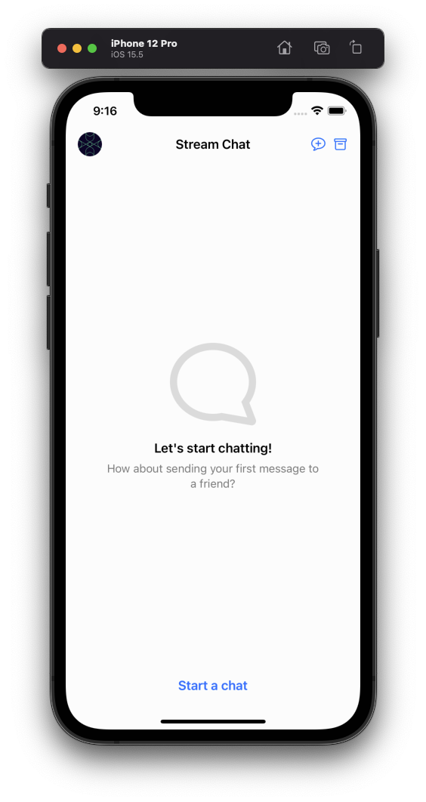
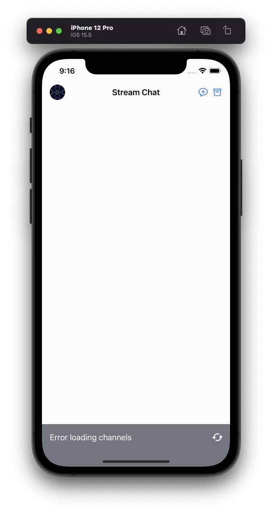
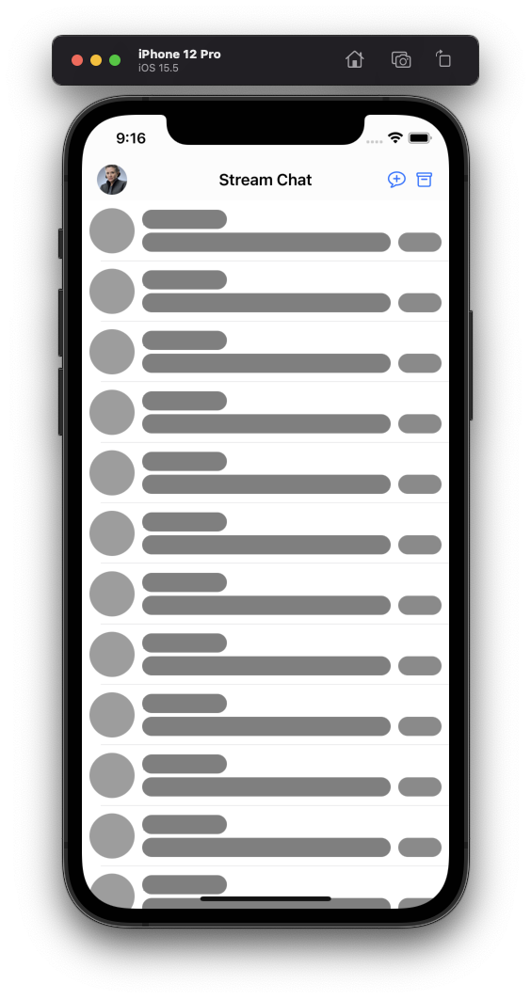
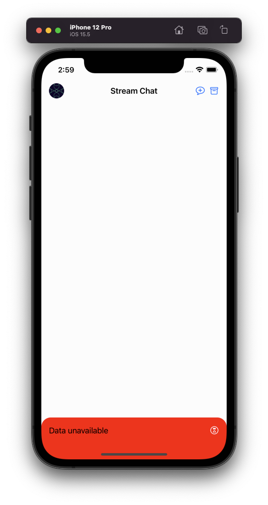

import SingletonNote from '../../common-content/chat-client.md'
import ComponentsNote from '../../common-content/components-note.md'
import Properties from '../../common-content/reference-docs/stream-chat-ui/chat-channel-list/chat-channel-list-vc-properties.md'

The `ChatChannelListVC` is the UI component used to display a list of channels matching the given query.

:::note
The Channel List screen is backed by the low-level `ChatChannelListController` component which fetches channels from the API and keeps the list in sync with the remote.
Read more about channel list query and how `ChatChannelListController` works [here](../../client/controllers/channels.md).
:::

## Basic Usage

The first step to show the channel list screen in your app is to create `ChatChannelListVC` instance:
```swift
// Create `ChatChannelController` with the given query
let controller = ChatClient.shared.channelListController(query: ..., filter: ...)

// Create a view controller backed by the low-level controller
let channelListVC = ChatChannelListVC.make(with: controller)
```

When the `ChatChannelListVC` instance is created, there are multiple ways of showing it:
1. modally
1. inside an existing `UINavigationController`
1. as a tab inside `UITabBarController`
1. inside `UISplitViewController`
1. as a child controller

To present the channel list modally:
```swift
let navigationVC = UINavigationController(rootViewController: channelListVC)

present(navigationVC, animated: true)
```

To push the channel list to an existing navigation controller:
```swift
navigationController?.pushViewController(channelListVC, animated: true)
```

To show the channel list as a tab:
```swift
let navigationVC = UINavigationController(rootViewController: channelListVC)

let tabBatVC = UITabBarController()
tabBatVC.viewControllers = [..., navigationVC]
```

To show the channel list as a main screen in split view controller and the selected channel as a detail:
```swift
let channelListNVC = UINavigationController(rootViewController: channelListVC)

let splitVC = UISplitViewController()
splitVC.preferredDisplayMode = .oneBesideSecondary
splitVC.viewControllers = [
    channelListNVC,
    /*optionally provide a controller shown as a detail till user opens a channel*/
]
```

To show the channel list as a child:
```swift
class ParentVC: UIViewController {
    let containerView: UIView

    override func viewDidLoad() {
        super.viewDidLoad()

        let navigationVC = UINavigationController(rootViewController: channelListVC)
        addChild(navigationVC)
        navigationVC.view.translatesAutoresizingMaskIntoConstraints = false
        containerView.addSubview(navigationVC.view)
        NSLayoutConstraint.activate([
            navigationVC.view.leadingAnchor.constraint(equalTo: containerView.leadingAnchor),
            navigationVC.view.trailingAnchor.constraint(equalTo: containerView.trailingAnchor),
            navigationVC.view.topAnchor.constraint(equalTo: containerView.topAnchor),
            navigationVC.view.bottomAnchor.constraint(equalTo: containerView.bottomAnchor)
        ])
        navigationVC.didMove(toParent: self)
    }
}
```

:::note
In all the cases but the push to the existing navigation controller, the channel list is wrapped by `UINavigationController` before presenting to get the `channel list -> channel` navigation out of the box.
:::

## UI Customization

You can customize how channels are rendered in the list by replacing the [`ChannelListItemView`](../../views/channel-list-item-view) component with your own. Like every component from this library, this component will also follow the [theming](../theming.md) of your application.

### Channel Header

The header of the channel can be configured the same way you would configure it on a `UIViewController` object.

```swift
class ViewController: ChatChannelListVC {
    /// ...

    override open func setUpAppearance() {
        super.setUpAppearance()
        title = "Chats"
    }

    /// ...
}
```

### Channel List States

You can opt to show an empty, error and loading view by setting the following flag to true in the `Components` configuration:

```swift
Components.default.isChatChannelListStatesEnabled = true
```

This feature is disabled by default, having just the standard loading indicator for the loading state. By enabling this feature, the StreamChat SDK will handle the channel list view states automatically for you.

| Empty | Error | Loading |
| ------------- | ------------- | ------------- |
|  |  |  |

You can further customize or add your own implementation of an empty, error or loading view by subclassing `ChatChannelListEmptyView`, `ChatChannelListErrorView` or `ChatChannelListLoadingView` respectively.

Let's see how you can customize our error view:

```swift
class CustomChatChannelListVC: ChatChannelListVC {

    override open func setUpAppearance() {
        super.setUpAppearance()

        channelListErrorView.backgroundColor = .red
        channelListErrorView.titleLabel.text = "Data unavailable"
        channelListErrorView.titleLabel.textColor = .black
        channelListErrorView.retryButton.setImage(.init(systemName: "hourglass.circle"), for: .normal)
    }

    override func layoutSubviews() {
        super.layoutSubviews()
        channelListErrorView.layer.cornerRadius = 20
    }
}
```



Now, let's see an example of how you can totally replace our loading view with your own implementation.

```swift
class CustomChannelListLoadingView: ChatChannelListLoadingView {

    lazy var customLoadingView: CustomLoadingView = {
        // You implementation...
    }()

    // ...

    override open func setUp() {
        // Set up your custom views.
        // Don't call super.setUp()
    }

    override open func setUpAppearance() {
        // Set up the appearance of your custom views.
        // Don't call super.setUpAppearance()
    }

    override open func setUpLayout() {
        // Set up the layout of your custom views.
        // Don't call super.setUpLayout()
    }

    // ...
}
```

Don't forget to set your custom implementation in the `Components` class:

```swift
Components.default.chatChannelListLoadingView = CustomChannelLoadingView.self
```

You can set your custom views for the channel list states when configuring your Components instance by replacing the following views as shown above:

```swift
// In Components.swift:

public var channelListEmptyView: ChatChannelListEmptyView.Type = ChatChannelListEmptyView.self

public var channelListErrorView: ChatChannelListErrorView.Type = ChatChannelListErrorView.self

public var chatChannelListLoadingView: ChatChannelListLoadingView.Type = ChatChannelListLoadingView.self
```

## Navigation

This component uses the [`ChannelListRouter`](../../common-content/reference-docs/stream-chat-ui/navigation/chat-channel-list-router.md) navigation component, you can customize this by providing your own.

```swift
Components.default.channelListRouter = CustomChannelListRouter.self
```

<ComponentsNote />

## Search

The UI SDK provides searching components out-of-the-box for the Channel List. Currently, there is two types of searching strategies that can be enabled, searching by messages or channels.

To enable it, a `ChannelListSearchStrategy` should be configured in the `Components` configuration:
```swift
// If you want to enable the search by messages
Components.default.channelListSearchStrategy = .messages
// If you want to enable the search by channels
Components.default.channelListSearchStrategy = .channels
```

In order to customize the search UI component, you can provide a subclass of our default components, `ChatMessageSearchVC` and `ChatChannelSearchVC`, like so:

```swift
// If you want to enable the search by messages with a custom subclass
Components.default.channelListSearchStrategy = .messages(CustomChatMessageSearchVC.self)
// If you want to enable the search by channels with a custom subclass
Components.default.channelListSearchStrategy = .channels(CustomChatChannelSearchVC.self)
```

Both `ChatMessageSearchVC` and `ChatChannelSearchVC` inherit from the Channel List component, so all the customization provided in the Channel List should be reflected in the search components. They also use the same cell component found in the Channel List, so in case you want to customize the search cell component, you can do it by customizing the [`ChannelListItemView`](../../views/channel-list-item-view). The Channel List Item View contains a `searchResult` in the `content` property in case the view is being used for searching.

In case your app requires a total custom search UI component you can build your own from scratch. To do so, you need to customize the `ChatChannelListVC.setUp()` lifecycle method and provide a `UISearchController` by setting the `navigationItem.searchController`.

## Channel List Controller

The channel list component uses the `ChannelListController` to fetch the list of channels matching your query and to stay up-to-date with all changes. In the example above you can see that we are passing a `ChannelListQuery` object to create the controller. Stream Chat APIs allow you to list channels based on your own query and sort.

## Channel List Query

The `ChannelListQuery` is the structure used to specify the query parameters for fetching the list of channels from Stream backend.
It has 4 parameters in its `init`:

```swift
public init(
        filter: Filter<ChannelListFilterScope>,
        sort: [Sorting<ChannelListSortingKey>] = [],
        pageSize: Int = .channelsPageSize,
        messagesLimit: Int = .messagesPageSize
)
```

Let's dive deep into each one.

### Filter

Filter is the main parameter for a query. You can define different filters to fetch different sets of channels for a user.
Examples of some most commonly used filters:
```swift
// Assume we've already created and configured our ChatClient

// Filter for channels where our user is a member
let filter = Filter<ChannelListFilterScope>.containMembers(userIds: [client.currentUserId!])

// Filter for channels where the name starts with "Group"
let filter = Filter<ChannelListFilterScope>.autocomplete(.name, text: "Group")

// Compound Filter for channels where team is read and our user is a member
let filter = Filter<ChannelListFilterScope>.and([.equal(.team, to: "read"),
                                                 .containMembers(userIds: [client.currentUserId!])])
```

### Sorting

Sorting parameter is used to sort the list of channels returned. By default, Channel List will be sorted by their last message date (or channel creation date, if the channel is empty).
Most commonly, you don't need to specify any sorting, StreamChat SDK handles this. If you'd like, you can create a custom sorting, such as:
```swift
// Sorting for always showing most crowded channels first
let sorting: [Sorting<ChannelListSortingKey>] = [.init(key: .memberCount, isAscending: true),
                                                 .init(key: .lastMessageAt, isAscending: true)]
```

### PageSize

Page size is used to specify how many channels the initial page will show. You can specify an integer value for advanced use-cases. Most commonly, you don't need to touch this.

### Message Limit

`messagesLimit` is used to specify how many messages the initial fetch will return.

## Replacing Channel List Query

In case you want to apply filters to your Channel List you can do this by replacing the channel list query of the `ChatChannelListVC` with either `replaceQuery()` function, or `replaceChannelListController()` in case you need more control. Here is a basic example on how you can change the Channel List data to show hidden channels only:

```swift
class CustomChatChannelListVC: ChatChannelListVC {

    lazy var hiddenChannelsButton: UIButton = {
        let button = UIButton()
        button.setImage(UIImage(systemName: "archive")!, for: .normal)
        return button
    }()

    override open func setUp() {
        super.setUp()

        hiddenChannelsButton.addTarget(self, action: #selector(didTapHiddenChannelsButton), for: .touchUpInside)
    }

    override open func setUpLayout() {
        super.setUpLayout()

        ...
    }

    @objc private func didTapHiddenChannelsButton(_ sender: Any) {
        guard let currentUserId = controller.client.currentUserId else { return }
        let hiddenChannelsQuery: ChannelListQuery = .init(filter: .and([
            .containMembers(userIds: [currentUserId]),
            .equal(.hidden, to: true)
        ]))
        self.replaceQuery(hiddenChannelsQuery)
    }
}
```

You can see a full working example in our Demo App [here](https://github.com/GetStream/stream-chat-swift/blob/add/replace-query-in-channel-list/DemoApp/StreamChat/Components/DemoChatChannelListVC.swift).

:::note
The replacing of the Channel List Query is only available after **4.32.0** version.
:::

## Marking all Channels as Read

When you're displaying, or loading a set of channels, you may want to mark all the channels as read. For this, `ChannelListController` has `markAllRead` function:
```swift
controller.markAllRead()
```
This function will reset the unread count for all the channels the controller paginates.

## Properties

<Properties />
