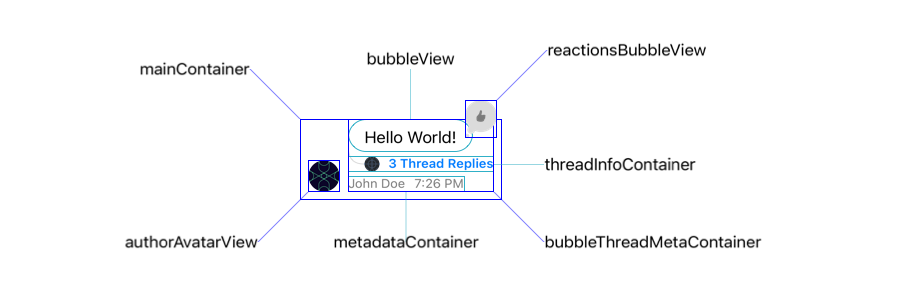

The responsibility of rendering the messages is shared between multiple components that can be customized or totally replaced.

Here is a diagram that shows the different components that are involved in rendering a message:

import Digraph from '../../common-content/digraph.jsx'
import ChatMessageContentViewProperties from '../../common-content/reference-docs/stream-chat-ui/chat-message-list/chat-message/chat-message-content-view-properties.md'
import ComponentsNote from '../../common-content/components-note.md'

<Digraph>{ `
    {rank = same; ChatMessageBubbleView; ChatReactionsBubbleView;}
    ChatMessageListVC
    ChatMessageLayoutOptionsResolver [href="../message-layout-options-resolver"]
    ChatAvatarView [href="../avatar"]
    ChatMessageListVC -> ChatMessageLayoutOptionsResolver
    ChatMessageLayoutOptionsResolver -> ChatMessageListVC 
    ChatMessageListVC -> ChatMessageListView
    ChatMessageListView -> ChatMessageContentView
    ChatMessageContentView -> ChatAvatarView
    ChatMessageContentView -> ChatReactionsBubbleView
    ChatMessageContentView -> ChatMessageBubbleView
    ChatReactionsBubbleView -> ChatMessageReactionsView
    ChatMessageReactionsView -> "ChatMessageReactionItemView"
` }</Digraph>

### Overview

1. `ChatMessageLayoutOptionsResolver` calculates the `ChatMessageLayoutOptions` for each message.
1. `ChatMessageLayoutOptions` contains all the information needed by the view to render the message.
1. `ChatMessageContentView` holds the entire message view and all its sub-views.
1. `ChatMessageBubbleView` wraps the message content inside a bubble. Depending on the layout options, the bubble will have different borders and colors and will show or not the user profile and name.
1. `ChatReactionsBubbleView` is a wrapper for `ChatMessageReactionsView`.
1. `ChatMessageReactionsView` is responsible for rendering all reactions attached to the message.
1. `ChatMessageReactionItemView` renders a single reaction.


## Basic Customizations

In case your application only requires minimal changes to the message view, you can easily change the styling of the message subviews by replacing them with custom views, or do simple layout changes by customizing the message layout options resolver.

### Changing the Bubble View

As an example of a styling change of the `ChatMessageContentView`, we will replace the bubble view with a custom one.

```swift
class CustomMessageSquaredBubbleView: ChatMessageBubbleView {
    override open func setUpAppearance() {
        super.setUpAppearance()

        layer.cornerRadius = 0
    }
}
```

```swift
Components.default.messageBubbleView = CustomMessageSquaredBubbleView.self
```

#### Result:
| Before  | After |
| ------------- | ------------- |
|  |  |

<ComponentsNote />

### Simple Layout Changes

The `ChatMessageLayoutOptions` are flags that the `ChatMessageLayoutOptionsResolver` injects in each message view depending on the message content (ie. Does the message contains reactions? Is it coming from the same user? Etc...). When rendering the message view, the layout options will be used to know which views to show or hide, and if the message cell can be reused since different layout options combinations will produce different reuse identifiers. 

By customizing the `ChatMessageLayoutOptionsResolver` it is possible to do simple layout changes, like for example always showing the timestamp (by default if the messages are sent in the same minute, only the last one shows the timestamp).

```swift
final class CustomMessageLayoutOptionsResolver: ChatMessageLayoutOptionsResolver {
    override func optionsForMessage(
        at indexPath: IndexPath,
        in channel: ChatChannel,
        with messages: AnyRandomAccessCollection<ChatMessage>,
        appearance: Appearance
    ) -> ChatMessageLayoutOptions {
        var options = super.optionsForMessage(at: indexPath, in: channel, with: messages, appearance: appearance)

        // Remove the reactions and thread info from each message.
        // Remove `.flipped` option, all messages will be rendered in the leading side
        // independent if it's the current user or not.
        options.remove([
            .flipped,
            .threadInfo,
            .reactions
        ])

        // Always show the avatar, timestamp and author name for each message.
        options.insert([.avatar, .timestamp, .authorName])

        return options
    }
}
```

```swift
Components.default.messageLayoutOptionsResolver = CustomMessageLayoutOptionsResolver()
```

#### Result:
| Before  | After |
| ------------- | ------------- |
|  |  |

## Advanced Customizations

Creating a subclass of [`ChatMessageContentView`](#chatmessagecontentview) is the best way do more advanced customizations since you have access to all the message subviews. By customizing this component you can not only change the existing views but add new ones and add new functionality.

:::note
`ChatMessageContentView` sets up its own layout on the `layout(options: ChatMessageLayoutOptions)` method and not in `setupLayout()` like other regular views. This view is different from the other ones since the layout is calculated based on the `ChatMessageLayoutOptions`.
:::

### Restructuring the Message Layout

In order to change the message layout we first need to understand how it is structured:



- `mainContainer` is a horizontal container that holds all top-hierarchy views inside the `ChatMessageContentView` - This includes the `AvatarView`, `Spacer` and `BubbleThreadMetaContainer`.
- `bubbleThreadMetaContainer` is a vertical container that holds the `bubbleView` at the top and `metadataContainer` at the bottom by default. You can switch the positions for these elements or even add your own according to your needs.
- `metadataContainer` is a horizontal container that holds  `authorNameLabel` , `timestampLabel` and `onlyVisibleForYouLabel`. 
- `bubbleView` is a view that embeds a `bubbleContentContainer` and is only responsible for the bubble styling. The `bubbleContentContainer` contains the `textView` and `quotedMessageView` if the message is a quote.

:::note `bubbleView` vs `bubbleContentContainer`
 When `ChatMessageContentView`'s `options` contain `.bubble` option, the `bubbleView` is added to `bubbleThreadMetaContainer`. If the option is not contained, the hierarchy includes only `bubbleContentContainer` as subview of `bubbleThreadMetaContainer`
:::

As an example on how we can restructure the layout of the message view we will do the following customization:

  

First, we need to customize the `ChatMessageLayoutOptionsResolver` and change the message layout options according to our needs. For this specific example, let's assume our message view layout needs to respect the following conditions:
- Always include the avatar, timestamp and author name.
- All messages should be rendered on the leading side.
- Don't support reactions.
- Don't support threads.

```swift
final class CustomMessageOptionsResolver: ChatMessageLayoutOptionsResolver {
    override func optionsForMessage(
        at indexPath: IndexPath,
        in channel: ChatChannel,
        with messages: AnyRandomAccessCollection<ChatMessage>,
        appearance: Appearance
    ) -> ChatMessageLayoutOptions {
        // Call super to get the default options.
        var options = super.optionsForMessage(at: indexPath, in: channel, with: messages, appearance: appearance)
        
        // Remove all the options that we don't want to support.
        // By removing `.flipped` option, all messages will be rendered in the leading side.
        options.remove([.flipped, .bubble, .avatarSizePadding, .threadInfo, .reactions])

        // Insert the options that we want to support.
        options.insert([.avatar, .timestamp, .authorName])
        
        return options
    }
}
```

Second, we need to subclass the `ChatMessageContentView` to restructure the layout. In this case we want to change the position and margins of some views:
```swift
final class CustomChatMessageContentView: ChatMessageContentView {
    override var maxContentWidthMultiplier: CGFloat { 1 }

    override func layout(options: ChatMessageLayoutOptions) {
        super.layout(options: options)

        // To have the avatarView aligned at the top with rest of the elements,
        // we'll need to set the `mainContainer` alignment to leading.
        mainContainer.alignment = .leading
        
        // Set inset to zero to align it with the message author
        textView?.textContainerInset = .zero 
        
        // Reverse the order of the views in the `bubbleThreadMetaContainer`.
        // This will reverse the order of the `textView` and `metadataContainer`
        let subviews = bubbleThreadMetaContainer.subviews
        bubbleThreadMetaContainer.removeAllArrangedSubviews()
        bubbleThreadMetaContainer.addArrangedSubviews(subviews.reversed())

        // We need to disable the layout margins of the text view
        bubbleContentContainer.directionalLayoutMargins = .zero
    }
}
```

Finally, don't forget to assign the custom subclasses to `Components`:
```swift
Components.default.messageLayoutOptionsResolver = CustomMessageOptionsResolver()
Components.default.messageContentView = CustomChatMessageContentView.self
```

#### Result:
| Before  | After |
| ------------- | ------------- |
|  |  |

### Adding new Views and Functionality

To show an example of how to add a new view and functionality to the message view, let's add a share button whenever the message has attachments, so that we can share or save the attachments to our device.

First, we need to introduce a custom message layout option:
```swift
extension ChatMessageLayoutOption {
    static let shareAttachments: Self = "shareAttachments"
}
```
The `ChatMessageLayoutOption` has a similar usage of an enum but it is not an enum. Instead, it is a struct that holds a string raw value. The advantage of this approach is that it is extendable while the enum is not.

The next step is to subclass the `ChatMessageLayoutOptionsResolver` so that we can add the new `.shareAttachments` option if the message has attachments:
```swift
final class CustomMessageLayoutOptionsResolver: ChatMessageLayoutOptionsResolver {
    override func optionsForMessage(
        at indexPath: IndexPath,
        in channel: ChatChannel,
        with messages: AnyRandomAccessCollection<ChatMessage>,
        appearance: Appearance
    ) -> ChatMessageLayoutOptions {
        var options = super.optionsForMessage(
            at: indexPath,
            in: channel,
            with: messages,
            appearance: appearance
        )

        let messageIndex = messages.index(messages.startIndex, offsetBy: indexPath.item)
        let message = messages[messageIndex]

        if !message.attachmentCounts.isEmpty {
            options.insert(.shareAttachments)
        }

        return options
    }
}
```

Now we need to customize the `ChatMessageContentView` to add the new functionality in case the new option is present:
```swift
final class CustomChatMessageContentView: ChatMessageContentView {
    /// The share button.
    private var shareAttachmentsButton: UIButton?

    /// A callback that is called when the share button is tapped.
    /// The message list can then use this callback to present an activity view controller.
    var onShareAttachments: (([URL]) -> Void)?

    override func layout(options: ChatMessageLayoutOptions) {
        super.layout(options: options)
        
        /// We only want to add the share button if the option is present.
        if options.contains(.shareAttachments) {
            let button = createShareAttachmentsButton()
            NSLayoutConstraint.activate([
                button.heightAnchor.constraint(equalToConstant: 40)
            ])
            /// We want the share button to be rendered in the bottom of the bubble content view.
            bubbleContentContainer.spacing = 0
            bubbleContentContainer.addArrangedSubview(button)
        }
    }

    /// Creating the share button.
    private func createShareAttachmentsButton() -> UIButton {
        if shareAttachmentsButton == nil {
            shareAttachmentsButton = UIButton(type: .system)
            shareAttachmentsButton?.tintColor = .systemBlue
            shareAttachmentsButton?.translatesAutoresizingMaskIntoConstraints = false
            shareAttachmentsButton?.setImage(UIImage(systemName: "square.and.arrow.up"), for: .normal)
            shareAttachmentsButton?.addTarget(self, action: #selector(handleTapOnShareButton(_:)), for: .touchUpInside)
        }
        return shareAttachmentsButton!
    }
    
    /// Handling the tap on the share button.
    @objc private func handleTapOnShareButton(_ sender: UIButton) {
        guard let message = content else { return }

        let images = message.imageAttachments.map(\.imageURL)
        let files = message.fileAttachments.map(\.assetURL)
        let gifs = message.giphyAttachments.map(\.previewURL)
        let videos = message.videoAttachments.map(\.videoURL)
        let audios = message.audioAttachments.map(\.audioURL)
        let links = message.linkAttachments.map(\.originalURL)
        
        let allAttachments = [images, files, gifs, videos, audios, links].reduce([], +)
        onShareAttachments?(allAttachments)
    }
}
```

Since the `ChatMessageContentView` is not a view controller it can't present an `UIActivityViewController`. So we need to subclass the `ChatMessageListVC` and handle the `onShareAttachments()` callback.

```swift
class CustomChatMessageListVC: ChatMessageListVC {
    override func tableView(_ tableView: UITableView, cellForRowAt indexPath: IndexPath) -> UITableViewCell {
        let cell = super.tableView(tableView, cellForRowAt: indexPath) as! ChatMessageCell
        let messageContentView = cell.messageContentView as! CustomChatMessageContentView

        messageContentView.onShareAttachments = { [weak self] attachments in
            let activityViewController = UIActivityViewController(
                activityItems: attachments,
                applicationActivities: nil
            )

            self?.present(activityViewController, animated: true, completion: nil)
        }

        return cell
    }
}
```

Finally, the last step is just to replace these custom components:
```swift
Components.default.messageLayoutOptionsResolver = CustomMessageLayoutOptionsResolver()
Components.default.messageContentView = CustomChatMessageContentView.self
Components.default.messageListVC = CustomChatMessageListVC.self
```

#### Result:
| Before  | After |
| ------------- | ------------- |
|  |  |

## ChatMessageContentView

`ChatMessageContentView` is the container class for a message. Internally this class uses subviews such as the message bubble, reactions, attachments, and user avatars.

### Properties and Methods

<ChatMessageContentViewProperties />
