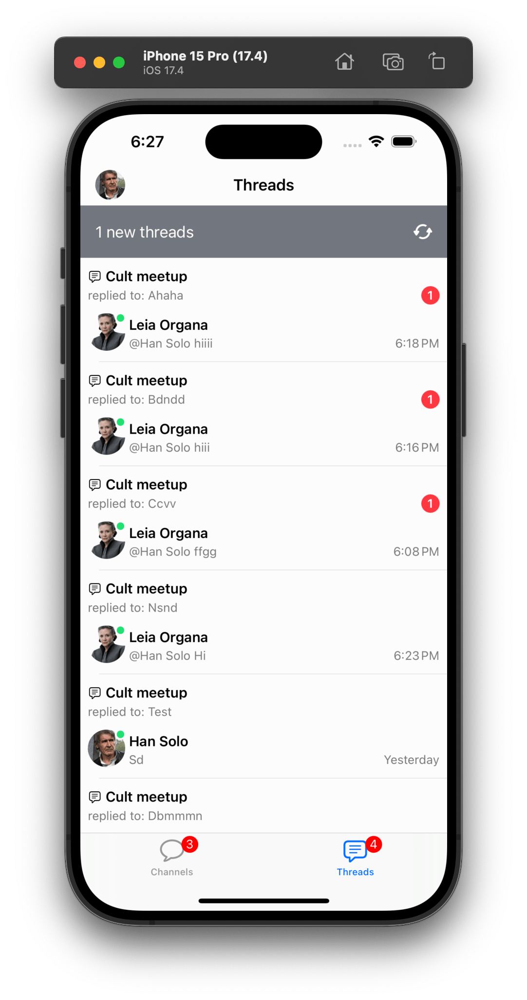
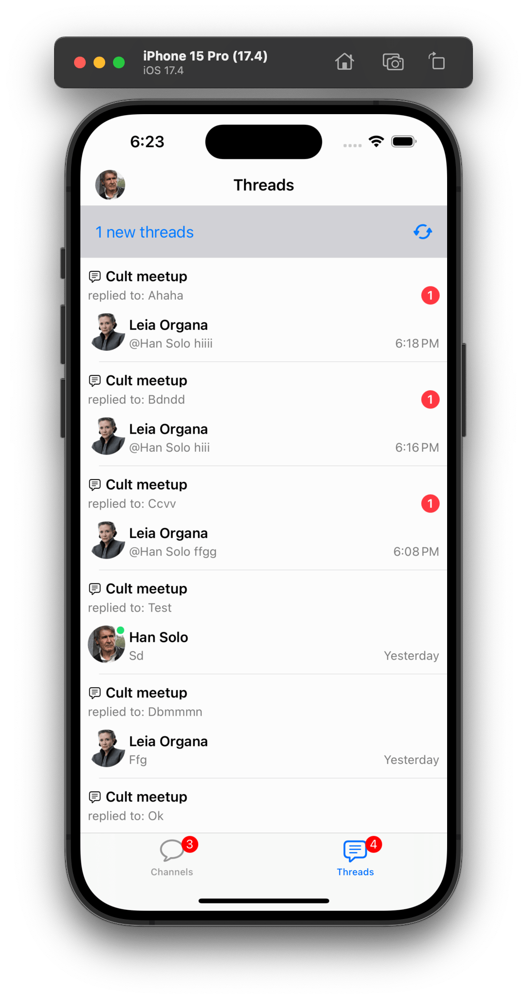
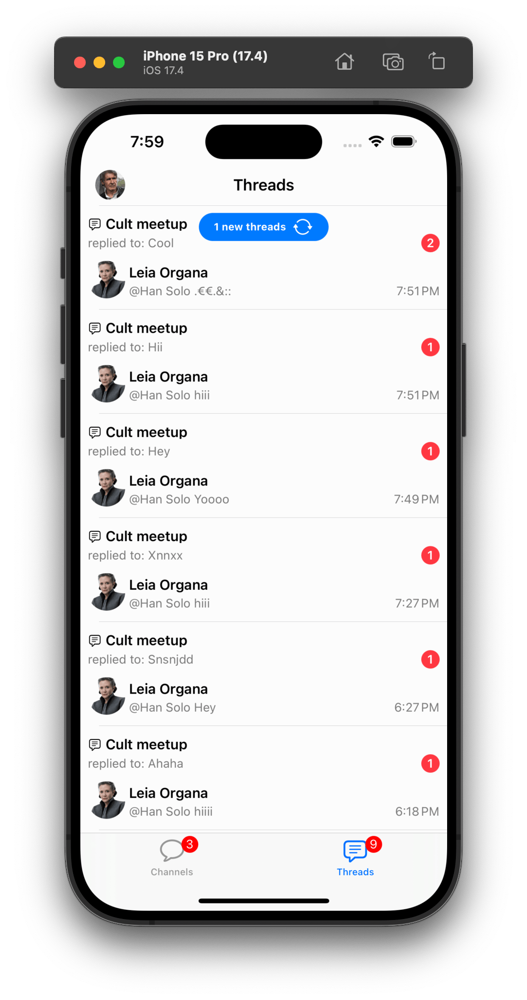
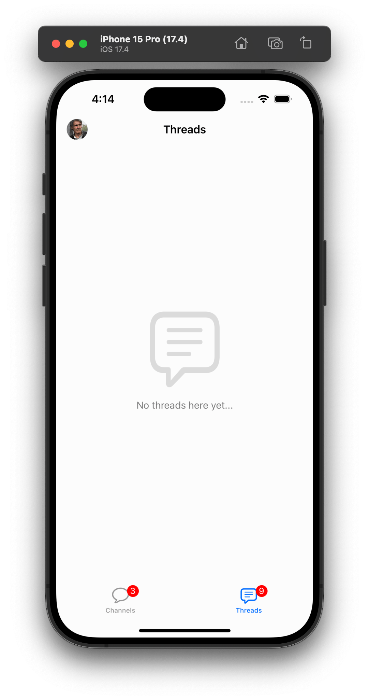
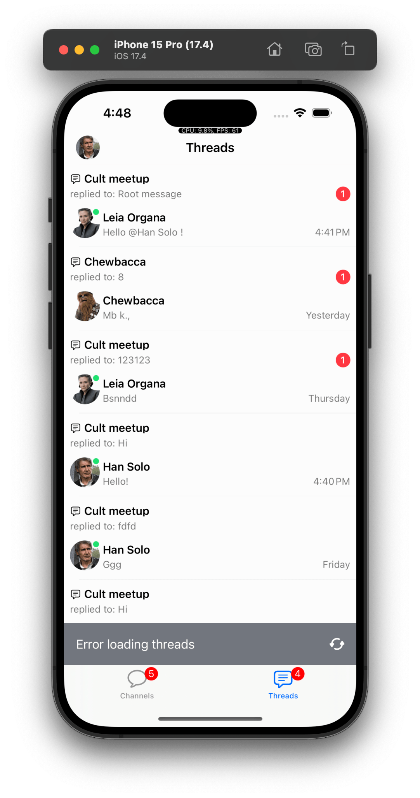
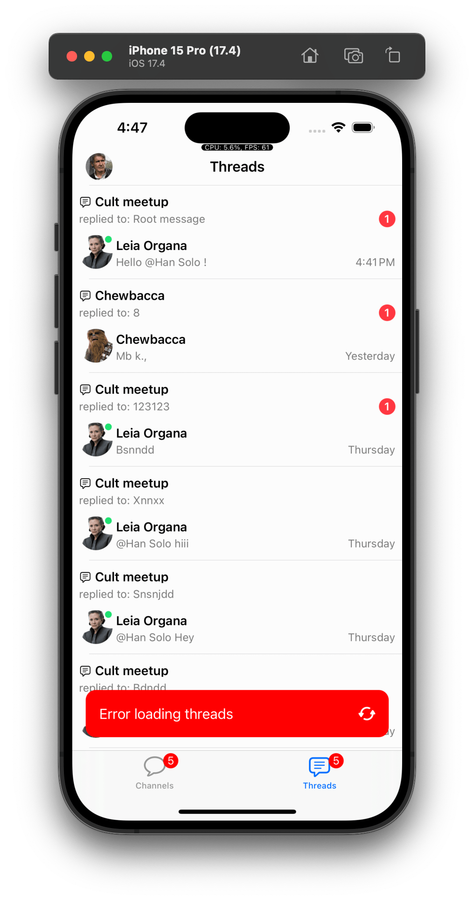
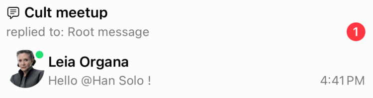
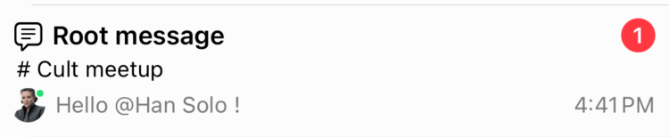

The `ChatThreadListVC` is the UI component that displays the list of threads that the current user is participating in.

:::note
The Thread List component is available on the UIKit SDK since version [4.59.0](https://github.com/GetStream/stream-chat-swift/releases/tag/4.59.0).
:::

## Basic Usage

You can show this component in your app by creating a `ChatThreadListVC` instance:

```swift
// Default thread list query with watch enabled. 
// Which means the list will be updated in real-time from thread events.
let threadListQuery = ThreadListQuery(watch: true)
let threadListController = ChatClient.shared.threadListController(query: threadListQuery)
let eventsController = ChatClient.shared.eventsController()
let threadListVC = ChatThreadListVC(
    threadListController: threadListController,
    eventsController: eventsController
)

// Present the thread list VC
let navigationThreadListVC = UINavigationController(rootViewController: threadListVC)
navigationController?.pushViewController(navigationThreadListVC, animated: true)
```

You can present the Thread List in a `UINavigationController` or in a `UITabBarController` depending on your app design. The `ChatThreadListVC` has two required dependencies: a `ThreadListController` and an `EventsController`.

## Thread List Query

The `ThreadListQuery` is responsible to configure the list of threads that will be displayed in the `ChatThreadListController`. These are the available parameters:

- `watch`: A boolean indicating whether to watch for changes in the thread list or not.
- `limit`: The amount of threads fetched per page. The default is 20.
- `replyLimit`: The amount of replies fetched per thread. The default is 3.
- `participantLimit`: The amount of participants fetched per thread. The default is 10.
- `next`: The pagination token from the previous response to fetch the next page.

All the parameters are customizable and you can change them according to your needs. The default values are a good compromise between performance and user experience.

If you are using the `ChatThreadListVC` component, you don't need to worry about the `next` parameter, since pagination is handled for you. If not, you can use the `next` parameter from the previous response to fetch the next page of threads.

## UI Customization

You can customize the Thread List UI by overriding the `ChatThreadListVC` component and the `ChatThreadListItemView`. In the `ChatThreadListVC` you can change, for example, the header and state views, where in the `ChatThreadListItemView` you can change how each thread is displayed.

### Thread List Navigation Header

The navigation header of the thread list can be configured the same way you would configure it on a `UIViewController` object if it is part of a `UINavigationController`. You can change the `title` and the `navigationItem` properties. Here is an example:

```swift
class CustomThreadListVC: ChatThreadListVC {
    
     override open func setUpAppearance() {
        super.setUpAppearance()
        title = "Threads"
    }
}
```

### Thread List Header Banner View

The `ChatThreadListHeaderBannerView` is the view that is displayed by default as a `tableHeaderView` in the `ChatThreadListVC`. This view is shown whenever the user is on the Thread List and new threads are available to fetch. New threads are not added automatically to the Thread List on purpose, allowing users to manually decide when to fetch them after reading all current unread threads.

You can customize this view by overriding the `Components.default.threadListHeaderBannerView` property in the `ChatThreadListVC`.

```swift
class CustomThreadListHeaderBannerView: ChatThreadListHeaderBannerView {
    override func setUpAppearance() {
        super.setUpAppearance()

        bannerView.backgroundColor = .systemGray4
        bannerView.textLabel.textColor = .systemBlue
        refreshButton.tintColor = .systemBlue
    }
}

Components.default.threadListHeaderBannerView = CustomThreadListHeaderBannerView.self
```

**Result:**

| Before| After |
| ------------- | ------------- |
|  |  |

In case you want to customize how the banner is shown and how the user interacts with it, you can override the `ChatThreadListVC` and, for example, change the banner view to a floating button on the top of the table view. Here is an example of how you can do it:

```swift
class CustomThreadListHeaderBannerView: ChatThreadListHeaderBannerView {
    override func setUp() {
        super.setUp()

        let tapGestureRecognizer = UITapGestureRecognizer(target: self, action: #selector(didTapBannerView))
        bannerView.addGestureRecognizer(tapGestureRecognizer)
    }

    override func setUpAppearance() {
        super.setUpAppearance()

        bannerView.backgroundColor = .systemBlue
        bannerView.textLabel.font = .systemFont(ofSize: 11, weight: .bold)
        bannerView.actionButton.setImage(UIImage(systemName: "arrow.triangle.2.circlepath"), for: .normal)
        bannerView.spacer.isHidden = true
        bannerView.container.spacing = 6
    }

    override open func layoutSubviews() {
        super.layoutSubviews()

        bannerView.layer.cornerRadius = bounds.height / 2
    }

    @objc func didTapBannerView() {
        onAction?()
    }
}

Components.default.threadListHeaderBannerView = CustomThreadListHeaderBannerView.self
```

```swift
class CustomChatThreadListVC: ChatThreadListVC {

    override func setUpLayout() {
        super.setUpLayout()

        view.addSubview(headerBannerView)
        NSLayoutConstraint.activate([
            headerBannerView.topAnchor.constraint(equalTo: view.safeAreaLayoutGuide.topAnchor, constant: 8),
            headerBannerView.centerXAnchor.constraint(equalTo: tableView.centerXAnchor),
            headerBannerView.heightAnchor.constraint(equalToConstant: 30)
        ])
    }

    override func showHeaderBannerView() {
        headerBannerView.isHidden = false
    }

    override func hideHeaderBannerView() {
        headerBannerView.isHidden = true
    }
}
```

When showing the Thread List in your app, you will then need to use the `CustomChatThreadListVC` instead of the default `ChatThreadListVC`.

**Result:**

| Before| After |
| ------------- | ------------- |
|  |  |


### Thread List States

The `ChatThreadListVC` comes with three states: **loading**, **empty**, and **error**. The state logic is handled automatically by this component. You can customize the appearance of these states by overriding the `ChatThreadListVC` and/or overriding the `Components.default.threadListLoadingView`, `Components.default.threadListEmptyView`, and `Components.default.threadListErrorView`.

| Empty | Error | Loading |
| ------------- | ------------- | ------------- |
|  |  |  |

The example below shows how you can customize the appearance of the error view:

```swift
class CustomThreadListErrorView: ChatThreadListErrorView {
    
    override func setUpAppearance() {
        super.setUpAppearance()

        bannerView.backgroundColor = .red
    }

    override func layoutSubviews() {
        super.layoutSubviews()

        bannerView.layer.cornerRadius = 12
    }
}

class CustomChatThreadListVC: ChatThreadListVC {
    override func setUpLayout() {
        super.setUpLayout()

        NSLayoutConstraint.activate([
            errorView.bottomAnchor.constraint(equalTo: view.layoutMarginsGuide.bottomAnchor, constant: -16),
            errorView.leadingAnchor.constraint(equalTo: view.layoutMarginsGuide.leadingAnchor),
            errorView.trailingAnchor.constraint(equalTo: view.layoutMarginsGuide.trailingAnchor)
        ])
    }
}

Components.default.threadListErrorView = CustomThreadListErrorView.self
```

**Result:**

| Before| After |
| ------------- | ------------- |
|  |  |

### Thread List Item View

The `ChatThreadListItemView` is the view that is displayed for each thread in the `ChatThreadListVC`. You can customize this view by overriding the `Components.default.threadListItemView` property.

This view is composed by the following subviews:

- `mainContainer`: Holds the `threadContainer` and the `replyContainer`.
- `threadContainer`: By default displays the information related to the thread.
  - `threadIconView`: Displays the thread icon.
  - `threadTitleLabel`: Displays the channel name.
  - `threadDescriptionLabel`: Displays the parent message text or thread title.
  - `threadUnreadCountView`: Displays the unread replies count.
- `replyContainer`: By default displays the information related to the last reply.
  - `replyAuthorAvatarView`: Displays the last reply author avatar.
  - `replyTitleLabel`: Displays the last reply author name.
  - `replyDescriptionLabel`: Displays the last reply text.
  - `replyTimestampLabel`: Displays the last reply timestamp.

Let's see an example of how you can customize the `ChatThreadListItemView` to display the information in a different way:

```swift
class CustomChatThreadListItemView: ChatThreadListItemView {

    lazy var channelNameLabel: UILabel = {
        let label = UILabel()
        label.font = .preferredFont(forTextStyle: .footnote)
        label.translatesAutoresizingMaskIntoConstraints = false
        return label
    }()

    override func setUpLayout() {
        super.setUpLayout()

        // Changes the margins of the item view
        directionalLayoutMargins = .init(
            top: 8,
            leading: 8,
            bottom: 8,
            trailing: 8
        )

        // Remove the bottom reply container
        replyContainer.isHidden = true

        // Moves the unread badge to the top right corner
        threadTitleContainer.addArrangedSubview(UIView())
        threadTitleContainer.addArrangedSubview(threadUnreadCountView)
        threadUnreadCountView.heightAnchor.constraint(greaterThanOrEqualToConstant: 20).isActive = true

        // Adds a new text label to display the channel name between the thread title and latest reply
        threadContainer.insertArrangedSubview(channelNameLabel, at: 1)

        // Moves the avatar view to the left of the latest reply
        threadDescriptionContainer.insertArrangedSubview(replyAuthorAvatarView, at: 0)
        threadDescriptionContainer.spacing = 6
        // Overrides the avatar view size
        NSLayoutConstraint.activate([
            replyAuthorAvatarView.heightAnchor.constraint(equalToConstant: 20),
            replyAuthorAvatarView.widthAnchor.constraint(equalToConstant: 20)
        ])

        // Moves the timestamp label to the right of the latest reply
        threadDescriptionContainer.addArrangedSubview(UIView())
        threadDescriptionContainer.addArrangedSubview(replyTimestampLabel)
    }

    override func updateContent() {
        super.updateContent()

        // Displays the parent message in the thread title label
        threadTitleLabel.text = parentMessagePreviewText
        // Displays the latest reply text in the thread description label
        threadDescriptionLabel.text = replyPreviewText
        // Displays the channel name in the new channel name label
        channelNameLabel.text = "# \(channelNameText ?? "")"
    }
}

Components.default.threadListItemView = CustomChatThreadListItemView.self
```

**Result:**

| Before| After |
| ------------- | ------------- |
|  |  |

## Navigation

This component uses the `ChatThreadListRouter` to handle navigation, you can customize the navigation behavior by overriding the `Components.default.threadListRouter`. 

By default, the `ChatThreadListRouter` uses the `ChatThreadVC` to show the thread replies, it is the same component used in the `ChatChannelVC` when tapping the replies of a message.

```swift
class CustomThreadListRouter: ChatThreadListRouter {
    override func showThread(_ thread: ChatThread) {
        // Custom implementation
    }
}

Components.default.threadListRouter = CustomThreadListRouter.self
```

## Thread Events

By default the UI components handle automatically the thread events, like new replies and thread updates. But, in case your app needs additional logic, these are the available thread events:

- `ThreadMessageNewEvent`: Triggered when a new reply is added to a thread.
- `ThreadUpdatedEvent`: Triggered when a thread is updated, like the thread title or custom data.

You can override the `ChatThreadListVC.eventsController(controller:didReceiveEvent:)` method to handle these events. For more information about how to handle events, check the [Events](../../client/controllers/events.md) documentation.