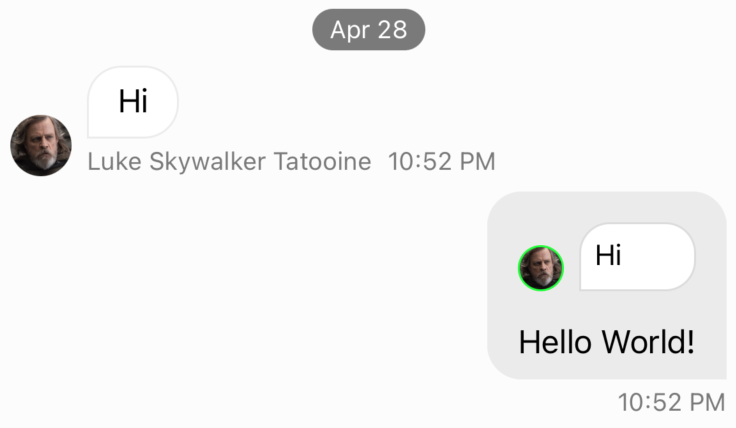

The Stream SDK UI components are fully customizable and interchangeable through the `Components` configuration type that holds all the reusable views of the SDK. You can customize these views by subclassing them and replacing them in the configuration with your subclass. Just like the `Appearance` configuration mentioned in the [Theming](theming.md) page, you should modify the values of the `Components` configuration from `Components.default` as early as possible in your application life-cycle.

## Customizing Components

These are the steps that you need to follow to use a custom component:

1. Create a new component class by subclassing the component you want to change.
1. Make changes to layout, styling, behavior as needed.
1. Configure the SDK to use your custom component.

To make customizations as easy as possible all view components share the same lifecycle and expose common properties such as `content`, `components` and `appearance`. When building your own custom component if you only want to change the styling and the layout of the view, you only need to override the  `setUpAppearance()` and `setUpLayout()` functions. In case you want to change the logic of the component or how the content is updated, you should override the `updateContent()` function.

:::note
Most UI components are stateless view classes. Components like `ChatMessageListVC`, `ChatChannelListVC` and `ComposerVC` are stateful and are view controllers. Customizations for these components are described in detail in their own doc pages.
:::

## The `Components` object

You can provide your own component class via dependency injection. The SDK exposes this via the `Components` object and the `Components.default` singleton. You should provide all customizations as early as possible in your application.

Let's say that you have your own component to render messages called `MyCustomMessageView`. Here's an example how to register it in the SDK and replace the built-in one:

```swift
class SceneDelegate: UIResponder, UIWindowSceneDelegate {

    func scene(_ scene: UIScene, willConnectTo session: UISceneSession, options connectionOptions: UIScene.ConnectionOptions) {
        ...
        Components.default.messageContentView = MyCustomMessageView.self
        ...
    }
}
```

The full list of customizations exposed by `Components` is available [here](../common-content/reference-docs/stream-chat-ui/components.md#properties).

## Components Lifecycle Methods

To make subclassing and customization simple, `StreamChatUI` view components conform to the `Customizable` protocol.

```swift
/// Main point of customization for the view functionality.
func setUp()

/// Main point of customization for the view appearance.
func setUpAppearance()

/// Main point of customization for the view layout.
func setUpLayout()

/// Main point of customizing the way the view updates its content.
func updateContent()
```

### `setUp()`

You can see this lifecycle method as a custom constructor of the view since it is only called once in the lifecycle of the component. This is a good place for setting delegates, adding gesture recognizers or adding any kind of target action. Usually you want to call `super.setUp()` when overriding this lifecycle method, but you can choose not to if you want to configure all the delegates and actions from scratch.

### `setUpAppearance()`

This lifecycle method is where you can customize the appearance of the component, like changing colors, corner radius, everything that changes the style of the UI but not the layout. You should call `super.setUpAppearance()` if you only want to override part of the view's appearance and not everything.

### `setUpLayout()`

This method is where you should customize the layout of the component, for example, changing the position of the views, padding, margins or even remove some child views. By overriding this lifecycle method you can customize the layout of the view while the view functionality will remain the same. Just like the other lifecycle methods, you can call `super.setUpLayout()` depending on if you want to make the layout of the component from scratch or just want to change some parts of the components.

### `updateContent()`

Finally, this method is called whenever the data of the component changes. Here you can change the logic of the component, change how the data is displayed or formatted. In the Stream SDK all of the components have a `content` property that represents the data of the component. This method should be used if the user interface depends on the data of the component.

## Customizing the appearance

Let's say, we want to change the appearance of avatars by adding a border. In this case, since it is a pretty simple example, we only need to change the appearance of the component:

```swift
class BorderedAvatarView: ChatAvatarView {

    override func setUpAppearance() {
        super.setUpAppearance()

        imageView.layer.borderWidth = 1.0
        imageView.layer.borderColor = UIColor.green.cgColor
    }
}
```

Then, we have to tell the SDK to use our custom subclass instead of the default type:

```swift
class SceneDelegate: UIResponder, UIWindowSceneDelegate {
    func scene(_ scene: UIScene, willConnectTo session: UISceneSession, options connectionOptions: UIScene.ConnectionOptions) {
        ...
        Components.default.avatarView = BorderedAvatarView.self
        ...
    }
}
```

| Before  | After |
| ------------- | ------------- |
|   |   |

And that's it 🎉, as you can see all avatars across the UI are now with a border.

### Applying changes to only one view

In the previous example we saw that when we customized the avatar view, it changed every UI component that uses an avatar view. All the components in the `Components` configuration are shared components, but it is also possible to customize a shared component of a specific view only. Let's imagine that we want to apply the previous customization of a bordered avatar view, but only in the quoted reply view:

```swift
class CustomQuotedChatMessageView: QuotedChatMessageView {

    lazy var borderedAvatarView = BorderedAvatarView()

    override var authorAvatarView: ChatAvatarView {
        borderedAvatarView
    }
}
```

Then, set the custom component:

```swift
Components.default.quotedMessageView = CustomQuotedChatMessageView.self
```

As you can see, we override the `authorAvatarView` property of the `QuotedChatMessageView` component and provide our custom bordered avatar view. It is important that the overridden `authorAvatarView` is backed by a custom view which is created lazily, to avoid creating multiple instances of the same view when `authorAvatarView` is called.

| Before  | After |
| ------------- | ------------- |
|   |   |

## Customizing the layout

When customizing the layout of a component you can either add new views, remove existing views or just changing the existing views constraints. Most of our components use stack views so that it easy to move one view to another stack, but you can also override our existing constraints since they have by default a lower priority.

Let's see an example on how to change the channel unread count indicator to look like the one in iMessage:

| Default style  | Custom "iMessage" Style |
| ------------- | ------------- |
|   |   |

First, we need to create a custom subclass of `ChatChannelListItemView`, which is the component responsible for showing the channel summary in the channel list. Because the iMessage-style unread indicator is just a blue dot, rather then trying to modify the existing unread indicator, it's easier to create a brand new view for it:

```swift
class iMessageChannelListItemView: ChatChannelListItemView {
    private lazy var customUnreadView = UIView()

    override func setUpAppearance() {
        super.setUpAppearance()

        customUnreadView.backgroundColor = tintColor
        customUnreadView.layer.masksToBounds = true
        customUnreadView.clipsToBounds = true
    }

    override func setUpLayout() {
        super.setUpLayout()

        // Set constraints for the new "dot" unread indicator
        NSLayoutConstraint.activate([
            customUnreadView.widthAnchor.constraint(equalTo: customUnreadView.heightAnchor),
            customUnreadView.widthAnchor.constraint(equalToConstant: 10),
        ])
        // Insert it as the left-most subview
        mainContainer.insertArrangedSubview(customUnreadView, at: 0)

        // Remove the original unread count indicator, since we don't need it anymore
        topContainer.removeArrangedSubview(unreadCountView)
    }

    override func updateContent() {
        super.updateContent()

        // We change the alpha value only because we want the view to still be part
        // of the layout system.
        customUnreadView.alpha = content?.channel.unreadCount.messages == 0 ? 0 : 1
    }
}
```

Because we added a new view, we also overridden the `updateContent()` method to update the visibility of the `customUnreadView` based on the unread count.

Finally, don't forget to change the `Components` configuration:

```swift
class SceneDelegate: UIResponder, UIWindowSceneDelegate {
    func scene(_ scene: UIScene, willConnectTo session: UISceneSession, options connectionOptions: UIScene.ConnectionOptions) {
        ...
        Components.default.channelContentView = iMessageChannelListItemView.self
        ...
    }
}
```

## New View Container Builder

Since version **4.64.0**, we introduced a new way to re-layout the components. The `ViewContainerBuilder` is a result builder that allows you to create stack views with a declarative syntax. If you are already familiar with SwiftUI, you will find this new way of building the layout very similar. The only difference is that the `ViewContainerBuilder` is only meant to be used for layout purposes, the appearance should still be set in the `setUpAppearance()` method and the component logic should still be set in the `updateContent()` method.

The interface of the `ViewContainerBuilder` is very simple, below you can find all the available methods:

- `HContainer()`, to create horizontal stack views.
- `VContainer()`, to create vertical stack views.
- `Spacer()`, to create a flexible space between views.
- `UIView.width()` and `UIView.height()`, convenience methods to set the width and height of the view.
- `UIStackView.views {}`, a result builder function to replace the views of a stack view.
- `UIStackView.padding()`, a convenience method to add padding to a stack view.
- `UIStackView.embed()` and `UIStackView.embedToMargins()`, convenience methods to embed the containers to a parent view.

### HContainer

The `HContainer` is used to create horizontal stack views. You can add as many views as you want to the container. It has the following parameters:

- `spacing: CGFloat`, the spacing between the views, by default it is `0`.
- `distribution: UIStackView.Distribution`, the distribution of the views, by default it is `.fill`.
- `alignment: UIStackView.Alignment`, the alignment of the views, by default it is `.fill`.

### VContainer

The `VContainer` is used to create vertical stack views. You can add as many views as you want to the container. It has the following parameters:

- `spacing: CGFloat`, the spacing between the views, by default it is `0`.
- `distribution: UIStackView.Distribution`, the distribution of the views, by default it is `.fill`.
- `alignment: UIStackView.Alignment`, the alignment of the views, by default it is `.fill`.

### Spacer

The `Spacer` is used to create a flexible space between views. There are no parameters for this method.

### UIView.width and UIView.height

Because setting the width and height of a view is a very common operation, we created two convenience methods to make it easier. They both support the following parameters:

- `value: CGFloat`, the same as using `equalToConstant` constraint.
- `greaterThanOrEqualTo: CGFloat`, the same as using `greaterThanOrEqualToConstant` constraint.
- `lessThanOrEqualTo: CGFloat`, the same as using `lessThanOrEqualToConstant` constraint.

Here is an example of how to use it:

```swift
VContainer {
    unreadCountView
    replyTimestampLabel
        .width(15)
        .height(greaterThanOrEqualTo: 15)
}
```

### UIStackView.views

The `UIStackView.views` is a result builder function that allows you to replace the views of an existing stack view. Here is an example of how to use it:

```swift
bottomContainer.views {
    unreadCountView
    replyTimestampLabel
}
```

### UIStackView.padding

The `UIStackView.padding()` is a convenience method to add padding to a stack view. Internally, it uses the `UIStackView.isLayoutMarginsRelativeArrangement` and sets the `directionalLayoutMargins`. Here is an example on how to use it:

```swift
VContainer {
    unreadCountView
    replyTimestampLabel
}.padding(top: 8, leading: 16, bottom: 8, trailing: 16)
```

If you want to apply the same value to all edges:

```swift
VContainer {
    unreadCountView
    replyTimestampLabel
}.padding(8)
```

### UIStackView.embed

The `UIStackView.embed` and `UIStackView.embedToMargins` are convenience methods to embed the containers to a parent view. The following methods are available:

- `embed(in view: UIView) -> UIStackView`, to embed the stack view to a parent view.
- `embed(in view: UIView, insets: NSDirectionalEdgeInsets) -> UIStackView`, to embed the stack view to a parent view with insets.
- `embedToMargins(in view: UIView) -> UIStackView`, to embed the stack view to the given view layout margins guide.

Here is an example of how to use them:

```swift
// Default embed
VContainer {
    unreadCountView
    replyTimestampLabel
}.embed(in: self) // Assuming that self is a view

// With insets
VContainer {
    unreadCountView
    replyTimestampLabel
}.embed(in: self, insets: .init(top: 10, leading: 10, bottom: 10, trailing: 10))

// Respecting the layout margins
self.directionalLayoutMargins = .init(top: 10, leading: 10, bottom: 10, trailing: 10)
VContainer {
    unreadCountView
    replyTimestampLabel
}.embedToMargins(in: self)
```

### Example

In order to show how to use the `ViewContainerBuilder`, let's see an example of how to create a custom layout from scratch for the `ChatThreadListItemView`.

The end result will look like this:

| Before| After |
| ------------- | ------------- |
|  |  |

The goal is to have the thread title at the top with the unread threads on the right top corner, then the channel name in the middle and finally the reply author avatar, description and timestamp at the bottom, horizontally aligned.

Here is the code to achieve this:

```swift
public class CustomChatThreadListItemView: ChatThreadListItemView {

    lazy var channelNameLabel: UILabel = {
        let label = UILabel()
        label.font = .preferredFont(forTextStyle: .footnote)
        return label
    }()

    public override func setUpLayout() {
        // We do not call super on purpose to complete re-layout the view from scratch

        VContainer(spacing: 4) {
            HContainer(spacing: 2) {
                threadIconView
                threadTitleLabel
                Spacer()
                threadUnreadCountView
                    .width(20)
                    .height(20)
            }
            channelNameLabel
            HContainer(spacing: 4) {
                replyAuthorAvatarView
                    .width(20)
                    .height(20)
                replyDescriptionLabel
                Spacer()
                replyTimestampLabel
            }
        }
        .embedToMargins(in: self)
    }

    public override func updateContent() {
        super.updateContent()

        // Displays the parent message in the thread title label instead of the channel name
        threadTitleLabel.text = parentMessagePreviewText
        // Displays the channel name in the new channel name label
        channelNameLabel.text = "# \(channelNameText ?? "")"
    }
}

// Don't forget to set the custom component in the Components configuration
Components.default.threadListItemView = CustomChatThreadListItemView.self
```

From the version **4.64.0** onward our own components will be using the `ViewContainerBuilder` to create the layout. This will make it easier to understand how the components are laid out and make it easier to customize them. This does not mean that you need to use the `ViewContainerBuilder` to customize the components, you can still use regular UIKit or your own UI framework to customize the components.
