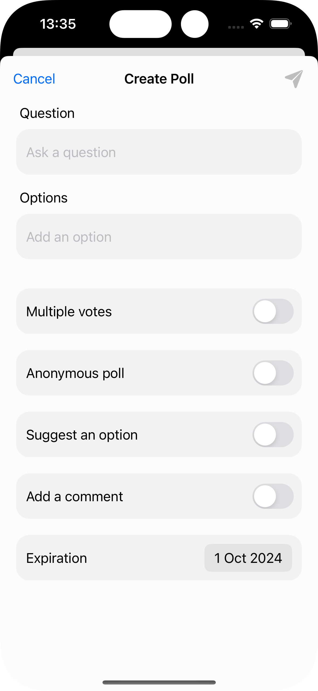
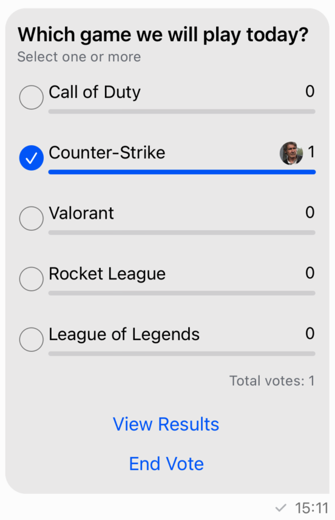
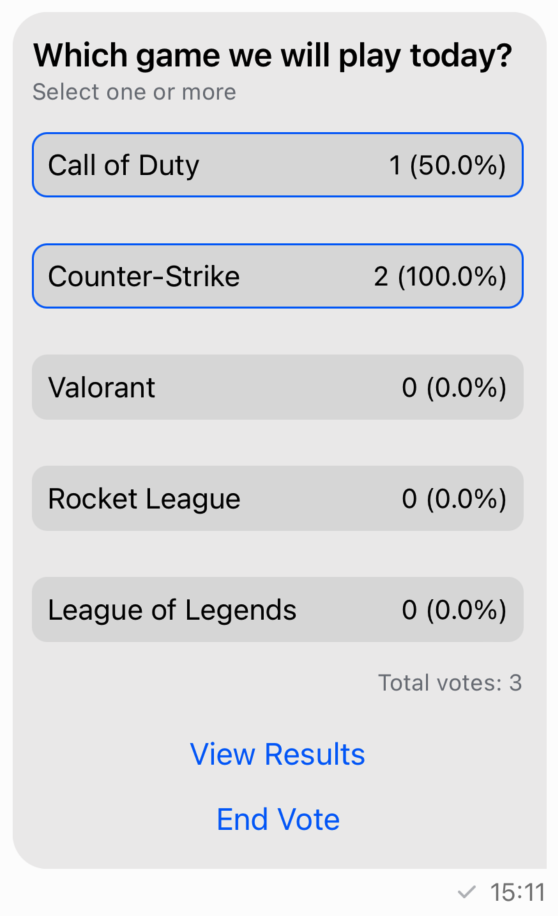

import ViewContainerBuilderNote from '../common-content/view-container-builder-note.md'
import PollState from '../common-content/polls/state.md'
import PollController from '../common-content/polls/poll-controller.md'
import PollControllerDelegate from '../common-content/polls/poll-controller-delegate.md'
import PollVoteListController from '../common-content/polls/poll-vote-list-controller.md'
import PollVoteListControllerDelegate from '../common-content/polls/poll-vote-list-controller-delegate.md'

Stream Chat's UIKit SDK includes the capability to create polls within your chat application. Polls are an effective tool for enhancing user interaction and engagement, providing a dynamic way to gather opinions and feedback.

:::note
Polls on UIKit are available since version [4.64.0](https://github.com/GetStream/stream-chat-swift/releases/tag/4.64.0).
:::

Polls are disabled by default. In order to enable this feature, you need to go to the Stream dashboard for your app, and enable the "Polls" flag for your channel type.


When enabling Polls, an additional "Create Poll" action will be shown in the attachment picker of the default composer component.

## Poll configuration

You can configure the default poll features by changing the `Components.default.pollsConfig`. This will determine which features the user can enable when creating the poll. Below is the poll creation view with all features supported:


You can setup which of these options will be supported. In order to do that, you need to provide your own `PollsConfig`.

For example, let's create a new configuration that removes the suggestions feature and enables multiples votes by default.

```swift
let pollsConfig = PollsConfig(
    multipleAnswers: PollsEntryConfig(configurable: true, defaultValue: true),
    anonymousPoll: .default,
    suggestAnOption: .notConfigurable,
    addComments: .default,
    maxVotesPerPerson: .default
)

Components.default.pollsConfig = pollsConfig
```

## Poll creation view

The `PollCreationVC` is the view controller responsible for creating polls. By default, it is shown when the user taps the "Create Poll" action in the composer's attachment picker. You can completely provide your own implementation by overriding the `ComposerVC.showPollCreation()` function or you can customize the default component by overriding the `Components.default.pollCreationVC` property. This view is composed by the following sub components:

- `Components.default.pollCreationNameCell` - The cell responsible for the poll title.
- `Components.default.pollCreationOptionCell` - The cell responsible for the poll options.
- `Components.default.pollCreationFeatureCell` - The cell responsible for the enabling/disabling of the poll features.
- `Components.default.pollCreationMultipleVotesFeatureCell` - The cell responsible for the multiple votes feature which has more information than the other features.
- `Components.default.pollCreationSectionHeaderView` - The header view for the sections in the poll creation view.

To show an example on how you can customize the `PollCreationVC`, let's create a new feature cell that will allow the user to set a poll's expiration date.

The first thing we need to do is to create the new feature, for this we will need to extend the `PollFeatureType` and create a new feature that conforms to the `PollFeature` protocol:

```swift
extension PollFeatureType {
    public static var expiration = Self(rawValue: "expiration")
}

public struct ExpirationPollFeature: PollFeature {
    public let name: String = "Expiration"
    public var isEnabled: Bool
    public var expirationDate: Date?
}
```

After that, we need to customize the poll creation view to show this new feature. We will create a new cell that will allow the user to set the expiration date:

```swift
class PollExpirationFeatureCell: PollCreationFeatureCell {
    lazy var featureNameLabel = UILabel()

    lazy var datePicker = UIDatePicker()

    var onValueChanged: ((Date?) -> Void)?

    override func setUp() {
        super.setUp()

        datePicker.datePickerMode = .date
        datePicker.addTarget(self, action: #selector(datePickerValueChanged), for: .valueChanged)
    }

    override func setUpLayout() {
        // We will use the existing container that renders the rounded container.
        container.views {
            featureNameLabel
            datePicker
        }
        .height(PollCreationVC.pollCreationInputViewHeight)
        .padding(leading: 12, trailing: 12)
        .embed(in: self, insets: .init(top: 6, leading: 12, bottom: 6, trailing: 12))
    }

    @objc func datePickerValueChanged() {
        onValueChanged?(datePicker.date)
    }
}
```

Finally, we need to create a new `PollCreationVC` that will include the new feature cell and that it updates the extra data to include the expiration date:

```swift
class CustomPollCreationVC: PollCreationVC {

    var pollExpirationFeature = ExpirationPollFeature(isEnabled: false) {
        didSet {
            // Update the extra data to include the custom feature.
            // The extra data will be automatically send by the `createPoll` function.
            if let expDate = pollExpirationFeature.expirationDate?.timeIntervalSince1970 {
                extraData["expiration"] = .number(expDate)
            }
        }
    }

    override func setUp() {
        super.setUp()

        // Register the custom cell
        collectionView.register(PollExpirationFeatureCell.self, forCellWithReuseIdentifier: "PollExpirationFeatureCell")
        // Adds the new feature to the poll features
        pollFeatures.append(.expiration)
    }

    override func collectionView(_ collectionView: UICollectionView, cellForItemAt indexPath: IndexPath) -> UICollectionViewCell {
        /// We need to override the `collectionView(_:cellForItemAt:)` method to provide the custom cell for the expiration feature.
        let section = sections[indexPath.section]
        switch section {
        case .features:
            let feature = pollFeatures[indexPath.item]
            switch feature {
            case .expiration:
                let expCell = collectionView.dequeueReusableCell(
                    withReuseIdentifier: "PollExpirationFeatureCell",
                    for: indexPath
                ) as! PollExpirationFeatureCell
                    expCell.featureNameLabel.text = pollExpirationFeature.name
                    expCell.onValueChanged = { [weak self] date in
                        self?.pollExpirationFeature.isEnabled = date != nil
                        self?.pollExpirationFeature.expirationDate = date
                    }
                return expCell
            default:
                break
            }
        default:
            break
        }
        /// If the feature is not the expiration, we use the default implementation.
        let cell = super.collectionView(collectionView, cellForItemAt: indexPath)
        return cell
    }
}

Components.default.pollCreationVC = CustomPollCreationVC()
```

The above customization will add the new expiration feature to the poll creation as seen in the image below:



:::note
The handling of the expiration date on the server is out of the scope of this guide. You will need to implement the server-side logic to handle the expiration date and automatically close the poll.
:::

## Poll attachment view

When a message contains a poll in the `ChatMessage.poll` property, the poll will be rendered by the `PollAttachmentView`.

Poll attachments have the same behaviour as other types of messages - you can send reactions, reply, delete them or pin them.

The default poll attachment view has the following UI:


You can customize the poll attachment view by providing your own implementation of the `PollAttachmentView` class and replace it in the `Components.default.pollAttachmentView` property. This view is composed by a header view, the list of options, and a footer view. The header view displays the poll title and the rule to submit votes, while the footer view displays a list of buttons to interact with the poll. If you want to change the layout or add new views to the poll, this is the place to do it.

As an example, let's add a label that shows the total number of votes in the poll:

```swift
class CustomPollAttachmentView: PollAttachmentView {
    lazy var totalVotesLabel = UILabel()

    override func setUpAppearance() {
        super.setUpAppearance()

        totalVotesLabel.font = appearance.fonts.caption1
        totalVotesLabel.textColor = appearance.colorPalette.textLowEmphasis
    }

    override func setUpLayout() {
        directionalLayoutMargins = .init(top: 12, leading: 10, bottom: 10, trailing: 12)

        VContainer(spacing: 14) {
            headerView
            optionListView
            HContainer {
                Spacer()
                totalVotesLabel
            }
            footerView
        }
        .embedToMargins(in: self)
    }

    override func updateContent() {
        super.updateContent()

        totalVotesLabel.text = "Total votes: \(content?.poll.voteCount ?? 0)"
    }
}
```

This will add a new label below the options like you can see in the image below:



If you want to customize the poll options, you should override the `Components.default.pollAttachmentOptionListView` or the `Components.default.pollAttachmentOptionListItemView`. Below is an example of a custom option list item view that changes how the votes are displayed:

```swift
class CustomPollAttachmentOptionListItemView: PollAttachmentOptionListItemView {

    lazy var roundedContainer = HContainer(spacing: 4, alignment: .center)

    override func setUpAppearance() {
        super.setUpAppearance()

        roundedContainer.backgroundColor = appearance.colorPalette.background2
        roundedContainer.layer.cornerRadius = 8
        roundedContainer.layer.borderColor = appearance.colorPalette.accentPrimary.cgColor
    }

    override open func setUpLayout() {
        roundedContainer.views {
            optionNameLabel
            Spacer()
            votesCountLabel
        }
        .padding(8)
        .embed(in: self)
    }

    override func updateContent() {
        super.updateContent()

        guard let content = self.content else { return }
        roundedContainer.layer.borderWidth = content.isVotedByCurrentUser ? 1 : 0
        votesCountLabel.text = "\(content.voteCount) (\(content.voteRatio * 100)%)"
    }
}

Components.default.pollAttachmentOptionListItemView = CustomPollAttachmentOptionListItemView.self
```

<ViewContainerBuilderNote />

We reused only the `optionNameLabel` and `votesCountLabel` from the default implementation and added a new `roundedContainer`. The interactions and logic pretty much remain the same. The result of this customization can be seen in the image below:



Besides these components, the SDK also provides components to show the results of the polls, comments, the full list of options in case it is a big poll and more. Here are some of the available components:
- `Components.default.pollResultsVC` - The view controller that shows the results of the poll.
- `Components.default.pollResultsVoteListVC` - The view controller that shows the list of all the votes received for an option.
- `Components.default.pollCommentListVC` - The view controller that shows the comments of the poll.
- `Components.default.pollAllOptionsListVC` - The view controller that shows the full list of options in case it is a big poll.

## Poll State

<PollState />

## `PollController`

<PollController />

## `PollControllerDelegate`

<PollControllerDelegate />

## `PollVoteListController`

<PollVoteListController />

## `PollVoteListControllerDelegate`

<PollVoteListControllerDelegate />