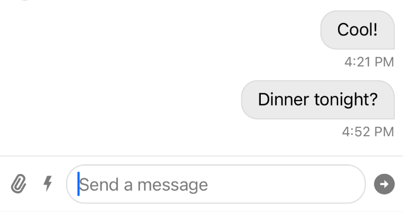
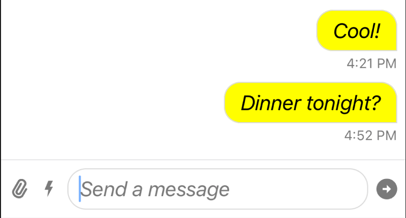
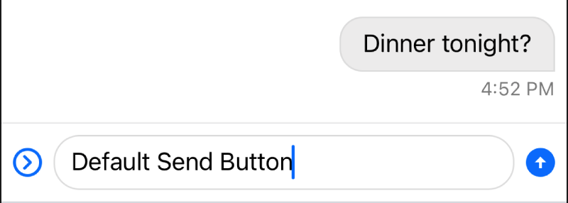
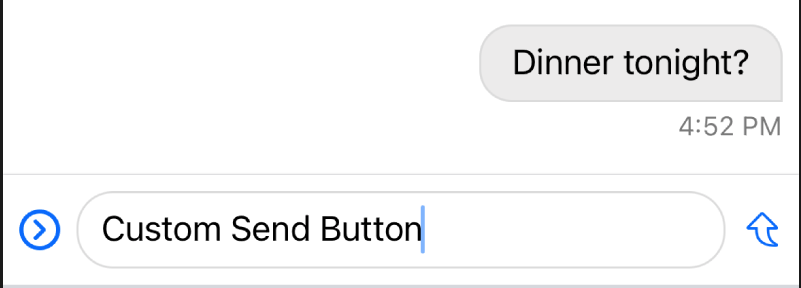

You can customize the look and feel of all UI components provided by `StreamChatUI`. The SDK allows you to change the appearance of components such as colors and fonts via the `Appearance` configuration. Changes to appearance should be done as early as possible in your application lifecycle, the `SceneDelegate` and `AppDelegate` are usually the right places to do this. The SDK comes with a singleton object `Appearance.default` that you can use directly to make changes.

## Changing Brand Color

The most basic customization you can do is to change the brand color, and for this one you don't really need the Stream's `Appearance` configuration, you only need to change the tint color of the `UIWindow`. If suitable, UI elements respect `UIView.tintColor` as the main (brand) color. The current `tintColor` depends on the tint color of the view hierarchy the UI element is presented on.

For example, by changing the tint color of the `UIWindow` of the app, you can easily modify the brand color of the whole chat UI:

```swift
class SceneDelegate: UIResponder, UIWindowSceneDelegate {
    func scene(_ scene: UIScene, willConnectTo session: UISceneSession, options connectionOptions: UIScene.ConnectionOptions) {
        guard let scene = scene as? UIWindowScene else { return }

        scene.windows.forEach {
          $0.tintColor = .systemPink
        }
    }
}
```

| Before  | After |
| ------------- | ------------- |
|   |   |

## Changing Colors and Fonts

The colors and fonts are part of the `Appearance` configuration type. Since all components have access to this configuration, all components will be impacted by the changes on this configuration.

For example, let's change the color of the messages sent by the current user and the body font. We can do this by simply modifying the values from `Appearance.default` as early as possible in your application life-cycle:
```swift
class SceneDelegate: UIResponder, UIWindowSceneDelegate {
    func scene(_ scene: UIScene, willConnectTo session: UISceneSession, options connectionOptions: UIScene.ConnectionOptions) {
        ...
        Appearance.default.fonts.body = .italicSystemFont(ofSize: 20)
        Appearance.default.colorPalette.background6 = .yellow
        ...
    }
}
```

| Before  | After |
| ------------- | ------------- |
|   |   |

You can see the font and the background color of the message has changed. Also note, that the font in the composer text view is also changed, since it uses the same semantic font as the body of the message.

## Changing Image Assets

The image assets and icons used by buttons also use the `Appearance` configuration type. For example, let's modify the icon used for the "Send" button:

```swift
Appearance.default.images.sendArrow = UIImage(systemName: "arrowshape.turn.up.right")!
```

| Before  | After |
| ------------- | ------------- |
|   |   |

If the same image is used in multiple places, changing the image in the `Appearance` object will update it in all places.

## Properties

Appearance style properties are organized in three groups:

### colorPalette

A color palette to provide basic set of colors for all UI components. The full reference can be found [here](../common-content/reference-docs/stream-chat-ui/appearance.color-palette.md)

### fonts

The set of fonts used by UI components. The full reference can be found [here](../common-content/reference-docs/stream-chat-ui/appearance.fonts.md)

### images

The set of images used by UI components. The full reference can be found [here](../common-content/reference-docs/stream-chat-ui/appearance.images.md)
