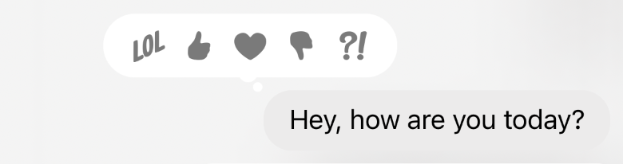
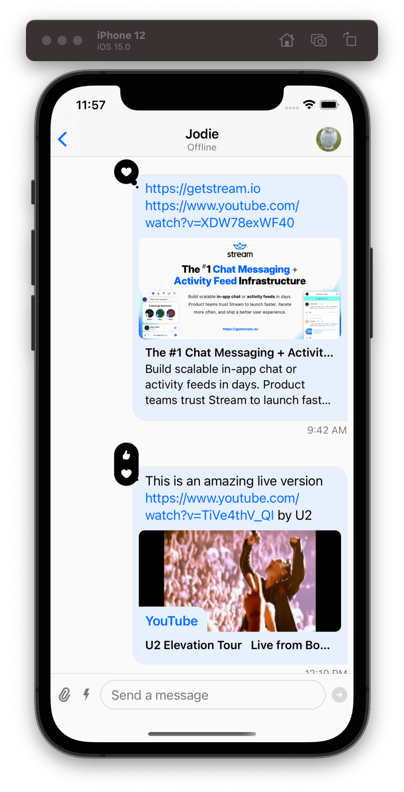
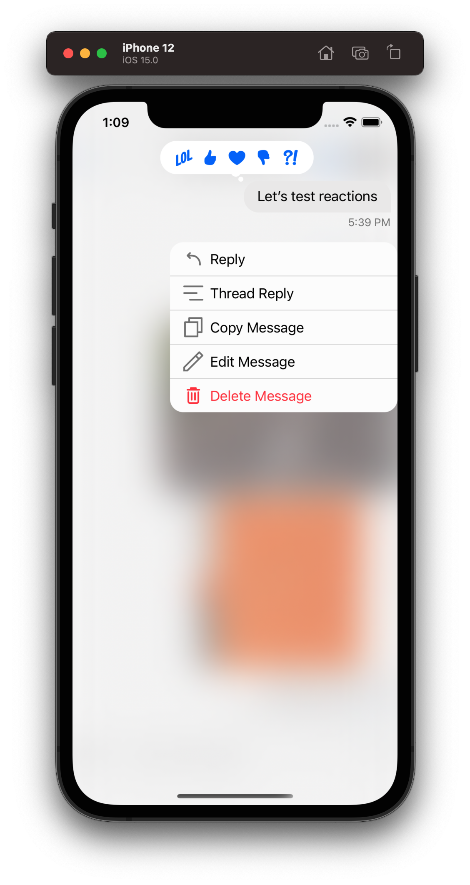
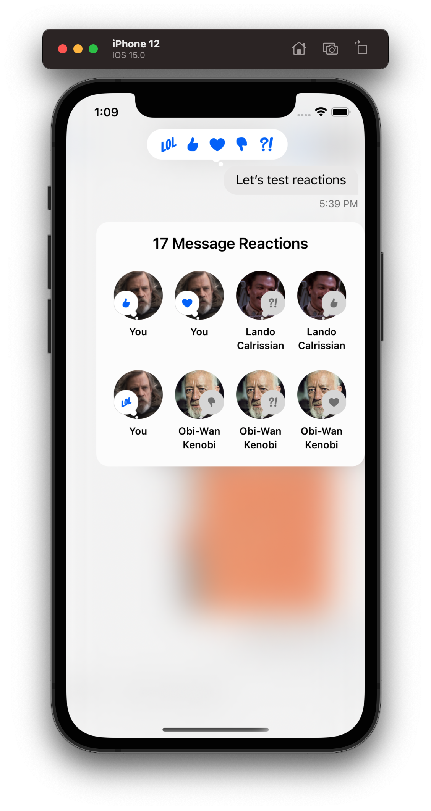
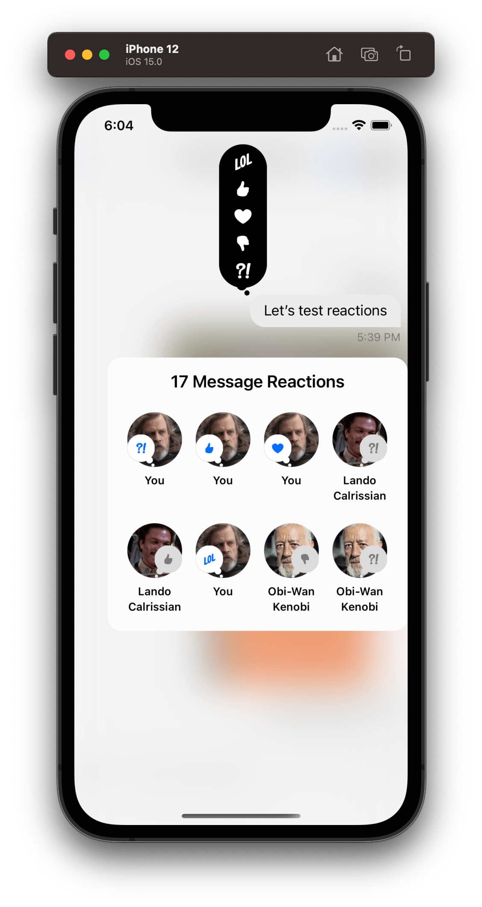
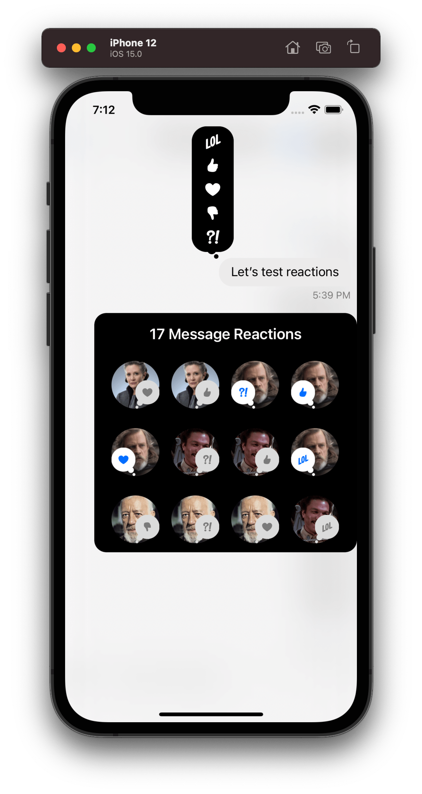

import Digraph  from '../../common-content/digraph.jsx'

The Stream Chat API provides built-in support for adding reactions to messages. The UI SDK provides components for displaying and adding reactions to a message.

## Basic Usage

Message reactions come out of the box with Stream Chat. The SDK will respect your channel configuration, if you disable reactions for a channel or channel type from the dashboard, the SDK will not render the UI for reactions.

### Custom Reactions and Images

All the available reactions are extendible or totally replaceable with custom ones. You can change the list of supported message reactions via the `Appearance` object. Here is an example of how you can use your own set of reactions:

```swift
let reactionFireSmall: UIImage = UIImage(named: "fireSmall")!
let reactionFireBig: UIImage = UIImage(named: "fireBig")!
let reactionWaveSmall: UIImage = UIImage(named: "waveSmall")!
let reactionWaveBig: UIImage = UIImage(named: "waveBig")!

let customReactions: [MessageReactionType: ChatMessageReactionAppearanceType] = [
    "fire": ChatMessageReactionAppearance(
        smallIcon: reactionFireSmall,
        largeIcon: reactionFireBig
    ),
    "wave": ChatMessageReactionAppearance(
        smallIcon: reactionWaveSmall,
        largeIcon: reactionWaveBig
    )
]

Appearance.default.images.availableReactions = customReactions
```

## Message Reactions

By default, the message reactions are displayed inline as a bubble view on top of the messages.


The message reaction view is composed of a container bubble view that holds a stack of reaction item views. Here is the hierarchy of the message reaction view:

<Digraph margin="0 auto" width="300px">
{`
    ChatReactionsBubbleView -> ChatMessageReactionsView
    ChatMessageReactionsView -> ChatMessageReactionItemView
`}
</Digraph>

### ChatReactionsBubbleView

The reactions bubble view is a container that is responsible not only to hold the stack of the reactions but also for the bubble styling.

By subclassing the `ChatReactionsBubbleView`, you can customize the styling of the bubble view. In this example, we change the bubble fill color to black:
```swift
class CustomChatReactionsBubbleView: ChatReactionsBubbleView {
    override var fillColor: UIColor? {
        UIColor.black
    }
}

Components.default.messageReactionsBubbleView = CustomChatReactionsBubbleView.self
```

### ChatMessageReactionsView

This component is responsible for rendering the list of reactions. By default, the reactions are rendered in a horizontal stack.

In this example we customize the `ChatMessageReactionsView` so that the reactions are rendered in a vertical stack instead:
```swift
class CustomChatMessageReactionsView: ChatMessageReactionsView {

    override func setUpLayout() {
        super.setUpLayout()

        stackView.axis = .vertical
    }
}

Components.default.messageReactionsView = CustomChatChatMessageReactionsView.self
```

### ChatMessageReactionItemView

This component is responsible to display a single reaction. By default, if the reaction is from the logged-in user, the reaction image color is blue, if not, the color is gray. Let's do a simple customization and set the color to white instead of blue when the reaction is from the logged-in user:

```swift
class CustomChatMessageReactionItemView: ChatMessageReactionItemView {

    override var reactionImageTint: UIColor? {
        guard let content = content else { return nil }
        let isChosenByCurrentUser = content.reaction.isChosenByCurrentUser
        return isChosenByCurrentUser ? .white : .gray
    }
}

Components.default.messageReactionItemView = CustomChatMessageReactionItemView.self
```

If we do all the customizations described above to the message reactions view, this will be the end result:

| Default Message Reactions | Custom Message Reactions |
| ------------------------- | ------------------------ |
|   |   |

## Reactions Picker

In order to add a new reaction to a message you need to long-press a message or tap the message reactions bubble view, and the SDK will show a popup view with a reactions picker at the top. The reactions picker which is represented by the `ChatMessageReactionsPickerVC` is basically a bigger message reaction view that is interactable to allow the user to select a reaction.

When the user long-presses the message, the popup view will display the reactions picker at the top, the message content at the centre, and the message actions at the bottom. On the other hand, if the user taps the reactions bubble view, instead of having the message actions at the bottom, it will show a view with all the reactions that belong to the message.

| Long-pressing a message | Tapping reaction bubble view |
| ------------------------- | ------------------------ |
|   |   |

The reaction picker view has a similar structure to the message reaction view. Here is the hierarchy of the reaction picker view:

<Digraph margin="0 auto" width="300px">
{`
    ChatReactionPickerBubbleView -> ChatReactionPickerReactionsView
    ChatReactionPickerReactionsView -> ChatMessageReactionItemView
`}
</Digraph>

### ChatReactionPickerBubbleView

Much like the message reaction view, the picker view also has a container bubble view that is responsible to hold the stack of reactions and the styling of the bubble. By default the UI SDK uses the `DefaultChatReactionPickerBubbleView` which is a subclass of the base `ChatReactionPickerBubbleView`. If you want to do more advanced customization you can subclass directly the `ChatReactionPickerBubbleView`, but for the most common customizations, subclassing `DefaultChatReactionPickerBubbleView` should be fine.

Let's show an example of customizing the `DefaultChatReactionPickerBubbleView` component:

```swift
class CustomChatReactionPickerBubbleView: DefaultChatReactionPickerBubbleView {

    override open var contentBackgroundColor: UIColor {
        .black
    }

    override open var contentBorderColor: UIColor {
        .black
    }

    override open var tailBackImage: UIImage? { 
        super.tailBackImage?.withTintColor(.black) 
    }

    override open var tailFrontImage: UIImage? { 
        super.tailFrontImage?.withTintColor(.black) 
    }

    override open func layoutSubviews() {
        super.layoutSubviews()

        contentViewBackground.layer.cornerRadius = 20
    }
}

Components.default.reactionPickerBubbleView = CustomChatReactionPickerBubbleView.self
```

In the example above we changed the color of the bubble to black. For this, we had not only to change the background to black but also the border color and the tail images. We also changed the corner radius of the bubble since in the next step we will make the bubble vertical instead of horizontal.

### ChatReactionPickerReactionsView

This component is responsible to render the list of reactions. By default, the reactions are rendered in a horizontal stack, exactly like the message reaction view.

Let's do the same change we did with the message reaction view, and change the stack to be vertical aligned:
```swift
class CustomChatReactionPickerReactionsView: ChatReactionPickerReactionsView {

    override func setUpLayout() {
        super.setUpLayout()

        stackView.axis = .vertical
    }
}

Components.default.reactionPickerReactionsView = ChatReactionPickerReactionsView.self
```

### ChatMessageReactionItemView

The component responsible to display a single reaction is actually the same as the one used by the message reaction view. Let's reuse the same customization we did the message reaction view and apply it to the reaction picker too:

```swift
class CustomChatMessageReactionItemView: ChatMessageReactionItemView {

    override var reactionImageTint: UIColor? {
        guard let content = content else { return nil }
        let isChosenByCurrentUser = content.reaction.isChosenByCurrentUser
        return isChosenByCurrentUser ? .white : .gray
    }
}

Components.default.reactionPickerReactionItemView = CustomChatMessageReactionItemView.self
```

Here is the result for all the customizations done to the reaction picker view:

| Default Picker | Custom Picker |
| ------------- | ------------- |
|   |   |

## Reaction Authors

The `ChatMessageReactionAuthorsVC` is responsible to displays all the reactions of the message and its author. It is the view that is presented at the bottom when the user taps the reactions bubble view.

### ChatMessageReactionAuthorsVC
By default the `ChatMessageReactionAuthorsVC` render the reactions in a collection view and each cell is represented by the `ChatMessageReactionAuthorViewCell` component.

Let's change the background color of the reaction authors view and change the cell size by subclassing the `ChatMessageReactionAuthorsVC` component:

```swift
class CustomChatMessageReactionAuthorsVC: ChatMessageReactionAuthorsVC {

    override var reactionAuthorCellSize: CGSize {
        CGSize(width: 64, height: 70)
    }

    override func setUpAppearance() {
        super.setUpAppearance()

        topLabel.textColor = UIColor.white
        view.backgroundColor = .black
    }
}

Components.default.reactionAuthorsVC = CustomChatMessageReactionAuthorsVC.self
```

### ChatMessageReactionAuthorViewCell

In order to customize each cell of the reaction authors view, we need to subclass the `ChatMessageReactionAuthorViewCell` component.

```swift
class CustomChatMessageReactionAuthorViewCell: ChatMessageReactionAuthorViewCell {

    override func setUpLayout() {
        super.setUpLayout()

        containerStack.removeArrangedSubview(authorNameLabel)
    }
}

Components.default.reactionAuthorCell = CustomChatMessageReactionAuthorViewCell.self
```

If we apply these customizations above on the reaction authors view component, we will see the following result:

| Default Reaction Authors | Custom Reaction Authors |
| ------------- | ------------- |
|   |   |